# Pre-read: Introduction to Programming & Python Basics

Every morning, millions of people in India check their **phone balance**, book a **train ticket**, or pay a shopkeeper through **UPI** — all in seconds. Behind each tap is a machine following thousands of tiny instructions written by someone who once sat exactly where you are now: learning how to tell a computer what to do, step by step.

You do not need a tech degree or years of experience to start. You only need curiosity and the willingness to think clearly. This session is your **first step** into that world — and by the end, you will have written small programs that ask questions, do calculations, and show answers on the screen.

---

## Context of This Session in the Course

```mermaid
%%{init: {"diagramPadding": 24, "flowchart": {"htmlLabels": true, "nodeSpacing": 90, "rankSpacing": 110, "curve": "basis", "padding": 20}, "theme": "base", "themeVariables": {"fontFamily": "Arial", "fontSize": "15px", "lineColor": "#334155"}}}%%
flowchart TB
    subgraph FOUNDATION[" "]
        direction LR
        ENTRY["&nbsp;&nbsp;<b>Course Entry Point</b>&nbsp;&nbsp;<br/><br/>Certification in Software Development<br/>Engineering with Applied AI<br/><br/><i>No prior tech background<br/>required to begin</i>"]
        CM[["&nbsp;&nbsp;<b>Current Module Until Previous Session</b>&nbsp;&nbsp;<br/><br/>Module 1: Programming, DSA<br/>&amp; AI-Powered Foundations<br/><br/><i>Course begins here<br/>No prior sessions covered</i>"]]
    end

    CURRENT{{"&nbsp;&nbsp;<b>Current Session</b>&nbsp;&nbsp;<br/><br/>Introduction to Programming<br/>&amp; Python Basics<br/><br/><i>OneCompiler · variables · operators<br/>input and output</i><br/><br/><b>Mental shift:</b><br/>from app user<br/>to instruction writer"}}

    subgraph VALUE[" "]
        direction LR
        COURSE["&nbsp;&nbsp;<b>Course Connection</b>&nbsp;&nbsp;<br/><br/>First building block for DSA,<br/>web development, backend APIs,<br/>and applied AI later<br/><br/><i>Foundation for all<br/>future coding work</i>"]
        REAL(["&nbsp;&nbsp;<b>Real-Life Connection</b>&nbsp;&nbsp;<br/><br/>UPI, train booking, WhatsApp,<br/>and AI tools all run on<br/>clear step-by-step logic<br/><br/><i>Learn to give machines<br/>precise directions</i>"])
    end

    subgraph FUTURE[" "]
        direction LR
        M2["&nbsp;&nbsp;<b>Upcoming Module</b>&nbsp;&nbsp;<br/><br/>Web Foundations &amp;<br/>Dedicated Frontend<br/>(HTML + CSS + JavaScript)<br/><br/><i>Will use: pages, styling,<br/>DOM and Fetch API</i>"]
        M3["&nbsp;&nbsp;<b>Upcoming Module</b>&nbsp;&nbsp;<br/><br/>Core Backend, Data<br/>&amp; Architecture<br/>(FastAPI + SQL)<br/><br/><i>Will use: APIs, databases,<br/>server-side logic</i>"]
        M4(["&nbsp;&nbsp;<b>Upcoming Module</b>&nbsp;&nbsp;<br/><br/>Applied AI Features<br/>&amp; Capstone<br/>(LLMs + Integration)<br/><br/><i>Will use: prompt design,<br/>AI APIs, full-stack build</i>"])
    end

    ENTRY ==>|&nbsp;Start&nbsp;| CM
    CM ==>|&nbsp;Foundation&nbsp;| CURRENT
    CURRENT ==>|&nbsp;Course Path&nbsp;| COURSE
    CURRENT ==>|&nbsp;Real-Life Use&nbsp;| REAL
    COURSE ==>|&nbsp;Next Module&nbsp;| M2
    M2 ==>|&nbsp;Next Module&nbsp;| M3
    M3 ==>|&nbsp;Next Module&nbsp;| M4

    classDef previous fill:#f8fafc,stroke:#475569,stroke-width:2px,color:#0f172a
    classDef current fill:#ecfeff,stroke:#0f766e,stroke-width:3px,color:#134e4a
    classDef value fill:#fff7ed,stroke:#c2410c,stroke-width:2px,color:#7c2d12
    classDef future fill:#f0fdf4,stroke:#15803d,stroke-width:2px,color:#14532d

    class ENTRY,CM previous
    class CURRENT current
    class COURSE,REAL value
    class M2,M3,M4 future

    style FOUNDATION fill:transparent,stroke:transparent
    style VALUE fill:transparent,stroke:transparent
    style FUTURE fill:transparent,stroke:transparent
    linkStyle default stroke:#334155,stroke-width:3px
```

---

## When a calculator is not enough

Imagine you are helping your college society prepare the **annual report card** for 200 students. For each student, you need to add marks from three subjects, find the average, and check whether they crossed the passing line.

Doing this by hand with a notebook and calculator would take hours. One wrong addition in row 47 ruins the whole sheet. And if the principal asks you to **change the passing marks from 40 to 45**, you start over.

**What if** you could write a set of clear instructions once — and the computer would repeat the same steps for all 200 students, instantly and without mistakes?

That is exactly what **programming** is about. **Programming** means writing step-by-step instructions that a computer can follow to finish a task. The computer does not guess. It does not improvise. It follows your directions exactly — which is both its greatest strength and the reason you must learn to think in small, precise steps.

---

## Your first language: Python

To talk to a computer, you need a **programming language** — a shared vocabulary of words and symbols the machine understands. In this course, we start with **Python**, one of the most widely used languages in the world for **software development**, **data science**, and **artificial intelligence**.

Python reads almost like plain English, which makes it ideal when you are learning to think logically instead of fighting complicated syntax rules. You will write and run your first programs using **OneCompiler** — a free **online compiler** (a browser-based workspace where you type instructions, press Run, and see the result immediately). No complicated installation on day one. Open the website, pick Python, write your program, and watch it work — just like filling an online form without buying special software.

---

## The recipe analogy

Think of programming like writing a **recipe** for a cook in the kitchen.

If you write *"add salt"*, the cook adds salt. If you forget to write *"turn on the gas"*, nothing gets cooked. The cook will not guess what you meant — they follow only what is on the paper.

Computers work the same way. Every step must be written clearly. This habit of **breaking a big job into small, ordered steps** is useful far beyond coding — in exam preparation, project planning, and any career where you solve problems systematically.

---

## Storing information: variables and data types

A program that only shows fixed text cannot calculate your exam percentage or split a dinner bill among friends. For that, the program needs to **remember** information.

A **variable** is like a labelled dabba at a kirana store — the shopkeeper writes *"Rice — 2 kg"* on the bag. The label is the name, and *"2 kg"* is the value stored inside. In programming, you give a name to a piece of data so you can use it later.

Not everything stored is the same kind of information. Your age is a whole number, your name is text, and whether you passed an exam is either yes or no. **Data types** tell the computer what kind of value you are storing:

| Kind | What it holds | Everyday example |
|------|---------------|------------------|
| **Whole numbers** | Counts without decimals | 40 students in a class |
| **Decimal numbers** | Values with fractions | ₹99.50 for a snack |
| **Text** | Names, cities, messages | *"Priya"*, *"Patna"* |
| **True or False** | Yes/no decisions | Did the student pass? |

Getting the type wrong causes real problems — storing marks as text instead of a number means the computer cannot add them up.

---

## Making things happen: operators

Once data is stored, you need tools to work with it. **Operators** are symbols that perform actions on values — the same way a calculator uses **+** and **−** for maths.

You will work with four families of operators:

- **Arithmetic operators** — add, subtract, multiply, divide, and find remainders. Useful for splitting a ₹1,500 dinner bill among three friends or calculating GST on a purchase.
- **Comparison operators** — check whether one value is greater than, less than, or equal to another. They always give a **True** or **False** answer — like asking *"Did I score more than 40 marks?"*
- **Logical operators** — combine multiple yes/no checks. For example, a scholarship might need **both** high marks **and** good attendance — not just one of them.
- **Assignment operators** — shortcuts for updating a value, like adding points to a game score without rewriting the whole calculation each time.

An **expression** is simply a combination of values and operators that produces a result — similar to writing *1000 + (1000 × 0.18)* to find the total price after 18% GST.

---

## Talking to the user: input and output

So far, imagine programs that use fixed numbers. Real programs need to **listen** and **reply**.

**Input** is when the program asks you something — your name, your marks, the price of a phone. **Output** is when the program shows you a result — a greeting, a percentage, a monthly EMI amount.

Think of a railway ticket counter: you tell the clerk your destination (**input**), and the clerk prints your ticket (**output**). Programs work the same way — they collect information, process it using variables and operators, and display the answer.

One important detail you will learn in the live session: when a program asks for your age and you type **22**, the computer often stores it as text first. Before doing maths, you must convert it to a number — otherwise the machine gets confused, just like a form that expects digits but receives letters.

---

In this pre-read, you'll discover:

- **Understand** what **programming** really means — and why clear step-by-step thinking matters in tech and in daily life
- **Learn** how to write and run your first **Python** programs using an **online compiler**, without installing anything on your laptop
- **Discover** how **variables** and **data types** let a program remember and organise information like numbers, text, and true/false values
- **Understand** how **operators** and **input/output** turn a static set of instructions into a program that calculates, compares, and interacts with a real user

---

## What's next

After this session, you should be able to:

- Open an online coding workspace and run a Python program from start to finish
- Store personal details — name, age, marks — in **variables** and display them
- Split a bill, calculate pocket money left after expenses, or find a percentage using **arithmetic operators**
- Check whether a student passed or qualifies for something using **comparison** and **logical operators**
- Build a small interactive program that asks the user for marks and prints a result — like a mini report card or EMI calculator

These building blocks prepare you for **conditional logic** in the **next** session — where programs start making decisions like *"if marks are above 40, show Pass; otherwise show Fail."* Every app you use, from banking to food delivery, started with exactly these fundamentals.

---

## Questions to explore in the live session

1. A student receives **₹2,000** pocket money and spends **₹450** on books and **₹320** on food. How would you store each amount, subtract both expenses, and show the remaining balance — without doing the maths on paper?

2. A college offers a scholarship only to students with **marks ≥ 80** **and** **attendance ≥ 75%**. How do you check **both** conditions together using comparison and logical operators — and what happens if you accidentally use the wrong symbol for "equals"?

3. You build a program that asks a student for marks in three subjects and prints their total and average. What goes wrong if the user types marks as text instead of numbers — and how do you fix it before the calculation runs?

Come ready to move from being someone who **uses** apps to someone who can **write** the logic behind them. Your first program is closer than you think — and the live session is where the screen lights up with your own instructions running for the first time.
