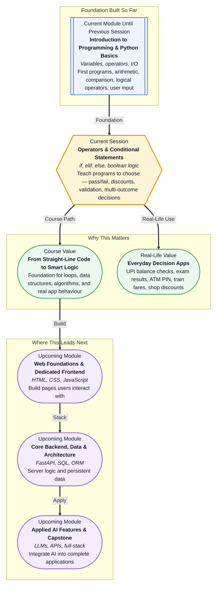

```mermaid
%%{init: {"flowchart": {"nodeSpacing": 45, "rankSpacing": 65, "diagramPadding": 20}} }%%
flowchart TB
    subgraph Foundation["Foundation Built So Far"]
        C1[["Current Module Until Previous Session<br/><b>Introduction to Programming &amp; Python Basics</b><br/><i>Variables, operators, I/O</i><br/>First programs, arithmetic, comparison, logical operators, user input"]]
    end

    CS{{"Current Session<br/><b>Operators &amp; Conditional Statements</b><br/><i>if, elif, else, boolean logic</i><br/>Teach programs to choose — pass/fail, discounts, validation, multi-outcome decisions"}}

    subgraph Value["Why This Matters"]
        CV(["Course Value<br/><b>From Straight-Line Code to Smart Logic</b><br/>Foundation for loops, data structures, algorithms, and real app behaviour"])
        RV(["Real-Life Value<br/><b>Everyday Decision Apps</b><br/>UPI balance checks, exam results, ATM PIN, train fares, shop discounts"])
    end

    subgraph Future["Where This Leads Next"]
        F1(["Upcoming Module<br/><b>Web Foundations &amp; Dedicated Frontend</b><br/><i>HTML, CSS, JavaScript</i><br/>Build pages users interact with"])
        F2(["Upcoming Module<br/><b>Core Backend, Data &amp; Architecture</b><br/><i>FastAPI, SQL, ORM</i><br/>Server logic and persistent data"])
        F3(["Upcoming Module<br/><b>Applied AI Features &amp; Capstone</b><br/><i>LLMs, APIs, full-stack</i><br/>Integrate AI into complete applications"])
    end

    C1 ==>|&nbsp;Foundation&nbsp;| CS
    CS ==>|&nbsp;Course Path&nbsp;| CV
    CS ==>|&nbsp;Real-Life Use&nbsp;| RV
    CV ==>|&nbsp;Build&nbsp;| F1
    F1 ==>|&nbsp;Stack&nbsp;| F2
    F2 ==>|&nbsp;Apply&nbsp;| F3

    classDef previous fill:#eef4ff,stroke:#4f7ccf,color:#111827,stroke-width:2px;
    classDef current fill:#fff4d6,stroke:#d9a321,color:#111827,stroke-width:3px;
    classDef value fill:#eaf8ef,stroke:#3f9f63,color:#111827,stroke-width:2px;
    classDef future fill:#f4ecff,stroke:#8a61d1,color:#111827,stroke-width:2px;

    class C1 previous;
    class CS current;
    class CV,RV value;
    class F1,F2,F3 future;
    linkStyle default stroke-width:3px;
```
