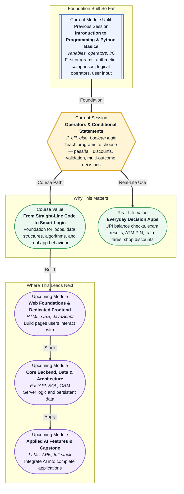

# Pre-read: Operators & Conditional Statements

## Context of This Session in the Course

---

You are standing at a railway station with a ticket in your hand. The display board says **Platform 3**. You do not wander randomly — you turn left, because that is where your train leaves from. If the board had shown a different number, you would have walked the other way. One piece of information, two possible paths, and you picked the right one without thinking twice.

That is exactly what the apps on your phone do millions of times every day. When you try to pay through **UPI**, the app checks your balance first — if the money is not enough, it stops and shows an error instead of completing the payment. When you open your **exam result portal**, it looks at your marks and shows either **Pass** or **Fail**. When you enter your **PIN at an ATM**, a wrong number blocks you; the correct one opens the menu. None of these apps follow a single fixed path. They **look at a situation, decide, and act accordingly**.

In the previous session, you learned to write Python programs that calculate marks, split bills, and display results — but every program ran the same way from top to bottom, like a fixed recipe that never changes. That was a strong start. Now your programs are ready for their next upgrade: the ability to **think and choose**.

---

## When one answer is not enough

Imagine you are the clerk at a college results desk. A long queue of students waits with their mark sheets. For each student, you must decide: **Pass or Fail?** If they passed, which **grade** do they get — A, B, C, or D? If they failed, do you tell them it was because of low marks, low attendance, or both?

You *could* handle one student manually. But what if you had to process **five hundred students** in an afternoon, each with different marks, attendance records, and subject-wise scores? Doing every check by hand would be slow, tiring, and full of mistakes — especially when rules overlap, like needing at least 40 in every subject **and** 75% attendance to pass.

This is the kind of challenge that **conditional statements** solve. They let a program check a situation — a **condition** that is either true or false — and run different actions depending on the answer. A **boolean** value is simply a yes-or-no answer stored in code: either **True** or **False**, like answering whether you have a membership card at a shop.

You already met the building blocks in the previous session. **Comparison operators** let you ask questions like "Are the marks at least 40?" or "Is the age 18 or above?" **Logical operators** let you combine questions — **and** means both must be true (scholarship needs good marks *and* good attendance), **or** means at least one must be true (discount applies if the bill is above ₹1,000 *or* you have a membership card), and **not** flips the answer (login allowed only when the account is *not* locked).

---

## The fork in the road — and the menu with many options

Think of **conditional statements** like the signpost at that railway fork. The platform number is the **condition**. Your direction is the **action**. In Python, the word **if** means "only do this when the check passes" — like saying, *"If it is raining, take an umbrella."* The action happens only when the condition is true.

But life rarely stops at two choices. Sometimes you need an **otherwise** path. **else** covers everything the first check did not catch — like a pass/fail result where marks below 40 mean Fail and everything else means Pass. Exactly one path runs; never both, never neither.

Many real problems have **more than two** outcomes. At a restaurant, you might order thali — or if that is not available, dosa — or if neither works, a default combo. The kitchen checks options **in order** and stops at the first match. In Python, **elif** does the same thing: if the first check fails, try the next one, and keep going until something matches or the default **else** runs.

This pattern shows up everywhere around you:

- **Electricity billing slabs** — different rates for the first 100 units, the next 100, and anything above 200.
- **Train ticket categories** — free for very young children, half fare for kids, full fare for adults, senior discount for those above 60.
- **Grade ladders** — A for 90 and above, B for 75–89, and so on, checked from the highest threshold downward so nobody accidentally lands in the wrong grade.

The order of checks matters. Putting a lower threshold before a higher one is like putting "anyone above 40" before "anyone above 90" in a grade program — almost everyone would get the wrong grade. Getting the sequence right is part of **logical thinking**: breaking a problem into small, testable steps before you write a single line of code.

---

## Decisions inside decisions

Some problems need a second check only after the first one passes. Picture entering a stadium: first, the guard checks whether you have a ticket. Only if that passes does a second guard check whether you have a VIP pass for the premium stand. This is a **nested conditional** — one decision sitting inside another.

Login screens work the same way. If the username is wrong, the program says so immediately. If the username is right, it then checks the password — and gives a different error message for each kind of mistake. That is far more helpful than a single vague "login failed" for every case.

When several conditions must be checked together, you can combine them with **and**, **or**, and **not** inside a single decision — scholarship eligibility, shop discounts, and account-lock checks all work this way. The **STEP method** gives you a reliable habit before you code: **State** the problem in plain English, identify the **inputs** you need, list every **condition and outcome**, and only then write the Python. It is like making chai — boil water, add tea, add milk, add sugar. The order matters, and each step can be tested on its own.

---

**In this pre-read, you'll discover:**

- How programs use **if**, **elif**, and **else** to choose different actions instead of running the same steps every time.
- Why **boolean logic** and **comparison operators** are the questions your program asks before it acts.
- How to break real problems — exam results, bill slabs, discounts, login checks — into clear, testable steps using structured thinking.
- Why the **order of conditions** can make or break a program, and how to avoid the most common beginner mistakes.

---

A **condition** is any check that results in True or False — like asking whether marks are at least 40. **Program flow control** simply means the program can change which steps it runs based on those answers, rather than marching line by line from start to finish. **Indentation** — the spaces at the start of a line in Python — tells the computer which lines belong to which decision block; get it wrong and the wrong code runs. None of this requires advanced maths. It requires the same clarity you use when explaining rules to a friend: *"If this, then that; otherwise, something else."*

---

## After this session, you'll be able to

- Write programs that check user input and respond differently — voting eligibility, pass/fail results, even-or-odd numbers, and temperature warnings.
- Handle **multiple outcomes** with **elif** chains — grade calculators, electricity billing slabs, and train ticket categories by age.
- Combine **and**, **or**, and **not** inside conditions for scholarship rules, shop discounts, and login validation.
- Use **nested conditionals** when one decision depends on another, with clear error messages for each failure case.
- Apply the **STEP method** to plan any conditional problem before writing code — and debug confidently when something does not behave as expected.

---

## Questions we will solve together in the live class

1. **A student has marks in three subjects and an attendance percentage.** The college says you must pass every subject with at least 40 marks **and** maintain 75% attendance to get an overall Pass — and only then assign First, Second, or Third division based on average marks. How do you break this into conditions, and what happens when a student fails for more than one reason?

2. **An electricity board charges ₹5 per unit for the first 100 units, ₹7 for units 101–200, and ₹10 beyond 200.** A customer enters their total units consumed. How does the program figure out which slab applies — and why does checking the slabs in the wrong order give wrong answers for almost everyone?

3. **You are building a simple ATM withdrawal check.** The account has ₹5,000. A user tries to withdraw an amount. How should the program handle three different situations — not enough balance, an invalid amount like zero or negative, and a successful withdrawal that updates the remaining balance?

Bring your curiosity. Every app you use daily — from payments to results to ticket booking — runs on the same decision logic you are about to learn. The live session turns these everyday scenarios into programs you can write, test, and trust.
