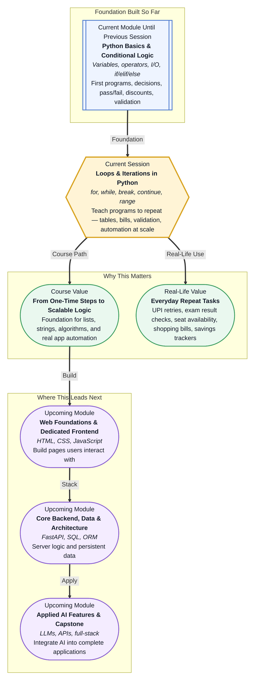

# Pre-read: Loops & Iterations in Python

## Context of This Session in the Course

---

Picture yourself at a temple **prasad counter** on a busy Sunday. A long queue stretches behind you — fifty people, maybe a hundred. The volunteer at the counter does not serve everyone at once. They repeat the same small action again and again: take one laddu, hand it to the next person, move on. Same gesture, same smile, same rule — **one serving per person** — until the queue is empty. That quiet repetition is something you see everywhere in daily life, and it is exactly the kind of work that computers are built to handle at massive scale.

Your **UPI app** may check a failed payment two or three times before showing an error. A **train ticket app** scans every seat in a coach to show which ones are still free. An **exam result system** goes through every student's marks to decide pass or fail. None of these apps copy-paste the same instruction hundreds of times by hand. They use a single piece of logic and **run it again and again** — automatically, cleanly, without getting tired or making careless mistakes.

In the previous session, you taught your programs to **think and choose** — checking marks, applying discounts, validating input with **if**, **elif**, and **else**. That was a major upgrade. But every instruction still ran **once**, from top to bottom, like reading a recipe straight through without ever going back to step one. Now your programs are ready for their next skill: the ability to **repeat**.

---

## When doing it once is not enough

Imagine you are in charge of printing **multiplication tables** for an entire coaching class — tables of 7, 8, 9, and 10, each with ten rows. You could write every line by hand: 7 × 1 = 7, 7 × 2 = 14, and so on. For one table, that is annoying. For four tables, it is exhausting. For a hundred students who each need a personalised set of tables, it becomes impossible without help.

Now picture a **college results desk** again — but this time the challenge is different. You are not just deciding pass or fail for one student. You must process **every mark in a list of five hundred students**, add up shopping bills with **twenty items**, or keep asking for a **password** until the user finally types eight characters. You do not know in advance how many tries a student will need. Sometimes they get it right on the first attempt; sometimes it takes four.

This is where **loops** come in. A **loop** — also called an **iteration** — is simply a way of telling a program: *"Do this block of steps again and again, until a condition changes or every item has been handled."* Instead of copying the same logic ten or hundred times, you write it **once** and let the computer run it for you.

---

## Two ways to repeat — and when to use each

Not every repetition works the same way, and choosing the right approach is half the battle.

A **`while` loop** is for situations where you keep going **until something changes**. Think of waiting at a traffic signal: you stay still **while** the light is red, and you only move when it turns green. You do not know exactly how long you will wait — the condition decides when to stop. This fits problems like **password validation** (keep asking until the input is long enough) or **saving ₹500 every month** until your balance crosses ₹5,000.

A **`for` loop** is for situations where you already know **what to visit** — every fruit in a list, every student on an attendance sheet, every ball in a cricket over. A teacher calling roll does not guess how many names are on the list; they simply go through **each name, one by one**. When you need to count numbers in order — like printing 1 through 10 or building a multiplication table — Python offers a helper called **`range()`**, which hands you numbers one at a time without writing each number yourself.

Sometimes you need finer control inside a loop. **`break`** means *"stop the loop right now — we are done."* Like finding your Aadhaar card in the second drawer and closing the rest without checking. **`continue`** means *"skip this round only, but keep going."* Like packing tiffin boxes and skipping one spoiled roti while still filling the rest. Together with the **conditionals** you already know, loops let your programs both **decide** and **repeat** — the combination real applications rely on every day.

---

## Think of it like a photocopy machine

Here is a simple way to hold the core idea in your head. A **photocopy machine** does not draw each page by hand. You place one original, press start, and the machine repeats the same print action fifty times. You wrote the logic once; the machine applied it everywhere.

That is the **accumulator pattern** in everyday terms: start with zero, add each item's price to a running total, and at the end you have the full shopping bill. Write the rule once; let the loop apply it to five items or five hundred. The **LOOP method** for problem-solving follows the same calm habit you used with conditionals: **list the goal**, **observe what repeats**, **outline which loop fits**, and **process one small step inside each round** — testing each part before combining them.

---

**In this pre-read, you'll discover:**

- How **`while` loops** and **`for` loops** let a program repeat actions automatically instead of copying the same steps many times.
- When to choose **`for`** (you know the items or count) versus **`while`** (you repeat until a condition changes).
- How **`break`** and **`continue`** give you control to stop early or skip one round without stopping the whole process.
- How **iterative thinking** breaks big problems — bills, averages, tables, validation — into small, testable steps you can trust.

---

A **loop** is any structure that runs the same block of steps more than once. An **iteration** is one single round of that loop — like serving one person in the prasad queue before moving to the next. An **infinite loop** happens when the stopping condition never becomes false — the program runs forever, like a counter that never increases. An **accumulator** is a variable (usually starting at zero) that builds a total inside the loop, round by round. None of this needs advanced maths. It needs the same patience you use when checking a long list — one item at a time, without losing track.

---

## After this session, you'll be able to

- Print **number sequences and multiplication tables** using **`for` loops** and **`range()`** without writing every line separately.
- Build **input validation** that keeps asking until the user enters acceptable data — passwords, PINs, and savings goals.
- Process **lists of marks, prices, or attendance statuses** by combining loops with the conditionals you already know.
- Use **`break`** to stop a search as soon as you find what you need, and **`continue`** to skip unwanted items while keeping the loop running.
- Apply the **LOOP method** to plan and solve repetitive problems step by step — and spot common mistakes like off-by-one counts and loops that never end.

---

## Questions we will solve together in the live class

1. **A student saves ₹500 every month starting from zero.** How does a program add the saving each round, print the balance after every month, and stop exactly when the total reaches at least ₹5,000 — without guessing the number of months in advance?

2. **You have a shopping list with prices ₹120, ₹85, ₹250, ₹40, and ₹199.** How do you calculate the total bill with one loop instead of five separate additions — and why does the final answer need to be computed **outside** the loop, not inside every round?

3. **A coaching app must keep asking for a 4-digit PIN until the user types the correct one.** When should you use a **`while` loop** instead of a **`for` loop** here — and what happens if you forget to update the variable that controls when the loop stops?

Bring your curiosity. Every app that retries a payment, scans a seat list, or grades a whole class runs on the same repetition logic you are about to learn. The live session turns these everyday scenarios into programs you can write, test, and scale.
