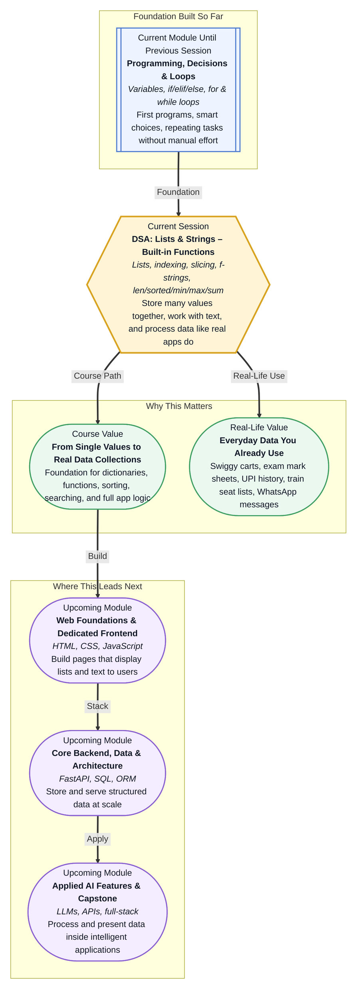

```mermaid
%%{init: {"flowchart": {"nodeSpacing": 45, "rankSpacing": 65, "diagramPadding": 20}} }%%
flowchart TB
    subgraph Foundation["Foundation Built So Far"]
        C1[["Current Module Until Previous Session<br/><b>Programming, Decisions &amp; Loops</b><br/><i>Variables, if/elif/else, for &amp; while loops</i><br/>First programs, smart choices, repeating tasks without manual effort"]]
    end

    CS{{"Current Session<br/><b>DSA: Lists &amp; Strings – Built-in Functions</b><br/><i>Lists, indexing, slicing, f-strings, len/sorted/min/max/sum</i><br/>Store many values together, work with text, and process data like real apps do"}}

    subgraph Value["Why This Matters"]
        CV(["Course Value<br/><b>From Single Values to Real Data Collections</b><br/>Foundation for dictionaries, functions, sorting, searching, and full app logic"])
        RV(["Real-Life Value<br/><b>Everyday Data You Already Use</b><br/>Swiggy carts, exam mark sheets, UPI history, train seat lists, WhatsApp messages"])
    end

    subgraph Future["Where This Leads Next"]
        F1(["Upcoming Module<br/><b>Web Foundations &amp; Dedicated Frontend</b><br/><i>HTML, CSS, JavaScript</i><br/>Build pages that display lists and text to users"])
        F2(["Upcoming Module<br/><b>Core Backend, Data &amp; Architecture</b><br/><i>FastAPI, SQL, ORM</i><br/>Store and serve structured data at scale"])
        F3(["Upcoming Module<br/><b>Applied AI Features &amp; Capstone</b><br/><i>LLMs, APIs, full-stack</i><br/>Process and present data inside intelligent applications"])
    end

    C1 ==>|&nbsp;Foundation&nbsp;| CS
    CS ==>|&nbsp;Course Path&nbsp;| CV
    CS ==>|&nbsp;Real-Life Use&nbsp;| RV
    CV ==>|&nbsp;Build&nbsp;| F1
    F1 ==>|&nbsp;Stack&nbsp;| F2
    F2 ==>|&nbsp;Apply&nbsp;| F3

    classDef previous fill:#eef4ff,stroke:#4f7ccf,color:#111827,stroke-width:2px;
    classDef current fill:#fff4d6,stroke:#d9a321,color:#111827,stroke-width:3px;
    classDef value fill:#eaf8ef,stroke:#3f9f63,color:#111827,stroke-width:2px;
    classDef future fill:#f4ecff,stroke:#8a61d1,color:#111827,stroke-width:2px;

    class C1 previous;
    class CS current;
    class CV,RV value;
    class F1,F2,F3 future;
    linkStyle default stroke-width:3px;
```
