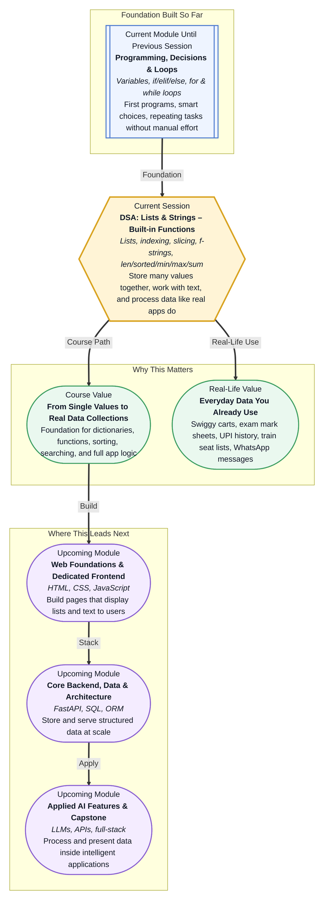

# Pre-read: DSA: Lists & Strings – Built-in Functions

## Context of This Session in the Course

---

Open your **Swiggy** app and look at your cart. Item one is biryani. Item two is raita. Item three is a cold drink. You did not create three separate apps for three separate dishes — everything sits in **one ordered list** that you can add to, remove from, and review before checkout. Now open your **exam result portal**. Your name appears as a clean line of text. Below it, five subject marks appear in a row. The app did not store each mark in a completely unrelated place — it grouped them together, counted them, found the highest and lowest, and printed a neat summary on screen.

That is the shift happening in this session. Until now, your Python programs could **calculate**, **decide**, and **repeat** — but mostly one value at a time. A single age. One bill amount. One password check. Real applications rarely work that way. They handle **collections** — shopping carts, student mark sheets, train seat numbers, UPI transaction histories, and long messages — and they do it thousands of times per second without breaking a sweat.

---

## When one variable is not enough

Imagine you are the class teacher for **Section B** with **40 students**. After the mid-term exam, you must find the **highest mark**, the **lowest mark**, the **total**, the **average**, and print a **sorted rank list** for the notice board. You could, in theory, create forty separate variables — `mark1`, `mark2`, `mark3`, all the way to `mark40`. But what happens when a new student joins? What if you need to remove someone who transferred out? What if the principal asks for only the **top five** marks, or the marks from students **3 to 7** on the attendance register?

Doing any of this by hand — or with forty hard-coded variables — becomes slow, messy, and full of mistakes. The moment your data **grows**, **changes**, or needs to be **sliced into parts**, a single-value approach falls apart. This is exactly the kind of challenge that **lists** and **strings** were built to solve. A **list** is an ordered collection where you keep many values together in one place — like a numbered row of boxes. A **string** is an ordered chain of characters that represents text — like the garland of letters that spell your name on an Aadhaar card.

In the previous session, you learned how to **repeat actions** with loops — visiting every number in a table, checking every password attempt, printing every row of a pattern. Lists and loops fit together naturally: once your data lives in a list, a loop can walk through every item without you knowing the count in advance. Combined with the **decision-making** skills from earlier sessions, you now have the full toolkit to build programs that behave like the apps on your phone.

---

## One lunch box, many compartments

Think of a **list** like a **tiffin box with compartments**. Each compartment holds something different — rice in one, dal in another, sabzi in a third — but together they form **one lunch box** you carry as a single unit. You can **add** a new compartment's worth of food at the end, **remove** the last item when you finish it, or **rearrange** items when you want them in a particular order. That is what list actions like **append**, **pop**, and **sort** do — they let your collection grow, shrink, and reorganise without creating a brand-new variable every time.

Now think of a **string** like your **WhatsApp status message** — a fixed sequence of characters that reads left to right. You can look at the **first letter**, the **last letter**, or **cut out a portion** in the middle, but you treat the whole message as one piece of text. When you add **"Ji"** after someone's name on a wedding invitation, you are joining text together — that is **concatenation**. When a shop receipt prints *"You paid ₹450 for Notebook × 3"*, it fills in blanks from real values — that is what **f-strings** (formatted text templates) let your programs do cleanly and readably.

Every item in a list has a **position number** called an **index**. Here is the one detail that surprises most beginners: counting starts at **zero**, not one. The first item is index **0**, the second is index **1**, and so on. You can also count **backwards from the end** — the last item is index **-1**, the second-to-last is **-2**. This is not a trick to confuse you; it is how you grab the last seat in a train booking list without knowing how many seats exist. **Slicing** goes one step further — it lets you take a **portion** of a list or string, like picking songs 3 to 5 from a playlist of ten, or taking the first three days of temperature readings from a week-long weather log.

---

## Ready-made tools for common questions

Real programs constantly ask the same simple questions: **How many items are there?** What is the **smallest** value? The **largest**? The **total**? Can you give me a **sorted copy** without changing the original? Python answers these through **built-in functions** — ready-made tools that work the moment you call them, with no extra setup.

There is an important difference worth understanding early. Some tools **change the list itself** — like **sort**, which rearranges the original list in place. Others **return a new sorted copy** and leave the original untouched — like **sorted**. Knowing which is which saves hours of confusion when your program prints unexpected results. These functions complement the **loop** skills you already have: instead of manually adding every mark one by one to find a total, **sum** does it instantly. Instead of scanning every item to count them, **len** gives you the answer in one step.

Put together, these ideas power the kind of small but complete programs real teams write every day — a **class report** that adds a new student, updates marks, calculates the average, identifies the topper, and prints a formatted summary in one clean flow.

**In this pre-read, you'll discover:**

- How **lists** let you store many values — marks, prices, names, seat numbers — in one organised collection instead of dozens of separate variables.
- How **indexing** and **slicing** help you reach any item, grab the last entry safely, or extract just the portion you need from lists and text.
- How **strings** and **f-strings** let you build readable messages, bills, and greetings that automatically fill in real values.
- How **built-in functions** like **len**, **sorted**, **min**, **max**, and **sum** answer everyday data questions without writing a fresh loop every time.

---

A **mutable** collection is one you can change after creating it — add items, remove items, update a value at a specific position. Lists work this way. An **immutable** sequence cannot be edited in place — strings behave like this, which is why you build new text rather than changing individual letters inside the original. An **IndexError** happens when you ask for a position that does not exist — like requesting seat number 50 when only 40 seats are booked. None of this needs advanced mathematics. It needs the same clarity you use when reading a numbered queue at a ration shop: know the order, pick the right position, and handle changes without losing track.

---

## After this session, you'll be able to

- Create and update **lists** — start empty, add items, remove items, and sort data for reports and rankings.
- Access any element using **positive and negative indexing**, and extract sub-portions with **slicing** on both lists and strings.
- Build clean, readable output using **f-strings** for bills, greetings, and mark summaries with calculated values inside the text.
- Use **len**, **sorted**, **min**, **max**, and **sum** to analyse collections — totals, averages, highest and lowest scores, sorted copies — in a few clear steps.
- Combine lists, strings, loops, and conditions into a **class report** or similar program that mirrors how real applications handle everyday data.

---

## Questions we will solve together in the live class

1. **Your coaching centre has a list of five mid-term marks: 72, 88, 65, 91, and 77.** The admin needs the total, average, highest, lowest, and a sorted copy for the notice board — all printed in one clean formatted report. How do you get every answer without manually looping through each mark five separate times?

2. **A Swiggy-style cart starts with three items, then a customer adds two more and removes the last one before checkout.** How does the list change at each step — and what happens if you try to remove from an already-empty cart?

3. **Given the word "AGENTIC", you need the first character, the last character, the middle three characters, and the entire word written backwards.** Indexing and slicing work on text the same way they work on lists — but why can you change a mark inside a list yet not swap a single letter inside a string directly?

Bring your curiosity. Every app that shows you a cart, a mark sheet, a transaction history, or a personalised message is built on the same list-and-string logic you are about to learn. The live session turns these everyday data problems into programs you can write, test, and trust.
