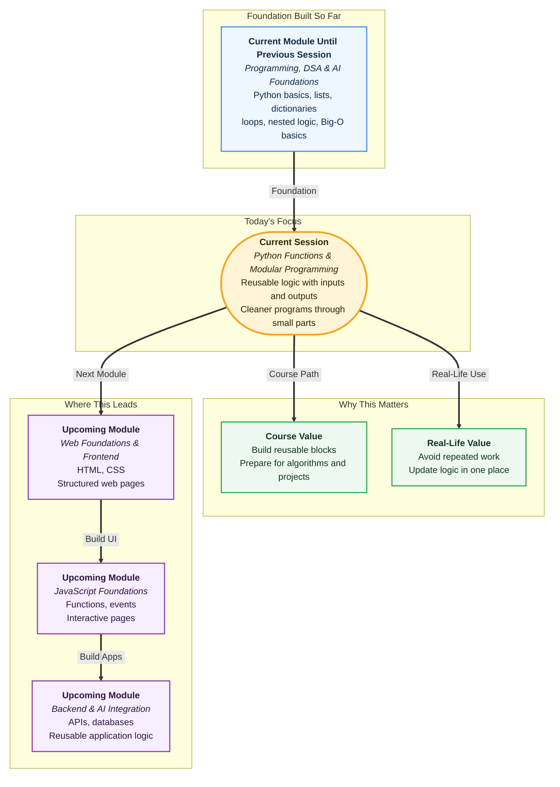

# Pre-read: Python Functions & Modular Programming

## Context of This Session in the Course

Imagine you are helping at a small college fest counter. Students are coming one by one to buy food coupons, register for events, and collect receipts.

At first, the work feels simple. You calculate one bill, print one receipt, and move to the next student.

But after some time, the same steps keep repeating again and again:

- Take the student's name.
- Add the selected item prices.
- Apply a discount if needed.
- Show the final amount.
- Print a simple message.

Now think like a programmer. If you had to write the same steps again for every counter - food counter, event counter, merchandise counter, and certificate counter - your program would become long, messy, and tiring to update.

What if the college suddenly changes the discount rule?

If the same calculation is copied in ten different places, you must carefully find and fix all ten places. If you miss even one place, your program may give different answers in different counters.

This is exactly the kind of problem **functions** solve.

A **function** is a reusable block of logic. In simple words, it is like saving a useful task with a name, so you can call it whenever you need it.

Think of it like a tea stall.

The tea stall worker does not need a new full explanation every time someone orders tea. The steps are already known: boil water, add tea powder, add milk, add sugar, and serve.

In programming, a function works in a similar way. Once you define a task properly, you can reuse it many times with different inputs.

For example, the same tea-making process can handle:

- One tea with less sugar.
- One tea with more milk.
- One tea without sugar.
- One strong tea.

The process is mostly the same, but the input changes. That is the power of functions.

In this pre-read, you'll discover:

- How a **function** helps you avoid writing the same logic again and again.
- How **parameters** and **arguments** allow a function to work with different inputs.
- How **return values** allow one function to give an answer back to the rest of the program.
- How **modular programming** helps you build programs as small, clear, reusable parts.

Let us make this more real.

Suppose you are building a simple recharge app. A user selects a plan, chooses the number of months, pays a small platform fee, and maybe gets cashback.

You can write the full calculation in one long block. It may work once, but it will become difficult to read later.

A cleaner way is to divide the work:

- One part calculates the base amount.
- One part adds platform fee.
- One part applies cashback.
- One part shows the final amount.

Each part can be a function. Each function does one clear job.

This is called **modular programming**. In simple words, it means building a program using small useful blocks instead of one big confusing block.

The benefit is not only neatness. It also makes your thinking sharper.

When you write a function, you are forced to answer three questions:

- What input does this task need?
- What work should happen inside?
- What output should come back?

This input-work-output thinking is used everywhere in software.

A login app may have one function to check username, one function to check password, and one function to show the result. A shopping app may have one function to calculate subtotal, one to add delivery charge, and one to apply discount.

Even advanced AI and backend systems are built using reusable blocks like this. Big applications are not usually written as one giant piece of code.

They are built by connecting many small pieces that each do their work properly.

One important idea you will explore is the difference between **printing** and **returning**.

Printing only shows something on the screen. Returning gives the result back to the program, so it can be stored, reused, or passed to another function.

This becomes powerful when the output of one function becomes the input of another function.

For example:

- First function calculates subtotal.
- Second function receives that subtotal and adds delivery charge.
- Third function receives the updated amount and applies discount.

This is like a shopping bill moving from one counter to another. Each counter adds or changes something and passes it forward.

You will also learn about **default values**.

A default value is a backup value used when the user does not provide something. For example, a delivery app may use "standard delivery" unless the customer chooses express delivery.

In functions, default values help us write flexible code without forcing the user to provide every small detail every time.

## What's Next

After the session, you will be able to:

- Talk about functions as reusable problem-solving blocks.
- Explain parameters, arguments, return values, and default values in simple words.
- Break repeated code into smaller functions.
- Connect multiple functions so one function's output becomes another function's input.
- Read a larger program more confidently because it is divided into meaningful parts.

## Think About These Before the Session

- If you had to calculate bills for 100 customers, would you copy the same formula 100 times or save it once and reuse it?
- What should happen if a function calculates a value but does not give it back to the program?
- Can one function's answer become the starting point for another function?
- Where have you seen a real-life process where one counter finishes work and passes the result to the next counter?

Keep these questions in mind. The live session will turn these ideas into clear Python examples and show how reusable functions make programs cleaner, shorter, and more professional.
