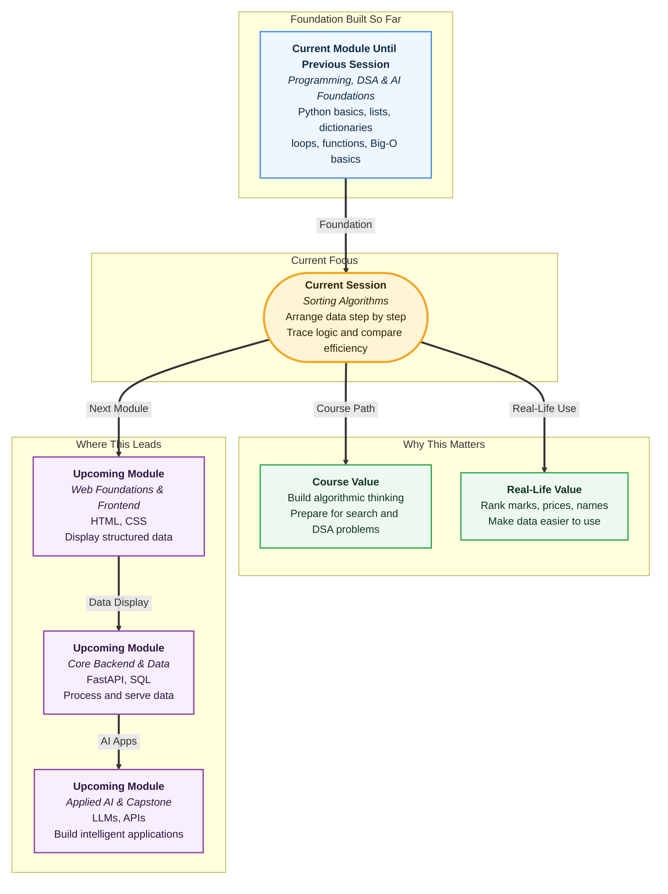

# Pre-read: Sorting Algorithms - Bubble Sort & Selection Sort

## Context of This Session in the Course

Imagine you open a shopping app and search for headphones. You see hundreds of products, different prices, different ratings, and different delivery dates.

Now you tap **"Price: Low to High"**.

Within a second, the app rearranges everything neatly. The cheapest product comes first, then the next, then the next.

This simple-looking action is powered by a very important idea in programming: **sorting**.

Sorting means arranging data in a particular order. In simple words, it is like putting things from smallest to biggest, biggest to smallest, or A to Z.

You already use sorting in daily life without thinking too much about it:

- Arranging exam marks from low to high.
- Sorting cricket players by runs.
- Organising contacts alphabetically.
- Filtering train tickets by departure time.
- Comparing product prices before buying.

Now imagine doing this manually for a small list of four values. It is possible.

But what if the list has 1,000 values?

What if a result portal has to rank every student in a college? What if an e-commerce app has to arrange thousands of products instantly? What if a hiring platform has to sort candidates by test score?

Doing this by hand would be slow, boring, and full of mistakes. A computer can do it, but only if we give it a clear step-by-step method.

That step-by-step method is called an **algorithm**.

An algorithm is simply a fixed set of steps to solve a problem. In this preread, the problem is sorting, and the two methods you will explore are **Bubble Sort** and **Selection Sort**.

Bubble Sort is like students standing in a line with number cards. You compare two neighbours at a time. If the left student has a bigger number than the right student, they exchange places.

Slowly, the bigger numbers move towards the right side. This is why the idea is called Bubble Sort: larger values "bubble up" towards the end.

Selection Sort thinks differently.

Instead of swapping neighbours again and again, it looks at the unsorted part, finds the smallest value, and places it in the next correct position. It is like arranging currency notes: first pick the smallest note, then the next smallest, then the next.

Both methods are easy to understand because they match real-life behaviour:

- Bubble Sort is like correcting a queue by checking neighbours.
- Selection Sort is like picking the smallest remaining item and placing it properly.

In this pre-read, you'll discover:

- How **Bubble Sort** moves larger values step by step toward the end.
- How **Selection Sort** repeatedly finds the smallest remaining value.
- How to **trace** an algorithm manually so you can see every comparison and swap.
- How **O(n²)** helps explain why these beginner sorting methods become slow for large lists.

The word **trace** is important.

Tracing means manually following an algorithm step by step. In simple words, it is like dry running the logic on paper before trusting the computer.

When you trace sorting, you do not simply look at the final answer. You watch how the list changes after every pass.

A **pass** means one full round of work in the algorithm. For Bubble Sort, a pass means checking neighbouring pairs across the unsorted part. For Selection Sort, a pass means finding the smallest value for one position.

This habit is powerful because it builds real understanding. If you can trace a small list on paper, code becomes much less scary.

You will also meet the idea of **complexity** again.

Complexity tells us how much work an algorithm does as the input grows. In simple words, it answers: "If the list becomes bigger, how much slower will this become?"

Bubble Sort and Selection Sort both use repeated checking. For a list of `n` items, the work grows roughly like `n x n`, which is written as **O(n²)**.

That does not mean the algorithm always performs exactly `n²` steps. It means the work grows in that general pattern.

This matters because a method that feels fine for 5 items may become painful for 5,000 items.

Sorting is not only about getting the right answer. It is also about learning to compare approaches.

Two algorithms can give the same final sorted list but behave differently inside. Bubble Sort compares neighbours many times. Selection Sort searches for the smallest value and usually swaps once per pass.

That comparison mindset is the beginning of algorithmic thinking.

## What's Next

After the session, you will be able to:

- Explain sorting using simple real-life examples like marks, prices, and names.
- Trace Bubble Sort and Selection Sort on small lists.
- Identify comparisons, swaps, passes, sorted parts, and unsorted parts.
- Understand why nested checking often leads to **O(n²)** time.
- Compare two algorithms that solve the same problem in different ways.

## Think About These Before the Session

- If four students are standing with marks cards, how would you arrange them from lowest to highest using only neighbour swaps?
- If you could pick the smallest remaining value each time, how many rounds would you need to sort the full list?
- Why does checking many pairs become slow when the list becomes large?
- If two methods give the same sorted answer, how can we decide which one is better?

Keep these questions in mind. The live session will turn this everyday idea of arranging things into clear sorting logic, manual tracing, and Python implementation.
