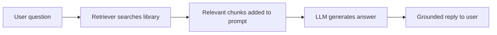
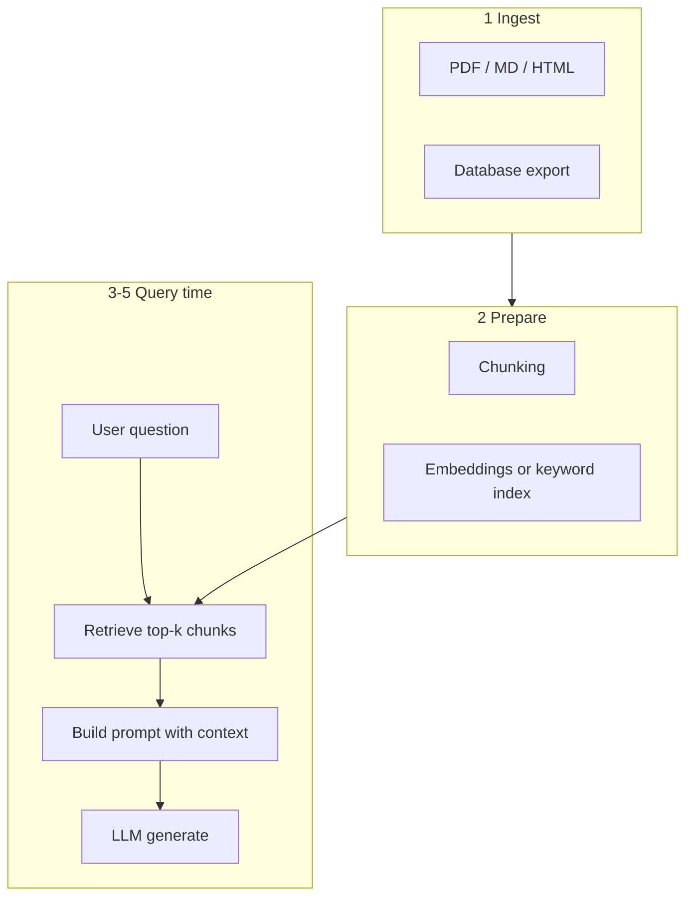
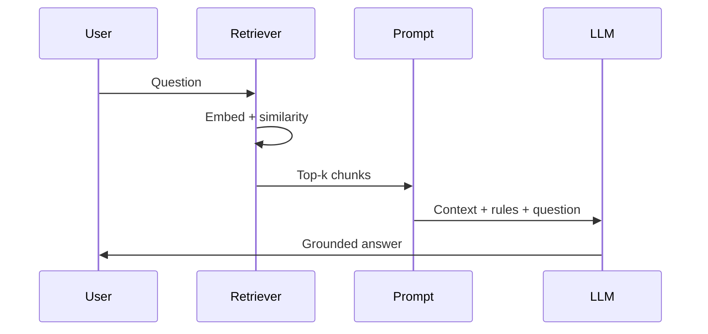

# RAG Foundations

## What We Covered So Far & What's Coming Next

In our last session, we learned to run **open-source LLMs** on your own machine with **Ollama** — install, pull a **light model**, chat from the terminal, and call the same model from **Python** (local or **Ollama Cloud**). We also previewed **embeddings**: turning text into number vectors so similar meanings sit close together. That preview was the first brick of today’s topic.

Today we answer a bigger question: **How do you give an AI its own library** so it can answer questions about **your** notes, company policy, or this week’s syllabus — not only what it memorized during training?

**In this session, you will learn:**
- Why an LLM **alone** is risky for organization-specific or **up-to-date** questions
- What **RAG** (Retrieval-Augmented Generation) means and how it differs from **fine-tuning**
- The **end-to-end RAG flow** and each stage of the **retrieval pipeline**
- How **retriever** and **generator** work together, and what **grounding** means
- How **bad or missing context** breaks answers — and practical ways to improve accuracy
- A **simple RAG demo** you can trace from user question → retrieval → final answer

---

## Why LLMs Alone Are Not Enough

You can already chat with a powerful model. So why do companies still build **RAG** systems?

**Official Definition:** A **Large Language Model (LLM)** is trained on huge public text up to a **knowledge cutoff** date. At answer time it **predicts** the next likely words — it does not automatically **look up** your private files or today’s news unless you give that text in the prompt or connect tools.

**In Simple Words:** The model is like a student who read millions of books until last year. If you ask about **your college’s 2026 hostel rules**, they may **guess** confidently instead of opening your actual notice board.

**Real-Life Example:** You ask ChatGPT, “What is the refund deadline for Masai’s March 2026 batch?” If that detail was never in training data, the model might invent a plausible-sounding date. That is dangerous for **policy**, **legal**, or **medical** questions.

### Three problems when you rely only on training memory

| Problem | What it means | Why it hurts you |
|---|---|---|
| **Knowledge cutoff** | Training data stops at a fixed date | New products, exams, prices, and policies are missing |
| **No access to private data** | Your PDFs, Notion, SQL, and emails were not in training | Company-specific answers are unavailable |
| **Hallucination risk** | Model fills gaps with fluent but **wrong** text | Users trust the tone and do not check facts |

> **Common doubt:** “But GPT feels so smart — can’t it just know our company?”  
> **Answer:** It knows **patterns** from the internet. It does **not** know your internal Google Doc unless you **paste it**, **upload it**, or **retrieve it** with RAG (or similar).

### Where prompt engineering stops and RAG starts

From the **Prompt Engineering** sessions you learned **system prompts**, **few-shot examples**, and **chain-of-thought**. Those skills still matter in RAG — but they cannot magically inject **50 PDF handbooks** into every question.

- **Static context in the prompt** works for a **short** institute blurb or one-page rules.
- **RAG** works when the library is **large**, **changes often**, or must stay **verifiable** from source documents.

**Connecting idea:** Ollama gave you a **local brain**; RAG gives that brain a **searchable bookshelf** sitting next to it.

---

## What Is RAG?

**Official Definition:** **Retrieval-Augmented Generation (RAG)** is a pattern where, before the LLM answers, a system **searches an external knowledge base** (documents, wikis, databases), **retrieves** the most relevant pieces, **adds them to the prompt**, and then asks the model to **generate** an answer grounded in that material.

**In Simple Words:** RAG = **Search first, then speak.** The model reads the right pages from **your library** for this question, then writes the answer like an open-book exam.

**Real-Life Example:** At a **DU photocopy shop**, you do not memorize every past-year paper. You ask the shopkeeper, they **pull the right folder** (retrieval), you **read the page** (context in prompt), then you **explain the answer** in your own words (generation).



### The “library” metaphor (use it in every project)

| Library part | RAG equivalent |
|---|---|
| Books on shelves | Your **documents** (PDF, MD, web pages, tickets) |
| Index cards / catalog | **Embeddings** or keyword index for search |
| Librarian finding books | **Retriever** |
| You reading before answering | **Context in the prompt** |
| Your explanation to a friend | **Generator** (the LLM) |

> **Reason you need this:** Agents in this course will take **actions** (send email, update ticket, approve refund). If the fact is wrong, the **action** is wrong. RAG reduces “confident fiction” for factual tasks.

---

## RAG vs Fine-Tuning — Which First?

Teams often ask: “Should we **train** the model on our data, or **retrieve** our data at question time?”

**Official Definition:** **Fine-tuning** updates (or adapts) model **weights** using your examples so behaviour or style becomes baked in. **RAG** keeps the model weights fixed and supplies **fresh context** in the prompt from a search step.

**In Simple Words:** Fine-tuning is like **memorizing** the textbook. RAG is like **bringing the textbook to the exam** each time.

**Real-Life Example:** Teaching a waiter to always say “Namaste” in Hindi is like **fine-tuning style**. Giving them tonight’s **menu printout** for specials is like **RAG** for facts that change daily.

### High-level comparison

| | **RAG** | **Fine-tuning** |
|---|---|---|
| **Best for** | Changing docs, policies, FAQs, support knowledge | Tone, format, domain language, classification style |
| **Updates when docs change** | Re-index new files — **no retrain** | Often needs **new training run** |
| **Shows sources** | Easier — you know **which chunk** was retrieved | Harder — knowledge is inside weights |
| **Cost / complexity to start** | Lower for many teams | Higher (data prep, GPU, evaluation) |
| **Risk** | Bad retrieval → wrong context | Overfit or outdated memorized facts |

### When RAG is the better **first** choice

Choose **RAG first** when:
- Answers must come from **specific documents** you can point to (policy, product manual, lecture notes).
- Content **changes** (pricing, syllabus, API docs).
- You want a **quick prototype** before investing in training.
- The team can maintain a **document library** more easily than a **training pipeline**.

Consider **fine-tuning later** (or together) when:
- You need a **consistent voice** (“always sound like our brand”).
- The task is **pattern recognition** (intent labels, JSON shape) more than quoting docs.
- Retrieved chunks are never enough because reasoning style must be deeply customized.

> **Common mistake:** Fine-tuning on 200 FAQ rows when the real problem is “model never saw the PDF.” That is usually a **retrieval** problem, not a **memory** problem.

> **[ Student Activity ]**
>
> **RAG or Fine-tune? (10 minutes)**
>
> For each scenario, shout **RAG**, **Fine-tune**, or **Both**:
> 1. Hospital chatbot must cite the latest **insurance circular** uploaded yesterday.  
> 2. Bot must always reply in **Shakespearean English**.  
> 3. Startup has 3,000 support tickets and wants answers from the **help centre PDF**.  
> 4. Model must classify emails into exactly **7 labels** with 99% format compliance.  
>
> *Discuss one wrong choice and what would break in production.*

---

## End-to-End RAG Flow (Conceptual Walkthrough)

Before code, picture the **full journey** once. Every tool — LangChain, LlamaIndex, custom Python — implements the same story with different packaging.

**Official Definition:** The **RAG pipeline** is: **Ingest** documents → **Prepare** them for search → **Retrieve** relevant segments for a query → **Augment** the prompt with that text → **Generate** the final answer.

**In Simple Words:** Bring books in → tear into readable pages → find the right pages for the question → hand those pages to the student → student writes the answer.

### The five phases in plain language

| Phase | What happens | Student-friendly analogy |
|---|---|---|
| **1. Ingest** | Load files from disk, web, or database | Books arrive at the library |
| **2. Prepare** | Clean text, **split into chunks**, build search index | Chop into chapters; write catalog cards |
| **3. Retrieve** | Compare user question to chunks; pick top matches | Librarian pulls 3–5 best pages |
| **4. Augment** | Paste chunks into the prompt with instructions | Open-book exam: “Use only these pages” |
| **5. Generate** | LLM writes the answer | Student explains in their own words |



### What “prepare for search” really means

- **Chunking:** Long files are cut into **small pieces** (e.g. 300–800 words) so one paragraph about “refunds” is not buried inside a 40-page file.
- **Indexing:** Each chunk gets an **ID** and a way to be found — today we focus on **embedding vectors** (next session goes deeper into **vector databases** like Chroma/FAISS).
- **Metadata:** Optional tags — `department=HR`, `year=2026` — to filter search later.

> **Common doubt:** “Why not put the whole PDF in the prompt?”  
> **Answer:** Models have a **context window limit** (max tokens). Huge paste is slow, expensive, and often **dilutes** the important sentence. Retrieval picks **only** what matters.

---

## The Retrieval Pipeline — Stage by Stage

Now zoom into **retrieval** — the part that makes RAG different from normal chat.

**Official Definition:** The **retrieval pipeline** transforms raw documents into a searchable store and, at query time, returns ranked **chunks** relevant to the user’s question.

**In Simple Words:** Build a smart catalog once; every question uses that catalog to pull the right snippets.

### Stage map (name + job)

| Stage | Name | What happens |
|---|---|---|
| A | **Document loading** | Read PDF, TXT, Markdown, web page, etc. |
| B | **Cleaning** | Remove junk headers, broken encoding, duplicate lines |
| C | **Chunking / splitting** | Cut into overlapping pieces so ideas are not cut mid-sentence |
| D | **Embedding** | Turn each chunk into a vector (list of numbers) capturing meaning |
| E | **Storage / index** | Save vectors + original text (in memory, file, or vector DB) |
| F | **Query embedding** | Turn the user question into a vector the same way |
| G | **Similarity search** | Find chunks whose vectors are closest to the question vector |
| H | **Top-k selection** | Keep the best **k** chunks (e.g. 3 or 5) — not the whole library |
| I | **Context assembly** | Format chunks with labels (“Source 1”, “Source 2”) for the prompt |

**Real-Life Example:** **Stage A–E** is setting up a **Justdial** listing for your shop once. **Stage F–I** is what happens when a customer calls: you search your notebook for matching services, read only those lines, then answer.

> **Integrated tip:** Overlap between chunks (e.g. 50 words repeated) helps when an important sentence sits on a **boundary** between two splits — you will practice chunking more in the **Building a RAG App** session.

---

## Retriever vs Generator — Two Jobs, One Answer

RAG is not “one model doing everything.” Two roles must cooperate.

**Official Definition:** The **retriever** selects relevant evidence from the knowledge base. The **generator** is the LLM that produces natural language using the prompt (including retrieved text).

**In Simple Words:** Retriever = **finds** the notes. Generator = **writes** the exam answer using those notes.

**Real-Life Example:** In a **court case**, the **junior lawyer** collects case law (retriever). The **senior lawyer** argues in court in clear language (generator). If the junior brings the wrong cases, the senior can still sound brilliant — but lose the case.

### Why both must work

| If retriever fails… | If generator fails… |
|---|---|
| Right answer exists in library but **never reaches** the prompt | Perfect context is ignored or **misread** |
| Model answers from **old training memory** | User gets a **summary** that contradicts the provided policy |
| Hallucination risk **goes up** | Citations look fine but reasoning is **illogical** |

### Division of responsibility (checklist for debugging)

- **Retriever quality:** Are the top chunks actually about the user’s topic?
- **Generator quality:** Given perfect chunks, does the model follow “answer only from context”?
- **Prompt instructions:** Do you tell the model to say **“I don’t know”** when context is silent?

> **Common mistake:** Blaming the LLM when the real bug is **search returned irrelevant chunks** (wrong department’s PDF, outdated file version).

---

## Grounding — Answering From Supplied Context

**Official Definition:** **Grounding** means the model’s answer should be **supported by** explicit context provided at inference time (retrieved chunks), rather than invented facts when the library already contains the answer.

**In Simple Words:** The AI should behave like a student in an **open-book** test: if the book has the line, quote or paraphrase it — do not make up a new rule.

**Real-Life Example:** A **railway enquiry** board shows the live platform number. A grounded assistant reads the board. An ungrounded assistant guesses platform 5 because it “sounds right.”

### Strong grounding instructions (put in system or user prompt)

Use clear rules such as:
- “Answer **only** using the Context below. If the answer is not in the Context, say **I could not find this in the provided documents**.”
- “Do not use outside knowledge for factual claims about company policy.”
- “When possible, mention which **source chunk** you used.”

### Signs of good grounding

- Answer **matches** retrieved text on dates, numbers, and names.
- Model admits **uncertainty** when chunks do not contain the fact.
- You can **audit** by reading the same chunks the model saw.

### Signs of poor grounding

- Correct-sounding answer with **no support** in retrieved chunks.
- Mixing **two policies** from different years in one reply.
- Ignoring a clear line in context because the model “prefers” training memory.

> **Link to agents:** In agentic systems, grounding is what stops an agent from **booking the wrong flight** because it imagined a fare.

---

## When Context Goes Wrong — Failure Modes

Even with RAG, answers fail if **context** is missing, **irrelevant**, or **contradictory**.

**Official Definition:** **Context failure** is any situation where the text given to the generator does not reliably support a correct answer for the user’s question.

**In Simple Words:** Garbage in → confident garbage out.

### Three classic failure modes

| Failure mode | What went wrong | What the user sees |
|---|---|---|
| **Missing context** | Retriever found nothing useful; prompt has empty or generic chunks | Model **hallucinates** or gives a vague generic answer |
| **Irrelevant context** | Top chunks are about another topic (similar words, wrong dept) | Fluent answer that is **wrong for this question** |
| **Contradictory context** | Chunk A says refund in 7 days; Chunk B says 30 days | Model **picks one**, blends both, or confuses the user |

**Real-Life Example:** Searching “apple” in a mixed library returns **fruit prices** and **iPhone warranty** — the retriever must use **metadata** or better embeddings to disambiguate.

### How each failure hurts quality

- **Missing:** User thinks RAG is “broken” — often you need **better documents**, **smaller chunks**, or **lower similarity threshold**.
- **Irrelevant:** Looks like hallucination but is really **bad search** — fix retriever before swapping LLM.
- **Contradictory:** Needs **document ownership** (which file is official?), **version dates**, or **human review**.

> **[ Student Activity ]**
>
> **Failure Mode Detective (15 minutes)**
>
> Read this user question: *“Can I get a hostel single room as a first-year student?”*  
> Retrieved chunk is about **mess timings** only.  
> - Name the failure mode.  
> - What should the **grounded** model say?  
> - List **two** fixes (library side, not model side).

---

## Improving Accuracy Through Better Context

RAG quality is often **80% data and retrieval**, **20% model choice**.

**Official Definition:** **Context engineering** (for RAG) is the practice of improving answers by curating **trustworthy sources**, **clear structure**, **good chunking**, and **focused user questions** — not only by buying a bigger LLM.

**In Simple Words:** Clean the bookshelf before blaming the reader.

### Practical improvements (integrate into your projects)

| Lever | What to do | Why it helps |
|---|---|---|
| **Trustworthy sources** | Use official PDFs, signed policies, not random scraped blogs | Reduces wrong facts in the index |
| **Clear document structure** | Headings, tables, bullet lists; avoid scanned images without OCR | Chunks stay readable and on-topic |
| **Focused user questions** | Ask “What is the **2026** refund rule for **online** courses?” not “Tell me everything” | Retrieval gets a sharper target vector |
| **Metadata filters** | Tag docs by year, product, language | Stops 2024 policy from beating 2026 policy |
| **Chunk size tuning** | Not too tiny (no meaning), not too huge (noise) | Each retrieved piece is one idea |
| **Top-k tuning** | Retrieve 3–5 chunks; evaluate on real questions | Balance recall vs prompt clutter |
| **Prompt rules** | Require “not in documents” answers | Stops invention when library is silent |

**Real-Life Example:** A **Zomato** menu photo that is blurry hurts recommendations. A clean typed menu helps — same for RAG chunks.

> **Common doubt:** “Should we retrieve 20 pages to be safe?”  
> **Answer:** Usually **no** — see next section.

---

## More Context Is Not Always Better

It feels logical: “Give the model **everything** and it will figure it out.” In practice, **extra noise** confuses the generator and wastes the **context window**.

**Official Definition:** The **context window** is the maximum tokens (roughly words + symbols) the model can read in one request — including instructions, retrieved chunks, and chat history.

**In Simple Words:** The model’s desk has limited space. Piling 30 random pages makes it miss the one line that matters.

**Real-Life Example:** Studying for an exam by carrying **all semester notebooks** into the hall is worse than carrying **three marked pages** on the exact chapter.

### Why “only the most relevant material” wins

| Too little context | Too much context |
|---|---|
| Model lacks the fact → may guess | Important sentence buried in noise |
| Easy to debug | Model attends to **wrong paragraph** |
| Cheap, fast | Slower, costlier, hits token limits |

### Rules of thumb for beginners

- Start with **top-k = 3** chunks; increase only if evaluations show **missing** facts.
- Prefer **reranking** later (advanced) over dumping 50 chunks.
- Put the **strongest** chunk near the top of the prompt (many models pay more attention to start/end).
- If one chunk is enough, **do not** add five more “just in case.”

> **Forward link:** The next session on **Embeddings & Vector Search** teaches **similarity scores** and vector stores so your retriever picks the **right** few pages, not the **most** pages.

---

## Same Question — Without RAG vs With RAG

Let us compare one **factual** question using a tiny sample **library** about a fictional **IIT Roorkee Agentic Systems** course handbook.

**Sample fact (only in our library, not in model training):**  
*“For the March 2026 cohort, assignment late submissions are accepted up to 48 hours with a 10% penalty per day after the deadline.”*

### Case A — No external context (plain LLM)

**User question:** “What is the late submission penalty for the March 2026 cohort?”

**What happens:**
- The model has **no guaranteed access** to our handbook sentence.
- It may invent a **generic** university rule (5% per day, no late work, etc.).
- Answer sounds **professional** but may be **false**.

**Typical bad outcome:** “Most institutes allow 24 hours with 5% penalty…” — **not our rule.**

### Case B — With retrieved context (RAG)

**Retriever returns chunk:**  
`"... March 2026 cohort ... 48 hours ... 10% penalty per day after the deadline."`

**Prompt includes:** “Answer only from Context.”

**What happens:**
- Generator sees the **exact policy line**.
- Answer paraphrases **48 hours** and **10% per day** correctly.
- If chunk were missing, a well-prompted model should say **not found**.

| | **No RAG** | **With RAG** |
|---|---|---|
| Source of fact | Training guess | **Your document** |
| Verifiable | Hard | Read the same chunk |
| Updates when policy changes | Wrong until retrain / new model | **Re-index** new PDF |
| Risk for agents | High | Lower (if retrieval is good) |

> **[ Student Activity ]**
>
> **Side-by-Side Demo (20 minutes)**
>
> 1. Ask your local Ollama model the late-penalty question **with no context**.  
> 2. Paste the handbook sentence manually into the prompt (simulate RAG).  
> 3. Compare answers — note one invented detail from step 1.  
>
> *This manual paste is exactly what RAG automates.*

---

## Simple RAG Demo — End to End

We now run a **complete but small** RAG program in Python using **Ollama** (from the previous session): **embed** chunks, **search**, **build prompt**, **generate**.

**Prerequisites:**
- Ollama running locally
- `ollama pull qwen2.5:0.5b` (or another small chat model you already use)
- `ollama pull nomic-embed-text`
- `pip install ollama`

Save as `simple_rag_demo.py`:

```python
# simple_rag_demo.py — minimal RAG: embed, retrieve, augment, generate

# math module for square root (used in cosine similarity)
import math

# Official Ollama Python helpers for chat and embeddings
from ollama import chat, embed

# ----- 1. OUR "LIBRARY" (in real apps: load from files / database) -----

# Each dict is one searchable chunk with an id and text
DOCUMENT_CHUNKS = [
    {
        "id": "policy-late",
        "text": (
            "For the March 2026 cohort, assignment late submissions are accepted "
            "up to 48 hours with a 10% penalty per day after the deadline."
        ),
    },
    {
        "id": "policy-contact",
        "text": (
            "Course support email is agentic-help@example.edu. "
            "Replies are sent within 2 business days."
        ),
    },
    {
        "id": "policy-exam",
        "text": (
            "The Module 3 capstone viva is scheduled in week 12. "
            "Students must submit the GitHub repo link 24 hours before the viva."
        ),
    },
]

# Name of the embedding model (must be pulled: ollama pull nomic-embed-text)
EMBED_MODEL = "nomic-embed-text"

# Name of the chat model for final answer (must be pulled: ollama pull qwen2.5:0.5b)
CHAT_MODEL = "qwen2.5:0.5b"

# How many top chunks to send to the LLM (keep small — see "more context" section)
TOP_K = 2

# The user's question — change this to test retrieval
USER_QUESTION = "What is the late submission rule for the March 2026 cohort?"


def cosine_similarity(vector_a, vector_b):
    """Return similarity score between two vectors (higher = more similar)."""
    # Multiply matching positions and sum — dot product
    dot_product = sum(a * b for a, b in zip(vector_a, vector_b))
    # Length (magnitude) of vector A
    magnitude_a = math.sqrt(sum(a * a for a in vector_a))
    # Length (magnitude) of vector B
    magnitude_b = math.sqrt(sum(b * b for b in vector_b))
    # Avoid division by zero if a vector is empty
    if magnitude_a == 0 or magnitude_b == 0:
        return 0.0
    # Cosine similarity formula: dot / (|A| * |B|)
    return dot_product / (magnitude_a * magnitude_b)


def embed_text(text):
    """Turn one string into an embedding vector using Ollama."""
    # Call Ollama embed API; response has a list of vectors
    response = embed(model=EMBED_MODEL, input=text)
    # Take the first (and only) vector for a single string input
    return response["embeddings"][0]


def retrieve_top_chunks(question, chunks, top_k):
    """Find the top_k chunks most similar to the question."""
    # Embed the user question once
    question_vector = embed_text(question)
    # List to store (score, chunk) pairs
    scored_chunks = []
    # Loop over every document chunk in the library
    for chunk in chunks:
        # Embed this chunk's text
        chunk_vector = embed_text(chunk["text"])
        # Compute similarity between question and chunk
        score = cosine_similarity(question_vector, chunk_vector)
        # Save score with chunk for sorting later
        scored_chunks.append((score, chunk))
    # Sort by score highest first
    scored_chunks.sort(key=lambda pair: pair[0], reverse=True)
    # Keep only the top_k results
    top_results = scored_chunks[:top_k]
    # Return chunks without scores (for prompt building)
    return [chunk for score, chunk in top_results]


def build_rag_prompt(question, retrieved_chunks):
    """Build a single prompt string with context + grounding rules."""
    # Start with strict instructions for the model
    lines = [
        "You are a helpful course assistant.",
        "Answer ONLY using the Context below.",
        "If the answer is not in the Context, say: I could not find this in the provided documents.",
        "",
        "=== Context ===",
    ]
    # Add each retrieved chunk with a label
    for index, chunk in enumerate(retrieved_chunks, start=1):
        lines.append(f"[Source {index} | id={chunk['id']}]")
        lines.append(chunk["text"])
        lines.append("")
    # Close context block and add the user question
    lines.append("=== Question ===")
    lines.append(question)
    # Join all lines into one string for the user message
    return "\n".join(lines)


def generate_answer(rag_prompt):
    """Call the LLM with the augmented prompt and return text."""
    # Send one user message containing context + question
    response = chat(
        model=CHAT_MODEL,
        messages=[{"role": "user", "content": rag_prompt}],
    )
    # Extract assistant reply text from response dict
    return response["message"]["content"]


def main():
    """Run full RAG pipeline and print each step for learning."""
    print("=== RAG Demo: Step-by-step trace ===\n")
    # Step 1 — show the question
    print("1) User question:")
    print("  ", USER_QUESTION)
    print()
    # Step 2 — retrieve
    print("2) Retrieving top chunks (embedding + similarity)...")
    retrieved = retrieve_top_chunks(USER_QUESTION, DOCUMENT_CHUNKS, TOP_K)
    for chunk in retrieved:
        print(f"   - {chunk['id']}: {chunk['text'][:80]}...")
    print()
    # Step 3 — build prompt
    print("3) Building augmented prompt with grounding rules...")
    rag_prompt = build_rag_prompt(USER_QUESTION, retrieved)
    print()
    # Step 4 — generate
    print("4) Calling LLM generator...")
    answer = generate_answer(rag_prompt)
    print()
    # Step 5 — final output
    print("5) Final grounded answer:")
    print(answer)
    print()
    print("=== Compare: run again with a question NOT in the library ===")
    print("Example: 'What is the dress code for convocation?'")


# Standard entry point — run main when file is executed directly
if __name__ == "__main__":
    main()
```

**How the code works:**
- `DOCUMENT_CHUNKS` — plays the **library**; production code loads PDFs/MD files instead.
- `embed_text` — uses Ollama **`nomic-embed-text`** to turn text into vectors (retrieval index).
- `retrieve_top_chunks` — embeds the question and each chunk, scores with **cosine similarity**, keeps **top-k**.
- `build_rag_prompt` — **augments** the prompt with grounding rules and labeled sources.
- `generate_answer` — **generator** step via `chat()` on your local model.
- `main()` — prints a **trace** so you can teach each stage on screen.

### Run the demo

```text
python simple_rag_demo.py
```

**Expected behaviour:**
- For the **late submission** question, retrieved `id=policy-late` should appear.
- Final answer should mention **48 hours** and **10% penalty per day**.
- For an **out-of-library** question, the model should refuse (if it follows instructions).

> **Common mistakes:**
> - Ollama not running → connection error on `embed` or `chat`.
> - Forgot `ollama pull nomic-embed-text` → embed model not found.
> - `TOP_K` too high with tiny unrelated chunks → irrelevant context failure mode.

> **[ Student Activity ]**
>
> **Trace the Pipeline (25 minutes)**
>
> - Run `simple_rag_demo.py` and screenshot the **retrieved chunk ids**.  
> - Change `USER_QUESTION` to the support **email** question — verify `policy-contact` is retrieved.  
> - Change to a **convocation dress code** question — note retrieval misses and whether the model says **not found**.  
> - Lower `TOP_K` to `1` and see if quality improves or breaks for one question.

---

## Tracing User Query → Retrieval → Final Response

Use this script in class as a **live narration checklist**:

| Step | Code location | What to say to the class |
|---|---|---|
| **User query** | `USER_QUESTION` | “This is what the student types in the app.” |
| **Query embedding** | `embed_text(question)` | “We turn the question into numbers for meaning-search.” |
| **Search** | `retrieve_top_chunks` | “Librarian picks the closest shelves.” |
| **Context injection** | `build_rag_prompt` | “We paste only those shelves into the exam paper.” |
| **Generation** | `generate_answer` | “The LLM writes the answer — open-book style.” |
| **Grounding check** | Compare answer to chunk text | “Every fact should point back to Source 1 or 2.” |



### Optional: compare with “no RAG” in the same file

Add this function below `generate_answer` and call it from `main()` for a live contrast:

```python
def generate_without_rag(question):
    """Ask the LLM with NO retrieved context — shows hallucination risk."""
    # Plain question only — no handbook text
    response = chat(
        model=CHAT_MODEL,
        messages=[{"role": "user", "content": question}],
    )
    # Return assistant message text
    return response["message"]["content"]
```

Run both on the **same** `USER_QUESTION` and read answers aloud — the class should hear the difference immediately.

---

## Building Your First “Library” — Checklist for Projects

Before you jump to frameworks, practise this **manual quality checklist**:

- [ ] **One folder** of truth — `policies/`, `lectures/`, not 50 duplicate copies
- [ ] **File names** include year or version (`refund-policy-2026.md`)
- [ ] **Chunk size** you can read in 30 seconds on one screen
- [ ] **Test questions** written by teammates who did not write the docs
- [ ] **Log retrieved ids** in the terminal (like our demo) for debugging
- [ ] **System prompt** that forces “not in documents” when needed

**Real-Life Example:** A **kirana store** WhatsApp bot fails when the price list PDF is outdated. RAG does not fix **stale** documents — you still update the shelf, then re-index.

---

## How This Connects to Upcoming Sessions

- **Embeddings & Vector Search** goes deeper on **vectors**, **similarity scores**, and tools like **Chroma/FAISS** — today we used a tiny in-memory index.
- **Building a RAG App** adds **chunking strategies**, **top-k retrieval** at scale, and **prompt injection** patterns in a full app shape.
- **LangChain / agents** will call the same retriever → generator pattern as a **tool** inside an agent loop.

You already have **Ollama + Python**; RAG is the layer that makes those calls **trustworthy for your own data**.

---

## Key Takeaways

- LLMs alone hit **knowledge cutoffs**, lack **private docs**, and **hallucinate** when they guess — RAG fixes factual gaps by **searching your library first**.
- **RAG** = ingest → prepare (chunk + index) → retrieve → augment prompt → generate; **retriever** finds evidence, **generator** writes language.
- **Grounding** means answers should follow **supplied context**; missing, irrelevant, or contradictory chunks are the usual reasons RAG “fails.”
- **Better context** beats a bigger model: trustworthy sources, clear structure, focused questions, and **only top-k relevant chunks** — not the whole drive.
- Your **`simple_rag_demo.py`** trace proves the pipeline; next you will store vectors properly and build a fuller RAG app.

---

## Important Commands, Libraries, Terminologies Used

| Term / Command | Category | Meaning |
|---|---|---|
| **RAG** | Concept | Retrieval-Augmented Generation — search library, then generate |
| **Knowledge cutoff** | Concept | Last date of training data; model may not know events after |
| **Hallucination** | Concept | Fluent but incorrect or invented output |
| **External knowledge base** | Concept | Your documents/store separate from model weights |
| **Ingest** | Pipeline stage | Load raw documents into the system |
| **Chunking / splitting** | Pipeline stage | Break large files into searchable pieces |
| **Embedding** | Concept | Numeric vector representing text meaning |
| **Index** | Concept | Search structure built from chunks (vectors or keywords) |
| **Retriever** | Component | Finds relevant chunks for a query |
| **Generator** | Component | LLM that produces the final answer |
| **Augment (prompt)** | Pipeline stage | Insert retrieved text into the LLM prompt |
| **Grounding** | Concept | Answer supported by provided context, not invented |
| **Top-k** | Parameter | Number of best chunks returned by retrieval |
| **Context window** | Concept | Max tokens the model can read in one request |
| **Fine-tuning** | Concept | Adapting model weights with training examples |
| **Cosine similarity** | Math | Score for how alike two embedding vectors are |
| **Context failure** | Concept | Missing, irrelevant, or contradictory retrieved text |
| **Context engineering** | Practice | Improving RAG via docs, structure, and retrieval tuning |
| `ollama pull nomic-embed-text` | CLI | Download embedding model for search |
| `ollama pull qwen2.5:0.5b` | CLI | Example small chat model for generation |
| `from ollama import embed` | Python | Create embeddings locally |
| `from ollama import chat` | Python | Generate answers after retrieval |
| `simple_rag_demo.py` | Project file | End-to-end classroom RAG trace script |
| **Vector database** | Tool (next session) | Stores millions of vectors for fast search (Chroma, FAISS) |
| **LangChain** | Framework (later) | Orchestrates RAG and agent steps in code |
