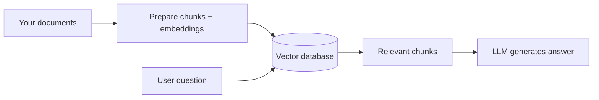
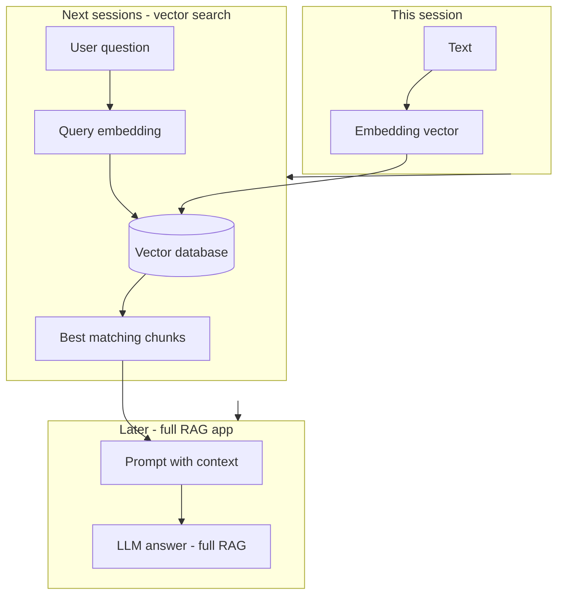

# RAG Foundations

## What We Covered So Far & What's Coming Next

In our last session we ran **open-source LLMs** with **Ollama** and previewed **embeddings** — turning a sentence into a list of numbers that capture **meaning**. That preview is the last piece we need today.

This session is about the **big picture**: how to give AI its own **library** so answers can come from **your documents**, not only from training memory. We will **not** build a full RAG application in code today — that comes in a **later session**. We **will** see how **text becomes embeddings**, and how that connects to **vector databases** and full RAG in **upcoming sessions**.

**In this session, you will learn:**
- Why an LLM **alone** is risky for private or up-to-date questions
- What **RAG** means and the **five-step flow** (concept only)
- **Retriever**, **generator**, and **grounding** in plain language
- **Without vs with context** — a quick live comparison (manual, no RAG app)
- How **input text converts to embeddings** (hands-on demo at the end)
- How embeddings lead to **vector DBs** → **retrieval** → **RAG** in upcoming classes

---

## Why LLMs Alone Are Not Enough

**Official Definition:** A **Large Language Model (LLM)** is trained on huge public text up to a **knowledge cutoff**. At answer time it **predicts** likely words — it does not automatically read your private PDFs or this morning’s notice unless you put that text in the prompt.

**In Simple Words:** The model is like a student who read the internet until last year. Ask about **your company’s 2026 refund rule** and they may **sound confident** but still be wrong.

**Real-Life Example:** You ask, “What is the late-submission penalty for our March 2026 batch?” If that line lives only in an internal PDF, the model might invent a generic university rule.

### Three quick problems

| Problem | In one line |
|---|---|
| **Knowledge cutoff** | New policies and products may not exist in training data |
| **No private data** | Your internal docs were never in training |
| **Hallucination** | The model fills gaps with fluent but **false** text |

> **Common doubt:** “Can’t ChatGPT just know our company?”  
> **Answer:** Only if you **give it the text** (paste, upload, or **retrieve** with RAG). Otherwise it guesses from general patterns.

**Connecting idea:** **Prompt engineering** helps you *talk* to the model. **RAG** helps you *feed* the model the right **pages** from your library before it speaks.

---

## What Is RAG?

**Official Definition:** **Retrieval-Augmented Generation (RAG)** is a pattern where the system **searches an external knowledge base**, **retrieves** relevant text, **adds it to the prompt**, and then the LLM **generates** an answer using that material.

**In Simple Words:** **Search first, then speak.** Open-book exam: find the right page, then answer.

**Real-Life Example:** At a **DU photocopy shop**, the keeper **pulls the right folder** (retrieval), you **read the page** (context in prompt), then you **explain** (generation).

| Library idea | RAG part |
|---|---|
| Books on shelves | Your **documents** |
| Catalog / index | **Embeddings** + later a **vector database** |
| Librarian | **Retriever** |
| Reading before answering | **Context in the prompt** |
| Your explanation | **Generator** (the LLM) |

> **Why it matters for agents:** Wrong facts → wrong **actions** (wrong refund, wrong email). RAG reduces guessing on policy and product questions.

---

## The Five-Step RAG Flow (Concept Only)

Every RAG tool (LangChain, custom Python, enterprise products) follows the same story. Learn this **once** — details come in **upcoming sessions**.

**Official Definition:** **RAG pipeline** = **Ingest** → **Prepare** → **Retrieve** → **Augment** → **Generate**.

**In Simple Words:** Bring documents in → chop and index them → find the best pieces for the question → paste into the prompt → LLM writes the answer.

| Step | What happens | We do it in class today? |
|---|---|---|
| **1. Ingest** | Load PDFs, Markdown, web pages, etc. | Concept only |
| **2. Prepare** | Clean text, **chunk**, build **embeddings**, store in an **index** | **Embeddings demo** at end of today |
| **3. Retrieve** | Find chunks closest to the user question | **Next session** (vector search) |
| **4. Augment** | Put chunks + rules into the prompt | **Later session** (RAG app) |
| **5. Generate** | LLM produces the final answer | You already did this with Ollama |



> **Common doubt:** “Why not paste the whole PDF?”  
> **Answer:** Models have a **context limit**. Retrieval sends only the **most relevant** pieces — **upcoming sessions** will teach how to pick them.

---

## Retriever, Generator, and Grounding

Two jobs work together — do not blame only the LLM when RAG fails.

**Official Definition:** The **retriever** finds relevant evidence from the library. The **generator** is the LLM that writes the answer. **Grounding** means the answer should follow **supplied context**, not invent facts when the library already has the answer.

**In Simple Words:** Retriever = **finds** the notes. Generator = **writes** the answer. Grounding = **stick to the notes** on the open-book test.

**Real-Life Example:** A **railway display board** shows the platform. A grounded assistant reads the board. An ungrounded one guesses platform 5 because it “sounds right.”

### One prompt rule to remember

Add something like:

- *“Answer **only** using the Context below. If the answer is not in the Context, say you could not find it in the documents.”*

### If something goes wrong (one glance)

| Symptom | Likely cause | Fixed in |
|---|---|---|
| Confident wrong fact | No context or bad retrieval | Today (manual context); **upcoming sessions** (search) |
| Answer ignores your PDF | Weak grounding instruction | Prompt + **later RAG build** |
| Wrong year of policy | Outdated doc in the library | Document hygiene + **later sessions** |

> **Deeper tuning** (chunk size, top-k, failure drills) is for **future sessions**, not today.

---

## Without Context vs With Context (Manual Demo — No RAG App)

We prove the **idea** before we automate it. No full RAG script in this session.

**Sample fact (only in our handbook, not guaranteed in training):**  
*“For the March 2026 cohort, late submissions are accepted up to 48 hours with a 10% penalty per day after the deadline.”*

### Step 1 — Ask the LLM with no extra text

Use **Ollama** CLI or your Python script from the **previous session**. Ask only:

```text
What is the late submission rule for the March 2026 cohort?
```

**What you often see:** A generic or invented rule — sounds professional, may be **wrong**.

### Step 2 — Same question, paste the handbook line

Send a prompt like:

```text
Answer ONLY using the Context below.

Context:
For the March 2026 cohort, late submissions are accepted up to 48 hours
with a 10% penalty per day after the deadline.

Question:
What is the late submission rule for the March 2026 cohort?
```

**What you should see:** **48 hours** and **10% per day** — grounded in the text you supplied.

| | **No context** | **With context (manual)** |
|---|---|---|
| Where the fact comes from | Model guess | **Your document** |
| What RAG automates later | — | **Finding** the right paragraph for you |

**Connecting sentence:** Today you played **librarian + student** yourself. **RAG** automates the librarian: **embed** → **store** → **search** → **paste** → **generate**.

> **[ Student Activity ]**
>
> **Two-Question Compare (15 minutes)**
>
> - Run Step 1 and Step 2 on the same machine.  
> - Write one sentence: what changed between the two answers?  
> - Optional: try a question **not** in the handbook and check if the model says “not in context.”

---

## RAG vs Fine-Tuning (One Minute — Not a Deep Dive)

**Official Definition:** **Fine-tuning** changes model **weights** with training examples. **RAG** keeps weights fixed and adds **fresh text** in the prompt after **search**.

**In Simple Words:** Fine-tuning = **memorize** the book. RAG = **bring the book** to each exam.

| Need | Start with |
|---|---|
| Facts from changing PDFs / policies | **RAG** |
| Fixed brand tone or label format | Fine-tuning (later) |

Full comparison and production choices — optional reading; **not** an exam focus for this session.

---

## Hands-On Demo: How Text Becomes Embeddings

This is the **hands-on end** of today’s class. We extend what you started when we previewed **embeddings with Ollama**.

**Official Definition:** An **embedding** is a list of numbers representing the **meaning** of text. Similar meanings → vectors that are **close** in math space. Those vectors can be **stored** in a **vector database** and **searched** when a user asks a question.

**In Simple Words:** Each sentence gets a **GPS pin** in “meaning land.” Questions about refunds land near sentences about refunds.

**Real-Life Example:** A library sorts books by **topic**, not only by title spelling — embeddings are that sort key for **sentences**.


### Prerequisites

- Ollama running
- `ollama pull nomic-embed-text`
- `pip install ollama`

Save as `text_to_embeddings_demo.py`:

```python
# text_to_embeddings_demo.py — see how input text becomes embedding vectors

# Import Ollama's embed helper (same library as the previous session)
from ollama import embed

# Embedding model — must be pulled: ollama pull nomic-embed-text
EMBED_MODEL = "nomic-embed-text"

# Three short pieces of text: two about refunds, one unrelated
sentence_return = "How do I return a product?"
sentence_refund = "What is the refund policy?"
sentence_exam = "When is the Module 3 capstone viva?"

# Helper: turn any string into one embedding vector (list of floats)
def text_to_vector(text):
    # Call Ollama embed API with our model name and the input string
    response = embed(model=EMBED_MODEL, input=text)
    # Response contains a list of vectors; we sent one string, so take index 0
    return response["embeddings"][0]


# Convert each sentence to a vector
vector_return = text_to_vector(sentence_return)
vector_refund = text_to_vector(sentence_refund)
vector_exam = text_to_vector(sentence_exam)

# Show that each text became a long list of numbers (we print size + sample only)
print("--- Text to embeddings ---")
print("Sentence:", sentence_return)
print("Vector length (how many numbers):", len(vector_return))
print("First 5 numbers:", vector_return[:5])
print()

print("Sentence:", sentence_refund)
print("Vector length:", len(vector_refund))
print("First 5 numbers:", vector_refund[:5])
print()

print("Sentence:", sentence_exam)
print("Vector length:", len(vector_exam))
print("First 5 numbers:", vector_exam[:5])
print()

# Simple message for class discussion (full similarity math comes in a future session)
print("--- What this means for RAG ---")
print("Return + refund sentences are about similar topics,")
print("so their vectors sit CLOSER in meaning-space than the exam sentence.")
print("Upcoming sessions: store these vectors in a vector DB and SEARCH them.")
```

**How the code works:**
- `embed(model=..., input=...)` — sends text to Ollama; returns numeric vectors.
- `["embeddings"][0]` — one vector per input string.
- **Vector length** — often hundreds or thousands of numbers; we only print a sample.
- **Similar meanings** — refund/return vectors are nearer than refund/exam; a **future session** teaches **similarity scores**.

### Run it

```text
python text_to_embeddings_demo.py
```

> **[ Student Activity ]**
>
> **Embedding Walkthrough (20 minutes)**
>
> - Run the script; confirm all three sentences produce a **vector length** (same size for each).  
> - Change `sentence_exam` to another refund-related line; run again.  
> - In one sentence, answer: *“What would a RAG system do with these numbers after storing them?”*

---

## From Embeddings to Full RAG — What Happens Next

Today we stopped **after** creating embeddings. Here is how the course completes the loop — **this is the bridge to close the session**.

### Step A — Store embeddings (upcoming: Embeddings & Vector Search)

- Each **document chunk** is turned into a vector (like in the demo).
- Vectors are saved in a **vector database** (e.g. **Chroma**, **FAISS**) — a special store built for **fast similarity search**.
- Think: **filing cabinet for meaning**, not just filenames.

**Official Definition:** A **vector database** stores embedding vectors and finds the **nearest** vectors to a query vector.

**In Simple Words:** You ask a question → the DB finds the **closest stored sentences** → those sentences become your **context**.

### Step B — Retrieve and feed the LLM (upcoming: Building a RAG App)

- User asks a question → question is **embedded** → DB returns **top chunks**.
- Chunks are **pasted into the prompt** (augment) with grounding rules.
- **Ollama / LLM generates** the final answer — like your manual demo, but automated.



### One closing story for the instructor

1. **Today:** Text → numbers (**embeddings**).  
2. **Next sessions:** Numbers → **vector DB** → **search** for relevant chunks.  
3. **After that:** Search result → **prompt** → **grounded answer** = **full RAG**.

You already proved step 3’s **feeling** with the **manual paste** demo. **Upcoming sessions** automate storage, search, and the full RAG loop.

---

## Key Takeaways

- LLMs **guess** when they lack your documents — **knowledge cutoff** and **hallucination** are why teams add a **library**.
- **RAG** = **ingest → prepare → retrieve → augment → generate**; today we learned the **map**, not the full coded app.
- **Retriever** finds text; **generator** writes; **grounding** means **answer from context** when the fact is there.
- **Manual context paste** shows what RAG automates — you did open-book; RAG finds the right page for you.
- **Embeddings** turn text into vectors; **vector DBs** store them; **upcoming sessions** retrieve those vectors and **feed the LLM** to finish RAG.

---

## Important Commands, Libraries, Terminologies Used

| Term / Command | Category | Meaning |
|---|---|---|
| **RAG** | Concept | Retrieve relevant text, then generate an answer |
| **Knowledge cutoff** | Concept | Last date in training data |
| **Hallucination** | Concept | Confident but wrong model output |
| **External library** | Concept | Your docs outside model weights |
| **Ingest / Prepare / Retrieve / Augment / Generate** | Pipeline | Five RAG steps (concept today) |
| **Retriever** | Component | Finds relevant chunks |
| **Generator** | Component | LLM that writes the answer |
| **Grounding** | Concept | Answer supported by provided context |
| **Embedding** | Concept | Numbers representing text meaning |
| **Vector database** | Tool (upcoming) | Stores and searches embedding vectors |
| **Chunk** | Concept | Small piece of a large document |
| `ollama pull nomic-embed-text` | CLI | Download embedding model |
| `from ollama import embed` | Python | Convert text to vectors |
| `text_to_embeddings_demo.py` | Demo file | This session’s hands-on script |
| **Chroma / FAISS** | Tools (upcoming) | Example vector stores |
| **Full RAG app** | Upcoming build | Retrieval + prompt injection + generation |
