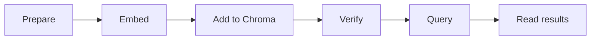

# Embeddings & Vector Search

## Context of This Session

In the **previous** session you learned **RAG Foundations** — why LLMs need an external **library**, the five-step RAG flow, and a preview of **text → embeddings** with **Ollama**. You saw that meaning can be turned into numbers before any full retrieval app exists.

Today you go **deeper and hands-on**: how **embeddings** work as semantic coordinates, how **similarity scores** help you judge matches, and how a **vector database** (**Chroma** in this lab; **FAISS** is a common alternative) stores and searches those vectors. By the end you will **embed sample text**, **store** it, and run a **top-k semantic search** — the retrieve step your RAG pipeline will reuse.

**In this session, you will:**

- Explain **embeddings** as semantic coordinates and **interpret similarity scores**
- **Create embeddings** for sample sentences using a standard library
- **Store vectors** in **Chroma** with minimal configuration
- Run a **top-k semantic search** and inspect retrieved chunks for relevance

**Deferred to upcoming sessions:** loading PDFs, chunk-size tuning, prompt assembly, and a full end-to-end RAG script — those build on the store-and-search skills you practice today.

---

## Embeddings as Semantic Coordinates

RAG needs a retriever that finds the right **chunks** before the LLM writes an answer. That retriever runs on **embeddings** — not on Ctrl+F keyword matching alone.

- **Official Definition:** An **embedding** is a dense vector (ordered list of numbers) produced by a model such that texts with **similar meaning** map to **nearby** points in vector space.
- **In Simple Words:** Embeddings are **meaning coordinates** — similar sentences get similar numbers; different topics sit farther apart.
- **Real-Life Example:** On a music app, every song has a **fingerprint vector**; humming a tune creates another vector; the app finds the **closest** stored song — same idea as matching a user question to the closest FAQ.

### Vectors — Ordered Lists of Numbers

- **Official Definition:** A **vector** is an ordered list of numbers, e.g. `[x₁, x₂, …, xₙ]`, representing a point in **n-dimensional space**.
- **In Simple Words:** A fixed-length row of numbers — like GPS uses two numbers for a map, embeddings often use **384** or **768** numbers for text.
- **Real-Life Example:** Two sentences about **refunds** should land near each other on the map; a sentence about **weather** should be far away.

**Full Code — Tiny Vectors in Python (Concept Demo):**

```python
# Toy 4-number vectors — real embeddings have hundreds or thousands of numbers
vec_refund_a = [0.12, -0.84, 1.35, 0.67]   # Stand-in for "I want my money back"
vec_refund_b = [0.15, -0.80, 1.30, 0.70]   # Stand-in for "When will I get a refund?"
vec_weather  = [-1.20, 0.55, 0.10, -0.90]  # Stand-in for "Will it rain tomorrow?"
```

**How the code works:**

- Each position is one **dimension**; real models output 384+ dimensions — you rarely read each number by hand.
- The list is what gets **stored** and **compared** in vector search.
- **Common mistake:** Treating embeddings as arbitrary numbers — they only work when produced by the **same trained model** for documents and queries.

### Granularity — Sentence vs Document Chunk

| Level | What gets embedded | Typical use in this course |
|---|---|---|
| **Sentence** | One question or utterance | User **query** embedding |
| **Document chunk** | Short FAQ line or paragraph slice | **Stored** knowledge for retrieval |

- **Important rule:** Use the **same embedding model** for every stored chunk and every user query. Mixing models is like comparing addresses from two different maps — distances become meaningless.
- **Today's lab** uses **short FAQ sentences** as chunks. In the **next** session you will **split longer documents** into chunks before storing them in the same kind of vector store.

### Simple Activity — Meaning Clusters on Paper

Write eight short phrases (mix **returns**, **shipping**, and **account** topics). Sort them into meaning groups **without** matching exact keywords. For each group, write one sentence: *"These would sit close together as vectors."*

---

## Text to Vectors and Similarity Scores

You do not train embedding models in this course — you **use** them. You **do** need to understand the pipeline and how to **read** a similarity result.

### How Text Becomes a Vector

1. **Raw text** — A sentence or chunk enters the system.
2. **Tokenization** — Text splits into **tokens** (subword pieces the model knows).
3. **Encoding** — An **embedding model** outputs one fixed-size vector.
4. **Store or compare** — Save the vector in a database or compare to a query vector.


- **Official Definition:** An **embedding model** is a trained network that maps input text to a vector capturing semantic information.
- **In Simple Words:** A **meaning printer** — text in, list of numbers out.
- **Real-Life Example:** In the previous session you may have used **Ollama** for a quick embedding demo. Today's lab uses **Sentence Transformers** (`all-MiniLM-L6-v2`) — same idea, different library, same rule: **one model for all texts**.

**Full Code — Encode Two Sentences (Preview Before the Lab):**

```python
from sentence_transformers import SentenceTransformer  # Library for local embedding models

model = SentenceTransformer("all-MiniLM-L6-v2")  # Small open model — same one used in the full lab below

sentence_a = "Refunds are processed within 5 to 7 business days"  # FAQ-style stored text
sentence_b = "When will I get my money back after returning the item?"  # User-style paraphrase

vector_a = model.encode(sentence_a, convert_to_numpy=True)  # Turn sentence_a into a numeric vector
vector_b = model.encode(sentence_b, convert_to_numpy=True)  # Turn sentence_b into a numeric vector

print("Vector length:", len(vector_a))  # Should be 384 for this model — one number per dimension
print("First five numbers of vector_a:", vector_a[:5])  # Peek at the start of the coordinate list
```

**How the code works:**

- `SentenceTransformer("all-MiniLM-L6-v2")` downloads the model on first run (~80 MB).
- `model.encode(...)` returns one vector per input string.
- You will batch-encode **six FAQs** and later **one query** with this **same** model object.

### Semantic Similarity and Reading Scores

- **Official Definition:** **Semantic similarity** measures how close two texts are in **meaning**, often approximated by distance or angle between embedding vectors.
- **In Simple Words:** If two sentences mean nearly the same thing, their vectors sit **close** on the meaning map.
- **Real-Life Example:** *"Reset password"* and *"recover account access"* are close; *"weather forecast"* is far from both.

Production systems use measures like **cosine similarity** or **distance** (Euclidean/L2). In **Chroma** query results, **distance** often appears — **lower usually means closer** for distance-based metrics.

| What you see | How to read it (today's level) |
|---|---|
| **Rank 1, 2, 3** | Best to third-best match by vector closeness |
| **Distance value** | Smaller often = nearer in meaning (check your collection metric) |
| **No single "100% correct"** | Scores are **relative** — you pick **top-k** and inspect text |

**Full Code — Toy Similarity Intuition (Optional Warm-Up):**

```python
# Two tiny hand-made vectors — illustration only, not real embeddings
vec_login_help = [1.0, 0.2, 0.1]   # Stand-in for password-help FAQ
vec_forgot     = [0.9, 0.25, 0.05] # Stand-in for "forgot login" query
vec_weather    = [0.1, 0.9, 0.8]   # Different topic

def dot_similarity(a, b):  # Toy score — higher when numbers align
    return sum(x * y for x, y in zip(a, b))  # Multiply matching positions and add up

print("Login vs forgot (expect higher):", dot_similarity(vec_login_help, vec_forgot))
print("Login vs weather (expect lower):", dot_similarity(vec_login_help, vec_weather))
```

**How the code works:**

- Real systems use optimised similarity in high dimensions — this dot product is only for **intuition**.
- Never compare vectors from **different models** or **different lengths**.

### Keyword Search vs Semantic Search

| Aspect | Keyword search | Semantic search |
|---|---|---|
| **Core idea** | Match exact words or SQL filters | Match **meaning** via embeddings |
| **Strength** | IDs, dates, exact statuses | Paraphrases, informal language |
| **Weakness** | Misses synonyms | Can return a loosely related chunk if data is thin |
| **Best when** | `WHERE user_id = 7` | FAQs, policies, RAG retrieval |

- **They work together in production:** SQL for **who** bought **what**; vector search for **what the user meant** in free text.

### Simple Activity — Predict the Top Match

Before running the lab query, read these three stored lines:

1. `"Refunds are processed within 5 to 7 business days after the return is approved."`
2. `"Orders above 499 rupees qualify for free shipping."`
3. `"You can reset your password from the account settings page."`

User question: *"I want to return my shoes and get my money back."* Write which line should rank **#1** and why. Run the lab later and compare.

---

## Why Vector Databases — Chroma and FAISS at a Glance

You could compare vectors in a Python loop for **six** FAQs. At **thousands** of chunks, you need a store built for **nearest-meaning search**.

- **Official Definition:** A **vector database** stores embedding vectors and supports **similarity search** — finding the nearest vectors to a query vector efficiently.
- **In Simple Words:** A **library catalogue sorted by meaning**, not only by book title spelling.
- **Real-Life Example:** SQL answers *"ticket with PNR XYZ"* (exact key). Vector search answers *"complaints **like** this one"* across lakhs of past tickets.


| Tool | What it is | This course |
|---|---|---|
| **Chroma** | Beginner-friendly vector DB with collections, upsert, query | **Today's lab** |
| **FAISS** | Facebook AI Similarity Search — fast index library, often used inside pipelines | Valid alternative; same embed → store → query idea |
| **pgvector** | Vector type inside PostgreSQL | Mention only — useful when you already use SQL |

- **Common doubt:** *"Is Chroma the same as an embedding model?"* **No.** The **model** creates vectors; **Chroma** stores and searches them.
- **What we skip today:** Deep **ANN/indexing** theory and **metadata filtering** — enough to store, verify, and query; tuning comes with full RAG later.

### The Pipeline You Will Run in Code

Picture a support bot for an online shopping app. The user types: *"I want my money back after sending the shoes back."* No stored FAQ uses those exact words — but the **meaning** is about returns and refunds.

1. **Prepare** — Short text chunks with unique **id** and optional **metadata**.
2. **Embed documents** — Run each chunk through the embedding model.
3. **Store in Chroma** — Save id, text, metadata, and vector in a **collection**.
4. **Verify** — Confirm rows landed (`count`, `peek`, `get`).
5. **Embed query** — Encode the user's question with the **same model**.
6. **Query** — Ask Chroma for **top-k** nearest vectors.
7. **Read results** — Inspect ranked text, metadata, and distance scores.


- **Official Definition:** **Top-k retrieval** returns the **k** stored items whose vectors are nearest to the query vector.
- **In Simple Words:** *"Give me the three best matches by meaning."*
- **Real-Life Example:** At a **kirana**, you say *"Bhaiya, kuch thanda de do"* without naming a brand — the shopkeeper still hands you a cold drink (**intent**, not exact words).

**Same model rule (non-negotiable):** The **identical** embedding model and version must encode stored documents and every new query.

### Simple Activity — Map the Pipeline Before You Code

In your notebook, draw six boxes: **Prepare → Embed → Add to Chroma → Verify → Query → Read results**. Under **Add to Chroma**, label four fields: **id**, **document**, **metadata**, **embedding**. This is your checklist while typing the lab script.



---

## Chroma Terminology — Learn the Vocabulary First

Before typing code, learn what Chroma **calls** things. If you have used **SQL** in earlier parts of the course, this table maps Chroma terms to familiar ideas.

### Chroma vs SQL — Concept Map

| Chroma term | What it holds | SQL analogy |
|---|---|---|
| **Client** | Connection to Chroma (`PersistentClient`, in-memory `Client`) | Database **connection** |
| **Collection** | Named bucket of stored records | **Table** |
| **Record / row** | One searchable item | One **row** |
| **id** | Unique key | **Primary key** |
| **document** | Human-readable text | Text **column** |
| **metadata** | Key–value tags (category, source) | Extra **columns** |
| **embedding** | Numeric meaning vector | Vector column (e.g. pgvector) |
| **upsert** | Insert or replace by id | `INSERT ... ON CONFLICT UPDATE` (conceptually) |
| **query** | Similarity search by vector | No classic SQL equivalent for meaning |
| **get** | Fetch by id | `SELECT ... WHERE id = ...` |


- **Official Definition:** A **Chroma collection** stores records with **id**, optional **document**, optional **metadata**, and an **embedding** used for similarity search.
- **In Simple Words:** One **labelled shelf**; each **folder** has a name tag (**id**), notes inside (**document**), stickers (**metadata**), and a hidden coordinate (**embedding**) for search.
- **Real-Life Example:** A coaching centre **cupboard** (collection) with numbered **folders** (records) — the librarian finds similar folders by coordinate, not by folder colour alone.

### Three Ways to Connect to Chroma

| Client type | Code pattern | When to use |
|---|---|---|
| **In-memory** | `chromadb.Client()` | Quick experiments — data gone when program ends |
| **Persistent (local disk)** | `chromadb.PersistentClient(path="./chroma_store")` | **Today's lab** — survives restarts |
| **HTTP client** | Remote Chroma server | Team deployments — not needed in class |

- **Official Definition:** **PersistentClient** stores data in a folder on your machine across runs.
- **In Simple Words:** Saving to **Documents** instead of an unsaved Notepad window.
- **Real-Life Example:** `./chroma_store` is your almirah — closing Python does not empty it.

### What Goes Inside One Stored Record?

| Piece | Required? | Purpose |
|---|---|---|
| **id** | Yes | Unique name for upsert, get, debugging |
| **document** | Recommended | Text returned in search results |
| **metadata** | Optional | Tags like `category` — filtering deep-dive comes later |
| **embedding** | Yes in our lab | Vector from your model — Chroma searches by this |


**Common doubt:** *"Can Chroma embed text for me?"* — Yes, with an **embedding_function** on the collection. This lab sets **`embedding_function=None`** so you pass embeddings yourself and see every step.

### What Is a Method?

- **Official Definition:** A **method** is a **function that belongs to an object** — called with a dot: `object.method()`.
- **In Simple Words:** A **toolbox**; `count()` counts rows, `query()` searches by meaning.
- **Real-Life Example:** **WhatsApp chat** = object; **Search messages** = method.

### Key Chroma Methods You Will Use Today

| Method | Job | SQL feel |
|---|---|---|
| `get_or_create_collection(...)` | Open or create a collection | `CREATE TABLE IF NOT EXISTS` |
| `collection.upsert(...)` | Add or update by id | Insert or update by primary key |
| `collection.count()` | Row count | `COUNT(*)` |
| `collection.peek()` | Sample rows | `SELECT * LIMIT 5` |
| `collection.get(ids=[...])` | Exact fetch by id | `SELECT ... WHERE id = ...` |
| `collection.query(...)` | Top-k similarity search | Meaning-based nearest neighbours |


**add vs upsert:**

- **`add`** — Inserts new records; duplicate **id** may be **ignored** (not overwritten).
- **`upsert`** — Inserts if new; **updates** if id exists. We use **upsert** — matches how living FAQ bases change.

### Simple Activity — Terminology Match

Copy the concept map table without the Chroma column. Fill in: Client, Collection, id, document, metadata, embedding, upsert, query, get. Next to each, write one FAQ example (e.g. id = `"doc2"`, document = `"Refunds take 5–7 days"`). Check against the table above.

---

## Set Up Your Development Environment

Install **Chroma** for storage and retrieval, and **Sentence Transformers** for local embeddings.

### Install Commands

```bash
pip install chromadb  # Install the Chroma vector database client for Python
pip install -U sentence-transformers  # Install the library for local embedding models
```

**How the code works:**

- `chromadb` provides `PersistentClient`, `get_or_create_collection`, `upsert`, `get`, and `query`.
- `sentence-transformers` loads `all-MiniLM-L6-v2` and converts text with `model.encode()`.
- Use **Python 3.10+** in a **virtual environment** when possible.

### Create Your Project Folder

```bash
mkdir vector_search_lab  # Create a folder for today's lab files
cd vector_search_lab  # Move into that folder — chroma_store will appear here
```

**How the code works:**

- `PersistentClient(path="./chroma_store")` creates **`chroma_store`** in your current directory.
- One folder makes it easy to restart or share the lab.

### Simple Activity — Environment Check

Run `python --version` (3.10+). Run both `pip install` commands. In Python, run `import chromadb` and `from sentence_transformers import SentenceTransformer`. In your notebook, write: *"Environment ready — Chroma + Sentence Transformers."*

---

## Prepare Sample Data

Good retrieval starts with **clean, small chunks** — one idea per row.

| Field | Purpose | Example |
|---|---|---|
| **id** | Unique key | `"doc2"` |
| **text** | Stored and returned in results | `"Refunds are processed within 5 to 7 business days..."` |
| **metadata** | Tags with the row | `{"category": "returns", "source": "policy"}` |

- **Official Definition:** **Metadata** is structured key–value data stored with each record.
- **In Simple Words:** A **label on the folder** — stored today; richer use in upcoming RAG sessions.
- **Real-Life Example:** Tagging FAQs as **Returns**, **Shipping**, or **Account** for support routing.

Our example is an **e-commerce support knowledge base** — six short FAQ sentences reused in every code block below.

```python
records = [  # Master list — each dict becomes one row in the Chroma collection
    {  # Record 1 — return window
        "id": "doc1",  # Unique primary key for this FAQ row
        "text": "Customers can return products within 30 days of delivery.",  # Human-readable FAQ text
        "metadata": {"category": "returns", "source": "policy"},  # Tags stored with the row
    },
    {  # Record 2 — refund timing
        "id": "doc2",  # Second unique primary key
        "text": "Refunds are processed within 5 to 7 business days after the return is approved.",  # Refund FAQ text
        "metadata": {"category": "returns", "source": "policy"},  # Returns category tag
    },
    {  # Record 3 — free shipping threshold
        "id": "doc3",  # Third unique primary key
        "text": "Orders above 499 rupees qualify for free shipping.",  # Shipping FAQ text
        "metadata": {"category": "shipping", "source": "faq"},  # Shipping category tag
    },
    {  # Record 4 — password reset
        "id": "doc4",  # Fourth unique primary key
        "text": "You can reset your password from the account settings page.",  # Account FAQ text
        "metadata": {"category": "account", "source": "help_center"},  # Account category tag
    },
    {  # Record 5 — express delivery window
        "id": "doc5",  # Fifth unique primary key
        "text": "Express delivery orders usually arrive within 24 to 48 hours.",  # Express delivery FAQ text
        "metadata": {"category": "shipping", "source": "faq"},  # Shipping category tag
    },
    {  # Record 6 — failed payment help
        "id": "doc6",  # Sixth unique primary key
        "text": "If your payment fails, try another card or use UPI.",  # Payment FAQ text
        "metadata": {"category": "payments", "source": "help_center"},  # Payments category tag
    },
]
```

**How the code works:**

- Each dict is one **record** — like one SQL **row**.
- Lists `documents`, `ids`, and `metadatas` built from this list must stay **index-aligned** (position 0 everywhere = same record).

### Simple Activity — Draft Two Rows in Your Domain

Copy the structure. Replace **two** FAQ sentences with topics you care about (coaching, travel, internal wiki). Keep id + text + metadata. Write one user question you expect to match each — test after the retrieve step.

---

## Create the Chroma Client and Collection

Connect to Chroma and open a named **collection** — your shelf ready for records.

```python
import chromadb  # Import Chroma — vector database client for Python
from sentence_transformers import SentenceTransformer  # Import embedding model loader
from pprint import pprint  # Pretty-print for readable verify output later

client = chromadb.PersistentClient(path="./chroma_store")  # Local disk storage — survives restarts

collection = client.get_or_create_collection(  # Open existing collection or create new one
    name="support_knowledge_base",  # Collection name — like a SQL table name
    embedding_function=None,  # We supply embeddings manually — Chroma won't auto-embed
)

print("Collection ready:", collection.name)  # Confirm which collection you connected to
print("Current record count:", collection.count())  # Should be 0 on first run
```

**How the code works:**

- **`PersistentClient(path=...)`** creates `./chroma_store` if missing.
- **`get_or_create_collection`** is safe to run twice — reconnects instead of duplicating.
- **`embedding_function=None`** means you pass `embeddings=` on upsert and `query_embeddings=` on query.
- **`count()`** should be **0** before first upsert.

**Common mistake:** Running from different folders creates **different** `./chroma_store` paths. Always `cd` into the same lab folder.

### Simple Activity — Inspect an Empty Collection

Run the client + collection block only. Record: collection name, count, and full path to `chroma_store`. One sentence: what would count be if you had upserted yesterday in the **same** folder?

---

## Add Data to Your Chroma Collection

Turn text into **embeddings**, then **upsert** ids, documents, metadata, and vectors.

```python
model = SentenceTransformer("all-MiniLM-L6-v2")  # Load embedding model — same one for all queries later

documents = [record["text"] for record in records]  # Plain text list — parallel to ids below
ids = [record["id"] for record in records]  # Unique id per row — required for upsert
metadatas = [record["metadata"] for record in records]  # Metadata dict per row

document_embeddings = model.encode(  # Convert all six FAQ strings to vectors in one batch
    documents, convert_to_numpy=True  # Returns numpy array — efficient for multiple texts
).tolist()  # Chroma expects Python lists, not numpy arrays

collection.upsert(  # Insert all six records — insert new ids, update if id already existed
    ids=ids,  # Unique keys — one per record
    documents=documents,  # Original text — returned later in query results
    metadatas=metadatas,  # Tags like category and source
    embeddings=document_embeddings,  # Vectors — what Chroma searches by meaning
)

print("Upsert complete.")  # Confirm add step finished
print("Total records now:", collection.count())  # Should print 6 after first successful run
```

**How the code works:**

- **`model.encode(documents, ...)`** returns one vector per string; `.tolist()` converts for Chroma.
- **`collection.upsert(...)`** — index `2` in each list is always the **same** FAQ row.
- After upsert, **`count()`** should equal **6**. If not, debug before querying.

**Why embed outside Chroma:** You see the full **embed → store** path. Upcoming sessions will **chunk real documents** and use the **same pattern** at larger scale.

### Simple Activity — Trace One Record Through Add

Pick **doc3** (free shipping). Write: (1) document text, (2) one metadata key-value, (3) one sentence on what `model.encode` does before upsert. After upsert, note whether `count()` is 6.

---

## Verify What You Stored

Never demo search without confirming **add** worked.

### count() — Row Count

```python
total = collection.count()  # Returns integer — number of records in this collection
print("Total records:", total)  # Expect 6 for our six-record FAQ lab
```

**How the code works:**

- Wrong count → every query result is untrustworthy until ingest is fixed.

### peek() — Sample Rows

```python
print("\nPeek at stored data:")  # Header for notebook output
pprint(collection.peek())  # Shows a small sample — ids, documents, metadata fields
```

**How the code works:**

- **`peek()`** eyeballs real text after first upsert — catches empty or garbled rows.

### get() — Exact Fetch by id

```python
one_row = collection.get(ids=["doc4"])  # Exact lookup by primary key — not similarity search
print("\nExact fetch for doc4:")  # Label output
pprint(one_row)  # Shows document + metadata for that id only
```

**How the code works:**

- **`get`** = exact id lookup (like SQL `WHERE id = 'doc4'`).
- **`query`** = similarity by meaning — different operation.

| Method | Search type | Use when |
|---|---|---|
| **get(ids=[...])** | Exact id lookup | You know the key; debugging one row |
| **query(query_embeddings=...)** | Nearest-meaning vectors | User asked a natural-language question |


### Simple Activity — Verification Log

After upsert, fill in your notebook:

- Expected count: **6**
- Actual `count()`: ___
- One id from `peek()`: ___
- One metadata value from `peek()`: ___
- `get(ids=["doc1"])` document text (first line): ___
- Pass / fail: ___

If fail, delete `./chroma_store`, rerun from client creation, and note what changed.

---

## Retrieve Data with Similarity Search

Embed the **user question** with the **same model**, then **`query`** for top-k nearest records.

```python
user_query = "I want to return my shoes and get my money back"  # Plain-English user question

query_embedding = model.encode(  # MUST be same SentenceTransformer model as document ingest
    [user_query], convert_to_numpy=True  # Batch of one — same API shape as batch encode
).tolist()  # Convert to list-of-lists for Chroma query_embeddings parameter

results = collection.query(  # Similarity search — find nearest vectors to query_embedding
    query_embeddings=query_embedding,  # Query vector — not raw string text
    n_results=3,  # Top-k: return the 3 closest matches by meaning
)

print("\nQuery:", user_query)  # Echo the question for readable output
print("Top 3 matches:\n")  # Section header

for i in range(len(results["ids"][0])):  # Loop ranks 0, 1, 2 — best to third-best
    print(f"Rank {i + 1}")  # Human-friendly rank label (1-based)
    print("  ID:", results["ids"][0][i])  # Which stored row matched
    print("  Document:", results["documents"][0][i])  # FAQ text to show the user
    print("  Metadata:", results["metadatas"][0][i])  # Stored tags for this row
    if results.get("distances"):  # Distances included when collection metric returns them
        print("  Distance:", results["distances"][0][i])  # Lower usually means closer meaning
    print()  # Blank line between ranks
```

**How the code works:**

- **`query_embeddings`** must use the **same model dimension** as at upsert time.
- **`n_results=3`** is **top-k** — three best matches, not the whole collection ranked.
- Aligned lists: `results["ids"][0][0]`, `results["documents"][0][0]`, `results["metadatas"][0][0]` = **Rank 1** record.
- **`distances`** — smaller values usually mean closer (depends on Chroma's distance metric).

**Common doubt:** *"Why not pass the raw string to query?"* — With `embedding_function=None`, **you** embed; Chroma **searches vectors**.

### Try a Second Query — Same Collection, Different Intent

```python
second_query = "How do I change my login password?"  # Different user intent — account topic

second_embedding = model.encode(  # Same model again — never swap mid-lab
    [second_query], convert_to_numpy=True  # Encode password question to vector
).tolist()  # List shape Chroma expects for query_embeddings

second_results = collection.query(  # Same collection — different query vector
    query_embeddings=second_embedding,  # Password question as numbers
    n_results=2,  # Top-2 for a shorter result set this time
)

print("Query:", second_query)  # Echo second question
for i in range(len(second_results["ids"][0])):  # Loop each rank in top-2 results
    print(f"Rank {i + 1}:", second_results["documents"][0][i])  # Print document text per rank
```

**How the code works:**

- Same **collection**, same **model**, new **query** — only the query vector changes.
- **doc4** (password reset) should rank highly — different words, similar meaning.
- This `query()` output is what upcoming sessions will paste into an LLM prompt as **retrieved context**.

### Simple Activity — Predict Before You Run

Before the shoe-return query, write which **three ids** you expect at Rank 1–3. Run the code. Compare. One sentence: why did returns/refund docs beat shipping or payment docs?

---

## Interpret Query Results — Ranks, Distances, and One Wrong Match

Reading output correctly matters as much as writing the code.

### Understanding the Result Object

| Field | Meaning |
|---|---|
| **Rank order** | Index 0 = best semantic match |
| **documents** | Text to display or pass into a RAG prompt later |
| **metadatas** | Tags stored at upsert time |
| **distances** | Closeness score — **lower often = nearer** |


- **Official Definition:** **Similarity search** ranks stored vectors by proximity to the query vector.
- **In Simple Words:** Chroma finds which stored **meaning-coordinates** are closest to your question's coordinates.
- **Real-Life Example:** Google Maps lists **nearest** metro stations first — not every station alphabetically.

**Rank 1 ≠ always the business-correct answer.** Rank 1 means **closest vector** in the collection — usually right when data is clean and the same model is used.

### When Ranking Looks Wrong — One Example to Study

**User query:** *"When will my order reach me?"*

**What you hope for:** Shipping FAQs — doc3 or doc5.

**What can happen:** Rank 1 might be doc6 (*payment fails*) because both mention **order** loosely, or because no chunk states standard delivery timing clearly.

**What this teaches today:**

- Similarity returned the **mathematically nearest** vector — not necessarily the FAQ support wanted.
- **Missing or vague chunks** cause weak matches — fix by **better data**, not by blaming Chroma.
- Checking **top-k > 1** helps — Rank 2 or 3 may still hold a useful shipping line.

**Deferred to upcoming RAG sessions:** Metadata filtering, collection updates, and tuning **k** when you build and evaluate full pipelines.

### Simple Activity — Results Journal

Run the shoe-return query. For each rank, note: id, category from metadata, one phrase linking to user intent. Run the password query. Note which doc wins Rank 1. Two sentences: what is the difference between **get(ids=["doc4"])** and **query** for the password question?

---

## What Comes Next — From Vector Search to Full RAG

You built the **store and retrieve** half of the RAG pipeline. Upcoming sessions complete the rest.

| Upcoming focus | How today's lab connects |
|---|---|
| **Chunking and document preparation** | Load PDFs/text files, choose **chunk size** and **overlap**, attach metadata, **persist** into the same vector-store pattern |
| **Retrieval and grounded generation** | Use **top-k** results as a **context block** in the prompt; LLM answers from retrieved chunks |
| **Agent track** | Agents reuse retrieval for memory and tools; today's Chroma skills stay the **retriever shelf** |

Today's script is not a chatbot yet — it is the **retriever** every RAG assistant in this module will read from.

### Simple Activity — Draw the Next Layer

Draw two boxes: **Today's lab (Chroma query → top-k text)** and **Upcoming RAG (same retrieval → LLM writes answer)**. Label one arrow: *"Retrieved documents become prompt context."* One sentence: what breaks if the Chroma collection is empty?

---

## Key Takeaways

- **Embeddings** are semantic coordinates for text; **similarity scores** and **rank order** tell you which stored chunks are nearest in meaning — not which share the exact same words.
- **Same model rule:** One embedding model encodes **all** stored documents and **every** query; mixing models breaks distance meaning.
- **Vector databases** like **Chroma** (or **FAISS** in other stacks) store vectors and run **top-k** search faster than looping in plain Python at scale.
- **Chroma workflow:** `PersistentClient` → `get_or_create_collection(embedding_function=None)` → `model.encode()` → `upsert` → verify with `count` / `peek` / `get` → `query` with `query_embeddings` and `n_results=k`.
- **`get`** is exact lookup by **id**; **`query`** is meaning-based search — the operation your RAG **retriever** will wrap in upcoming sessions.

In the **next** session you will **load and chunk real documents**, attach metadata, and **persist** them into a vector store using the same embed-and-upsert pattern you practiced today.

---

## Important Commands, Libraries, and Terminologies

| Term / Command | Type | Meaning |
|---|---|---|
| `pip install chromadb` | Setup | Install Chroma vector database client |
| `pip install -U sentence-transformers` | Setup | Install local embedding model library |
| `chromadb.PersistentClient(path="...")` | Code | Chroma client with on-disk persistence |
| `chromadb.Client()` | Code | In-memory Chroma client (data not persisted) |
| `get_or_create_collection(name=..., embedding_function=None)` | Code | Open or create a named collection |
| `collection.upsert(...)` | Code | Insert or update records by id with vectors |
| `collection.add(...)` | Code | Insert only — may ignore duplicate ids |
| `collection.count()` | Code | Return number of stored records |
| `collection.peek()` | Code | Sample stored rows for quick inspection |
| `collection.get(ids=[...])` | Code | Exact fetch by id — not similarity search |
| `collection.query(query_embeddings=..., n_results=k)` | Code | Top-k similarity search by vector |
| `SentenceTransformer("all-MiniLM-L6-v2")` | Code | Load a small pretrained embedding model |
| `model.encode(texts, convert_to_numpy=True)` | Code | Convert text batch to embedding vectors |
| **Embedding** | Concept | Numeric vector representing text meaning |
| **Semantic similarity** | Concept | Closeness of meaning via vector proximity |
| **Vector database** | Concept | Store built for similarity search on embeddings |
| **Chroma** | Tool | Beginner-friendly vector DB used in this lab |
| **FAISS** | Tool | Alternative fast similarity index library |
| **Client** | Chroma term | Connection handle to Chroma storage |
| **Collection** | Chroma term | Named bucket of records (≈ SQL table) |
| **id** | Chroma term | Unique primary key per record |
| **document** | Chroma term | Human-readable text in results |
| **metadata** | Chroma term | Key–value tags per record |
| **Top-k** | Concept | Return the k best matches by vector proximity |
| **Same model rule** | Practice | Identical encoder for documents and every query |
| **Distance** | Concept | Closeness score — lower often means nearer match |
| **get vs query** | Concept | Exact id lookup vs meaning-based search |
