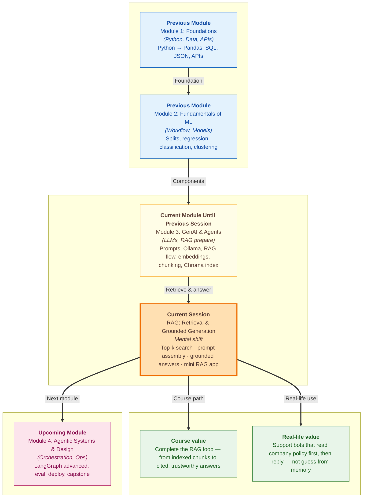

# Pre-read: RAG — Retrieval & Grounded Generation

You are at a **railway enquiry counter**. A traveller asks: **"Which platform is the Dehradun Shatabdi?"** The clerk does not answer from memory alone. They glance at the **live display board** — the official, updated list — and only then speak. If the board says **Platform 5**, that is what you hear. If the train is not listed, the clerk says so instead of guessing.

That small habit — **look up first, speak second** — is the heart of today's topic. In the **previous** session, you prepared ShopEasy policy documents: you **split** long text into searchable **chunks** (small labelled cards), attached **file names and page numbers**, and **stored** them in a **vector database** (a library sorted by **meaning**, not spelling). The index is ready. The missing piece is what happens when a real customer asks a question — and how the computer turns **retrieved policy lines** into a **clear, trustworthy answer**.

---

## Context of This Session in the Course

---

## When a smart chatbot still gives the wrong answer

Imagine **ShopEasy** again. A customer types: **"How many days do I have to return a product?"** Your system already has the **returns policy** stored as labelled chunks from the previous lab. But if you send the question straight to a **language model** (an AI that writes human-like text) with **no policy attached**, it may reply confidently with a **generic** number — **7 days**, **15 days**, whatever sounds plausible — even though your official rule says **30 days**.

Worse: a user asks about **UPI payments**, but your policy library has **no UPI section at all**. Without strict rules, the model might **invent** a payment method rather than admitting **"I don't know."** That failure mode — sounding sure while being wrong — is called **hallucination** (the model fills gaps with made-up detail).

You already learned the **five-step RAG flow** in an **earlier** session: **ingest** documents, **prepare** them for search, **retrieve** relevant pieces, **augment** the prompt with those pieces, and **generate** the final answer. You have done **ingest** and **prepare** — chunking, embedding, storing in **Chroma**. Today you finish the loop: **retrieve → augment → generate**.

---

## The challenge we will tackle

What if your support bot had **hundreds of policy cards** in its library but, for every question, either pulled **none** of them or pulled **too many** — flooding the answer with irrelevant shipping rules when the user only asked about returns?

What if the right paragraph **was** retrieved, but pasted into the prompt as one messy blob — so the model treated it as optional background instead of **the only evidence it may use**?

What if the answer sounded perfect but **no one could trace** which file or page supported the **"30 days"** claim — and a compliance team rejected the bot for lack of accountability?

These are everyday RAG problems, not rare bugs. The live session shows how to **search the index**, **build a structured context block**, **generate a grounded reply**, and **manually verify** that every fact in the answer actually came from a retrieved chunk.

---

## Search first, paste the notes, then speak

**Retrieval-Augmented Generation (RAG)** means giving the language model a **searchable library** instead of relying on training memory alone. **Grounded generation** means the final answer should follow **retrieved context** — not invent facts when the library already has the answer.

Think of it as an **open-book exam with strict rules**. The student may only use the **allowed pages** placed on the desk. The question sits at the bottom. Instructions at the top say: **"If the answer is not in these pages, say you could not find it."** That is **context assembly** — combining retrieved chunks, formatting rules, and the user question into one structured input for the model.

### Top-k: how many folders does the librarian bring?

When a user asks a question, the system converts the question into a **meaning fingerprint** (an **embedding** — numbers that capture what the text is about) and searches the index for the **closest matches**. **Top-k retrieval** returns the **k best-matching chunks** — like a librarian bringing **three relevant folders** instead of the entire stack.

| k value | What it means |
|---|---|
| **k = 1** | Fast and focused — but may miss a second rule hidden in another chunk |
| **k = 3** | Balanced default for short ShopEasy policies |
| **k = 5+** | More context — but extra chunks can add **noise** and confuse the model |

The same **embedding model** used when chunks were stored must be used for the query — otherwise you are comparing fingerprints from two different machines. In the lab, that model is **`all-MiniLM-L6-v2`**, and the collection is **`policy_chunks`**.

### Delimiters, labels, and the court-brief pattern

Raw chunk text pasted blindly is hard for the model to parse. **Context assembly** wraps retrieved text in a **clear block** with **boundaries** and **labels** — like a **court brief** that separates *"Exhibit A"*, *"Exhibit B"* with headers so the judge knows which document each line came from.

Each chunk in the prompt carries its **`source_id`** (which file) and **`page`** (which page). Clear section markers — such as **CONTEXT START** and **CONTEXT END** — tell the model exactly where the **allowed evidence** lives. Grounding rules at the top reduce guessing: answer **only** from that block, refuse when the fact is missing, and list **which sources** were used at the end.

### Generating the answer — local or cloud

The **generator** step sends your assembled prompt to a language model. On this track you have already used **Ollama** (runs on your laptop) and **Groq** (a fast cloud service). **Retrieval and prompt building stay identical** — only the final generation call changes. That separation is deliberate: you should be able to swap backends without rebuilding search.

After the answer appears, you run an **informal grounding check** — a manual fact-check where you match each claim in the reply to a specific retrieved chunk and its **source_id**. Production teams use automated tools for this; in the lab you build the habit yourself. Ask about **UPI payments** (not in the corpus) and confirm the model **refuses** instead of inventing.

---

## The WhatsApp forwards analogy

One more daily-life picture captures the full flow. You are helping a friend with a ShopEasy question. You do **not** answer from what you memorised last year. You open **three WhatsApp forwards** — the official policy messages — read them carefully, and **then** dictate the reply. **Retrieval** is opening the right forwards. **Augmentation** is having them visible while you speak. **Generation** is the spoken answer. **Grounding check** is confirming every number you said appears in one of those forwards.

---

In this pre-read, you'll discover:

- **Why** sending a question to a language model **without** retrieved policy leads to confident but wrong answers — and how **RAG** fixes that
- **How** **top-k retrieval** picks the best-matching chunks from your prepared index — and why **k = 3** is a sensible starting point
- **How** **context assembly** with **delimiters** and **source labels** turns raw chunks into structured evidence the model must follow
- **How** **grounded generation** via **Ollama** or **Groq** produces answers tied to your library — plus a simple **claim-to-chunk audit** you can run after every demo

---

## Words you will hear — explained right away

- **Retrieve:** Search the vector index and pull back the chunks whose meaning is closest to the user's question.
- **Augment (prompt augmentation):** Insert those chunks — with rules and labels — into the input the language model reads.
- **Grounded generation:** The model writes the answer **after** reading supplied context, not from memory alone.
- **Top-k:** The number of best-matching chunks returned per search — **k** is the knob you tune.
- **Delimiter:** A visible boundary marker (like **CONTEXT START / END**) that separates instructions, evidence, and the question.
- **Informal grounding check:** Manually verifying that each fact in the answer appears in a retrieved chunk and noting its **source_id**.
- **Without-RAG vs with-RAG:** The same question answered once with **no context** (shows hallucination risk) and once through the full pipeline (shows the difference retrieval makes).

---

## What's next

By the end of the session, you should be able to:

- **Configure** top-k search against your **`policy_chunks`** index and interpret which **`source_id`** values come back for a given question
- **Assemble** a grounded prompt with clear **delimiters**, **source labels**, and **refusal rules** when context is missing
- **Generate** answers using **Ollama** (local) or **Groq** (cloud) — same retrieval, same prompt, different backend
- **Audit** a generated answer by mapping each claim to the chunk and file that supports it
- **Wire** ingest, retrieve, and generate into one **mini RAG script** you can run end-to-end on ShopEasy policy questions
- **Compare** a plain chatbot reply with a RAG reply on the **same question** and explain why retrieval matters

Agent workflows that call RAG as a **tool**, metadata filters, and production-grade evaluation come in **later work** on the same track. Today you **complete the RAG loop** — the same pattern used in real company support bots, internal policy assistants, and document Q&A products.

---

## Questions to think about before class

1. A user asks **"How many days do I have to return a product?"** You run retrieval with **k = 1** and get only the chunk about **original packaging** — no mention of **30 days**. Would raising **k** fix this, or could the problem also be **chunking** from the previous lab? What would you try first?

2. Two answers to **"Is delivery free for a 600 rupee order?"** — one from a **without-RAG** call and one from the **full RAG pipeline**. What differences would you expect in **accuracy**, **tone**, and the **Sources used** line at the bottom?

3. You ask **"Can I pay with UPI?"** and the model gives a detailed UPI workflow — but **no UPI text** exists in your stored policies. What went wrong: **retrieval**, **grounding rules in the prompt**, or something else — and how would you fix it before showing this bot to a customer?

Keep these questions in mind. The session turns your **prepared policy index** into a **working support assistant** — one that reads the display board before it speaks.
