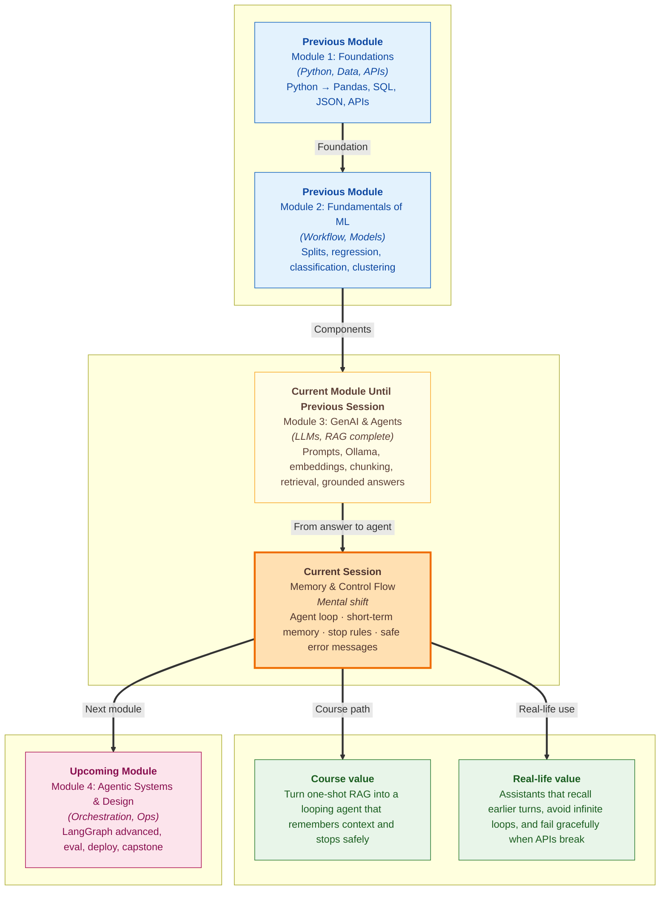

# Pre-read: Memory & Control Flow

You call a **customer care helpline** about a **ShopEasy return**. You explain the order number, the product, and that the box arrived damaged. The agent puts you on hold, comes back, and asks: **"What is your order number?"** You repeat everything. Hold again. Same question. You hang up frustrated — not because the company lacks policy documents, but because the **person on the line forgot what you already said** and had **no clear rule for when to stop asking**.

Now imagine the opposite nightmare: an automated system that **never hangs up**. It keeps saying **"Let me check one more thing…"** fifty times, burning your phone battery and your patience, because nobody told it **when the job is finished**.

Both failures — **forgetting the conversation** and **running forever** — show up constantly in real AI products. In the **previous** session you built a **RAG assistant** (a bot that **searches company documents first**, then answers from what it finds). That pattern handles **one question at a time** beautifully. Today you take the next step: a system that **remembers earlier turns**, **loops through steps** when needed, and **knows when to stop** — the foundation of a true **AI agent** (a program that **observes**, **thinks**, and **acts** using tools and memory, not just a single reply).

---

## Context of This Session in the Course

---

## When a smart assistant forgets — or never stops

Picture **ShopEasy support** again. A customer opens chat and says: **"I want to return order #48291 — the screen is cracked."** Your RAG bot retrieves the returns policy and answers correctly about **30 days** and **original packaging**. Good.

Ten seconds later the same customer types: **"What about pickup?"** If the system treats every message as **brand new**, it may search again with no memory of order **#48291** and reply with generic shipping rules — or ask the customer to repeat the order number. The answer might still be **technically correct** but feel **clueless**, like talking to a different person each time.

Now flip the problem. You design an **agent loop** (a repeating cycle where the system **reads input → decides → takes action → checks result → repeats**) so the bot can **look up policy**, **ask a follow-up**, and **confirm** before closing the ticket. But you forget a **stop condition** (a rule that says **"exit the loop when the task is done or after N tries"**). The bot keeps calling the search tool, rephrasing the same question, never declaring **"Your return is approved."** Your laptop fan spins. Your API bill rises. The user abandons chat.

These are not edge cases. They are the difference between a **demo** and something you would trust with real customers.

---

## The challenge we will tackle

What if you had to build a ShopEasy helper that handles **three back-and-forth messages** — order details, return reason, pickup preference — without the customer repeating themselves each time?

What if that helper sometimes needs **two or three internal steps** (search policy → draft reply → check if anything is missing) but must **never** run those steps more than a **safe limit**?

What if the **language model service** is temporarily down, or a **tool call** returns an error — and instead of a scary stack trace, the user sees a **clear, human message** like **"Our policy search is unavailable right now. Please try again in a minute."**?

Manually juggling memory, loop counts, and error messages in your head is exhausting. The live session shows how to **store conversation history across turns**, **reload it when the script restarts**, **wire termination rules into the agent loop**, and **catch predictable failures** before they confuse the user.

---

## The waiter with a notepad

Think of a **restaurant waiter** taking your order for a group of friends.

**Short-term memory** is the **notepad on the tray** — what was said **at this table during this visit**: who wants less spice, who asked for extra roti, which dish was sent back. The waiter reads the notepad before every trip to the kitchen. Without it, they would keep asking **"Table 7, what did you order?"** after every round.

**Long-term memory** is the **loyalty card file at the counter** — your visit history across months, favourite dishes, allergies on record. Today's session focuses mainly on **short-term memory**: keeping the **running chat history** so each new turn knows what came before. Long-term storage across weeks and advanced compaction come in **later work** on the same track.

**Control flow** is the **head waiter's rulebook**: **"After three kitchen trips for the same correction, call the manager."** **"When all dishes are served and the bill is paid, close the table."** In agent terms, that means **loop termination** — explicit conditions like **task complete**, **maximum iterations reached**, or **user said stop**.

When the kitchen printer fails, a good waiter does not shout technical jargon at the customer. They say **"There is a small delay — I will update you shortly."** That is **basic error handling**: catching known failure types and returning a **user-visible message** instead of crashing silently.

---

## From one-shot answers to a living loop

Until now, much of your GenAI work looked like **one question → one answer**. An **AI agent** adds a **cycle**:

| Stage | What it means (everyday words) |
|---|---|
| **Perceive** | Read the user's latest message **plus** what was said earlier |
| **Reason** | Decide what to do next — answer directly, search policy, or ask a clarifying question |
| **Act** | Call a tool or produce a reply |
| **Remember** | Save the exchange so the **next** turn starts with full context |
| **Stop or repeat** | Exit when done — or loop again, but only within safe limits |

**Persisting conversation history** means saving messages to a file or in-memory list and **loading them back** when the notebook or script runs again — so turn four still knows what happened in turns one through three. **Reloading across runs** matters when you close your laptop and reopen the same ShopEasy demo tomorrow.

**Loop termination** protects you from **runaway iterations** — the agent equivalent of a waiter who keeps walking to the kitchen forever because nobody said **"Service complete."** Common guards include a **maximum step count**, a **"final answer" flag** from the model, or detecting that the **same action repeated** with no progress.

**Error handling** covers predictable bumps: network timeout, invalid API key, empty search results. The user should see **what went wrong in plain language**, not a wall of system text.

---

In this pre-read, you'll discover:

- **Why** a RAG bot that answers one question well can still **fail** on follow-ups — and how **short-term memory** fixes the "who are you again?" problem
- **How** an **agent loop** differs from a single prompt call — and why **perceive → reason → act** needs **memory** and **stop rules**
- **How** to **persist and reload** conversation history so multi-turn ShopEasy chats stay coherent across turns and script restarts
- **How** **termination conditions** and **basic error messages** keep agents safe, bill-friendly, and trustworthy when tools or APIs misbehave

---

## Words you will hear — explained right away

- **AI agent:** A system that **observes** input, **reasons** about what to do, and **acts** — often by calling **tools** — while using **memory** from earlier steps.
- **Short-term memory:** The **running conversation history** for the current session — like the waiter's notepad for one table visit.
- **Long-term memory:** Facts or summaries stored **across sessions** — loyalty-card style; deeper architecture comes **later** in the course.
- **Agent loop:** A repeating cycle: read state → decide → act → update memory → check whether to stop or go again.
- **Loop termination:** Rules that **end** the loop — task finished, max steps hit, or user requested stop — so the agent cannot spin forever.
- **Control flow:** The **logic that decides** which step runs next and when the whole process exits — the head waiter's rulebook.
- **Persist / reload:** **Save** conversation history to disk or a variable and **load** it back so context survives the next turn or the next time you run the script.
- **User-visible error message:** A short, friendly explanation shown when something predictable fails — instead of exposing raw system errors.

---

## What's next

By the end of the session, you should be able to:

- **Define** an AI agent as something that **perceives, reasons, and acts** with **tools and memory** — not just a one-shot text generator
- **Persist and reload** multi-turn **conversation history** in a script or notebook so ShopEasy follow-ups stay connected
- **Implement stop conditions** on a simple agent loop so it **cannot run away** through endless iterations
- **Handle predictable API or tool errors** with **clear messages** the user can understand
- **Explain** when **short-term memory** is enough today and when **long-term memory** becomes necessary in **upcoming** work
- **Connect** your existing **RAG retrieval** pattern to a **looping agent** that can search policy, reply, and stop — safely

Tool calling, workflow graphs, structured JSON outputs, and production guardrails build directly on this foundation in **upcoming** sessions on the same track. Today you learn the **discipline every agent needs**: **remember what mattered**, **know when to stop**, and **fail gracefully** when the outside world does not cooperate.

---

## Questions to think about before class

1. A ShopEasy customer says **"Return my order #48291"** and gets a good policy answer. Their **next** message is only **"And pickup?"** — no order number repeated. What would go wrong if your system had **no conversation history**? What is the **minimum** the agent must remember from turn one to answer turn two well?

2. You allow an agent loop to run until the model says **"I'm done"** — but you set **no maximum step count**. The model keeps calling the policy search tool with slightly different wording, never producing a final reply. What **termination rules** would you add first: a **step limit**, a **duplicate-action detector**, or a **timeout** — and why?

3. Your RAG search works in testing, but during the live demo the **API returns a connection error**. One design shows the user a full error log; another shows **"Policy search is temporarily unavailable — please retry."** Which builds more trust, and what **predictable errors** should your ShopEasy agent plan for before you show it to anyone?

Keep these questions in mind. The session turns your **grounded Q&A helper** into the beginnings of a **reliable agent** — one that remembers the table, knows when dinner is over, and speaks calmly when the kitchen printer jams.
