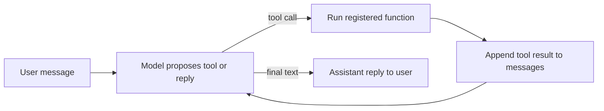

# Agent Tool Use

## Context of This Session

In the **previous** session you worked on the **Tesla annual report** — **`retriever`** on `./Tesla_db`, **`rag_answer`**, **`tesla_chat_history.json`**, **`run_chat_turn`**, **`MAX_STEPS`**, and user-visible errors. That helper could remember *"And in 2023?"* and stop safely — but every answer still came from **searching report text**. It had no structured way to **run a live function** and **read the result** before speaking.

A Tesla PDF will never hold *"Order #48291 is out for delivery today."* Questions like that need a **tool**, not another chunk search. **Today's lab introduces a new ShopEasy support scenario** for tool calling — you reuse the same **Groq** client, **`MAX_STEPS`**, and JSON-history pattern from the Tesla work, but practice on a mock **`lookup_order`** function instead of `./Tesla_db`.

ShopEasy was **not** part of the **previous** session; it is **today's** domain because order status is the clearest example of something RAG cannot answer from a static document. You close that gap with **function calling**, **tool schemas**, and the **model–tool loop**: **propose → run → return → reason again**.

**What you will learn:**

- **Describe tools in schema form** so the model can pick the right action and fill in arguments
- **Register and bind** at least one callable tool to your agent executor
- **Execute** the model–tool loop: propose a call, run the function, return the result
- **Verify** tool outputs reach the model **before** the next reasoning step


---

## Why Tools Matter — From Chat to Real Actions

The **previous** labs searched **`./Tesla_db`** — revenue, margins, and strategy live in the report. **Today's ShopEasy lab** is a different kind of question: live order status from a warehouse system, not text in a PDF.

Picture a **ShopEasy service counter**. A customer asks: *"Is my order #48291 out for delivery today?"* The staff member knows the **returns policy by heart** but **cannot open the warehouse system**. They guess: *"It should arrive soon!"* The customer checks the tracking app and sees **"Delayed — rescheduled for tomorrow."** Trust is gone.

- **Official Definition:** **Function calling** (also called **tool use**) is when the model outputs a **structured request** — tool name plus argument values — instead of (or before) a final user-facing reply. A **tool** is a **real capability** your Python code exposes — search policy, look up an order, calculate a fee.
- **In Simple Words:** **RAG** is reading a **policy handbook**. **Tools** are **picking up the phone** to the warehouse. The model **fills a form** — *"Run `lookup_order` with `order_id=48291`"* — instead of only chatting.
- **Real-Life Example:** A restaurant **floor manager** writes a **kitchen chit** — **`check_stock`**, **`paneer_tikka`** — instead of shouting a guess. Your **executor** runs Python; the model only **plans** and **speaks after seeing results**.

| User question | RAG alone | Tool needed |
|---|---|---|
| *"How many days to return an item?"* | Policy chunk says **30 days** | Often enough |
| *"When was **my** order delivered?"* | No order dates in policy | **`lookup_order`** |
| *"Return fee for pincode 560001?"* | Rate not in policy text | **`calculate_fee`** |

- **Memory** helps follow-ups; **RAG** helps policy questions; **tools** help **live facts** tied to a specific order or calculation.
- The model **plans**; your code **acts**; the model **speaks** only after seeing what happened. Only tools you **register** and **bind** can run — not arbitrary functions on your laptop.
- **Common mistake:** Letting the model **guess** a delivery date — that is a **hallucinated action**, not a grounded answer.


---

## Tool Schemas — Describe Tools So the Model Can Choose

A **tool schema** is the **menu entry** for one action: **name**, **purpose**, and **required inputs**.

- **Official Definition:** A **tool schema** is a structured description (usually JSON) listing the tool's **name**, **description**, and **parameters** with types and **required** fields.
- **In Simple Words:** The **standard chit format** on the manager's desk — every field has a label so the kitchen never gets *"make something nice."*
- **Real-Life Example:** A **UPI app** shows *"Pay ₹500 to Rajesh (UPI ID: raj@okbank)"* before you confirm — payee, amount, and ID are all explicit.

```python
# Tool schema — the model reads this dict to know HOW to call lookup_order
LOOKUP_ORDER_SCHEMA = {
    "type": "function",  # Tells the API this entry is a callable tool
    "function": {
        "name": "lookup_order",  # Must match the Python function name exactly
        "description": (
            "Get delivery status, delivery date, and ETA for a ShopEasy order. "
            "Use when the user asks about a specific order number."
        ),
        "parameters": {
            "type": "object",  # Arguments arrive as one JSON object
            "properties": {
                "order_id": {
                    "type": "string",  # Digits as string, e.g. "48291"
                    "description": "ShopEasy order ID, digits only, e.g. 48291",
                }
            },
            "required": ["order_id"],  # Model must always supply order_id
        },
    },
}
```

**How the code works:**

- **`name`** must match the Python function you register — mismatch means the executor cannot find the handler.
- **`description`** tells the model **when** to pick this tool; **`required`** marks fields the model must never leave empty.
- Good schemas use verb-led names (`lookup_order`), clear **when-to-use** text, and types that match your Python function.
- **Common mistake:** Vague names like `helper`, or omitting **`required`** so the warehouse API gets empty IDs.

### Activity — Read a Schema Like the Model Does

1. For *"When was order 48291 delivered?"*, write the expected tool name and argument.
2. Mentally remove `"order_id"` from **`required`** — what breaks when the warehouse API runs?


---

## Registering and Binding a Tool

**Registering** = add `(tool_name → Python function)` to a registry. **Binding** = pass schemas to the Groq API and wire the registry into the executor loop.

- **Official Definition:** **Register** maps tool names to callables. **Bind** connects schemas on the API side to **`run_registered_tool`** on the code side.
- **In Simple Words:** Put the recipe card in the **kitchen index** and connect the **order bell** to the right stove.
- **Real-Life Example:** Hospital triage selects **"Lab"** — the call routes to the lab extension, not billing.

```python
import json  # Turn tool results into strings for the message list

# Mock warehouse — production would call a real API
MOCK_ORDERS = {
    "48291": {"status": "out_for_delivery", "delivered_on": None, "eta": "today by 6 PM"},
    "51002": {"status": "delivered", "delivered_on": "12 May 2025", "eta": None},
}


def lookup_order(order_id: str) -> dict:
    """Callable the executor runs when the model proposes lookup_order."""
    clean_id = order_id.strip()  # Remove accidental spaces from model output
    if not clean_id.isdigit():
        return {"error": f"Invalid order_id '{order_id}'. Use digits only, e.g. 48291."}
    if clean_id not in MOCK_ORDERS:
        return {"error": f"Order {clean_id} not found in ShopEasy records."}
    return MOCK_ORDERS[clean_id]  # Success payload the model reads next


TOOL_SCHEMAS = [LOOKUP_ORDER_SCHEMA]  # List sent to Groq tools= parameter

TOOL_REGISTRY = {"lookup_order": lookup_order}  # Register step — name → function


def run_registered_tool(tool_name: str, arguments: dict) -> str:
    """Bind step: find function by name, execute, return JSON string."""
    if tool_name not in TOOL_REGISTRY:
        return json.dumps({"error": f"Unknown tool: {tool_name}"})
    try:
        result = TOOL_REGISTRY[tool_name](**arguments)  # Unpack order_id=... into lookup_order
        return json.dumps(result)  # Model reads this string in the next turn
    except TypeError as exc:
        return json.dumps({"error": f"Bad arguments for {tool_name}: {exc}"})
```

**How the code works:**

- **`lookup_order`** is ordinary Python — test it without any LLM first.
- **`TOOL_SCHEMAS`** goes to Groq; **`TOOL_REGISTRY`** stays in your code — you control which functions exist.
- **`run_registered_tool`** is the bind bridge: proposed name + args → real result string.

### Activity — Test the Registry Without the Model

1. Call `run_registered_tool("lookup_order", {"order_id": "48291"})` — print the result.
2. Try `{"order_id": "99999"}` (not found) and `{"order_id": "forty-eight"}` (validation error).


---

## The Model–Tool Loop and Tool Result Handling

Your **previous** Tesla loop had: read context → decide → **`rag_answer` on `./Tesla_db`** → remember → check stop. **Tool use** upgrades **act** from *"always search the report"* to *"maybe call a named tool first."*

| Step | What happens |
|---|---|
| **1. Propose** | Model outputs a **tool call** (name + args) or a final reply |
| **2. Run** | Executor runs the function from **`TOOL_REGISTRY`** |
| **3. Return** | Result appended as a **`tool`** role message |
| **4. Reason again** | Model reads result; may call another tool or answer the user |
| **5. Stop** | **`MAX_STEPS`** from the **previous** lab still applies |

- **Official Definition:** The **model–tool loop** repeats **propose → execute → return → reason** until a final answer or stop rule fires. A **tool message** is the payload the model must read on the next API call.
- **In Simple Words:** Manager writes chit → kitchen cooks → runner brings answer → manager replies or writes another chit.
- **Real-Life Example:** Same discipline as **RAG grounding** — you would not answer if the retrieved chunk never reached the prompt.

| Role | Example |
|---|---|
| **`user`** | *"When was order 48291 delivered?"* |
| **`assistant`** | Contains **`tool_calls`** instead of plain text |
| **`tool`** | JSON string from `run_registered_tool` |
| **`assistant`** | Final reply: *"Order 48291 is out for delivery today by 6 PM."* |

- **Common mistake:** Model **says** it checked the order but code **never ran** `lookup_order` — fiction. Or tool ran but result **never appended** — model guesses anyway.




```python
def append_tool_result(messages, tool_call_id, result_string):
    """Return step — tool output must appear BEFORE the next model call."""
    messages.append(
        {
            "role": "tool",  # Special role for function results
            "tool_call_id": tool_call_id,  # Must match the assistant tool call id
            "content": result_string,  # Actual JSON from run_registered_tool — not a summary
        }
    )
    return messages


def verify_tool_feedback(messages, expected_tool_name):
    """Test helper — confirm tool call is followed by a tool result message."""
    saw_call = False
    for msg in messages:
        if msg.get("role") == "assistant" and msg.get("tool_calls"):
            for call in msg["tool_calls"]:
                if call["function"]["name"] == expected_tool_name:
                    saw_call = True
        if saw_call and msg.get("role") == "tool" and msg.get("content"):
            return True  # Safe to reason again
    return False  # Wiring bug — do not trust the final answer
```

**How the code works:**

- **`tool_call_id`** links result to the exact call Groq made — mismatch breaks the next turn.
- **`verify_tool_feedback`** catches the bug where the model cites data the tool never returned.
- Without **`append_tool_result`**, the next `client.chat.completions.create(...)` is blind to what the tool returned.

### Activity — Spot the Wiring Bug

Below is a broken message list — a **`tool_calls`** entry exists but the **`tool`** result was never appended.

```python
buggy_messages = [
    {"role": "user", "content": "Status of order 48291?"},
    {
        "role": "assistant",
        "tool_calls": [
            {
                "id": "call_abc",
                "function": {"name": "lookup_order", "arguments": '{"order_id": "48291"}'},
            }
        ],
    },
    # Tool result never appended here — this is the wiring bug
]
```

1. Run `verify_tool_feedback(buggy_messages, "lookup_order")` — expect **`False`**.
2. Add a **`tool`** message with `tool_call_id="call_abc"` and the JSON from your registry test — expect **`True`**.
3. One sentence: why is a confident final answer unsafe when verify returns **`False`**?


---

## Groq, Executor, and Memory — Put It Together

Your **previous** Tesla memory lab already used **Groq**, **`MAX_STEPS`**, and **`tesla_chat_history.json`**. **Today's cells are a separate ShopEasy tool lab** — same patterns, new file **`shopeasy_tool_history.json`**. Do not overwrite the Tesla history file; the two demos serve different purposes.

The same Groq client accepts **`tools=TOOL_SCHEMAS`**. The **agent executor** orchestrates model calls, runs tools, updates memory, and checks stop conditions — everything below is your executor for **today's ShopEasy lab**.

This section wires propose, run, return, and the **previous** stop rules into one bounded loop.

```python
import os
from groq import Groq

client = Groq(api_key=os.environ.get("GROQ_API_KEY"))  # Same env var as prior labs
MODEL_NAME = "llama-3.3-70b-versatile"  # Groq model with tool-calling support
MAX_STEPS = 5  # Same safety rail as the previous memory lab — never remove
HISTORY_FILE = "shopeasy_tool_history.json"


def propose_tool_or_reply(messages):
    """Propose step — model picks a tool or writes plain text."""
    response = client.chat.completions.create(
        model=MODEL_NAME,
        messages=messages,  # Full history including prior tool results
        tools=TOOL_SCHEMAS,  # Bind schemas on the API side
        tool_choice="auto",  # Model decides tool vs direct reply
        temperature=0,  # Same low-randomness setting as prior grounded generation
    )
    return response.choices[0].message  # May include tool_calls


def run_tool_agent_turn(user_message, history):
    """One user question — full propose-run-return loop until reply or step limit."""
    messages = list(history)  # Copy so we do not mutate caller's list
    messages.append({"role": "user", "content": user_message})
    step = 0
    final_reply = ""

    while step < MAX_STEPS:
        step += 1
        assistant_msg = propose_tool_or_reply(messages)

        if assistant_msg.tool_calls:
            messages.append(
                {
                    "role": "assistant",
                    "content": assistant_msg.content or "",
                    "tool_calls": [
                        {
                            "id": call.id,
                            "type": "function",
                            "function": {
                                "name": call.function.name,
                                "arguments": call.function.arguments,
                            },
                        }
                        for call in assistant_msg.tool_calls
                    ],
                }
            )
            for call in assistant_msg.tool_calls:
                args = json.loads(call.function.arguments)  # Parse JSON args from model
                result_string = run_registered_tool(call.function.name, args)  # Run step
                messages = append_tool_result(messages, call.id, result_string)  # Return step
                if not verify_tool_feedback(messages, call.function.name):
                    final_reply = "Internal error: tool result missing. Please try again."
                    break
            if final_reply:
                break
            continue  # Reason again

        final_reply = assistant_msg.content or "I could not generate a reply."
        messages.append({"role": "assistant", "content": final_reply})
        break

    if step >= MAX_STEPS and not final_reply:
        final_reply = "I could not finish within the safe step limit. Please try a simpler question."

    return final_reply, messages


def save_tool_history(messages):
    """Persist full message list — tool roles included."""
    with open(HISTORY_FILE, "w") as f:
        json.dump(messages, f, indent=2)


def load_tool_history():
    """Reload on notebook restart — same pattern as tesla_chat_history.json."""
    try:
        with open(HISTORY_FILE, "r") as f:
            return json.load(f)
    except FileNotFoundError:
        return []


def chat_with_tools(user_message):
    """Load history, run one turn, save, return reply."""
    history = load_tool_history()
    reply, updated = run_tool_agent_turn(user_message, history)
    save_tool_history(updated)
    return reply
```

**How the code works:**

- **`while step < MAX_STEPS`** keeps runaway protection — multi-tool questions can take several model calls.
- When **`tool_calls`** exist: **run**, **append**, **verify**, then **`continue`** — never skip to the user without feeding results back.
- **`save_tool_history`** saves the **entire** list including **`tool`** entries — not only final assistant text.
- **Common mistake:** Saving only the reply string — turn 2 forgets order **#48291** was already looked up.


### Notebook demo

```python
# Step A — kitchen works without the model
print(run_registered_tool("lookup_order", {"order_id": "48291"}))

# Step B — full loop
history = load_tool_history()
reply, messages = run_tool_agent_turn("Is order 48291 out for delivery today?", history)
print("Bot:", reply)
save_tool_history(messages)

# Step C — confirm tool results in saved history
loaded = load_tool_history()
print("Tool messages saved:", any(m.get("role") == "tool" for m in loaded))
```


### Activity — Two-Turn ShopEasy Chat

1. `chat_with_tools("When was order 51002 delivered?")` — expect a date from **`MOCK_ORDERS`**.
2. `chat_with_tools("What about the ETA on that same order?")` — memory should still know **51002**.
3. Open `shopeasy_tool_history.json` — confirm **`tool`** role entries appear between assistant turns.

---

## Optional Extension — Tesla RAG as a Second Tool

Once **`lookup_order`** works, you can add a **second tool** that wraps your **previous** Tesla stack — same schema + registry pattern, one executor. This shows how a real agent mixes **live tools** (ShopEasy orders) with **document search** (`./Tesla_db`).

```python
SEARCH_TESLA_SCHEMA = {
    "type": "function",
    "function": {
        "name": "search_tesla_report",
        "description": "Search the Tesla annual report. Use for revenue, margins, or strategy questions.",
        "parameters": {
            "type": "object",
            "properties": {"query": {"type": "string", "description": "Analyst question about the report"}},
            "required": ["query"],
        },
    },
}


def search_tesla_report(query: str) -> dict:
    """Wrap rag_answer + retriever from the previous Tesla lab on ./Tesla_db."""
    try:
        result = rag_answer(query, retriever)  # retriever unchanged from prior notebook
        return {"answer": result["answer"]}
    except Exception:
        return {"error": "Report search is unavailable. Please try again in a minute."}


# Add to TOOL_SCHEMAS and TOOL_REGISTRY alongside lookup_order — loop code unchanged
```

- Model picks **`search_tesla_report`** for *"What was 2023 revenue?"* and **`lookup_order`** for *"Where is my ShopEasy package?"*
- **One agent, many tools** — memory, stop rules, and error handling wrap the same executor loop.
- Today's lab focuses on **`lookup_order`** only — add **`search_tesla_report`** once the single-tool loop is stable.

### Activity — Plan Two Tools for One Question

An analyst asks: *"What was Tesla's 2023 revenue, and separately — when was ShopEasy order 51002 delivered?"* Write which tool handles each part. One sentence each for **`search_tesla_report`** and **`lookup_order`**.

---

## Tool Errors and When Something Goes Wrong

When tools fail, use the same rule as the **previous** session: **friendly text for the user**, details in your notebook log. Return errors as JSON inside the tool result so the model can phrase them politely.

| Failure | Tool returns | Fix / user sees |
|---|---|---|
| Bad **`order_id`** | `{"error": "Invalid order_id ..."}` | Validate in **`lookup_order`**; model asks for digits |
| Order not found | `{"error": "Order not found ..."}` | Model asks user to double-check number |
| Tool result ignored | Confident wrong answer | Call **`append_tool_result`** before next Groq request |
| Model never calls tool | Weak or missing schema | Sharpen **`description`**; confirm **`tools=TOOL_SCHEMAS`** |
| Infinite loop | No step limit | Keep **`MAX_STEPS = 5`** |
| Name mismatch | *"Unknown tool"* | Align **`name`** in schema and **`TOOL_REGISTRY`** |

- **Never** show raw tracebacks to the customer. Most demo failures are **wiring** (step 3 skipped), not a weak model — check the message list first.

---

## Key Takeaways

- **Function calling** lets the model request **named actions with structured arguments** instead of only generating text.
- **Tool schemas** are the **menu** — name, description, and required parameters so the model picks and fills calls correctly.
- **Register and bind** via **`TOOL_REGISTRY`** + Groq **`tools=`** so proposed calls dispatch to **real Python**.
- The **model–tool loop** is **propose → run → return → reason again**; **`MAX_STEPS`** still stops runaway loops.
- **Tool results must appear in `messages` before the next model call** — otherwise answers become **hallucinated actions**.

In **upcoming** work you will combine multiple tools, workflow graphs, and stronger production guardrails on the same loop you built today.

---

## Important Commands, Libraries, and Terminologies

| Term / Command | Type | Meaning |
|---|---|---|
| **Function calling** | Concept | Model outputs structured tool name + arguments |
| **Tool schema** | Concept | JSON description of name, purpose, and parameters |
| **Register / bind** | Concept | Map name → function; pass schemas to API |
| **Model–tool loop** | Concept | Propose → run → return → reason until final reply |
| **Tool message** | Concept | Payload appended after execution for model to read |
| **Hallucinated action** | Concept | Bot claims it checked data that was never retrieved |
| `LOOKUP_ORDER_SCHEMA` | Code | Schema dict for order lookup |
| `TOOL_SCHEMAS` / `TOOL_REGISTRY` | Code | Schemas for API; name → callable map |
| `lookup_order` | Code | Mock warehouse lookup function |
| `run_registered_tool` | Code | Execute registry function; return JSON string |
| `append_tool_result` | Code | Add `role: tool` with matching `tool_call_id` |
| `verify_tool_feedback` | Code | Test — tool call followed by tool result |
| `propose_tool_or_reply` | Code | Groq call with `tools` and `tool_choice="auto"` |
| `run_tool_agent_turn` | Code | Bounded loop with `MAX_STEPS` |
| `chat_with_tools` | Code | Load history, run turn, save JSON |
| `search_tesla_report` | Code | Optional second tool — wraps prior `rag_answer` on `./Tesla_db` |
| `Groq` / `client.chat.completions.create` | Library | Chat API with tool-calling support |
| `MAX_STEPS` | Config | Hard ceiling on loop iterations |
| `tesla_chat_history.json` | File | **Previous** Tesla memory lab — do not overwrite today |
| `shopeasy_tool_history.json` | File | **Today's** ShopEasy tool lab — includes tool roles |
| `rag_answer` / `retriever` | Code | **Previous** Tesla lab on `./Tesla_db` — reuse in optional extension |
