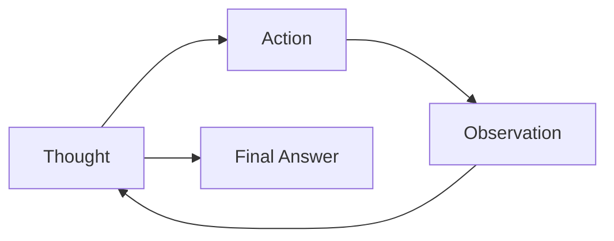

# Agent Tool Use

## Context of This Session

In the **previous** session you built a **Tesla report chat helper** with **short-term memory** — conversation history saved to a JSON file, **`MAX_STEPS`** so the loop cannot run forever, and **friendly error messages** when the API fails. The bot could follow up on *"And in 2023?"* because it remembered earlier turns. Every answer still came from **searching report text** in `./Tesla_db`.

Real analyst questions often need **more than text search** — live stock prices, compound-interest math, or a web lookup. A PDF cannot hold today's Nvidia price. **Today's lab introduces your first AI agent** using the **ReAct** pattern in **LangChain**: the model **thinks**, **acts** with a tool, **reads the observation**, and only then answers.

**What you will learn:**

- **Define** what an **AI agent** is and how it differs from a plain chatbot
- **Explain** the **ReAct paradigm** — **Thought**, **Action**, **Observation**, and the **scratchpad**
- **Wrap** tools with LangChain **`Tool`** — **Python REPL** and **Serper search**
- **Build** a **Python ReAct agent** and a **Search ReAct agent** with **`create_react_agent`**
- **Trace** how tool outputs flow back into the loop before the final answer


---

## Introduction to AI Agents

A **chatbot** only generates text from what it already "knows" from training. An **agent** can **plan**, **pick a tool**, **run it**, and **use the result** before speaking to you.

- **Official Definition:** An **AI agent** is a program where a **large language model (LLM)** works inside a **loop** with **tools** (search, code runner, database, etc.) to achieve a **user objective**.
- **In Simple Words:** A chatbot is a **clever speaker**. An agent is a **speaker with hands** — it can look things up and calculate instead of only guessing.
- **Real-Life Example:** At a **bank branch**, a trainee who only memorised the brochure is like a chatbot. A staff member who can open the **core banking system** is like an agent.

| Capability | Plain chatbot | ReAct agent |
|---|---|---|
| Answer from memory | Yes | Yes |
| Run Python for exact math | No | Yes — **python_repl** |
| Fetch live web facts | No | Yes — **serper_search** |
| Show reasoning steps | Rarely | Yes — **verbose=True** |

- **Common mistake:** Expecting the LLM to **multiply large numbers perfectly** — agents delegate math to **Python REPL**.
- **Common mistake:** Trusting a **stock price** from chat without a **search tool** — the number may be outdated.


### Activity — Spot Agent vs Chatbot

Read these two replies to *"What is Nvidia's stock price right now?"*

1. *"Nvidia trades around $500."* — no tool mentioned.
2. *"Thought: I need a live price. Action: serper_search. Observation: … Final Answer: $142.38 as of today."*

Write one line each: which is chatbot-style, which is agent-style, and why the second is safer.

---

## The ReAct Paradigm

**ReAct** stands for **Reasoning + Acting**. Instead of jumping straight to an answer, the agent writes a **Thought**, picks an **Action** (a tool call), reads the **Observation** (tool output), and repeats until it can give a **Final Answer**.

- **Official Definition:** The **ReAct paradigm** is an agent design where the LLM alternates between **reasoning traces** and **tool actions**, using **observations** from the environment to update its plan.
- **In Simple Words:** Think → do → read what happened → think again. Like solving a sums paper and **showing rough work** in the margin.
- **Real-Life Example:** A **detective** thinks *"I should check CCTV"*, visits the control room (**action**), reads the timestamp (**observation**), then thinks *"Now I need the witness list"*.

| Step | What the agent writes | Example |
|---|---|---|
| **Thought** | Reasoning about what to do next | *"I need compound interest — I should use Python."* |
| **Action** | Tool name + input | `python_repl` with `print(450 * (630/450)**(2/6))` |
| **Observation** | Raw tool output | `337.50` printed in the REPL |
| **Final Answer** | User-facing reply | *"₹450 grows to about ₹337.50 in 2 years at the same rate."* |

The **scratchpad** is the **running log** of every Thought, Action, and Observation. LangChain's **`AgentExecutor`** manages this scratchpad for you when **`verbose=True`**.



- **Why ReAct first:** You **see** the reasoning trail in the notebook. That builds intuition before wiring raw **function-calling** APIs by hand in a later session.
- **Common mistake:** Skipping **`verbose=True`** and wondering why the agent "magically" knew a number — you never saw the **Action** step.


### Activity — Label a ReAct Trace

A verbose log shows:

```
Thought: The user wants Tesla's founder — I should search the web.
Action: serper_search
Action Input: Who founded Tesla?
Observation: Elon Musk co-founded Tesla ...
Thought: I now know the final answer.
Final Answer: Tesla was co-founded by Elon Musk and others; ...
```

Label four lines as **Thought**, **Action**, **Observation**, or **Final Answer**. One sentence: why must **Observation** come **before** **Final Answer**?

---

## Environment Setup

Today's notebook installs **LangChain**, **LangChain-Groq**, and community tools. You reuse the same **Groq** model from earlier labs and add a **Serper** API key for web search.

```python
# Install packages — run once in the notebook
!pip install langchain==0.1.9 \
                langchain-groq \
                langchain-experimental==0.0.52 \
                langchainhub==0.1.15 \
                google-search-results \
                langchain-community
```

```python
# Import everything needed for ReAct agents
import os  # Read API keys from environment variables

import pandas as pd  # Used in later dataframe agent work

from langchain import hub  # Pull the standard ReAct prompt template
from langchain_groq import ChatGroq  # Groq chat model wrapper
from langchain.agents import Tool, AgentExecutor, create_react_agent  # ReAct building blocks
from langchain_experimental.utilities import PythonREPL  # Safe Python runner for agents
from langchain_community.utilities import GoogleSerperAPIWrapper  # Serper search wrapper
```

```python
# API keys — use os.environ locally; Colab may use userdata.get instead
serper_api_key = os.environ.get("SERPER_API_KEY")  # From serper.dev dashboard
groq_api_key = os.environ.get("GROQ_API_KEY")  # Same Groq key as prior labs

groq_llm = ChatGroq(
    model="llama-3.3-70b-versatile",  # Groq model with strong reasoning
    api_key=groq_api_key,  # Authenticate requests
    temperature=0,  # Low randomness — same habit as grounded RAG labs
)
```

**How the code works:**

- **`langchain==0.1.9`** matches the instructor notebook — newer versions may change import paths.
- **`ChatGroq`** wraps the same Groq backend you used before, now inside LangChain's agent API.
- **`SERPER_API_KEY`** powers live Google search results through the Serper service.
- **Common mistake:** Forgetting to export keys before opening the notebook — both searches and the LLM will fail immediately.

---

## LangChain Tools — Python REPL and Serper Search

Before building an agent, understand **`Tool`** — LangChain's way to **describe** and **register** one callable action. This is your **tool schema** in beginner-friendly form: **name**, **description**, and **function**.

- **Official Definition:** A LangChain **`Tool`** bundles a **name**, **natural-language description**, and **Python callable** so the agent can select and invoke it.
- **In Simple Words:** A **labelled button** on a remote — the agent reads the label to know which button to press.
- **Real-Life Example:** A **Swiggy** app shows *"Track order"* and *"Call restaurant"* — each button has a clear purpose, like **`description`**.

### Python REPL Tool

```python
# Create a Python REPL instance — runs code in a controlled shell
python_repl = PythonREPL()

# Test the REPL directly — no agent yet
python_repl.run(
    "print('Hello World! I am a langchain tool that allows running arbitrary Python code')"
)

# See the schema the agent will read
print(python_repl.schema())

# Wrap the REPL as a LangChain Tool
repl_tool = Tool(
    name="python_repl",  # Short id the agent writes in the Action line
    description=(
        "A Python shell used to execute python commands. "
        "Input should be a valid python command."
    ),
    func=python_repl.run,  # Actual function that runs when agent invokes the tool
)

# Invoke exactly as an agent would — sanity check before building the agent
print(repl_tool.invoke('print("Hello World!")'))
```

**How the code works:**

- **`PythonREPL`** executes one Python command string and returns printed output as the **observation**.
- **`name`** and **`description`** are what the ReAct prompt shows the LLM — clear text reduces wrong tool picks.
- **`repl_tool.invoke(...)`** proves the tool works **without** paying for an LLM call.

### Serper Search Tool

```python
# Serper wraps Google search results via API
serper_search = GoogleSerperAPIWrapper(serper_api_key=serper_api_key)

# Test search alone
print(serper_search.run("Who is the founder of Tesla?"))

# Wrap as a Tool — same pattern as repl_tool
search_tool = Tool(
    name="serper_search",  # Agent uses this name in Action lines
    description="An interface to the Serper search engine. Input should be a string.",
    func=serper_search.run,  # Runs the search and returns text snippets
)

# Invoke like an agent would
print(search_tool.invoke("Who is the founder of Tesla?"))
```

**How the code works:**

- **`GoogleSerperAPIWrapper.run`** takes a plain English query string — the agent fills that string in **Action Input**.
- Search returns **snippets** the model reads as **Observation** — not hidden inside the model weights.
- **Common mistake:** Vague **`description`** like *"helps with stuff"* — the agent may pick the wrong tool or answer without searching.


### Activity — Test Both Tools Without an Agent

1. Run **`repl_tool.invoke("print(7 * 8)")`** — note the printed observation.
2. Run **`search_tool.invoke("Who is the founder of Tesla?")`** — note that the answer comes from the web, not memory.
3. One sentence: which tool would you use for *"₹450 grows to ₹630 in 6 years — amount in 2 years?"* and why?

---

## Building a Python ReAct Agent

The **Python agent** has one tool: **`python_repl`**. It is ideal for **exact calculations** the LLM might approximate wrongly.

LangChain hides most of the loop: **`hub.pull("hwchase17/react")`** fetches the standard ReAct prompt; **`create_react_agent`** binds the LLM, tools, and prompt; **`AgentExecutor`** runs the Thought → Action → Observation cycle until a final answer.

```python
# Fresh REPL and tool — same as earlier section
python_repl = PythonREPL()
repl_tool = Tool(
    name="python_repl",
    description="A Python shell used to execute python commands. Input should be a valid python command.",
    func=python_repl.run,
)

# Pull the community ReAct prompt — defines Thought / Action / Observation format
react_prompt = hub.pull("hwchase17/react")

# Bind LLM + tools + prompt into a ReAct agent object
react_agent = create_react_agent(
    llm=groq_llm,  # Groq chat model drives reasoning
    tools=[repl_tool],  # Only Python REPL for this agent
    prompt=react_prompt,  # Standard ReAct instruction template
)

# Executor runs the loop; verbose=True prints every step to the notebook
react_agent_executor = AgentExecutor(
    agent=react_agent,  # The agent policy
    tools=[repl_tool],  # Must match tools passed to create_react_agent
    verbose=True,  # Show Thought / Action / Observation in output
)
```

```python
# Sample queries from the lab notebook
sample_queries = [
    "If $ 450 amounts to $ 630 in 6 years, what will it amount to in 2 years at the same interest rate?",
    (
        "The stock price of the shares of a certain company A closes at $ 117.25 on August 1st "
        "whose strike price is $100. The stock expires on November 1st. There are no dividends "
        "that need to be paid till the expiry date and the risk-free annual interest rate is 8.5%. "
        "If the standard deviation of the volatility of the stock returns is 0.8445, calculate "
        "the price of the call option using the Black-Scholes model formula."
    ),
]

# Run one query through the full ReAct loop
user_input = sample_queries[0]  # Start with the compound-interest question

response = react_agent_executor.invoke(
    {"input": user_input}  # User question enters the scratchpad
)

print(response["output"])  # Final natural-language answer after all observations
```

**How the code works:**

- **`hub.pull("hwchase17/react")`** saves you from writing the ReAct format rules by hand.
- **`create_react_agent`** registers **`repl_tool`** with the LLM — this is **binding** the tool to the executor.
- **`AgentExecutor.invoke`** repeats: LLM proposes Thought/Action → tool runs → Observation appended → LLM continues.
- **`verbose=True`** is your best debugging friend — read the trace before trusting **`output`**.
- **Common mistake:** Mismatching the **`tools=`** list between **`create_react_agent`** and **`AgentExecutor`** — the executor cannot run a tool the agent was not trained on.


### Activity — Read the Verbose Trace

Run the compound-interest query with **`verbose=True`**. In your notebook, highlight:

1. The first line starting with **`Thought:`**
2. The line starting with **`Action:`** and **`Action Input:`**
3. The **`Observation:`** line with the numeric result
4. The **`Final Answer:`** line

One sentence: what would go wrong if **`Observation`** were empty but the agent still wrote a **Final Answer**?

---

## Building a Search ReAct Agent

The **search agent** combines **`serper_search`** and **`python_repl`**. Real questions often need **live data** plus **calculation** — for example, today's Nvidia price and how much ₹100 invested a week ago would be worth today.

```python
# Recreate Serper wrapper and search tool
serper_search = GoogleSerperAPIWrapper(serper_api_key=serper_api_key)
search_tool = Tool(
    name="serper_search",
    description="An interface to the Serper search engine. Input should be a string.",
    func=serper_search.run,
)

# Reuse the same ReAct prompt template
react_prompt = hub.pull("hwchase17/react")

# Agent now has TWO tools — model must choose search vs Python per step
react_agent = create_react_agent(
    llm=groq_llm,
    tools=[search_tool, repl_tool],  # Both search and Python available
    prompt=react_prompt,
)

# Optional: inspect prompts attached to the agent
print(react_agent.get_prompts())

# Executor with parsing-error recovery — format slips do not crash the loop
react_agent_executor = AgentExecutor(
    agent=react_agent,
    tools=[search_tool, repl_tool],
    verbose=True,  # Essential for multi-step traces
    handle_parsing_errors=True,  # Re-prompt LLM if Action line is malformed
)
```

```python
# Multi-step query: needs web price AND a calculation
user_input = (
    "What is the latest stock price of Nvidia and please help me calculate "
    "if I had invested 100 dollar a week back how much money would I have today?"
)

response = react_agent_executor.invoke({"input": user_input})

print(response["output"])
```

**How the code works:**

- With **two tools**, the **Thought** step must decide: search first, then Python — or the reverse.
- **`handle_parsing_errors=True`** catches malformed **Action** lines and lets the LLM retry instead of crashing.
- Typical trace: **Thought** → **serper_search** → **Observation** (price) → **Thought** → **python_repl** → **Observation** (computed return) → **Final Answer**.
- **Common mistake:** Only enabling **`python_repl`** for a *"latest price"* question — the model cannot know today's market price without **search**.


### Activity — Plan the Tool Sequence

For the Nvidia + **$100 investment** query, write the expected order:

1. Which tool runs first and what **Action Input** might look like?
2. Which tool runs second and why?
3. What belongs in the **Final Answer** that should **not** appear in the first **Observation** alone?

---

## Inside the Loop — Schemas, Registration, and Observations

You did not write a manual **Groq function-calling** loop today — **LangChain ReAct** did it for you. Under the hood, the same ideas apply and you will wire them explicitly in a **future** session.

| Concept | In LangChain ReAct today | In raw function-calling (later) |
|---|---|---|
| **Tool schema** | **`Tool(name, description, func)`** | JSON schema with **`parameters`** |
| **Register / bind** | Pass **`tools=[...]`** to **`create_react_agent`** | Pass **`tools=`** to **`chat.completions.create`** |
| **Propose call** | LLM writes **`Action:`** line | Model returns **`tool_calls`** object |
| **Run function** | **`AgentExecutor`** calls **`func`** | Your Python **`run_registered_tool`** |
| **Return result** | **Observation** appended to scratchpad | **`role: tool`** message in chat history |
| **Reason again** | Next **Thought** sees observation | Next API call sees tool message |

- **Official Definition:** **Tool result handling** means every tool output must reach the model **before** the next reasoning step — as a ReAct **Observation** or a **`tool`** chat message.
- **In Simple Words:** The chef must **taste the dish** before telling the customer it is ready.
- **Real-Life Example:** Same discipline as **RAG grounding** — you would not answer if retrieved chunks never reached the prompt.

```python
# Conceptual check — after a tool runs, the scratchpad must contain the observation
# AgentExecutor does this automatically; in a hand-rolled loop you would append manually:

def observation_reached_scratchpad(trace_text: str, tool_name: str) -> bool:
    """Return True only if an Observation follows an Action for the given tool."""
    action_seen = False  # Track whether we saw the tool action line
    for line in trace_text.splitlines():  # Walk verbose log line by line
        if line.startswith("Action:") and tool_name in line:
            action_seen = True  # Model proposed this tool
        if action_seen and line.startswith("Observation:") and line.strip() != "Observation:":
            return True  # Non-empty observation after action — safe to trust Final Answer
    return False  # Wiring bug — Final Answer may be a guess
```

**How the code works:**

- **`observation_reached_scratchpad`** mirrors **`verify_tool_feedback`** from hand-rolled loops — check trace, not vibes.
- **`handle_parsing_errors=True`** is LangChain's safety net when the **Action** line format breaks.
- **`MAX_STEPS`** from the **previous** memory lab still applies when you write **custom** loops — **`AgentExecutor`** has its own iteration limit you can tune later.
- **Common mistake:** Treating **`response["output"]`** as grounded when **`verbose`** shows **no Observation** for a factual claim.


### Activity — Map ReAct to Function Calling

Complete this table from memory:

| ReAct line | Rough function-calling equivalent |
|---|---|
| **Action: serper_search** | ? |
| **Action Input: Nvidia stock price** | ? |
| **Observation: snippet text** | ? |
| **Final Answer:** | ? |

One sentence: why learn ReAct **first** if production systems often use JSON **tool_calls**?

---

## Reading Verbose Output and Handling Errors

Most beginner bugs are **missing API keys**, **wrong package versions**, or **trusting output without reading the trace**.

| Symptom | Likely cause | What to do |
|---|---|---|
| Auth error on first cell | **`GROQ_API_KEY`** or **`SERPER_API_KEY`** missing | Export keys; restart kernel |
| `ImportError` for LangChain | Version mismatch | Install exact versions from setup cell |
| Agent answers without searching | Weak tool choice; no **`serper_search`** in list | Check **`tools=[...]`**; sharpen **`description`** |
| `Parsing LLM output produced exception` | Malformed **Action** line | Set **`handle_parsing_errors=True`** |
| Confident wrong number | No **python_repl** observation | Read **verbose** trace; fix tool list |
| Loop feels endless | Rare with **`AgentExecutor`** | Tune **`max_iterations`** in a later session |

- **Never** show raw API tracebacks to an end user — log details in the notebook, show a short friendly message in apps.
- **`verbose=True`** during lab; turn verbosity off in production UIs where users should only see the final reply.


### Activity — Full Notebook Walkthrough

Work through the instructor notebook in order:

1. Run setup and confirm both API keys work.
2. **`repl_tool.invoke`** and **`search_tool.invoke`** — both return sensible text.
3. Python agent — compound-interest query; save a screenshot of the **verbose** trace.
4. Search agent — Nvidia query; count how many **Action** steps ran.

One sentence: what is the biggest difference you noticed between the **one-tool** and **two-tool** agents?

---

## Key Takeaways

- An **AI agent** pairs an **LLM** with **tools** in a **loop** — it can act, not only chat.
- **ReAct** alternates **Thought → Action → Observation** until a **Final Answer**; the **scratchpad** holds the full trace.
- LangChain **`Tool`** describes each action with **name**, **description**, and **func** — register tools by passing them to **`create_react_agent`**.
- **`AgentExecutor`** with **`verbose=True`** runs and displays the loop; **`handle_parsing_errors=True`** keeps the search agent stable.
- **Tool results must appear as Observations before the final reply** — otherwise answers become educated guesses.

In **upcoming** work you will wire **function-calling schemas** and **custom executors** directly — the ReAct trace you read today is the mental model for that code.

---

## Important Commands, Libraries, and Terminologies

| Term / Command | Type | Meaning |
|---|---|---|
| **AI agent** | Concept | LLM + tools in a loop to reach a user goal |
| **ReAct** | Concept | Reasoning and Acting — Thought, Action, Observation cycle |
| **Scratchpad** | Concept | Running log of agent steps before the final answer |
| **Thought / Action / Observation** | Concept | ReAct steps — plan, run tool, read result |
| **Tool schema** | Concept | Description of a tool's name, purpose, and inputs |
| **LangChain `Tool`** | Code | Wraps `name`, `description`, `func` for agents |
| **PythonREPL** | Code | Runs Python command strings; returns printed output |
| **GoogleSerperAPIWrapper** | Code | Serper API search — live web snippets |
| **`repl_tool` / `search_tool`** | Code | Wrapped tools for Python and search |
| **`hub.pull("hwchase17/react")`** | Code | Standard ReAct prompt from LangChain Hub |
| **`create_react_agent`** | Code | Binds LLM, tools, and ReAct prompt |
| **`AgentExecutor`** | Code | Runs the agent loop until final output |
| **`verbose=True`** | Config | Print Thought / Action / Observation in notebook |
| **`handle_parsing_errors=True`** | Config | Recover from malformed Action lines |
| **`ChatGroq`** | Library | Groq LLM inside LangChain |
| **`invoke({"input": ...})`** | Code | Start one agent run; read `response["output"]` |
| **Function calling** | Concept | JSON tool calls — deeper wiring in a later session |
| **`GROQ_API_KEY`** | Secret | Groq authentication |
| **`SERPER_API_KEY`** | Secret | Serper web search authentication |
