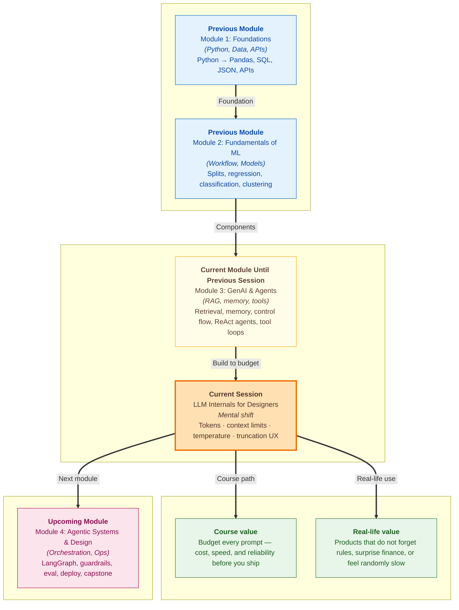

# Pre-read: LLM Internals for Designers

Your **ShopEasy support bot** worked beautifully on day one. A customer asked about **returns within 30 days** — the bot pulled the right policy paragraph, remembered the earlier message, and even used a **tool** to check **order status**. The demo video looked perfect.

On day thirty, the same bot confuses everyone. Finance notices the **API bill doubled** though traffic only grew a little. Users complain the bot **feels slower** after long chats. Worst of all, a loyal customer says: *"Yesterday it followed the refund policy. Today it invented a rule that does not exist."* Nobody changed the code. Nothing crashed. The product simply started **behaving differently** — and nobody on the team can explain **why**.

That is not bad luck. It is what happens when you ship an **agent** without understanding what the model **eats**, what it **forgets**, and when answers become **random**. In the **previous** sessions you learned to **retrieve documents**, **remember conversation turns**, and **call tools** in a loop. Those pieces work. What was missing is the **designer's view of the engine** — **tokens**, **context limits**, **temperature**, and the **user-visible pain** when the engine runs out of room.

---

## Context of This Session in the Course

---

## When the bot "forgets" without crashing

Picture a long support chat. Turn one, the user says: **"Answer only from our official policy document."** The bot agrees. Turns two through twelve go fine — order questions, delivery dates, polite follow-ups. On turn thirteen, the user asks: **"Can I return shoes bought during the sale?"** The bot answers confidently — but cites a **made-up 14-day window** that never appeared in your policy PDF.

Your team checks the logs. The **chat history file** on disk still contains the turn-one rule. The **retrieval** still works. The **tools** still run. So what failed?

Every time the bot replies, it sends a **bundle of text** to the cloud API: **instructions**, **retrieved policy chunks**, **older messages**, **tool results**, and the **new question**. That bundle has a **maximum size** — a **context window**. When the bundle gets too long, many systems **silently drop** the oldest lines. The turn-one rule was never deleted from your file; it simply **stopped being included** in what the model could see. The user experiences **forgetting**. Engineering sees **no error**.

Or imagine finance opens the monthly invoice. Each message looked small. But each call also shipped **three policy chunks**, **six prior turns**, and a **long tool log** from a web search. The provider bills per **token** — not per "user message." A five-word question can still be expensive if the **hidden prompt** is huge.

These are **design problems**, not mysteries. The live session gives you the vocabulary and habits to **measure**, **budget**, and **predict** them — without becoming a model engineer.

---

## The challenges we will tackle

What if you had to explain to your manager **why doubling the number of retrieved document chunks** made the product **slower and costlier** — even when users ask shorter questions?

What if your agent runs **ten tool steps** in one request and the **scratchpad** of thoughts and observations grows longer than the entire policy library you carefully chunked?

What if marketing wants **creative festival SMS banners** from the same bot that must quote **exact refund wording** — and someone sets **one global randomness dial** for both?

What if a user refreshes the page and gets a **different policy answer** for the same question — not because data changed, but because **randomness** was left too high on a factual task?

What if the API returns **"context length exceeded"** and your app shows a **scary technical error** instead of **"This chat got too long — please start fresh"**?

In class we connect these stories to four practical skills: **counting tokens**, **planning context budgets**, **setting temperature and seed for the right job**, and **designing what users see when context overflows**.

---

## The tiffin box on a crowded metro

Imagine packing lunch in a **tiffin carrier with fixed compartments**. You must fit **rice**, **dal**, **sabzi**, and **salad** in the same box every day. If you overfill one compartment, something else gets left behind — or the lid will not close.

An LLM request works the same way. **System rules**, **retrieved paragraphs**, **chat history**, **tool outputs**, and room for the **reply** all share **one context window**. When the box is full, the system does not always announce *"sorry, we dropped your turn-one instruction."* It just **continues** — and the answer changes.

Now picture a **DMRC metro train** at rush hour. Each station, more passengers board. The train has a **fixed capacity**. When it is full, new people cannot enter unless someone gets off. That is **truncation** — and in long agent chats, **old messages** are often the passengers asked to leave.

You do not need to build trains or cook lunch for a living to design better bots. You need to **know the capacity**, **pack deliberately**, and **tell users honestly** when the ride is full.

---

## What fills the box in your agent today

From the **previous** work you already send several heavy items on every turn:

| Piece of the prompt | Why it grows |
|---|---|
| **Retrieved chunks** | More `top_k` or larger chunks = more text per question |
| **Chat history** | Every user and assistant turn adds lines on the next call |
| **Tool observations** | Search results and calculation logs can be very long |
| **Agent scratchpad** | Each **thought** and **action** step in a ReAct loop adds more text |

None of this is wrong by itself. Together, unchecked, it creates **slow replies**, **high bills**, **silent rule loss**, and **inconsistent answers**. Today's session teaches you to treat every prompt as a **finite budget** — the same discipline finance uses for a monthly plan, applied to **tokens** instead of rupees.

---

In this pre-read, you'll discover:

- **Why** the model counts **tokens**, not words — and how that affects **billing**, **speed**, and how long your prompts should be
- **How** a **context window** forces trade-offs between **RAG chunks**, **memory**, and **tool logs** — and why saving chat history to disk is not the same as the model "remembering"
- **How** **temperature** and **seed** let you choose between **stable, factual** replies and **creative variation** — and when mixing both in one product backfires
- **What users actually feel** when context is **truncated** or **overloaded** — and what designers should show instead of silent failure

---

## Words you will hear — explained right away

- **Token:** The smallest chunk of text the model reads and bills for — often smaller than a word you see on screen.
- **Context window:** The **maximum text** one request can hold — instructions, history, tools, and the answer **share** this space.
- **Truncation:** When older text is **left out** because the window is full — the model literally does not see it that turn.
- **Temperature:** A **randomness dial** — low values give **repeatable** answers; higher values allow **more varied** wording.
- **Seed:** A fixed number (when the provider supports it) that helps you get the **same answer again** during testing.
- **Determinism:** The practical goal that **the same prompt gives the same answer** — important for policy bots, not for poetry.

---

## What's next

By the end of the session, you should be able to:

- **Estimate** how **tokens** drive **cost and latency** for a typical RAG or agent call — and decide what to trim first
- **Allocate** a **context budget** across system rules, retrieval, history, tools, and answer space
- **Choose** sensible **temperature** (and **seed** where available) for **policy Q&A**, **tool planning**, and **creative features** in one product
- **Predict** user-visible symptoms of **truncation** and **overload** — forgotten rules, invented facts, cut-off replies — and name **design fixes**
- **Read** a full **request anatomy** (~thousands of tokens) and know whether you are within safe limits before demo day
- **Connect** internals to choices you already make: **`top_k`**, **chunk size**, **history length**, **`temperature=0`**, and **verbose agent traces**

**Prompt versioning**, **structured outputs**, and the **agent build workshop** still lie ahead in this module. **Orchestration, evaluation, and deployment** deepen these habits in the **next** module. Today you learn to **look inside the lunchbox** before you ship another feature on top.

---

## Questions to think about before class

1. A user chats with your **policy bot** for **twenty minutes**, then says the bot **ignored** the instruction *"answer only from the official document."* Your **history file** still shows that instruction on line one. What is the most likely explanation — bad retrieval, **truncation**, or high **temperature**? What would you change so the user is **warned** instead of surprised?

2. Two teams share one API account. Team A sends **short questions** with **ten retrieved chunks** each time. Team B sends **longer questions** with **three chunks**. Which team probably pays more per turn, and **why** — even if Team A's questions look shorter in the chat UI?

3. **Refund policy Q&A** needs **identical wording** every time. **Festive SMS banners** need **fresh phrases** each run. Should both features use the **same temperature**? Should QA use a fixed **seed** on the policy feature? Write one sentence defending your choice for each.

Bring these questions to class. The session turns your working **RAG**, **memory**, and **tool** stack into a product you can **budget**, **tune**, and **trust** — before users and finance teach you the hard way.
