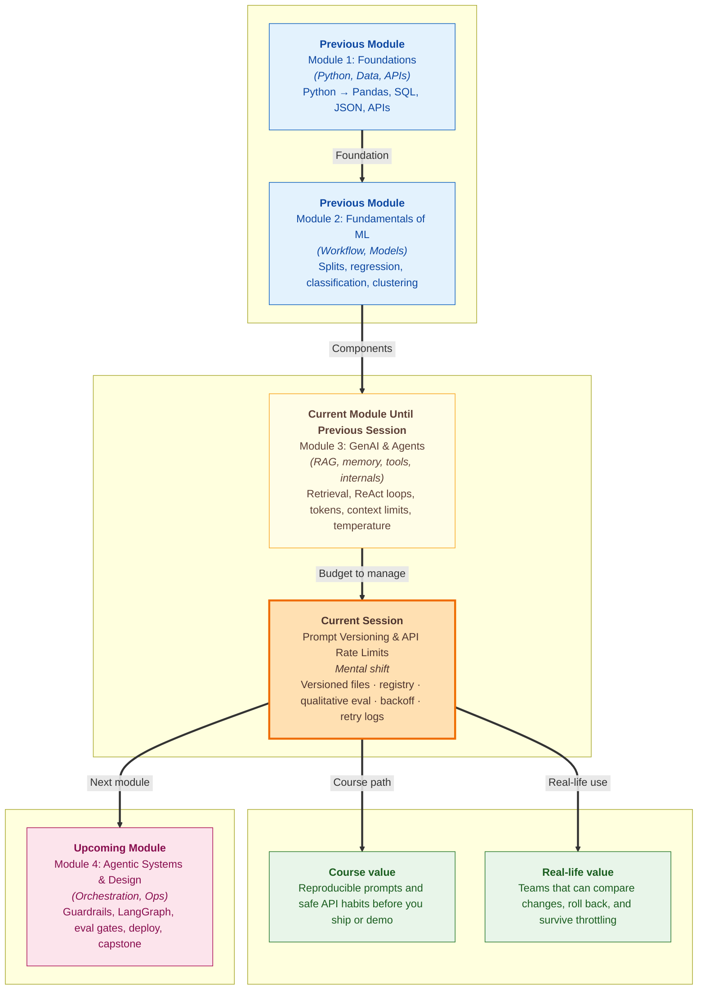

# Pre-read: Prompt Versioning & API Rate Limits

Your **ShopEasy support bot** passed every test last week. Customers loved the polite tone. The **return policy** answers matched the official document. Your manager shared the demo link in the team group.

This Monday, complaints arrive. *"The bot keeps asking for my order ID at the end of every reply — we never asked for that."* Your teammate shrugs: *"I tweaked the instructions yesterday. It should be better now."* You open the shared notebook. The old instructions are **gone**. Nobody saved a copy. You cannot prove what changed. You cannot rerun yesterday's version against the same customer questions. The bug report says *"it worked before"* — and your team has **no evidence either way**.

Meanwhile, your intern runs a batch of **test questions** to compare two wording ideas. Within two minutes, the screen fills with **"too many requests — slow down"** errors. The notebook keeps firing calls in a tight loop. Half the class shares one **API key**. The demo stops. Everyone blames the internet.

These are not model failures. They are **management failures** — prompts treated like disposable sticky notes, and API calls treated like free unlimited SMS. In the **previous** session you learned how **tokens**, **context windows**, and **temperature** shape cost and behaviour inside a single request. Today we step back and ask: *how do you keep prompt changes traceable over time*, and *how do you call cloud APIs without tripping shared limits during development*?

---

## Context of This Session in the Course

---

## When "it worked yesterday" is not good enough

A **prompt** is not a casual WhatsApp message you edit and forget. For an AI product, it is **living logic** — the same way a refund rule or delivery promise is living logic. Change one closing line, one grounding rule, or one temperature setting, and customer experience shifts even if the **model name** on the invoice stays identical.

Think of a **Zomato restaurant** updating its menu card. If the old card is thrown away, nobody remembers what wording customers saw when complaints spike. Smart teams keep **version one** and **version two** side by side. When someone says *"Tuesday's answers were wrong,"* you open Tuesday's card — not today's guess.

The same discipline applies to your support bot. Without **prompt versioning**, you lose the baseline forever. With versioning, you can reload the **exact** instructions and settings from the day a bug was reported — and compare them fairly against a new draft.

---

## The challenges we will tackle

What if your team needs to test **two polite closing lines** — one that ends with *"Need anything else?"* and one that stays silent — but nobody wrote down which file was live on demo day?

What if you must run the **same five customer questions** through both drafts and decide which one **stays inside the policy document**, refuses unknown facts cleanly, and keeps replies short — without changing the retrieved context between runs?

What if one user message in an **agent loop** becomes **eight API calls** in a minute because the model keeps calling tools — and your shared development key hits a **rate limit** that looks like a crash?

What if the API returns **"too many requests"** and your script retries **instantly, fifty times per second**, making the problem worse instead of waiting like a patient customer at a busy **RTO counter**?

What if retries happen in the background with **no log entry** — so the app feels randomly slow and nobody knows the cloud provider asked you to **wait**?

In class we connect these stories to practical habits: **named prompt files**, a simple **registry** that bundles prompt text with model settings and tools, **side-by-side qualitative evaluation**, **exponential backoff** when limits are hit, and **visible retry logs** so development stays honest.

---

## Recipe versions in the family notebook

Imagine your family cookbook. **Paneer butter masala v1** is mild — guests who dislike spice praise it. **v2** adds extra chilli — some guests love it, others send the plate back. You do not erase v1 when you try v2. You label both recipes, cook each on the same day with the **same ingredients**, and note which batch people preferred.

**Prompt versioning** works the same way. Each meaningful change gets a **label** — like `v1` and `v2`, or a date stamp. The **words** the model reads live in their own files. **Numbers and switches** — which model, how random answers should be, how long replies may run — live in separate **config** files so designers and developers do not fight in one giant paragraph.

When the project grows, a **registry** acts like the **Big Bazaar store directory** at the entrance: one lookup chart that says *support agent, version two → this prompt file, these settings, these tools* — instead of every teammate guessing file paths inside a shared notebook.

Before you promote v2 to default, you run a **qualitative eval**: the **same questions**, the **same policy context**, two answer columns, and a simple checklist — did it stay grounded, refuse guesses, meet length rules? That is how product teams ship tone improvements without silently breaking trust.

---

## When the API says "slow down"

Cloud LLM providers protect shared servers with **rate limits** — caps on how many requests or tokens your account may use per minute or per day. Hit the cap and you receive a standard **"too many requests"** signal. That is not a broken key and not necessarily a bad prompt. It means **wait, then try again**.

During development, limits bite faster than you expect. A **ReAct agent** that plans, calls a tool, reads the result, and plans again can burn many calls from **one** user message. A classroom running eval scripts on **one org key** looks like a **UPI app on sale day** — fine in isolation, crowded together.

The professional response is **exponential backoff**: wait a short time, then longer, then longer still — like knocking on a friend's door with patience instead of banging every second. Add a little **random jitter** so twenty laptops do not retry in perfect sync. Cap total attempts so broken loops cannot run forever. And **log every retry** with timestamp, attempt number, wait time, and which prompt version was active — the same way **Swiggy** shows *"restaurant is busy"* instead of leaving you staring at a frozen screen with no explanation.

---

In this pre-read, you'll discover:

- **Why** prompts and tool settings deserve **version labels and separate files** — so you can reproduce, compare, and roll back behaviour like any serious product team
- **How** a simple **registry pattern** keeps prompt text, model config, and allowed tools bundled together — so half-updated deployments do not slip through
- **How** to run a **qualitative side-by-side eval** on the same questions and context — and decide whether a new version is truly better before making it default
- **What** **HTTP rate limits** mean during agent development — and how **retries, backoff, and structured logs** turn invisible throttling into something you can see and fix

---

## Words you will hear — explained right away

- **Prompt versioning:** Saving each revision of instructions and related settings with a clear name so you can reload or compare later.
- **Config file:** A small settings record — model choice, randomness level, reply length — kept apart from the prose prompt.
- **Registry pattern:** One central map that points from *agent name + version* to the right prompt file, config, and tools.
- **Qualitative eval:** Running the same test questions through two versions and judging answers by human criteria — tone, grounding, brevity — not one automated score alone.
- **Eval set:** A fixed list of test questions you reuse every time you change a prompt.
- **HTTP rate limit:** A server rule that blocks too many requests in a short window — often shown as **"too many requests."**
- **Exponential backoff:** Waiting longer after each failed retry — for example one second, then two, then four — instead of hammering the API.
- **Jitter:** A tiny random extra wait so many clients do not retry at the exact same moment.
- **Retry log:** A written record of each wait and retry during development — timestamp, attempt count, error type, active prompt version.

---

## What's next

By the end of the session, you should be able to:

- **Organize** prompts and configs in a **versioned folder layout** — or register them in one lookup table — so switching versions is deliberate, not accidental
- **Compare** two prompt versions on the **same eval questions** with a **qualitative checklist** before promoting a winner
- **Explain** why agent loops hit **rate limits** faster than single-turn chat — and what **RPM** and **token-per-minute** pressure feel like in practice
- **Implement** **exponential backoff with jitter** for retryable API errors — and know when **not** to retry (bad keys, broken requests)
- **Log** retry events to a file and console so **invisible waits** become a debug trail you can review after demo day
- **Connect** versioning with what you already know about **token budgeting** — shorter, stable prompts reduce both cost and throttling pressure

**Structured outputs**, the **agent build workshop**, and deeper **orchestration and deployment** topics still lie ahead in this module and the **next** module. Today you learn to treat prompts like **released product logic** and API calls like **shared public infrastructure** — habits that separate a classroom demo from something your team can maintain.

---

## Questions to think about before class

1. Your support bot **v2** adds one closing line: *"Need anything else? Reply with your order ID."* Customers like the warmth, but **three** complaints say the bot now **ignores** the rule *"answer only from the policy document"* on long chats. You changed **only** the prompt text — not retrieval or temperature. How would **saved v1 and v2 files** plus a **five-question eval** help you decide whether to keep, fix, or roll back v2 — without guessing what "worked yesterday" meant?

2. A script runs **ten eval questions** back-to-back on a shared org API key. Question six fails with **"too many requests."** Without any waiting logic, the script retries **immediately** in a loop. What likely happens to the remaining questions — and why is **exponential backoff** fairer to both the provider and your classmates?

3. Two retry events happen during your demo, but nobody sees them — the UI only shows a **spinner**. Which **three fields** would you want in a **retry log line** (timestamp, attempt number, wait seconds, error type, prompt version — pick the most useful trio) so tomorrow's you can explain the slowness in one glance?

Bring these questions to class. The session turns fragile notebook edits into a **traceable prompt pipeline** — and turns mysterious API slowdowns into **logged, recoverable waits** you can trust during real builds.
