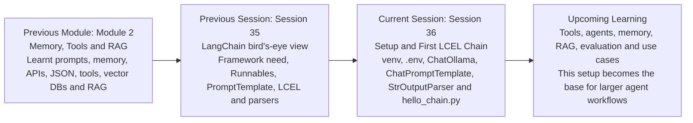

```mermaid
flowchart LR
    A["Previous Module: Module 2<br/>Memory, Tools and RAG<br/>Learnt prompts, memory, APIs, JSON, tools, vector DBs and RAG"]
    B["Previous Session: Session 35<br/>LangChain bird's-eye view<br/>Framework need, Runnables, PromptTemplate, LCEL and parsers"]
    C["Current Session: Session 36<br/>Setup and First LCEL Chain<br/>venv, .env, ChatOllama, ChatPromptTemplate, StrOutputParser and hello_chain.py"]
    D["Upcoming Learning<br/>Tools, agents, memory, RAG, evaluation and use cases<br/>This setup becomes the base for larger agent workflows"]

    A --> B --> C --> D
```
