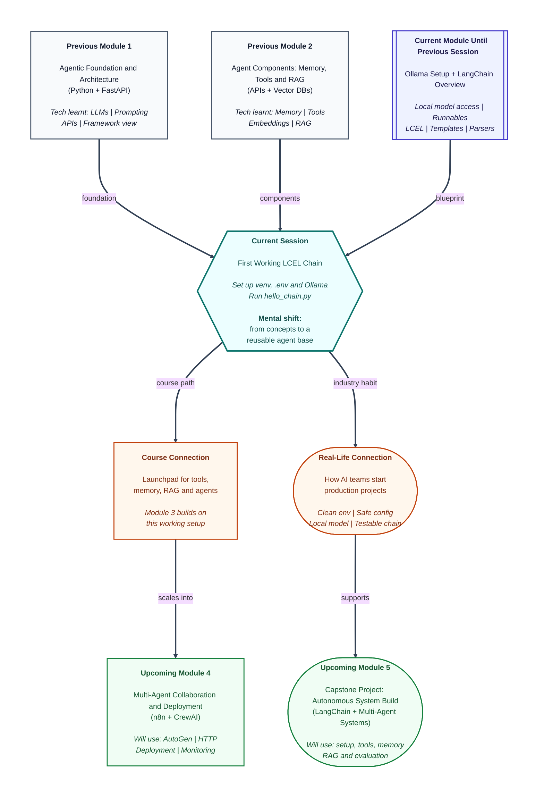

```mermaid
%%{init: {"diagramPadding": 24, "flowchart": {"htmlLabels": true, "nodeSpacing": 90, "rankSpacing": 110, "curve": "basis", "padding": 20}, "theme": "base", "themeVariables": {"fontFamily": "Arial", "fontSize": "15px", "lineColor": "#334155"}}}%%
flowchart TB
    subgraph FOUNDATION[" "]
        direction LR
        M1["&nbsp;&nbsp;<b>Previous Module 1</b>&nbsp;&nbsp;<br/><br/>Agentic Foundation and Architecture<br/>(Python + FastAPI)<br/><br/><i>Tech learnt: LLMs | Prompting<br/>APIs | Framework view</i>"]
        M2["&nbsp;&nbsp;&nbsp;<b>Previous Module 2</b>&nbsp;&nbsp;&nbsp;<br/><br/>Agent Components: Memory, Tools and RAG<br/>(APIs + Vector DBs)<br/><br/><i>Tech learnt: Memory | Tools<br/>Embeddings | RAG</i>"]
        S35[["&nbsp;&nbsp;<b>Current Module Until Previous Session</b>&nbsp;&nbsp;<br/><br/>Ollama Setup + LangChain Overview<br/><br/><i>Local model access | Runnables<br/>LCEL | Templates | Parsers</i>"]]
    end

    S36{{"&nbsp;&nbsp;<b>Current Session</b>&nbsp;&nbsp;<br/><br/>First Working LCEL Chain<br/><br/><i>Set up venv, .env and Ollama<br/>Run hello_chain.py</i><br/><br/><b>Mental shift:</b><br/>from concepts to a<br/>reusable agent base"}}

    subgraph VALUE[" "]
        direction LR
        COURSE["&nbsp;&nbsp;<b>Course Connection</b>&nbsp;&nbsp;<br/><br/>Launchpad for tools,<br/>memory, RAG and agents<br/><br/><i>Module 3 builds on<br/>this working setup</i>"]
        REAL(["&nbsp;&nbsp;<b>Real-Life Connection</b>&nbsp;&nbsp;<br/><br/>How AI teams start<br/>production projects<br/><br/><i>Clean env | Safe config<br/>Local model | Testable chain</i>"])
    end

    subgraph FUTURE[" "]
        direction LR
        M4["&nbsp;&nbsp;<b>Upcoming Module 4</b>&nbsp;&nbsp;<br/><br/>Multi-Agent Collaboration and Deployment<br/>(n8n + CrewAI)<br/><br/><i>Will use: AutoGen | HTTP<br/>Deployment | Monitoring</i>"]
        M5(["&nbsp;&nbsp;<b>Upcoming Module 5</b>&nbsp;&nbsp;<br/><br/>Capstone Project: Autonomous System Build<br/>(LangChain + Multi-Agent Systems)<br/><br/><i>Will use: setup, tools, memory<br/>RAG and evaluation</i>"])
    end

    M1 ==>|foundation| S36
    M2 ==>|components| S36
    S35 ==>|blueprint| S36
    S36 ==>|course path| COURSE
    S36 ==>|industry habit| REAL
    COURSE ==>|scales into| M4
    REAL ==>|supports| M5

    classDef previous fill:#f8fafc,stroke:#475569,stroke-width:2px,color:#0f172a
    classDef bridge fill:#eef2ff,stroke:#4338ca,stroke-width:2px,color:#1e1b4b
    classDef current fill:#ecfeff,stroke:#0f766e,stroke-width:3px,color:#134e4a
    classDef value fill:#fff7ed,stroke:#c2410c,stroke-width:2px,color:#7c2d12
    classDef future fill:#f0fdf4,stroke:#15803d,stroke-width:2px,color:#14532d

    class M1,M2 previous
    class S35 bridge
    class S36 current
    class COURSE,REAL value
    class M4,M5 future

    style FOUNDATION fill:transparent,stroke:transparent
    style VALUE fill:transparent,stroke:transparent
    style FUTURE fill:transparent,stroke:transparent
    linkStyle default stroke:#334155,stroke-width:3px
```
