# Mindmap: Session 36 - LangChain Environment Setup and First LCEL Chain

## Session Focus

Session 36 turns LangChain from a concept into a working project setup. Learners create a clean Python environment, configure Ollama through environment variables, and run their first LCEL chain:

```text
ChatPromptTemplate | ChatOllama | StrOutputParser
```

This session is the practical foundation for all later LangChain work: tools, agents, memory, RAG, evaluation, debugging, and real-world use cases.

## Mermaid Mindmap

```mermaid
flowchart TB
    S36(("Session 36<br/>LangChain Environment Setup<br/>and First LCEL Chain"))

    WHY["Why This Session Matters"]
    BUILD["What Learners Build Today"]
    PRIOR["Prior Learning Connected<br/>Module Wise"]
    REAL["Real Life Relevance"]
    NEXT["How It Links Further"]
    TAKEAWAY["Big Takeaway"]

    S36 --> WHY
    S36 --> BUILD
    S36 --> PRIOR
    S36 --> REAL
    S36 --> NEXT
    S36 --> TAKEAWAY

    WHY --> WHY1["Moves from theory to runnable LangChain project"]
    WHY --> WHY2["Creates a repeatable setup for later agent builds"]
    WHY --> WHY3["Teaches professional habits before complex workflows"]
    WHY --> WHY4["Makes local LLM development possible with Ollama"]

    BUILD --> B1["Python project workspace"]
    B1 --> B1A["venv for isolated dependencies"]
    B1 --> B1B["Packages for LangChain and Ollama"]
    B1 --> B1C["Folder structure for clean code"]

    BUILD --> B2["Safe configuration"]
    B2 --> B2A[".env for local settings"]
    B2 --> B2B[".env.example for collaboration"]
    B2 --> B2C[".gitignore to protect secrets"]

    BUILD --> B3["First LCEL chain"]
    B3 --> B3A["ChatPromptTemplate prepares messages"]
    B3 --> B3B["ChatOllama calls the local or cloud model"]
    B3 --> B3C["StrOutputParser returns clean text"]
    B3 --> B3D["hello_chain.py proves end-to-end execution"]

    BUILD --> B4["Validation"]
    B4 --> B4A["Run with two different inputs"]
    B4 --> B4B["Check readable string output"]
    B4 --> B4C["Trace errors through setup, model, env, and chain"]

    PRIOR --> M1["Module 1: Agentic Foundation and Architecture"]
    M1 --> M1A["Agent loop now needs code execution"]
    M1 --> M1B["LLM basics explain model choice and outputs"]
    M1 --> M1C["Prompt engineering becomes ChatPromptTemplate"]
    M1 --> M1D["Python essentials support scripts, packages, and errors"]
    M1 --> M1E["Pydantic and FastAPI thinking supports clean projects"]
    M1 --> M1F["Agent frameworks overview becomes hands-on LangChain"]

    PRIOR --> M2["Module 2: Memory, Tools, and RAG"]
    M2 --> M2A["Advanced prompting informs reusable prompt templates"]
    M2 --> M2B["Feedback loops support validation and debugging mindset"]
    M2 --> M2C["Databases, APIs, and JSON build integration comfort"]
    M2 --> M2D["Embeddings, vector DB, and RAG prepare retrieval chains"]
    M2 --> M2E["Tool integration prepares learners for LangChain tools"]

    PRIOR --> M3["Module 3: Sessions 34 and 35"]
    M3 --> M3A["Session 34: Ollama provides the model backend"]
    M3 --> M3B["Session 35: LangChain concepts provide Runnables, LCEL, and parsers"]
    M3 --> M3C["Session 36 combines both into a working local chain"]

    REAL --> R1["Software teams need reproducible environments"]
    REAL --> R2["Secrets must stay outside source code"]
    REAL --> R3["Local models reduce cost and enable experimentation"]
    REAL --> R4["Simple chains become chatbots, assistants, and internal tools"]
    REAL --> R5["Debugging setup issues mirrors real AI engineering work"]

    NEXT --> N37["Session 37: LangChain Tools"]
    N37 --> N37A["First chain becomes tool-enabled workflows"]
    N37 --> N37B["Typed functions and tool calls build on stable setup"]

    NEXT --> N38["Session 38: First LangChain Agent"]
    N38 --> N38A["LCEL and model binding feed AgentExecutor agents"]
    N38 --> N38B["Validation expands to multiple query classes"]

    NEXT --> N39["Session 39: Memory on Agents"]
    N39 --> N39A["Stateless chain gains conversation history"]
    N39 --> N39B["ChatPromptTemplate evolves with MessagesPlaceholder"]

    NEXT --> N40["Session 40: LangChain RAG Pipeline"]
    N40 --> N40A["LCEL chain connects retriever context to generation"]
    N40 --> N40B["Module 2 RAG knowledge becomes LangChain implementation"]

    NEXT --> N41["Session 41: Integrated Agent"]
    N41 --> N41A["Tools, memory, and retrieval combine into one workflow"]

    NEXT --> N42["Sessions 42 and 43: Evaluation and Debugging"]
    N42 --> N42A["hello_chain validation grows into test sets, logs, and quality tuning"]

    NEXT --> N44["Session 44: Real-World Use Cases"]
    N44 --> N44A["Same foundation supports HR onboarding and industry workflows"]

    TAKEAWAY --> T1["A working LangChain chain is the seed of every later agent"]
    TAKEAWAY --> T2["Environment discipline plus LCEL composition equals reliable AI apps"]
```



## One-Line Teaching Anchor

If Session 35 answered "What is LangChain and how do chains compose?", Session 36 answers "How do I set up my machine and run the first chain reliably?"

## Instructor Framing

Use this session to show learners that real AI development is not only about prompting the model. It is also about creating a project structure that another teammate can run, keeping secrets safe, binding the correct model, parsing outputs cleanly, and validating behaviour before building bigger agent workflows.
