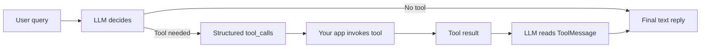

# LangChain Tools: Custom Tools and Tool Calling

## What You Already Know and What We Build Now

In the previous class, you set up a LangChain project with **Ollama**, built a first **LCEL chain** using `ChatPromptTemplate`, `ChatOllama`, and `StrOutputParser`, and learned to **validate** model output before showing it to users.

That chain could only **generate text**. It could not look up a real order, read company policy from a database, or open a support ticket. Today we extend LangChain so the model can **request actions** in a structured, inspectable way—and your Python code **runs** those actions safely.

**In this lesson, you will learn:**

- Why LLM-only apps need **external tools** and how the **tool-calling loop** works end to end.
- How to author LangChain tools with **`@tool`**, **Pydantic** schemas, and clear descriptions.
- How to use **`bind_tools`**, read **`tool_calls`**, and return results with **`ToolMessage`**.
- How to build a **manual feedback loop** that produces a final user-friendly answer.
- How to apply **error-containment** patterns and **diagnose** wrong tool or argument choices.

---

## Why LLMs Alone Are Not Enough

An application with only an LLM can answer general questions from its training. It **cannot** reliably fetch live order status, call MakeMyTrip, or read your company database—unless you connect it to the outside world.

- **Official Definition:** An **external tool** is any callable capability outside the model—API, database, calculator, search, ticket system—that the application runs when the model asks for it.
- **In Simple Words:** The LLM is the **brain** that decides *what* to do; tools are the **hands** that actually do it.
- **Real-Life Example:** A food-delivery app chatbot cannot guess where your biryani is. It must call the order-tracking API and then explain the result in simple Hindi or English.


The same idea appeared earlier when **RAG** connected your app to a **vector database**. In LangChain, that retrieval step can also be exposed as a **tool** the model chooses when needed.

| Capability | LLM only | LLM + tools |
|---|---|---|
| General advice | Yes | Yes |
| Live order status | No (may guess) | Yes (via database/API) |
| Create refund ticket | No | Yes (via your backend) |
| Traceable actions | Hard | Yes (you see each tool call) |

---

## The Tool-Calling Workflow (Restaurant Analogy)

Think of a busy restaurant. The customer tells the **waiter** what they want. The waiter does not cook; they write a clear **order slip** and send it to the **kitchen**. The kitchen cooks and sends food back; the waiter serves it nicely to the customer.

| Role in software | Restaurant analogy |
|---|---|
| User | Customer |
| LLM | Waiter (plans and speaks) |
| Tool call | Written order slip |
| Tool (your function/API) | Kitchen |
| Tool result | Prepared dish (raw data) |
| Final reply to user | Waiter’s friendly explanation |

**The full loop taught in class:**

1. User sends a query.
2. LLM decides: *Can I answer directly, or do I need a tool?*
3. If a tool is needed, the LLM emits a structured **tool call** (name + arguments).
4. Your **application** runs the tool—not the LLM itself.
5. Tool output goes back to the LLM as a **ToolMessage**.
6. LLM writes a **user-friendly** final answer (you usually do **not** dump raw JSON to the user).




> **Common doubt:** “If the tool already returned the answer, why call the LLM again?”  
> **Answer:** Tools return data in different shapes (JSON from DB, text from API). The LLM turns that into one consistent, polite reply for your UI.

---

## LangChain Tools in One Line

- **Official Definition:** In LangChain, a **tool** is a **callable function** with well-defined **inputs** and **outputs** that the model may request through structured tool calls.
- **In Simple Words:** Any normal Python function can become a tool if you mark it and describe it clearly.
- **Real-Life Example:** `get_order_status(order_id)` is a function today; with `@tool` it becomes something GPT can *ask your code* to run.

---

## The `@tool` Decorator

To tell LangChain “this function is a tool,” use the **`@tool`** decorator from `langchain.tools`.

- **Official Definition:** **`@tool`** wraps a Python function as a LangChain **runnable tool** with metadata (name, description, schema) exposed to the model.
- **In Simple Words:** One line above your function registers it in the tool menu the LLM can read.
- **Real-Life Example:** Like putting a dish on the restaurant menu—the name and description help the waiter (LLM) pick the right kitchen (function).

**Minimal pattern from class:**

```python
from langchain.tools import tool

@tool
def get_order_status(order_id: str) -> str:
    """Fetch delivery status for a given order ID."""
    # your logic here
    return "..."
```

**Production habits mentioned in class:**

- Use **snake_case** names: `get_order_status`, `create_refund_ticket` (recommended, not a hard rule).
- Write a **clear docstring** on every tool—other developers (and the model) read it first.
- Return **structured JSON** (or consistent strings), not vague text like `"something went wrong"`.
- Avoid huge tools; split into smaller tools so debugging is easier later.

---

## Type Hints vs Real Validation (Pydantic)

You might write:

```python
def get_order_status(order_id: str):
    ...
```

That is only a **type hint**. Python will **not** stop someone from passing an integer unless you validate.

- **Official Definition:** **Pydantic** models describe fields, types, constraints, and optional defaults; invalid input raises a clear **validation error**.
- **In Simple Words:** Pydantic is a strict form checker before your tool logic runs.
- **Real-Life Example:** An order ID must look like `ORD1001`—Pydantic can enforce length and format; plain `str` cannot.

### `args_schema` on `@tool`

Define a **BaseModel** for inputs, then pass it to the decorator:

```python
from pydantic import BaseModel, Field

class OrderStatusInput(BaseModel):
    order_id: str = Field(
        description="Order ID in format ORD1001 (example: ORD1001)."
    )

@tool(args_schema=OrderStatusInput)
def get_order_status(order_id: str) -> str:
    ...
```

LangChain sends this schema to the model so it knows **what arguments** each tool expects.

### `Literal` for fixed choices

For policy lookup, the topic must be exactly one of `refund`, `shipping`, or `warranty`:

```python
from typing import Literal

class PolicyLookupInput(BaseModel):
    topic: Literal["refund", "shipping", "warranty"] = Field(
        description="Policy topic: refund, shipping, or warranty."
    )
```

If the model (or user path) sends `"delivery"`, Pydantic fails early—you do **not** need a manual `if topic not in ...` check inside the tool for that case.


---

## Mock Databases for This Demo

The class focus was **tool calling**, not SQL setup. We used in-memory **dictionaries** as fake databases:

- **`ORDERS_DB`** — order details, payment status, item name, ETA.
- **`POLICIES_DB`** — short policy text per topic.
- **`REFUND_TICKETS`** — tickets created during the demo.

In production you would replace dictionary lookups with real DB/API calls. The tool-calling loop stays the same.

---

## Bind Tools to the Model

The model does not magically know your tools exist. You must **bind** them.

- **Official Definition:** **`bind_tools(tools)`** attaches a list of tool definitions to a chat model so its responses may include structured **`tool_calls`**.
- **In Simple Words:** You hand the LLM a fixed menu of tools it is allowed to request.
- **Real-Life Example:** A waiter only takes orders for items on today’s menu—not anything random from the street.

```python
from langchain.chat_models import init_chat_model

model = init_chat_model("gpt-4o-mini", temperature=0)
model_with_tools = model.bind_tools(tools)
```

**`init_chat_model`** (from LangChain) creates the chat model by name. **`temperature=0`** makes tool choice steadier for demos. Class used a capable **GPT** model so tool selection was reliable.

---

## Reading `tool_calls` on the AI Message

When you call `model_with_tools.invoke(messages)`, the reply is an **`AIMessage`**. It has:

- **`content`** — text the model wrote (may be empty when it only wants tools).
- **`tool_calls`** — list of dict-like objects: tool **name**, **id**, and **args**.

Your job as developer:

1. Append the `AIMessage` to the conversation history.
2. If `tool_calls` is empty → return `content` as the final answer.
3. If not empty → run each tool, wrap results in **`ToolMessage`**, append those, and call the model again.

- **Official Definition:** **`ToolMessage`** carries the output of one executed tool back into the chat history, linked by `tool_call_id`.
- **In Simple Words:** It is the kitchen’s reply slip attached to the waiter’s original order number.
- **Real-Life Example:** “Order ORD1001: wireless mouse, shipped, ETA 2 days”—fed back so the LLM can say that politely to the customer.


---

## Execute Tool Calls Safely

Tool calls can fail—network down, bad API key, rate limits, validation errors.

- **Official Definition:** **Safe execution** means catching failures and returning a structured error as a `ToolMessage` instead of crashing the whole app.
- **In Simple Words:** Always use `try/except` around `tool.invoke(...)`.
- **Real-Life Example:** If MakeMyTrip’s API fails, the bot should say “booking service is down”—not close the entire website.

**Pattern from class:**

1. Build `tools_by_name = {tool.name: tool for tool in tools}`.
2. Read `tool_name`, `tool_call_id`, and `args` from each tool call.
3. If name missing → `ToolMessage` with `error_type: unknown_tool`.
4. Else `try: result = selected_tool.invoke(args)` → success `ToolMessage`.
5. `except Exception` → `ToolMessage` with JSON error details.


---

## Manual Customer-Support Agent Loop

Function name in class: **`run_customer_support_agent(user_query, max_steps=5)`**.

**System message (important for correct tool use):**

- You are a helpful customer-support agent.
- Use tools for order data, policy data, or creating a refund ticket.
- If a tool returns an error, explain clearly and ask for corrected information.

**Loop logic:**

1. Start `messages` = [system, human(user_query)].
2. Repeat up to **`max_steps`** (5 in class):
   - `ai_message = model_with_tools.invoke(messages)`
   - Append `ai_message`.
   - If no `tool_calls` → return `ai_message.content`.
   - For each tool call → `execute_tool_call_safely` → append each `ToolMessage`.
3. If still not done after 5 rounds → return a polite “could not complete within allowed steps” message.

**Why multiple steps?** One user message can need **several** tools—for example policy lookup first, then refund ticket creation. The loop lets the LLM see each result before the next decision.


**Live traces from class:**

| User query (example) | Step 1 tool(s) | Step 2 |
|---|---|---|
| “Where is my order ORD1001?” | `get_order_status` | Final natural-language status |
| “Can I get a refund if item is damaged?” | `lookup_policy` (refund) | Explains eligibility; may ask for order ID |
| “Create refund ticket for ORD1001, damaged” | `create_refund_ticket` | Confirms ticket ID created |

---

## The Three Demo Tools (Behaviour Summary)

### 1. `get_order_status`

- Looks up `order_id` in `ORDERS_DB` (uppercase normalized).
- Returns JSON with `ok: true` and order details, or `ok: false`, `error_type: order_not_found`.
- Docstring tells the model: use only when user asks about **status, delivery, shipping, or ETA**.

### 2. `lookup_policy`

- Input `topic`: `refund` | `shipping` | `warranty` (via `Literal`).
- Returns policy text from `POLICIES_DB`.
- Example refund policy from class: refunds allowed within **7 days** for damage or wrong product.

### 3. `create_refund_ticket`

- Needs `order_id`, `reason` (e.g. damaged, late_delivery), optional `customer_note`.
- Fails if order missing (`order_not_found`).
- Fails if `payment_status` is not **paid** (`payment_not_completed`).
- On success, stores ticket in `REFUND_TICKETS` and returns ticket id.

> **Common mistake:** Naming a tool vaguely (e.g. `handle_request`). The model picks tools by **name** and **description**—unclear names cause wrong calls.


---

## Full Class Code (`langchain_tools.py`)

Save this in your project folder (same layout as class: virtual environment, `.env` for API keys). Every line has a comment as taught.

```python
# --- Standard library ---
import json  # Convert Python dicts to JSON strings for ToolMessage content
import os  # Read environment variables safely
from typing import Literal  # Restrict a field to fixed allowed strings

# --- Third-party / LangChain ---
from dotenv import load_dotenv  # Load .env file into environment variables
from langchain.chat_models import init_chat_model  # Factory to create chat models by name
from langchain.tools import tool  # Decorator that registers a function as a LangChain tool
from langchain.messages import ToolMessage  # Message type that carries tool output back to the LLM
from pydantic import BaseModel, Field  # Define and validate tool input schemas

# --- Load API keys (e.g. OPENAI_API_KEY) from .env ---
load_dotenv()

# --- Fake in-memory databases (replace with real DB/API in production) ---
ORDERS_DB = {
    "ORD1001": {
        "order_id": "ORD1001",
        "item": "Wireless Mouse",
        "status": "shipped",
        "payment_status": "paid",
        "eta_days": 2,
    },
    "ORD1002": {
        "order_id": "ORD1002",
        "item": "USB-C Cable",
        "status": "delivered",
        "payment_status": "paid",
        "eta_days": 0,
    },
}

POLICIES_DB = {
    "refund": "Refunds are allowed within 7 days of delivery for damaged or wrong products.",
    "shipping": "Standard shipping takes 3-5 business days. Express is available at checkout.",
    "warranty": "Electronics have a 12-month manufacturer warranty from delivery date.",
}

REFUND_TICKETS = {}  # Filled when create_refund_ticket succeeds


# --- Pydantic input schemas ---
class OrderStatusInput(BaseModel):
    order_id: str = Field(
        description="Order ID in format ORD1001 (example: ORD1001)."
    )


class PolicyLookupInput(BaseModel):
    topic: Literal["refund", "shipping", "warranty"] = Field(
        description="Policy topic. Must be refund, shipping, or warranty."
    )


class RefundTicketInput(BaseModel):
    order_id: str = Field(description="Order ID such as ORD1001.")
    reason: Literal["damaged", "late_delivery", "wrong_item"] = Field(
        description="Refund reason."
    )
    customer_note: str = Field(
        default="",
        description="Short explanation from the customer.",
    )


# --- Tool 1: order status ---
@tool(args_schema=OrderStatusInput)
def get_order_status(order_id: str) -> str:
    """Fetch order status, item details, payment status, and delivery ETA.
    Use only when the user asks about status, delivery, shipping, or ETA of a specific order."""
    normalized_id = order_id.strip().upper()  # Match keys in ORDERS_DB consistently
    order = ORDERS_DB.get(normalized_id)  # Look up order in fake database
    if not order:  # If missing, return structured error JSON
        return json.dumps(
            {
                "ok": False,
                "error_type": "order_not_found",
                "message": f"No order found for id {normalized_id}.",
            }
        )
    return json.dumps({"ok": True, "order": order})  # Success payload for the LLM


# --- Tool 2: policy lookup ---
@tool(args_schema=PolicyLookupInput)
def lookup_policy(topic: str) -> str:
    """Look up company policy for refund, shipping, or warranty.
    Use when the user asks about rules, eligibility, or timelines."""
    policy_text = POLICIES_DB.get(topic)  # topic already validated by Literal in schema
    return json.dumps({"ok": True, "topic": topic, "policy": policy_text})


# --- Tool 3: create refund ticket ---
@tool(args_schema=RefundTicketInput)
def create_refund_ticket(order_id: str, reason: str, customer_note: str = "") -> str:
    """Create a refund ticket for an existing paid order.
    Use when the user wants to file a refund request."""
    normalized_id = order_id.strip().upper()  # Normalize order id
    order = ORDERS_DB.get(normalized_id)  # Fetch order record
    if not order:  # Block refund if order does not exist
        return json.dumps(
            {
                "ok": False,
                "error_type": "order_not_found",
                "message": f"No order found for id {normalized_id}.",
            }
        )
    if order.get("payment_status") != "paid":  # Block refund if payment incomplete
        return json.dumps(
            {
                "ok": False,
                "error_type": "payment_not_completed",
                "message": (
                    f"Cannot create refund for {normalized_id} "
                    f"because payment_status is {order.get('payment_status')}."
                ),
            }
        )
    ticket_id = f"RF-{normalized_id}-001"  # Simple demo ticket id
    REFUND_TICKETS[ticket_id] = {  # Store ticket in fake ticket database
        "ticket_id": ticket_id,
        "order_id": normalized_id,
        "reason": reason,
        "customer_note": customer_note,
        "status": "created",
    }
    return json.dumps(
        {
            "ok": True,
            "ticket_id": ticket_id,
            "message": "Refund ticket created successfully.",
        }
    )


# --- Register tools for bind_tools ---
tools = [get_order_status, lookup_policy, create_refund_ticket]  # List passed to the model

tools_by_name = {t.name: t for t in tools}  # Fast lookup when executing tool_calls


# --- Create model and bind tools ---
MODEL_NAME = os.getenv("CHAT_MODEL", "gpt-4o-mini")  # Model name from env or default
model = init_chat_model(MODEL_NAME, temperature=0)  # temperature=0 for steadier tool choice
model_with_tools = model.bind_tools(tools)  # Model now knows available tools


def execute_tool_call_safely(tool_call: dict) -> ToolMessage:
    """Run one model-emitted tool call; never crash the whole agent."""
    tool_name = tool_call.get("name")  # Which tool the model chose
    tool_call_id = tool_call.get("id")  # Id linking ToolMessage back to this call
    tool_args = tool_call.get("args", {})  # Arguments dict from the model

    selected_tool = tools_by_name.get(tool_name)  # Find matching tool object
    if selected_tool is None:  # Model asked for a tool that does not exist
        error_payload = {
            "ok": False,
            "error_type": "unknown_tool",
            "message": f"Tool '{tool_name}' is not available.",
        }
        return ToolMessage(
            content=json.dumps(error_payload),
            tool_call_id=tool_call_id,
        )

    try:  # Catch network/validation/runtime failures
        result = selected_tool.invoke(tool_args)  # Run the LangChain tool
        return ToolMessage(content=str(result), tool_call_id=tool_call_id)  # Success path
    except Exception as exc:  # Convert exception into recoverable signal for the LLM
        error_payload = {
            "ok": False,
            "error_type": "tool_execution_error",
            "message": str(exc),
        }
        return ToolMessage(
            content=json.dumps(error_payload),
            tool_call_id=tool_call_id,
        )


def run_customer_support_agent(user_query: str, max_steps: int = 5) -> str:
    """Manual tool-feedback loop until the model returns a final text answer."""
    messages = [
        {
            "role": "system",
            "content": (
                "You are a helpful customer support agent. "
                "Use tools when you need order data, policy data, or to create a refund ticket. "
                "If a tool returns an error, explain the issue clearly and ask for missing or corrected information."
            ),
        },
        {"role": "user", "content": user_query},
    ]

    for step in range(1, max_steps + 1):  # Limit loops so the agent cannot run forever
        ai_message = model_with_tools.invoke(messages)  # Model may return text and/or tool_calls
        messages.append(ai_message)  # Keep full conversation history

        tool_calls = getattr(ai_message, "tool_calls", None) or []  # Safe access to tool_calls
        if not tool_calls:  # No tools requested → this content is the final answer
            print(f"Step {step}: final model response")
            return ai_message.content

        print(f"Step {step}: tool_calls = {tool_calls}")  # Debug trace like live class
        for tool_call in tool_calls:  # A single turn may request multiple tools
            tool_message = execute_tool_call_safely(tool_call)  # Run each tool safely
            messages.append(tool_message)  # Feed result back for the next model turn

    return "I could not complete the request within the allowed number of steps."  # Safety exit


if __name__ == "__main__":
    test_queries = [
        "Where is my order ORD1001?",
        "Can I get a refund if my item arrived damaged?",
        "Create a refund ticket for ORD1001 because the item is damaged.",
        "What is your refund policy?",
        "Tell me a joke about databases.",
    ]

    for query in test_queries:  # Run controlled test set from class
        print("\n" + "=" * 60)
        print("Query:", query)
        final_answer = run_customer_support_agent(query)  # Run agent for each query
        print("Final answer:", final_answer)
```

### How the code works

- **Mock DBs** keep the lesson on tool mechanics, not SQL setup.
- **Pydantic + `args_schema`** enforce argument shape before business logic runs.
- **`bind_tools`** exposes the three tools to the model on every invoke.
- **`execute_tool_call_safely`** maps each tool call by name and wraps failures in `ToolMessage`.
- **`run_customer_support_agent`** implements the manual loop: model → tools → model until text-only reply or step limit.
- **`if __name__ == "__main__"`** runs the same style of test queries used live (order, refund policy, ticket, joke).

### Environment setup (before running)

```bash
python3 -m venv venv
source venv/bin/activate
pip install langchain langchain-openai pydantic python-dotenv
```

Add your API key to `.env` (example for OpenAI-backed `init_chat_model`):

```bash
OPENAI_API_KEY=your_key_here
CHAT_MODEL=gpt-4o-mini
```

Run:

```bash
python3 langchain_tools.py
```

---

## Error-Containment Patterns (Production Checklist)

These patterns were summarised on the whiteboard after the live code walkthrough:

| Pattern | What to do | Where you saw it |
|---|---|---|
| Structured error objects | Return JSON with `ok`, `error_type`, `message` | `get_order_status`, `create_refund_ticket` |
| Catch tool exceptions | `try/except` around `tool.invoke` | `execute_tool_call_safely` |
| Validate arguments early | Pydantic `args_schema` on every tool | All three tools |
| Keep tools minimal | One clear job per tool; split large tools | Three separate tools vs one mega-tool |
| Limit tool output size | Return only fields the LLM needs | Avoid dumping huge DB rows |

Large tool outputs slow the app and cost more tokens when sent back to the model.

---

## Diagnosing Tool Selection and Wrong Arguments

**Who chooses the tool?** The **LLM**—guided by your **system prompt**, **tool names**, and **tool descriptions** (from docstrings via `@tool`).

**Tool selection mistakes** often look like **hallucination**: the model invents order data instead of calling `get_order_status`. Fix by:

- Stating clearly in the system prompt: *use tools for order/policy/refund scenarios; do not guess live data.*
- Writing precise tool **names** and **descriptions** (the model reads both when tools are bound).
- Testing **10–30 realistic queries** before production: correct tool? correct args? sensible final reply?

**Wrong arguments** are reduced by Pydantic (wrong `topic`, bad order id format). Remaining issues should surface as structured errors the LLM can explain to the user.

**Tracing tip from class:** Print `tool_calls` each step. Compare what you expected vs what the model requested—same idea as debugging a confused waiter sending the wrong dish to the kitchen.

### Quick Activity — Match Query to Tool

For each user message, write which tool should run first:

1. “When will ORD1002 arrive?”  
2. “What is your warranty policy?”  
3. “Open a refund for ORD1001, product was damaged.”  
4. “Write me a poem about monsoon.”

**Answers:** 1 → `get_order_status`, 2 → `lookup_policy` (warranty), 3 → `create_refund_ticket` (after order checks if needed), 4 → **no tool** (direct LLM reply).

---

## Key Takeaways

- LLMs **plan**; your application **executes** tools and feeds results back through **`ToolMessage`** for a polished final answer.
- **`@tool`** plus **Pydantic `args_schema`** make tools reliable, readable, and easier for the model to call correctly.
- **`bind_tools`**, **`tool_calls`**, and a bounded **manual loop** are the core pattern behind agent-style apps in LangChain.
- **Safe execution** and **structured errors** turn failures into recoverable conversation turns instead of crashes.
- Clear names, descriptions, system prompts, and a small **test query set** prevent wrong tool choice before you ship.

Next, you will build on this pattern with richer agents, memory, and retrieval tools in larger LangChain and LangGraph workflows.

---

## Important Commands, Libraries, Terminologies Used

| Item | Meaning / Use |
|---|---|
| `@tool` | LangChain decorator that registers a Python function as a model-callable tool. |
| `args_schema` | Pydantic model passed to `@tool` to enforce and document tool inputs. |
| `bind_tools(tools)` | Attaches tool definitions to a chat model. |
| `init_chat_model` | Creates a chat model instance by provider/model name. |
| `tool_calls` | Structured list on `AIMessage` describing requested tools and arguments. |
| `ToolMessage` | Chat message carrying one tool’s output linked by `tool_call_id`. |
| `AIMessage` | Model reply; may include `content` and/or `tool_calls`. |
| `tool.invoke(args)` | Runs the tool programmatically (same as class execution path). |
| `Literal[...]` | Restricts a field to fixed allowed string values. |
| Pydantic `BaseModel` | Defines validated input/output structures. |
| `Field(description=...)` | Documents a field for humans and for the model’s schema. |
| snake_case | Recommended tool naming style (`get_order_status`). |
| Type hint | Suggestion only; does not enforce types at runtime. |
| Mock / fake DB | In-memory dict standing in for real database during learning. |
| Tool-calling loop | Model → tool call → app runs tool → ToolMessage → model again. |
| `max_steps` | Safety cap on how many model turns the agent may take. |
| Error containment | Patterns that prevent tool failures from crashing the app. |
| Hallucination (in this context) | Model guessing live data instead of calling the right tool. |
| Structured error JSON | `ok`, `error_type`, `message` for debuggable failures. |
