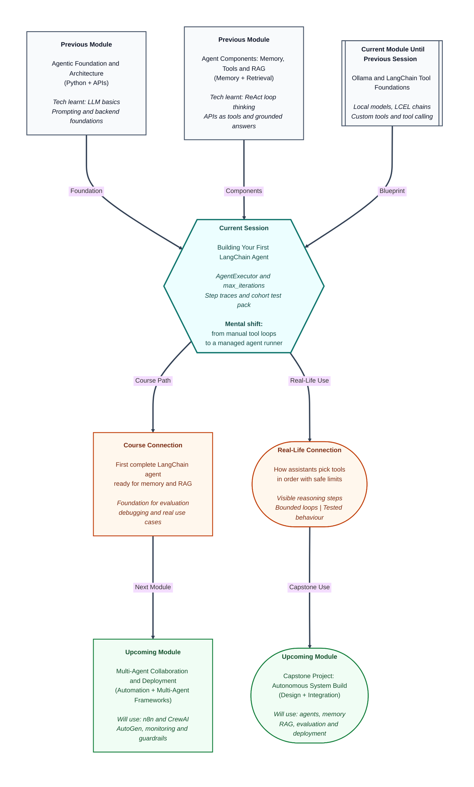

# Pre-read: Building Your First LangChain Agent

## Context of This Session in the Course

---

Imagine you are planning a family trip to Goa. You ask a smart assistant: *"Can we leave Friday evening, stay within ₹25,000, and still reach the beach hotel before dinner?"*

A basic chatbot might reply with general travel tips. But a useful assistant would need to **check train or flight options**, **compare hotel prices**, **estimate travel time from the station**, and maybe **convert currency** if one site shows dollars. Each step depends on the result of the previous one. One wrong guess at any stage ruins the whole plan.

Now ask yourself: **who decides the order of these steps?** Who stops when enough information is collected? Who handles a failed lookup without confusing the user?

That is exactly the kind of work an **agent** is built for. Not a chatbot that talks once and stops — but a system that can **think, act, observe, and think again** until it reaches a useful answer.

## From Single Tools to a Full Decision Loop

In the **previous session**, you learned how a language model can **request a tool** in a structured way — like a waiter sending a clear order to the kitchen. You also saw how tool results come back and how failures can be handled without crashing the whole system.

That was powerful, but it was still **manual**. Someone had to wire the loop: model asks → tool runs → result goes back → model decides again. For one or two steps, that is manageable. For real questions that need three or four actions — or questions where the model must decide **no tool is needed at all** — the wiring becomes fragile and hard to trust.

What if the assistant kept calling tools forever because it never felt "done"? What if it picked the wrong tool twice in a row and nobody could see why? What if a small formatting mistake in the model's reply broke the entire flow?

These are not rare edge cases. They are everyday problems in **agentic systems** — systems where the AI is allowed to take actions, not just generate text.

## The Managed Agent Runner

This session introduces your **first complete LangChain agent** — a system where custom tools, the language model, and a **managed executor** work together as one unit.

The core idea is a **bounded tool-calling loop**. The agent receives a user question, decides whether a tool is needed, runs it if required, reads the observation, and may repeat — but only up to a **safe limit** set by you. That limit is called **max iterations**. It is like telling a junior employee: *"You may check with two departments, but after that you must give me a final answer."*

The **AgentExecutor** is the component that runs this loop for you. Instead of hand-writing every round of "model → tool → model," you plug your tools and model into a standard runner that handles the repetition, catches common parsing mistakes, and produces a trace you can inspect.

A **tool-calling agent** is an agent whose main job is to choose from the tools you provide — a calculator, a search helper, a lookup function — and combine their outputs into one coherent reply.

Transparency matters here. You will configure the system so you can see **each step**: which tool was selected, what arguments were sent, and what came back as an observation. When something goes wrong, you do not have to guess. You read the trace.

## Think of a Hospital Reception Desk

Picture the reception desk at a busy city hospital during evening hours.

A patient walks in and says, *"I have a fever and a sore throat — can I see someone today?"* The receptionist does not treat the patient directly. They **listen**, **decide which department to contact**, **wait for a response**, and **may route the case again** — perhaps to triage, then to the duty doctor, then to the billing desk if an appointment slot is confirmed.

The receptionist follows a simple rule: **after a fixed number of routing steps, they must give the patient a clear outcome** — an appointment time, a referral, or an honest "please come back tomorrow morning."

In this picture:

- The **language model** is the receptionist who understands the request and plans the next move.
- The **tools** are the departments — triage, records, scheduling.
- The **AgentExecutor** is the hospital's standard process that keeps routing orderly and stops runaway back-and-forth.
- The **trace** is the slip of paper that records every handoff, so a supervisor can review what happened if the patient complains.

This is the heart of today's topic: **controlled autonomy**. The system acts on its own, but within boundaries you define.

## What Makes a Query Easy or Hard for an Agent

Not every user question looks the same. Some need **one tool** — for example, a direct calculation. Some need **multiple tools in sequence** — look up a value, then transform it, then summarise. Some need **no tool at all** — a general explanation the model can answer from its own knowledge.

A professional agent must handle all three patterns reliably. That is why you will validate behaviour using a **cohort test pack** — a shared set of queries designed to cover these different cases. You will run the agent, read the traces, and check whether the control flow matches what you expect: did it use one tool, chain two tools, or answer directly?

This kind of testing is how teams move from "it worked once on my laptop" to "it behaves predictably across representative inputs."

In this pre-read, you'll discover:

- **Understand** why a managed agent loop is safer and more scalable than wiring tool calls by hand.
- **Discover** how iteration limits protect users and systems from endless tool-chasing.
- **Learn** how step-level traces make tool selection and arguments visible for debugging.
- **Recognise** why agents must be tested across single-tool, multi-tool, and no-tool questions.

## What You Will Be Ready To Do

After this session, you will have moved from **building individual tools** to **running a full agent** — the kind of unit that sits at the centre of real LangChain applications.

You will be ready to:

- Connect custom tools to a **tool-calling agent** inside an **AgentExecutor**.
- Set **max iterations** and handle parsing errors so the loop stays stable.
- Read intermediate steps — tool names, arguments, and observations — from agent runs.
- Validate your agent against the cohort **test pack** and explain expected vs observed behaviour for each query type.
- Relate trace output to the agent's decision path without changing the instructor-provided scenarios.

This is a milestone moment in the module. Chains answered questions in one pass. Tools let the model take one action. An **agent** ties those actions into a repeatable, inspectable workflow — the base on which **memory**, **retrieval**, and **evaluation** will be added in upcoming topics.

## Why Bounded Agents Matter in the Real World

Companies do not deploy agents because they sound futuristic. They deploy them because repetitive multi-step tasks — checking inventory, pulling report figures, validating form data — waste human time when done manually.

But trust is non-negotiable. A finance assistant that loops silently for fifty API calls is a liability. A support bot that cannot explain why it queried the wrong database erodes customer confidence. **Bounds, traces, and test packs** are how responsible teams ship agent features: the system can act, but you can see what it did and prove it behaves on known cases.

Once this pattern clicks, the rest of the module — adding memory, connecting retrieval, running evaluation harnesses — will feel like extending a engine you already understand, not learning a new paradigm every week.

## Questions To Carry Into the Session

- When a user asks a simple factual question, how should the agent know **not** to call any tool?
- If a query needs two tools in order, what should the **trace** look like at each step — and how would you spot a wrong tool choice early?
- What should happen when the agent hits the **iteration limit** before finishing — silent failure, partial answer, or a clear message to the user?
- How can the same **test pack** reveal different failure modes: wrong tool, weak arguments, or unnecessary tool use?
