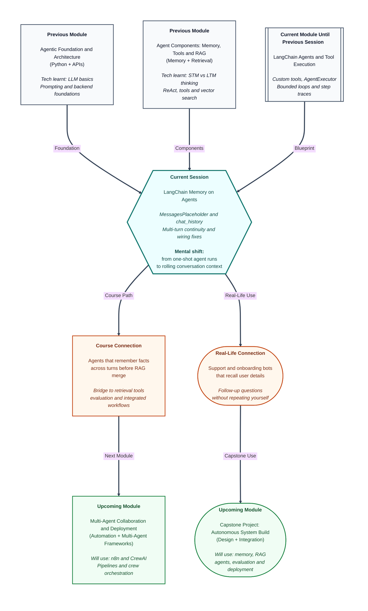

```mermaid
%%{init: {"diagramPadding": 24, "flowchart": {"htmlLabels": true, "nodeSpacing": 90, "rankSpacing": 110, "curve": "basis", "padding": 20}, "theme": "base", "themeVariables": {"fontFamily": "Arial", "fontSize": "15px", "lineColor": "#334155"}}}%%
flowchart TB
    subgraph FOUNDATION[" "]
        direction LR
        M1["&nbsp;&nbsp;<b>Previous Module</b>&nbsp;&nbsp;<br/><br/>Agentic Foundation and Architecture<br/>(Python + APIs)<br/><br/><i>Tech learnt: LLM basics<br/>Prompting and backend foundations</i>"]
        M2["&nbsp;&nbsp;<b>Previous Module</b>&nbsp;&nbsp;<br/><br/>Agent Components: Memory, Tools and RAG<br/>(Memory + Retrieval)<br/><br/><i>Tech learnt: STM vs LTM thinking<br/>ReAct, tools and vector search</i>"]
        CM[["&nbsp;&nbsp;<b>Current Module Until Previous Session</b>&nbsp;&nbsp;<br/><br/>LangChain Agents and Tool Execution<br/><br/><i>Custom tools, AgentExecutor<br/>Bounded loops and step traces</i>"]]
    end

    CURRENT{{"&nbsp;&nbsp;<b>Current Session</b>&nbsp;&nbsp;<br/><br/>LangChain Memory on Agents<br/><br/><i>MessagesPlaceholder and chat_history<br/>Multi-turn continuity and wiring fixes</i><br/><br/><b>Mental shift:</b><br/>from one-shot agent runs<br/>to rolling conversation context"}}

    subgraph VALUE[" "]
        direction LR
        COURSE["&nbsp;&nbsp;<b>Course Connection</b>&nbsp;&nbsp;<br/><br/>Agents that remember facts<br/>across turns before RAG merge<br/><br/><i>Bridge to retrieval tools<br/>evaluation and integrated workflows</i>"]
        REAL(["&nbsp;&nbsp;<b>Real-Life Connection</b>&nbsp;&nbsp;<br/><br/>Support and onboarding bots<br/>that recall user details<br/><br/><i>Follow-up questions<br/>without repeating yourself</i>"])
    end

    subgraph FUTURE[" "]
        direction LR
        M4["&nbsp;&nbsp;<b>Upcoming Module</b>&nbsp;&nbsp;<br/><br/>Multi-Agent Collaboration and Deployment<br/>(Automation + Multi-Agent Frameworks)<br/><br/><i>Will use: n8n and CrewAI<br/>Pipelines and crew orchestration</i>"]
        M5(["&nbsp;&nbsp;<b>Upcoming Module</b>&nbsp;&nbsp;<br/><br/>Capstone Project: Autonomous System Build<br/>(Design + Integration)<br/><br/><i>Will use: memory, RAG<br/>agents, evaluation and deployment</i>"])
    end

    M1 ==>|&nbsp;Foundation&nbsp;| CURRENT
    M2 ==>|&nbsp;Components&nbsp;| CURRENT
    CM ==>|&nbsp;Blueprint&nbsp;| CURRENT
    CURRENT ==>|&nbsp;Course Path&nbsp;| COURSE
    CURRENT ==>|&nbsp;Real-Life Use&nbsp;| REAL
    COURSE ==>|&nbsp;Next Module&nbsp;| M4
    REAL ==>|&nbsp;Capstone Use&nbsp;| M5

    classDef previous fill:#f8fafc,stroke:#475569,stroke-width:2px,color:#0f172a
    classDef current fill:#ecfeff,stroke:#0f766e,stroke-width:3px,color:#134e4a
    classDef value fill:#fff7ed,stroke:#c2410c,stroke-width:2px,color:#7c2d12
    classDef future fill:#f0fdf4,stroke:#15803d,stroke-width:2px,color:#14532d

    class M1,M2,CM previous
    class CURRENT current
    class COURSE,REAL value
    class M4,M5 future

    style FOUNDATION fill:transparent,stroke:transparent
    style VALUE fill:transparent,stroke:transparent
    style FUTURE fill:transparent,stroke:transparent
    linkStyle default stroke:#334155,stroke-width:3px
```
