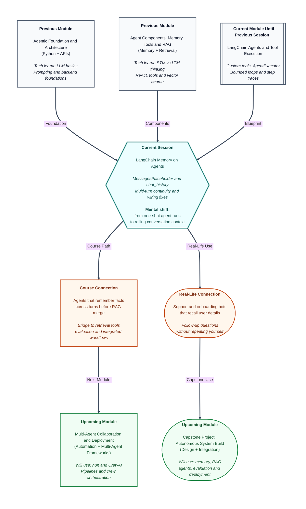

# Pre-read: LangChain Memory on Agents

## Context of This Session in the Course

---

You book a train ticket on a travel app. In the first message you say: *"I am travelling with my mother. She needs a lower berth."* The assistant confirms and asks for your travel date.

Five minutes later you type: *"Can you add meal preference for both of us?"*

You expect the app to still know there are **two passengers**, that one is your **mother**, and that **lower berth** was already discussed. You do not want to repeat the whole story from scratch.

Now imagine the same app powered by an **AI agent** that can call tools — check seat availability, fetch fare rules, apply discounts. In the **previous session**, you built exactly that kind of agent: it can pick tools, run them in a loop, and stop safely when the job is done.

But here is the uncomfortable question: **what if every new message starts a blank slate?** The agent might still call the right tools for *this* sentence, yet have no idea who "both of us" refers to. It might suggest a general meal plan instead of one suited for two travellers with the constraints you already shared.

That is not a tool problem. That is a **memory** problem — and it is one of the most common reasons real assistants feel brilliant in a demo and frustrating in daily use.

## When a Powerful Agent Still Feels Forgetful

A **stateless agent** treats each user message as if it were the first message of the day. The model sees your latest question, maybe a fixed system instruction, and whatever tools you gave it — but not the conversation that happened five minutes ago.

For a single-shot task — *"What is 18% GST on ₹4,200?"* — that is fine. The entire request lives in one message.

For **multi-turn work**, statelessness breaks down quickly:

- Turn 1: *"My employee ID is E-4471. I need leave from 12 June."*
- Turn 2: *"Will that overlap with the company shutdown week?"*
- Turn 3: *"Draft a short mail to my manager using the dates we discussed."*

Turn 3 only makes sense if the agent still holds Turn 1 and Turn 2 in mind. Without that rolling context, you get generic answers, wrong assumptions, or repeated questions that annoy users.

You already studied **why memory matters** for agents in an earlier module — short-term versus long-term memory, context windows, and strategies like keeping a sliding window of recent messages. Today's session is where that idea meets your **LangChain agent executor**: not theory alone, but **how to wire conversation history** so each new invocation can see what came before.

The goal is **context continuity**: later turns should depend on facts the user supplied earlier, without asking them to copy-paste their own chat log every time.

## Rolling History on an Executor-Based Agent

Your LangChain agent runs inside an **executor** — a managed runner that handles tool loops, iteration limits, and traces. Each time the user sends a message, you trigger a new run of that executor.

The design question is: **what extra information travels into each run?**

LangChain solves this with a familiar pattern:

- Extend the agent's **prompt template** with a reserved slot for past messages — a **MessagesPlaceholder** (think of it as an empty chair in the prompt where previous chat lines will sit).
- Maintain a **chat history** list outside the model — your application's notebook of what the user and assistant already said.
- On every turn, **append** the new user message, pass the growing history into the placeholder, let the agent work, then **append** the assistant's reply back into the list for the next turn.

A **multi-turn script** is simply a controlled conversation you run step by step — Turn 1, Turn 2, Turn 3 — so you can prove the agent remembered a name, a date, or a preference from an earlier turn when answering a later one.

This is different from stuffing everything into one giant prompt by hand. The framework gives you a repeatable way to attach **rolling conversational context** across invocations while keeping the same agent and tools you already built.

When history is wired correctly, answer quality changes in visible ways: follow-up questions get sharper, pronouns resolve naturally, and tool calls can use earlier facts (for example, looking up leave policy *for the dates already mentioned*).

When history is wired incorrectly — placeholder missing, history not passed, messages appended in the wrong order, or history reset by mistake — the agent looks "broken" even though tools and the model are fine. Part of this session is learning to **spot and fix** those representative wiring defects instead of blaming the model.

You will also learn to **justify when memory is worth the complexity**. Not every agent needs full chat history on every turn. Sometimes a stateless baseline is enough. The skill is comparing both behaviours on the same questions and explaining the difference with evidence, not gut feeling.

## Think of a Clinic Visit File on the Reception Desk

Picture a neighbourhood clinic where the receptionist keeps a **thin file folder** for each patient who walks in the same day.

When you arrive, they write your name, symptoms, and any allergies on the top sheet. Each time you return to the desk — after the nurse visit, after the lab report — they **add a line** to the file instead of starting a new blank form. When the doctor is ready, they open the folder and see the **whole story so far**, not just your latest sentence.

The **MessagesPlaceholder** is that empty section in the doctor's briefing template labelled *"Earlier conversation today."* The **chat history** is the stack of sheets in the folder. **Appending messages** is the receptionist adding each new note after you speak and after the doctor replies.

The **agent executor** is still the clinic's standard process for routing you — maybe to billing, maybe to the lab — but now every routing decision can respect what was already said at the desk.

If someone throws away the folder between your second and third visit, the process still "works," but you feel like the staff forgot you. That is what a stateless agent feels like to users.

## What You Will Explore

In this pre-read, you'll discover:

- **Understand** why executor-based agents need explicit conversation history, not just a clever model.
- **Discover** how a prompt placeholder and a growing message list create continuity across turns.
- **Learn** how to run and inspect a multi-turn conversation where later answers depend on earlier facts.
- **Recognise** common history-wiring mistakes and when memory actually improves answers versus a stateless baseline.

## What You Will Be Ready To Do

After this session, you will be able to connect ideas you already know — agent loops, tools, traces — with **conversation memory** in LangChain.

You will be ready to:

- Extend an agent prompt so it admits **rolling chat history** on every invocation.
- Run a **multi-turn script** and show that follow-up questions use facts from earlier turns.
- **Diagnose** typical defects when history is missing, empty, or passed incorrectly to the executor.
- **Compare** the same user questions with and without history and explain which cases benefit from memory.
- Prepare for upcoming work where **retrieval**, **tools**, and **memory** must work together in one agent — because real products rarely need only one of these.

## Why This Matters Beyond the Classroom

HR onboarding bots, bank support assistants, and internal IT helpdesks all live on **follow-up questions**. Users do not speak in perfect, self-contained paragraphs. They reveal information in pieces: name first, problem second, urgency third.

Teams that ship agents without history often hear: *"I already told you that."* Teams that wire history well sound attentive and save time for both user and company.

Memory also has a cost — more tokens, more care about what to keep, and more testing. Responsible builders do not turn memory on everywhere; they measure whether it changes outcomes on realistic dialogues. That disciplined comparison is part of professional agent development, and you will practise it here.

Once conversation history sits naturally beside your executor and tools, the upcoming topics — grounding answers with documents, combining retrieval tools with chat memory, running evaluation packs — will feel like **adding rooms to a house whose foundation you already laid**, not starting over each week.

## Questions To Carry Into the Session

- A user says *"Call me Ankit"* in the first turn and *"Book the same slot we discussed for me and my sister"* in the third. What should the agent know without being told again — and what breaks if **chat history** never reaches the prompt placeholder?
- You run the same agent twice on identical final questions: once **with** rolling history and once **stateless**. For which types of questions would you expect a dramatic quality gap, and for which would you expect almost no difference?
- If tool traces look perfect but the agent keeps asking for information the user already gave, what are the first three **wiring checks** you would make before changing the model or the tools?
- In a long conversation, is it always better to pass **every** past message, or might a shorter rolling window sometimes be enough — and how would you justify that choice to a teammate?
