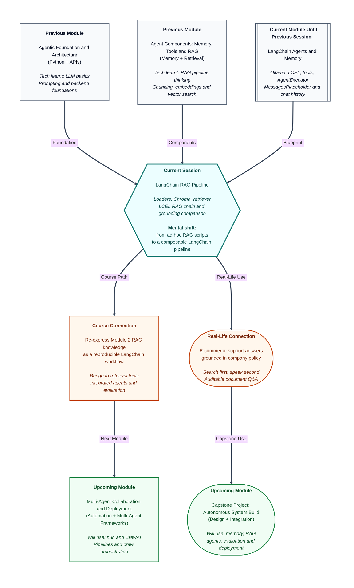

# Pre-read: LangChain RAG Pipeline

## Context of This Session in the Course

---

You contact an **online store's customer support** about a return. The agent replies instantly: **"You have 7 days to return any item."** You mention your order was placed three weeks ago. They change the story: **"Returns are accepted within 30 days."** You ask about **refund to UPI** — they describe a detailed UPI process even though your receipt shows you paid by card.

Nothing about the conversation felt malicious. The assistant simply **never opened the company's policy folder**. It answered from **general memory** — the kind of plausible-sounding text language models produce when they have no official document in front of them. That failure — confident answers with **no traceable source** — is exactly what **Retrieval-Augmented Generation (RAG)** was designed to prevent.

In an **earlier module**, you already built this idea for an **e-commerce support scenario**: load **returns, shipping, warranty, and refund policies**; **split** long PDFs into searchable **chunks**; store **embeddings** (meaning-based fingerprints of text) in a **vector database**; retrieve the best-matching passages; and generate answers **conditioned on what was retrieved**. In the **previous session**, you wired **conversation memory** into a LangChain agent so follow-up questions could reuse facts from earlier turns.

Today you bring those two worlds together inside **LangChain** itself — not as scattered scripts, but as one **composable pipeline** you can run, rerun, and **evaluate** for **grounding quality** (whether the answer actually follows retrieved policy text).

---

## When Smart Agents Still Guess Instead of Looking Up

Picture the same **e-commerce assistant** after the **previous session**. A customer says: **"My order #8821 arrived damaged. What are my options?"** Memory works — the agent remembers **#8821** when the user later asks **"And who pays return shipping?"**

But if the agent has **no retrieval step**, it may still invent shipping rules from thin air. Memory tells it **which order** you mean; it does not tell it **what your company's refund policy says**.

Or consider the opposite problem: you **did** build retrieval in Module 2, but every teammate runs a **slightly different script** — different chunk sizes, different storage paths, no shared way to compose **load → embed → retrieve → generate**. Demos work on one laptop and break on another. That is a **framework** problem — and **LangChain** is the framework this module uses to keep RAG **reproducible** and **inspectable**.

The live session expresses your prior RAG knowledge as a **LangChain retrieval-augmented answering pipeline** with **evaluable grounding behaviour** — meaning you can **compare answers with retrieval versus without**, using clear criteria, and see the difference in black and white.

---

## The challenge we will tackle

What if you had **dozen policy PDFs and text files** from the e-commerce corpus you designed in Module 2 — but needed to **ingest and segment** them through **LangChain document loaders** so every run starts from the same source material?

What if embeddings had to be **persisted in Chroma through LangChain** — so closing your notebook and reopening it tomorrow still hits the **same index**, not a blank library?

What if the full flow — **retrieve relevant passages, assemble context, generate an answer** — had to be expressed as one **LCEL chain** (LangChain Expression Language — the pipe-based way of linking steps: output of one stage feeds the next)?

What if a stakeholder asked: **"Prove this bot reads policy before it speaks"** — and you had to run **representative customer queries** twice, **with and without retrieval**, and **critique grounding quality** using instructor-supplied comparison criteria?

These are the practical questions today's session answers. You are not relearning RAG from zero — you are **repackaging** what you already know into LangChain's **loaders, retriever, vector store, and chain composition** so the pipeline is ready to plug into agents and evaluation harnesses in **upcoming** work.

---

## The railway enquiry counter — with a standard operating procedure

Return to a familiar picture: a **railway enquiry counter**. A traveller asks **"Which platform is the Dehradun Shatabdi?"** A good clerk **looks at the live display board** — the official list — and only then speaks. If the train is not listed, they say so instead of guessing.

Now imagine the **railway authority publishes a standard procedure** every clerk must follow:

1. **Load** today's timetable sheets into the desk tray (**document loaders** — pull text from files into a uniform format).
2. **Cut** long timetables into **platform-sized cards** with overlap so no train name gets split awkwardly (**chunking** — same design thinking you applied to policy documents in Module 2).
3. **File** the cards in a **sort-by-meaning cabinet** (**Chroma** vector store — embeddings persisted so search stays stable across shifts).
4. When a question arrives, **pull the best-matching cards** (**retriever** — top passages for the query).
5. **Read those cards aloud while answering** (**LCEL RAG chain** — generation conditioned on retrieved text).

**LCEL** is the **numbered procedure on the wall** that connects those steps with pipes: each stage's output becomes the next stage's input, in a fixed, readable order. Without that procedure, every clerk improvises — some skip the cabinet, some read from memory, some paste random paragraphs. **Grounding comparison** is the **audit**: run the same question **with the display board** and **without it**, side by side, and score which answer a supervisor would trust.

---

## What the LangChain RAG pipeline adds to your Module 2 work

You already understand the **RAG story** at a conceptual level: **query → retrieve → augment prompt → generate**. Today's focus is **implementation discipline inside LangChain**.

| Piece | Role in everyday terms |
|---|---|
| **Document loaders** | Bring policy PDFs and text files into LangChain as structured documents — the first step of every pipeline run |
| **Chunking** | Split large policies into searchable pieces, aligned with the **corpus design** you established in Module 2 (size, overlap, metadata such as policy type) |
| **Embeddings + Chroma** | Turn chunks into vectors and **persist** them so retrieval is **reproducible across runs** — same index tomorrow as today |
| **Retriever** | Given a customer question, fetch the most relevant policy passages from Chroma |
| **LCEL RAG chain** | Wire retriever + prompt template + language model into one composable chain — the LangChain-native version of your end-to-end flow |
| **Grounding comparison** | Run the **same queries** with retrieval **enabled versus disabled** and judge accuracy, refusal behaviour, and faithfulness to policy |

**Critique grounding quality** does not mean vague opinion. It means applying **comparison criteria** — Does the answer cite policy content that was actually retrieved? Does it refuse when no relevant passage exists? Does the **without-retrieval** baseline hallucinate rules that contradict your documents? That disciplined contrast is how professional teams prove RAG is worth the engineering effort.

This pipeline sits **beside** the agent memory you built in the **previous session**. Memory handles **"what did we already discuss in this chat?"** Retrieval handles **"what do official documents say?"** **Upcoming** sessions merge both inside an **integrated LangChain agent** with retrieval tools — but today's job is to make the **document pipeline** solid on its own first.

---

In this pre-read, you'll discover:

- **Why** conversation memory alone cannot fix policy guessing — and how a **LangChain RAG pipeline** grounds e-commerce answers in your Module 2 document corpus
- **How** to **ingest and segment** documents using **LangChain loaders and chunking** aligned with your established corpus design
- **How** to **embed and persist** vectors in **Chroma through LangChain** so retrieval stays **reproducible across runs**
- **How** to construct an **LCEL retrieval-augmented answering chain** that conditions generation on retrieved passages
- **How** to **critique grounding quality** by contrasting outputs **with versus without retrieval** on representative queries

---

## Words you will hear — explained right away

- **Document loader:** A LangChain component that **reads** files (PDF, text, web pages) and converts them into documents the pipeline can process.
- **Chunking:** Splitting long policy text into **smaller segments** so search can find the right paragraph, not an entire 40-page PDF at once.
- **Chroma:** A **vector database** that stores embeddings and returns semantically similar chunks for a query — persisted so indexes survive between runs.
- **Retriever:** The pipeline piece that **searches** the vector store and returns the best-matching passages for a user question.
- **LCEL (LangChain Expression Language):** The **pipe-based composition** pattern that links prompt, retriever, model, and parsers into one runnable chain.
- **RAG chain:** The full linked flow: **retrieve context → build prompt with that context → generate answer**.
- **Grounding:** Tying the model's answer to **retrieved evidence** instead of free-form guessing — answers should follow supplied policy text.
- **Grounding comparison:** Running the **same questions** with retrieval **on and off** to measure how much retrieval improves accuracy and reduces hallucination.

---

## What you will be ready to do

After this session, you will be able to:

- **Ingest and segment** your e-commerce policy corpus using **LangChain loaders and chunking** consistent with Module 2 design choices
- **Embed and persist** vectors in **Chroma through LangChain** so teammates and future-you get the **same retrieval behaviour** every run
- **Build an LCEL RAG chain** that retrieves passages and **conditions generation** on them before answering customer-style questions
- **Run a grounding comparison** — with versus without retrieval — on representative queries using **instructor-supplied criteria**
- **Explain** which failure modes remain (weak chunks, wrong top-k, missing metadata) before merging this pipeline into an **agent with memory and tools** in **upcoming** work
- **Connect** today's pipeline to the **RAG architecture** you studied in Module 2 — same mental model, stronger engineering wrapper

---

## Why this matters beyond the classroom

Policy assistants, HR handbooks, insurance claim bots, and internal IT runbooks all share one rule: **look up first, speak second**. Companies that ship plain chatbots without retrieval often face **compliance risk** — answers sound official but contradict written policy. Companies that ship RAG without **evaluation** discover problems only after customers complain.

LangChain does not replace RAG thinking; it **standardises** the plumbing so your team can swap models, tune chunking, and attach the same retriever to an agent executor without rewriting everything from scratch. That maintainability is why this session sits between **memory on agents** and **integrated retrieval tools** — you are building the **document engine** the agent will call next.

---

## Questions to carry into the session

1. A customer asks **"How many days do I have to return a damaged item?"** You run the question through your pipeline **with retrieval** and get **"30 days with original packaging."** You run it **without retrieval** and get **"7 days from purchase."** Which answer would your Module 2 policy corpus support — and what **grounding criterion** would you use to mark the without-retrieval reply as failed?

2. Two teammates chunk the same returns policy differently: one uses **large chunks** (whole sections), one uses **small chunks with overlap** (paragraph-sized). The second teammate retrieves the exact **"30 days"** sentence reliably; the first often retrieves a chunk about **packaging only**. How does this connect to **Module 2 chunking decisions** — and what would you change before blaming the language model?

3. You close your laptop, reopen the project tomorrow, and retrieval returns **nothing** — Chroma was not **persisted** through LangChain. Meanwhile, your agent from the **previous session** still remembers yesterday's chat history. Why are **memory** and **retrieval persistence** separate problems — and which one does today's session solve?

Keep these questions in mind. The session turns your **Module 2 RAG intuition** into a **LangChain pipeline you can run, rerun, and defend** — one enquiry counter that always checks the display board before it speaks.
