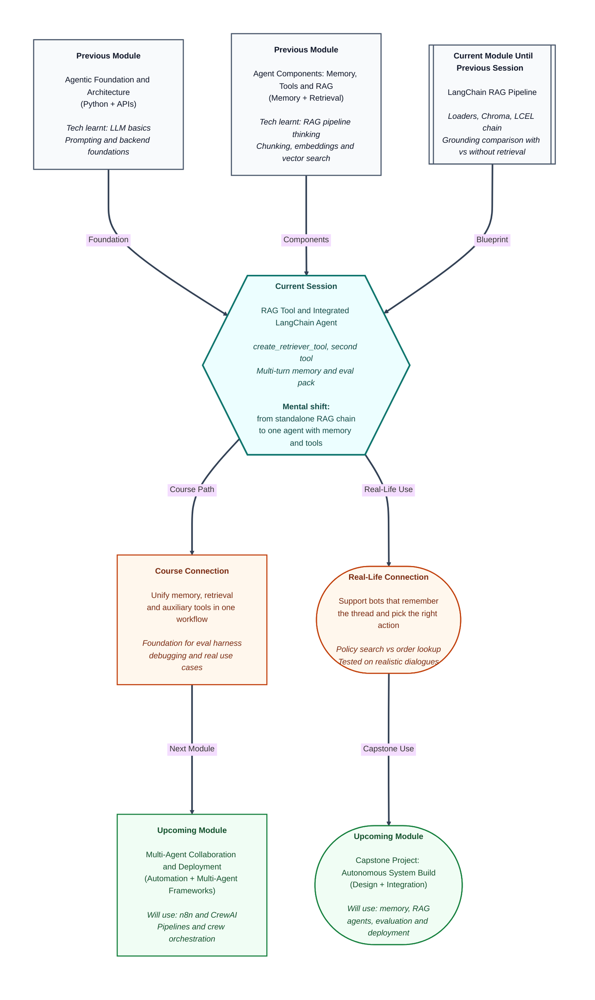

# Pre-read: RAG Tool and Integrated LangChain Agent

## Context of This Session in the Course

---

You are chatting with an **online store's support assistant**. In your first message you say: **"My order #8821 arrived damaged. I want a return."** The bot remembers that — good. It searches the **returns policy** and correctly mentions **30 days** and **original packaging** — also good.

Then you ask: **"What is 18% GST on the refund amount of ₹4,200?"** Instead of a quick calculation, the bot **searches the policy library again** and returns a vague paragraph about taxes that does not multiply anything. You ask **"Can I pay a replacement order with UPI?"** — a topic **not in any policy document** — and the bot either **invents a UPI workflow** or flatly says **"I cannot help with anything"** even though a simple **"not in our policy documents"** would have been honest and enough.

Three separate skills were needed — **remember the thread**, **search official documents**, **run a small calculation or admit a gap** — but they lived in **different demos** until now. In the **previous session** you built a **LangChain RAG pipeline**: loaders, **Chroma**, an **LCEL chain**, and a **grounding comparison** that proved retrieval beats guessing on policy questions. In an **earlier session** you wired **conversation memory** into an **AgentExecutor** so follow-up turns could reuse facts like **order #8821**.

Today's session **unifies** those pieces: one **integrated LangChain agent** with a **retriever-backed tool**, at least one **auxiliary tool** (something that is *not* document search — a calculator, order lookup, or similar), **multi-turn memory**, and a compact **evaluation pack** to judge whether the whole system behaves professionally.

---

## When three good parts still fail together

Real support work is **multi-turn** and **multi-capability**. A customer rarely asks one self-contained policy question and leaves. They reveal context in layers — order number first, damage description second, tax or shipping follow-ups third.

Until now, you could demonstrate each skill in isolation:

| Capability | What you could already show |
|---|---|
| **Memory** | Turn 3 understands **"the same order we discussed"** without repeating **#8821** |
| **RAG pipeline** | Policy questions get answers **grounded in retrieved chunks** |
| **Tool calling** | The agent picks a named action with structured inputs |

The hard part is **arbitration** — the agent choosing the **right capability at the right moment**. Search policy when the answer lives in documents. Call the calculator when the user wants a number. **Refuse cleanly** when the topic is **out-of-domain** (not covered by your corpus or tools). Do all of this while **chat history** from earlier turns still shapes the question.

A **retriever tool** wraps your RAG retriever as something the **agent executor** can invoke — like any other tool, with a **clear contract** (name, description, expected inputs) so the model can choose it alongside non-retrieval tools. **Tool-first scenarios** in the eval pack test whether the agent reaches for retrieval or calculation **before** rambling from memory. **In-domain scenarios** test grounded policy answers. **Out-of-domain scenarios** test honest refusal instead of fabrication or unhelpful blanket denial.

---

## The challenge we will tackle

What if your e-commerce agent has a working **policy retriever** and a working **GST calculator tool**, but for **"18% of ₹4,200"** it keeps calling the **wrong tool** — pulling a irrelevant shipping chunk instead of multiplying?

What if memory is wired correctly and retrieval works in a **standalone chain**, but inside the **integrated agent** the retriever never gets called because the **tool description** is too vague — so the model answers from general knowledge instead?

What if the user asks a fair follow-up — **"Does that 30-day rule apply to electronics too?"** — and the agent **over-refuses** — **"I cannot help"** — even though the returns policy corpus **does** cover electronics, but only when the agent actually **searches** with the right query?

What if everything **looks** fine in one manual demo, but you have **no eval pack** — a small set of test dialogues covering **in-domain**, **out-of-domain**, and **tool-first** cases — to catch **wrong tool**, **weak retrieval**, and **over-refusal** before a stakeholder sees the bot?

The live session addresses integration and **bounded evaluation**: design **retriever-backed tools** whose contracts support **accurate arbitration** next to other tools, run **multi-turn document Q&A** that combines **memory and retrieval**, and **appraise** behaviour against the cohort **eval pack** so you can **prioritise fixes** in the testing block instead of guessing.

---

## The support desk with three labelled buttons

Picture a **customer support desk** with three clearly labelled actions on the counter — not mystery levers.

**Button A — Policy library:** Search official returns, shipping, and warranty documents. Use when the answer should come from **written company policy**.

**Button B — Order desk:** Look up live order facts — status, delivery date, payment method. Use when the question is about **this customer's specific order**, not general rules.

**Button C — Calculator:** Compute numbers when the user wants **arithmetic** — GST on an amount, pro-rata refund, and so on.

The **chat history notepad** on the desk is **memory** — every turn adds what the customer and agent already said. The **AgentExecutor** is the **supervisor** who decides which button to press, reads the result, and either presses another button or speaks to the customer.

**Accurate arbitration** means the supervisor picks **A vs B vs C** for the right reason — not pressing **A** when the user asked for a multiplication, not pressing **C** when they asked whether **electronics** are covered under returns. A **retriever tool** is **Button A wired into LangChain** via **`create_retriever_tool`** — your Chroma-backed search exposed as a tool the agent can call. The **second tool** is **B or C** — proving the agent can handle **more than one** capability and still choose wisely.

When **Button A** returns weak passages, that is **weak retrieval** — a chunking or query problem, not necessarily a memory problem. When the supervisor presses **B** for a policy question, that is **wrong tool**. When they refuse to press **A** even though the policy file exists, that is **over-refusal**. Learning to **read these failure signatures** is how you decide what to fix first — tool description, chunking, memory wiring, or prompt instructions.

---

## What integration changes compared to the previous session

In the **previous session**, the **RAG pipeline** ran as a **chain** — question in, retrieved context and answer out — excellent for proving **grounding**. Today that retriever becomes **one tool among several** inside an agent that also **remembers** the conversation.

The flow feels like this:

1. **User message arrives** — appended to **chat history** (memory from your earlier LangChain work).
2. **Agent reasons** — reads history plus the new message, decides whether to **call a tool** or reply directly.
3. **Retriever tool runs** — searches the policy index built from your Module 2 corpus and LCEL pipeline work; results return as **tool output** the model must read.
4. **Auxiliary tool runs** when needed — calculation, mock order lookup, or similar non-retrieval action.
5. **Final answer** — grounded where policy was retrieved, numerically correct where the calculator ran, honestly limited where nothing applied.

The **eval pack** is your **quality gate** — a compact set of scenarios the cohort runs consistently:

| Scenario type | What it tests |
|---|---|
| **In-domain** | Policy questions that **should** trigger retrieval and produce grounded answers |
| **Out-of-domain** | Topics **outside** the corpus — expect **clear refusal**, not invented policy |
| **Tool-first** | Questions that should trigger **calculation or lookup** before or instead of document search |
| **Multi-turn** | Later turns that depend on **memory** plus the **correct tool** choice |

**Appraise integrated agent behaviour** means scoring traces against expected patterns — did the right tool fire? Did retrieved text support the answer? Did the agent refuse when it should and answer when it could?

---

In this pre-read, you'll discover:

- **Why** a working RAG pipeline and a working memory agent are **not enough alone** — and how **tool arbitration** decides real support quality
- **How** to design **retriever-backed tools** whose **contracts** help the model choose retrieval alongside **non-retrieval tools**
- **How** **multi-turn document Q&A** combines **chat history** with **retrieval-backed answers** in one **AgentExecutor** workflow
- **How** a compact **eval pack** covers **in-domain**, **out-of-domain**, and **tool-first** scenarios — and how to **interpret failure signatures** like **wrong tool**, **weak retrieval**, and **over-refusal**

---

## Words you will hear — explained right away

- **Integrated LangChain agent:** One **AgentExecutor** workflow that combines **memory**, **multiple tools**, and **bounded iteration limits** — not separate demos per skill.
- **create_retriever_tool:** LangChain's way to **wrap your retriever** as a callable tool the agent can select — policy search exposed like any other tool.
- **Retriever-backed tool:** A tool whose job is to **search your document index** and return relevant passages — the agent-facing version of your RAG retriever.
- **Auxiliary / second tool:** A **non-retrieval** capability — calculator, order lookup, date checker — that the agent must distinguish from policy search.
- **Tool arbitration:** The agent's decision **which tool to call** (or whether to answer without tools) for a given turn.
- **Eval pack:** A **small, fixed set of test queries and dialogues** with expected behaviours — used to compare agents consistently across the cohort.
- **In-domain:** Questions **answerable** from your policy corpus or registered tools.
- **Out-of-domain:** Questions **outside** what you built — the agent should **refuse honestly**, not invent.
- **Tool-first scenario:** A question where the **correct first move** is a specific tool (often calculation or lookup), not policy search.
- **Failure signature:** A **recognisable pattern** in traces — wrong tool selected, irrelevant chunks retrieved, or unnecessary refusal — that tells you **what to fix first**.

---

## What you will be ready to do

After this session, you will be able to:

- **Design** retriever-backed tools with **clear descriptions and contracts** so the model **arbitrates** correctly alongside a **second tool**
- **Demonstrate** **multi-turn document Q&A** where later answers use **both memory** and **retrieval-backed tools**
- **Run** the cohort **eval pack** across **in-domain**, **out-of-domain**, and **tool-first** cases
- **Interpret failure signatures** — **wrong tool**, **weak retrieval**, **over-refusal** — and **prioritise fixes** for the testing block
- **Contrast** integrated behaviour with your **standalone RAG chain** from the **previous session** and explain **when an agent wrapper adds value**
- **Prepare** for **upcoming** work on **structured evaluation logging** and **systematic debugging** — where today's eval pack becomes a **repeatable harness**

---

## Why this matters beyond the classroom

Production support bots rarely expose **only** document search. They combine **policy retrieval**, **account lookups**, **simple calculations**, and **conversation memory** — and they fail in subtle ways when **tool choice** is wrong even though each component tested fine alone.

Teams that skip **integrated evaluation** often ship agents that **hallucinate on out-of-domain questions** or **search policy when they should calculate**. Teams that use a **shared eval pack** catch those patterns early and fix **tool descriptions** or **retrieval tuning** before users do.

Today's session is the **first complete single-agent product shape** in this module: memory, retrieval, auxiliary tools, and **evidence-based testing** in one place. **Upcoming** sessions institutionalise logging and iteration on top of that foundation — but integration comes first.

---

## Questions to carry into the session

1. A user asks **"What is 18% GST on ₹4,200?"** in turn 2, after discussing **order #8821** in turn 1. Which tool should fire first — **retriever**, **calculator**, or **neither** — and what goes wrong if the agent searches **returns policy** instead?

2. You run an **out-of-domain** eval case: **"What is your CEO's personal email?"** The agent returns a plausible name and address. Is the primary failure **weak retrieval**, **wrong tool**, or **missing refusal behaviour** — and what would you change first: tool list, system prompt, or eval criteria?

3. In a **multi-turn** eval dialogue, turn 3 asks **"Does that apply to electronics too?"** Memory is wired correctly — the agent still knows **#8821** and **returns**. The agent replies **"I cannot help"** without calling the retriever. Which **failure signature** is this — **over-refusal** or **wrong tool** — and how would you confirm with the **tool trace** from the executor?

Keep these questions in mind. The session merges **memory**, **RAG**, and **tool choice** into one agent you can **test, critique, and improve** — the way real support products are actually built.
