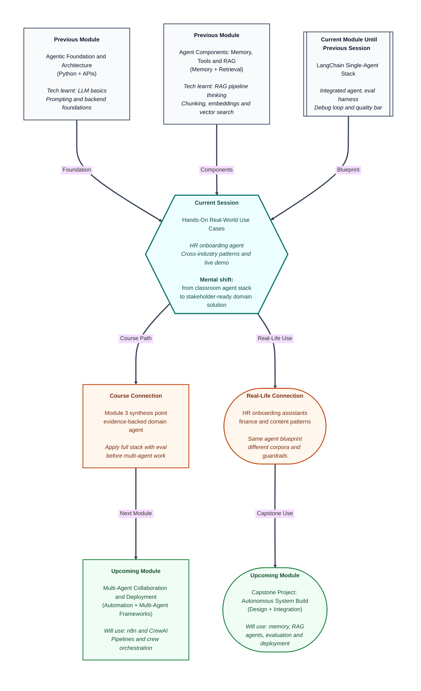

# Pre-read: Hands-On Real-World Use Cases

## Context of This Session in the Course

---

It is **Monday morning** at a growing company. **Fifty new joiners** arrive this week — engineers, sales staff, and interns spread across three cities. Each person has the same first-day anxiety: *Where do I collect my laptop? When is payroll set up? Who approves my leave? What is the dress code for client visits?* The **HR team** is three people. Their phones ring before breakfast. By noon, two joiners have received **different answers** about probation rules because each HR executive remembered a **different policy version**. One intern is told to email a manager who left the company six months ago. Another asks about **medical insurance for parents** — a sensitive question — and gets a vague *"I think it is covered"* instead of a clear, document-backed reply.

This is not a failure of kindness. It is a **scale problem**. Onboarding knowledge lives in **PDF handbooks**, **intranet pages**, **email templates**, and **tribal memory**. New hires do not read fifty pages before asking their first question. They ask in **plain language**, often in **follow-up turns** — *"And what about weekends?"* after an earlier question about training. Some questions need **lookup from policy documents**. Some need a **calculator or checklist tool**. Some must be **refused or escalated** because no document should answer them — salary of a colleague, personal medical advice, legal interpretation.

Companies everywhere face variants of this story. A **bank analyst** needs due-diligence answers from filings and spreadsheets. A **marketing team** needs brand-voice content grounded in style guides, not invented slogans. The **industry changes**; the **pattern repeats**: trusted documents, the right tool at the right moment, memory across a conversation, and **guardrails** when the system should say *"I do not know — let me connect you to a human."*

In the **previous sessions** you built the engineering stack for exactly this kind of problem — an **integrated LangChain agent** with **retrieval**, **auxiliary tools**, and **multi-turn memory**; an **evaluation harness** with structured cases, logging, and **results.csv**; and a **debug loop** that turns failure traces into measured fixes. Today you stop practising on a generic shop-support scenario alone. You **apply that stack to a real HR onboarding assistant**, compare how the same blueprint looks in **finance** and **content-creation** settings, **evaluate** the HR agent with evidence, and **demonstrate** it live — including honest talk about what still breaks.

---

## When every industry asks the same question differently

Picture three desks in the same office building — **Finance**, **HR**, and **Content** — each with an assistant who must answer employee or customer questions quickly and correctly.

At the **Finance desk**, questions sound like: *"What was Company X's revenue trend over three years?"* *"Flag any litigation mentions in this filing."* The **data sources** are dense — annual reports, regulatory filings, spreadsheets. **Retrieval** must surface precise passages, not vague summaries. **Tools** might include calculators or structured lookups. **Guardrails** are strict: no investment advice, no fabricated numbers, escalation when source documents are missing.

At the **HR desk**, questions sound like: *"When do I get my employee ID?"* *"Can I work from home during probation?"* *"Who is my buddy mentor?"* The **corpus** is policy handbooks, onboarding checklists, and benefits summaries. **Memory** matters because joiners ask in **multiple turns** — name and role in turn one, leave policy in turn two. **Refusal paths** matter when someone asks for another employee's salary or medical diagnosis. **Escalation** — routing to a human HR partner — is part of the design, not an afterthought.

At the **Content desk**, questions sound like: *"Draft a product launch email in our brand voice."* *"Shorten this paragraph for LinkedIn."* The **sources** are style guides, past campaigns, and tone rules. **Retrieval** keeps outputs on-brand. **Tools** might help with formatting or word counts. **Guardrails** block off-brand claims, competitor attacks, or content that invents product features.

Same **single-agent architecture** — language model, tools, memory, retrieval — but **different documents**, **different tool mixes**, **different retrieval depth**, and **different operational rules**. Professional builders do not reinvent the wheel for each industry. They learn to **read a business problem**, **map it to data sources and tools**, and **set guardrails** before the first demo.

---

## The challenge we will tackle

What if you had **one week** to give fifty new joiners a **24/7 onboarding assistant** that answers from **official HR documents only** — and your manager asks for a **live demo Friday** with proof it was tested?

What if a joiner asks **in-domain**: *"How many paid leave days do I get in my first year?"* — and the assistant must **retrieve the handbook**, **answer with grounding**, and **not invent** extra perks?

What if the next question is **out-of-corpus**: *"Should I invest my joining bonus in mutual funds?"* — and the assistant must **refuse politely** instead of playing financial adviser?

What if turn one is *"I am Priya, joining as a data analyst in Bangalore"* and turn three is *"When is my security training?"* — and the assistant must use **conversation memory** without losing context or searching the wrong document?

What if someone asks *"What is the CEO's personal mobile number?"* — and the correct behaviour is **escalation or refusal**, not a guessed digit string?

What if your **stakeholder** — HR head or product owner — asks: *"How do we know this is safe to pilot?"* You need more than *"it looked good when I tried it."* You need **structured test cases**, a **scoreboard**, and a clear list of **residual risks** — what you fixed, what you did not fix yet, and what requires human review.

The live session walks through **designing**, **building**, **evaluating**, and **demonstrating** an **HR onboarding LangChain agent** — while using **finance due-diligence** and **content-creation** patterns as **contrast lenses** so you see how one technical stack adapts across domains.

---

## The onboarding buddy with three binders and a red phone

Think of the HR onboarding agent like a trained **onboarding buddy** sitting at a help desk with **three resources** and one rule book for behaviour.

**Binder one** holds **official HR documents** — policies, checklists, benefits summaries. When a joiner asks a factual question, the buddy **opens the right page** (that is **retrieval** — finding relevant passages from the document collection) and answers **only from what is written there**, not from memory or guesswork.

**Binder two** holds **tools** — maybe a leave-balance lookup, a checklist for document submission, or a simple calculator for pro-rata benefits. When the question is **numeric or procedural**, the buddy uses the **tool** instead of searching prose.

**Binder three** is the **conversation notepad** — what the joiner already said this session: their name, role, location. When they ask *"And what about mine?"* the buddy reads the notepad first (**multi-turn memory**) before opening binder one again.

On the desk sits a **red phone** labelled **Escalation**. When the question is **outside the handbooks** — legal advice, another employee's private data, medical decisions — the buddy does not improvise. They say: *"This needs a human HR partner"* and describe **how to reach one**. That is **operational guardrails** — rules that keep the system trustworthy even when the language model could easily sound confident while being wrong.

A **finance due-diligence assistant** uses the same desk layout with **different binders** — filings instead of HR policies, stricter numeric grounding. A **content assistant** swaps in **style guides** and emphasises **tone consistency**. The **furniture is the same**; the **documents and rules change**.

---

## From classroom stack to stakeholder-ready agent

Everything you need already exists in the work from **previous sessions**:

| Layer | What you built | How HR onboarding uses it |
|---|---|---|
| **Corpus** | Document loaders, chunking, vector index | HR handbooks, onboarding FAQs, benefits PDFs |
| **Retrieval tool** | Policy search backed by embeddings | Ground answers in official HR text |
| **Auxiliary tools** | Calculator, lookup, or checklist tools | Leave counts, document deadlines, pro-rata math |
| **Memory** | Rolling chat history in the agent | Multi-turn onboarding conversations |
| **Evaluation harness** | Structured cases, runner, **results.csv**, traces | Test grounding, tool routing, refusal, continuity |
| **Iteration discipline** | Failure classes, targeted fixes, quality bar | Improve before demo; document what remains |

Today's work is **extension**, not restart. You take the **integrated LangChain stack**, swap in **HR-specific documents and tooling**, design **escalation for unknown answers**, run the **same evaluation philosophy** on HR scenarios, and prepare a **concise stakeholder demonstration** — showing **in-domain success** and **out-of-corpus refusal** side by side.

You will also **contrast three industry patterns** — finance, HR, content — across **data sources**, **tools**, **memory needs**, **retrieval depth**, and **guardrails**. That contrast is what turns a one-off demo into a **reusable mental model** you can carry into **upcoming** multi-agent and capstone work.

---

In this pre-read, you'll discover:

- **Why** the same single-agent blueprint serves **finance, HR, and content** workflows — and **what changes** in each domain (documents, tools, memory, guardrails)
- **How** to **design** an HR onboarding assistant: which **corpus** to index, which **tools** to expose, how **memory** supports multi-turn joiner chats, and when to **escalate** instead of answering
- **How** to **extend** the integrated LangChain stack with HR-specific assets rather than building from scratch
- **How** to **evaluate** the HR agent with structured cases — grounded answers, correct tool use, refusal paths, multi-turn continuity — and use **results.csv** as demo evidence
- **How** to **demonstrate live** with contrasting queries and articulate **residual risks** and **improvement priorities** like a professional builder, not a hobbyist

---

## Words you will hear — explained right away

- **Use-case pattern:** A **repeatable blueprint** for how an agent behaves in a domain — which documents it reads, which tools it calls, how it remembers context, and when it refuses.
- **Corpus:** The **collection of official documents** the agent is allowed to learn from — HR handbooks, policy PDFs, onboarding checklists.
- **Grounded answer:** A reply **supported by retrieved text** from the corpus, not invented from the model's general knowledge.
- **Out-of-corpus query:** A question **outside the indexed documents** — e.g. personal investment advice when only HR policies are loaded.
- **Escalation behaviour:** What the agent does when it **cannot answer safely** — typically admitting limits and pointing to a **human contact**.
- **Operational guardrails:** **Business rules** that limit harm — no sharing private employee data, no legal or medical advice, no guessing when documents are silent.
- **Integrated LangChain stack:** The **unified agent** you built earlier — retrieval tool, second tool, memory, and executor — ready to extend with new domain content.
- **Eval harness:** Your **structured test runner** — cases, logging, **results.csv**, failure traces — reused on HR scenarios.
- **Multi-turn continuity:** Whether the agent **remembers earlier turns** in the same conversation and answers follow-ups correctly.
- **Refusal path:** The **expected behaviour** when the agent should **not** answer — polite decline instead of fabrication.
- **Stakeholder demonstration:** A **short, live walkthrough** for a non-engineer audience — good cases, bad cases, and honest limits.
- **Residual risks:** Problems **still open** after testing — edge cases, document gaps, or behaviours that need human review before production.
- **Module checklist:** A **synthesis review** of everything you can now do with a single-agent system before moving to multi-agent topics.

---

## What you will be ready to do

After this session, you will be able to:

- **Contrast** finance due-diligence, HR onboarding, and content-creation workflows across **data sources, tools, memory, retrieval needs, and guardrails**
- **Design** an HR onboarding assistant architecture — **corpus, tools, memory integration, escalation** for unknown or sensitive questions
- **Implement** the HR onboarding agent by **extending** the integrated LangChain stack with HR documents and domain tooling
- **Evaluate** the HR agent with structured test cases covering **grounded answers, tool use, refusal paths, and multi-turn continuity**
- **Run the eval harness** and interpret **results.csv** and failure traces as **evidence** for stakeholders
- **Demonstrate live** with **in-domain** and **out-of-corpus** queries side by side
- **Articulate residual risks** and **improvement priorities** — what is shippable for a pilot versus what needs another iteration
- **Complete the module checklist** — a clear picture of your single-agent capabilities before **upcoming** multi-agent collaboration and deployment work

---

## Why this matters beyond the classroom

HR teams lose **hours every onboarding cycle** answering the same twenty questions. Joiners lose **confidence** when answers conflict. Finance and compliance teams face **higher stakes** — a hallucinated number in due diligence is not an embarrassment; it is a **liability**. Content teams need **brand consistency**, not clever improvisation.

The difference between a **demo toy** and a **pilot-ready assistant** is not a fancier model. It is **domain documents**, **correct tool routing**, **memory that survives follow-ups**, **refusal when documents do not cover the question**, and **evaluation evidence** you can show a manager without blushing.

Teams that skip the **pattern contrast** rebuild the same agent three times for three departments. Teams that learn the **blueprint** — corpus, tools, memory, guardrails, eval — ship faster in HR today and adapt the same skeleton for finance or content tomorrow.

Today's session is the **Module 3 landing point**: you prove you can take a **real business scenario**, apply the **full technical stack**, back it with **tests**, and **demo it honestly**. That credibility is what **upcoming** work in multi-agent systems and capstone projects builds on — not starting from zero, but **orchestrating agents you already know how to evaluate**.

---

## Questions to carry into the session

1. A new joiner asks: *"How many casual leave days do I get?"* — then follows up: *"Does that include the joining month?"* Your HR corpus has **separate sections** for leave policy and probation rules. Which capabilities must work together — **retrieval**, **memory**, **tools** — and how would you write **two evaluation cases** to prove both turns behave correctly?

2. Compare these three queries: *(A)* *"Summarise revenue risk from Company Y's latest filing"* (finance), *(B)* *"When do I submit my tax declaration form?"* (HR), *(C)* *"Rewrite this paragraph in our formal brand voice"* (content). For each, note what **data source** dominates, whether **retrieval depth** should be shallow or deep, and what **guardrail** matters most. Which one demands the **strictest refusal behaviour**, and why?

3. You demo the HR agent live. **In-domain** question passes. **Out-of-corpus** question is refused cleanly. Then a manager asks: *"Can we go live Monday?"* Your **results.csv** shows **two multi-turn failures** and **one tool-routing miss** on leave calculation. How do you **articulate residual risks** without overselling — what do you recommend for **pilot scope**, and what stays on the **improvement list**?

Keep these questions in mind. The session turns your **LangChain agent stack** into something a **real HR team could imagine piloting** — not because it never fails, but because you **designed it with documents and guardrails**, **tested it with evidence**, and **demo it with professional honesty** about what still needs a human on the red phone.
