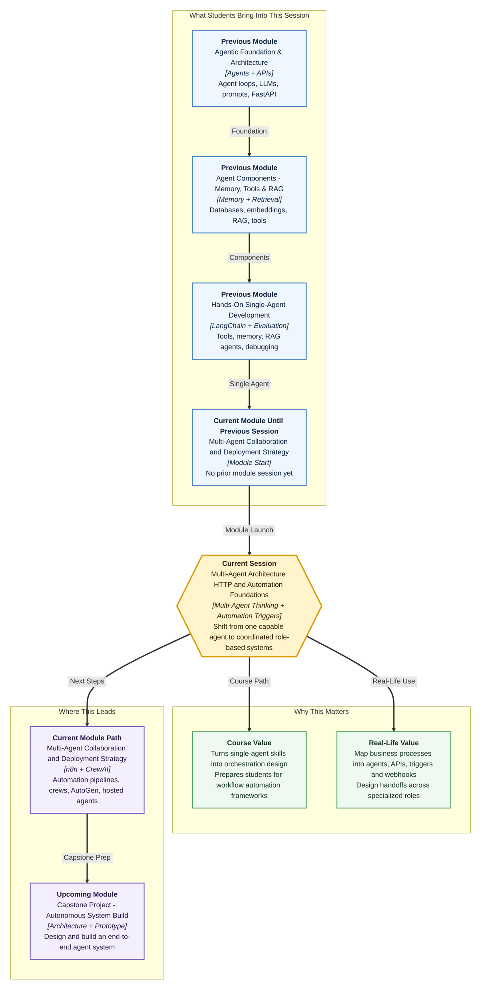

```mermaid
%%{init: {"flowchart": {"nodeSpacing": 70, "rankSpacing": 90, "diagramPadding": 24}} }%%
flowchart TB
  subgraph Foundation["What Students Bring Into This Session"]
    M1["<b>Previous Module</b><br/>Agentic Foundation & Architecture<br/><i>[Agents + APIs]</i><br/>Agent loops, LLMs, prompts, FastAPI"]
    M2["<b>Previous Module</b><br/>Agent Components - Memory, Tools & RAG<br/><i>[Memory + Retrieval]</i><br/>Databases, embeddings, RAG, tools"]
    M3["<b>Previous Module</b><br/>Hands-On Single-Agent Development<br/><i>[LangChain + Evaluation]</i><br/>Tools, memory, RAG agents, debugging"]
    CM["<b>Current Module Until Previous Session</b><br/>Multi-Agent Collaboration and Deployment Strategy<br/><i>[Module Start]</i><br/>No prior module session yet"]
  end

  CS{{"<b>Current Session</b><br/>Multi-Agent Architecture HTTP and Automation Foundations<br/><i>[Multi-Agent Thinking + Automation Triggers]</i><br/>Shift from one capable agent to coordinated role-based systems"}}

  subgraph Value["Why This Matters"]
    CV["<b>Course Value</b><br/>Turns single-agent skills into orchestration design<br/>Prepares students for workflow automation frameworks"]
    RV["<b>Real-Life Value</b><br/>Map business processes into agents, APIs, triggers and webhooks<br/>Design handoffs across specialized roles"]
  end

  subgraph Future["Where This Leads"]
    F4["<b>Current Module Path</b><br/>Multi-Agent Collaboration and Deployment Strategy<br/><i>[n8n + CrewAI]</i><br/>Automation pipelines, crews, AutoGen, hosted agents"]
    F5["<b>Upcoming Module</b><br/>Capstone Project - Autonomous System Build<br/><i>[Architecture + Prototype]</i><br/>Design and build an end-to-end agent system"]
  end

  M1 ==>|&nbsp;Foundation&nbsp;| M2
  M2 ==>|&nbsp;Components&nbsp;| M3
  M3 ==>|&nbsp;Single Agent&nbsp;| CM
  CM ==>|&nbsp;Module Launch&nbsp;| CS
  CS ==>|&nbsp;Course Path&nbsp;| CV
  CS ==>|&nbsp;Real-Life Use&nbsp;| RV
  CS ==>|&nbsp;Next Steps&nbsp;| F4
  F4 ==>|&nbsp;Capstone Prep&nbsp;| F5

  classDef previous fill:#eef6ff,stroke:#4b83c3,stroke-width:2px,color:#0f2540;
  classDef current fill:#fff4cc,stroke:#d99a00,stroke-width:3px,color:#2d2100;
  classDef value fill:#eefaf1,stroke:#4c9f63,stroke-width:2px,color:#16351f;
  classDef future fill:#f4efff,stroke:#7b61c8,stroke-width:2px,color:#261c45;

  class M1,M2,M3,CM previous;
  class CS current;
  class CV,RV value;
  class F4,F5 future;
  linkStyle default stroke-width:3px;
```
