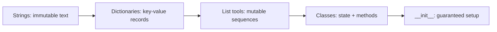

# Strings, Dictionaries & Classes

Picture every program you will write as a conversation between **what humans mean** (names, labels, records, “things” in the world) and **what Python can store** (typed values, fast lookups, objects with their own state). This session strings that arc together: **text** you can slice and clean without accidentally thinking you “edited” it in place, **dictionaries** that replace fragile “what was index 3 again?” with **keys that read like English**, a tight refresher on **list** tools you will keep reaching for next to those structures, and finally **classes**—blueprints for data **and** behavior, brought to life with **`__init__`** so each new object starts **coherent**, not half-built.

If you have ever concatenated a number into a message and met a `TypeError`, guessed the wrong index in a parallel list, or copy-pasted the same three variables through twenty functions because they “go together,” you already know why these topics share one session. Join us to trade scattered intuition for a **repeatable story**: strings for **immutable** text and useful methods; dictionaries for **semantic** storage and safe access patterns; lists as the **mutable** workhorse beside them; classes for **bundling** fields and methods; **`self`** and **`__init__`** for **instances** that stay independent even when they share one class definition. You will leave ready to read table-driven code and sketch small object models without reaching for ad-hoc dictionaries every time.

---

## Text as data: strings that do not rewrite themselves

**Strings** are ordered character sequences—Unicode in Python 3—created with quotes, joined with **`+`**, repeated with **`*`**, measured with **`len()`**. The mindset shift for this block is **immutability**: methods like **`strip`**, **`upper`**, **`replace`** do not “patch” the old text in memory; they yield **new** strings. That single idea prevents a whole class of bugs and explains why strings work well as **keys** and stable identifiers. You will also see the everyday polish: mixing quotes, multi-line literals, **`str()`** before gluing numbers into messages, and quick checks like **`startswith`** and membership. The goal is not to memorize every method—it is to recognize **text handling** as a first-class skill sitting underneath logs, prompts, file paths, and APIs.

---

## From positions to meaning: dictionaries as keyed records

**Lists** force you to remember **positions**; **dictionaries** let you store **labeled** fields—**keys** mapped to **values**—with fast average-time lookup backed by hashing (hence **keys must be hashable / immutable**: strings, numbers, tuples; not lists). We will build dicts with literals, **`dict()`**, **comprehensions**, and **`dict.fromkeys`**, and stress that **duplicate keys overwrite** silently—another sharp edge that rewards inspection.

The session then goes deep on **using** dictionaries well: **`d[key]`** when a missing key should be an error; **`.get(key, default)`** when absence is normal; **membership with `in`**; iterating **keys**, **values**, and **items**; and the **live view** behavior that surprises newcomers. You will see how to **add and update** entries (including **`update`**, **`setdefault`**, and modern merge styles), how to **remove** with **`del`**, **`pop`**, **`popitem`**, and **`clear`**, and how merges define **precedence** when two dicts share keys. Nested dicts get a nod as the bridge to JSON-like configuration and records—**shallow copy** intuition matters when you merge.

---

## Lists beside strings and dicts: the mutable sequence toolkit

Lists are **mutable sequences**: grow, shrink, sort **in place**, or use built-ins that return **new** sequences. The notes spotlight the distinction that trips people up—**`sorted(x)`** versus **`x.sort()`**—and the builtins you lean on in loops and data prep: **`enumerate`**, **`zip`**, **`reversed`**, **`sum`**, **`max`**, **`min`**. This block is deliberately compact: its job is to keep your **mental batteries** aligned so string formatting, dicts of rows, and object collections do not fight each other in the same notebook cell.

---

## Classes: blueprints, instances, and birth-day setup

A **class** is a **blueprint**; calling it like **`ClassName(...)`** **instantiates** an **object**—its own identity, its own attributes, shared methods. **Methods** take **`self`** as the first parameter so the body can say “**this** object’s balance,” not a global variable drifting through the program. That is how **`BankAccount`**-style examples keep deposits and withdrawals honest per customer while reusing one definition.

**`__init__`** is the **initializer** Python runs for you when an object is constructed: the right place to **require** inputs, set **defaults**, validate, or derive fields (like a salary from rate × hours). The session highlights the usual mistakes—forgetting **`self.`** on attributes, mis-indenting the class body—because constructor clarity is what turns OOP from syntax into **engineering**. You will also see **objects in collections** (lists of **`Product`** instances, and beyond), which is how small classes scale into **data models** instead of parallel lists.

---

## How the pieces reinforce each other

Strings often **label** dict keys and **serialize** pieces of state. Dicts often describe **one row** or **one config** before you promote the idea into a class when behavior clings to the data. Lists hold **many** of those rows or objects. **`__init__`** is where “this thing must always have X” becomes enforceable. Seeing all four in one session makes it easier to choose the **lightest** structure that still reads clearly—critical in a long lab block.

---

By the time we are in the room together, the vocabulary should feel **earned**, not memorized: **immutable** strings versus **mutable** lists; **hashable** keys; **`[]` vs `.get()`** as a **policy** choice; **`in`** for keys; **iteration** over **`items()`**; **`sorted` vs `sort`**; **class** as blueprint, **instance** as independent state; **`self`** as the handle on “this object”; **`__init__`** as **automatic, reliable** setup. Bring one tiny real-world record you have modeled badly before—a config dict that grew tentacles, or three parallel lists that had to stay synchronized—and we will pressure-test how strings, dicts, lists, or a short class would tame it. Those stories are what turn syntax into design, and they are welcome from the first minute.
