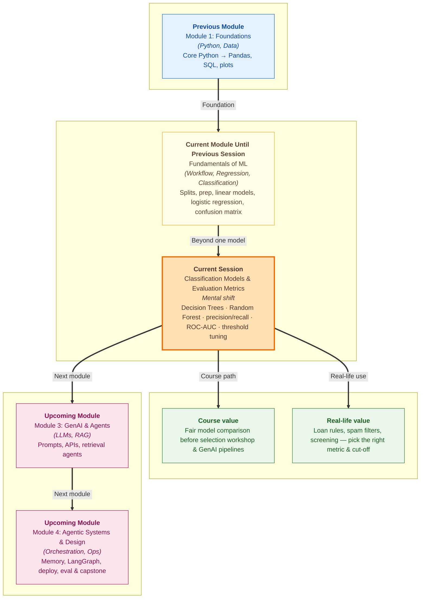

# Pre-read: Classification Models and Evaluation Metrics

Picture a bank branch on a busy Monday morning. Dozens of people walk in asking for a personal loan. The bank cannot read every detail of every life story by hand. So the officer follows a simple checklist: *Is monthly income above a certain level?* *Is the credit score healthy?* *Has the person missed payments before?* Each answer leads to the next question until a final decision appears — **approve** or **reject**.

That checklist feels human and readable. No one needs a maths degree to follow it. Now imagine your coaching institute has **400 students**, and you want to predict who will **pass** or **fail** the final exam before it happens. You already know how to build one type of model from the previous session — **Logistic Regression** — which gives a probability and a yes/no label. But what if you also want rules you can **draw on paper**? What if one model looks good on paper but misses the students who actually need help? What if two models both show **85% accuracy** but make completely different mistakes?

This is where the session takes a practical turn. You will meet models that think like flowcharts, teams of models that vote together, and a full toolkit to compare them fairly — not just with one headline number.

---

## Context of This Session in the Course

---

## When One Formula Is Not the Whole Story

In the previous session, you built **Logistic Regression** for pass/fail prediction. You read **probabilities**, applied a **threshold**, and opened the **confusion matrix** to see true positives, false positives, true negatives, and false negatives. You also saw why **accuracy alone** can mislead — for example, a model that always predicts Pass can look successful when most students pass anyway.

But real teams rarely stop at one model. A placement cell may ask: *Can we explain our decision in plain language?* A product team may ask: *Which inputs matter most — study hours, sleep, or distractions?* A risk team may ask: *If we use a different model, do we catch more fraud cases or create more false alarms?*

That is the challenge this session addresses. You need **readable rules**, **stronger combined models**, and **sharper ways to measure success** — so you can compare Logistic Regression, a tree, and a forest on the same student data and defend your choice with numbers that match the business problem.

---

## Decision Trees: Questions, Not One Long Formula

A **Decision Tree** works like the bank officer's checklist. The model learns a series of **if-else questions** from past data. *Is study time above 5 hours?* Go left or right. *Are distractions below 3?* Another split. At the end of each path sits a **leaf** — the final prediction, Pass or Fail.

Each part has a clear role:

| Part | What it does |
|---|---|
| **Root node** | The first question at the top |
| **Branch** | The path after Yes or No |
| **Internal node** | A follow-up question in the middle |
| **Leaf node** | The final answer |
| **Depth** | How many layers of questions — deeper trees can memorise training rows and fail on new students |

At every split, the tree tries to make each side as **pure** as possible — mostly Pass on one side, mostly Fail on the other. A score called **Gini impurity** measures how mixed a group is. Zero means one class only; 0.5 means an even 50/50 mix.

The trade-off is familiar: a very deep tree can **overfit** — it memorises noise from the training set and performs poorly on students it has never seen. Limiting **max depth** is like telling the officer, *"You may ask only four questions, not forty."* That keeps rules general enough to work on new cases.

---

## Random Forest: Ask the Crowd, Not Just One Expert

One tree can change its mind if you shuffle the training data slightly. **Random Forest** fixes that by training **many trees** and letting them **vote**.

Think of a cricket match prediction panel. You could trust one expert who might have a bad day. Or you could ask **100 experts**, each studying a slightly different sample of past matches and focusing on different stats. The majority answer — Pass or Fail — is usually more stable than any single opinion.

That idea has a name in machine learning: an **ensemble**. Each tree in the forest sees a random sample of students and a random subset of features at each split. Wrong trees get outvoted. The forest is harder to draw on paper than one tree, but it is often **more accurate and more stable** — a trade-off teams accept when prediction quality matters more than a pretty diagram.

---

## Beyond Accuracy: Precision, Recall, and the Dial You Can Turn

You will now compare three classifiers on the same student dataset: **Logistic Regression**, a **Decision Tree**, and a **Random Forest**. Accuracy — the share of correct predictions — is still useful, but two sharper questions often matter more.

**Precision** answers: *When the model says Pass, how often is it right?* Think of a spam filter. If it marks 20 emails as spam and 16 truly were spam, precision is 16 out of 20. High precision means fewer **false alarms** — important when wrong flags annoy users or block genuine messages.

**Recall** answers: *Of all students who truly passed, how many did the model catch?* Think of a cancer screening camp. If 100 patients need follow-up and the system finds 90, recall is 90%. High recall means fewer **missed cases** — critical when missing someone is dangerous.

Here is the catch: you cannot usually maximise both at once. Lowering the probability **threshold** — the cut-off that turns a score into Pass or Fail — tends to predict Pass more often. That raises recall but can lower precision. Raising the threshold does the opposite. Real teams pick the balance based on which mistake costs more.

**F1 score** combines precision and recall into one number. It stays low if either side is weak — so a model with perfect precision but terrible recall cannot hide behind a flattering average.

**ROC-AUC** asks a different question: *Does the model rank Pass students above Fail students before you fix a threshold?* An AUC near 1.0 means excellent separation; near 0.5 means no better than guessing. This helps when you want to compare models **before** choosing a cut-off — especially on imbalanced data where accuracy looks fine but ranking is poor.

Finally, **threshold tuning** is adjusting that cut-off without retraining. The same model, the same probabilities — a stricter threshold means fewer predicted Passes; a looser one catches more real Passes at the cost of more false alarms. A fraud team might say, *"We must catch at least 90% of fraud cases"* and then find the threshold that meets that recall goal, even if precision drops.

---

**In this pre-read, you'll discover:**

- **Understand** how Decision Trees turn data into readable if-else rules you can trace like a flowchart.
- **Discover** why Random Forest combines many trees by vote for stronger, stabler predictions.
- **Learn** how precision and recall answer different business questions — and why they trade off when you move the threshold.
- **Understand** how F1, ROC-AUC, and threshold tuning help you compare models fairly beyond a single accuracy number.

---

## What's Next

After this session, you should be able to discuss classification models with the confidence of someone who has seen more than one tool on the shelf. You will be able to:

- Trace a **Decision Tree** path for a student and explain why the model reached Pass or Fail.
- Compare a **single tree** and a **Random Forest** and say when explainability matters versus when stability matters.
- Choose whether **precision** or **recall** matters more for spam filters, loan alerts, or health screening.
- Explain why two models with the same accuracy can still be unequal — and use **ROC-AUC** to judge ranking quality.
- Describe how **threshold tuning** changes outcomes without rebuilding the model.

These skills matter in interviews, analytics reviews, and any project where the question is not just *"Is the model correct?"* but *"Correct in the way our users need?"*

---

## Questions to Explore in the Live Session

1. A student has **6 study hours** and **2 distractions**. The tree asks: *Is study time ≤ 4?* If No, then *Are distractions > 3?* — what is the final prediction, and can you walk through each branch?
2. Your spam filter must avoid marking important emails as spam, even if a few spam messages slip through. Your hospital screening system must not miss sick patients, even if more healthy people get called back. Which metric — **precision** or **recall** — matters more in each case, and why?
3. A model gives a student **P(Pass) = 0.55**. At threshold **0.5**, what label do you get? What changes if the team moves the threshold to **0.6** — and would that help or hurt recall?

Come ready to move from *"my model is accurate"* to *"my model is accurate **for the right reasons**, measured the **right way**, at the **right cut-off**." That is the shift that separates beginners from practitioners who can defend their work in a real room.
