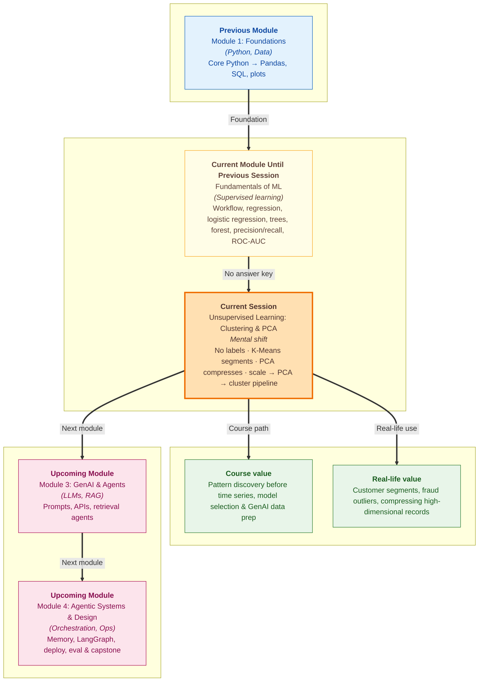

# Pre-read: Unsupervised Learning: Clustering and Dimensionality Reduction

Imagine you run a growing online store. Every week, **10,000 customers** buy something — electronics at midnight, groceries on sale days, fashion during festivals. You have their purchase history, browsing time, and average order value. Your marketing team wants to send the right offer to the right people. But nobody has written a label on each customer saying *"Night electronics buyer"* or *"Sale-day bargain hunter."*

There is no answer sheet. No Pass/Fail column. No fraud tag. Just rows of numbers describing how people behave. Yet the business still needs groups — because sending the same SMS to everyone wastes money and annoys loyal buyers.

In the previous sessions, you lived in a different world. You trained models that **predicted a known target**: house price, pass/fail, spam or not spam. The data always came with labels — like a student writing an exam with the **answer key** already printed at the back. That is **supervised learning**, and it is powerful when you know what you want to predict.

This session opens a new door. What happens when the labels are missing, expensive, or impossible to collect? How do you find natural groups in a crowd? How do you even **see** a dataset when it has dozens of columns and your screen can only show two?

---

## Context of This Session in the Course

---

## The Challenge: Structure Without Labels

Suppose a hospital researcher collects **30 measurements** from each of **569 patients** — size, texture, and shape readings from medical scans. There is no simple way to draw all 30 dimensions on a flat chart. Your eyes work in two dimensions. Your brain wants patterns — clusters, separations, outliers — but the raw table is too wide to inspect row by row.

Now scale the problem. A fintech company watches **millions of transactions** daily. Most are normal. A few may be suspicious. But nobody has marked every past transaction as *fraud* or *genuine* before building the first version of a monitoring system. The team still needs to spot behaviour that **does not look like the crowd**.

These are not prediction problems in the old sense. There is no single column to aim at. The goal is **discovery**: who resembles whom, which points sit far from everyone else, and whether hidden structure exists at all. That is the heart of **unsupervised learning** — learning from features alone, without labeled outputs telling the model what is "correct."

| | **Supervised** | **Unsupervised** |
|---|---|---|
| Labels? | Yes — a target column | No — features only |
| Goal | Predict a known answer | Find hidden groups or patterns |
| Everyday examples | Spam filter, loan default, pass/fail | Customer segments, unusual transactions, topic grouping |
| Evaluation | Compare predictions to true labels | Harder — no single right answer |

Think of the difference this way: supervised learning is a student with an **answer key**. Unsupervised learning is an explorer drawing regions on a map with **no legend** — the explorer must decide where the natural boundaries lie.

---

## K-Means: Finding Your Customer Tables

One practical tool for grouping similar points is **K-Means clustering**. The name sounds technical, but the idea is familiar.

Picture a large wedding reception. The venue has empty round tables. Guests arrive — family, college friends, office colleagues. You want people who **get along** to sit together. You pick a number of tables (**K**), place a temporary "head chair" at the centre of each table, and ask every guest to sit at the nearest head chair. Then you move each head chair to the **average position** of the people sitting there. Guests shuffle again. You repeat until nobody wants to change tables.

That is K-Means in plain language:

- **Cluster** — a group of points that sit close to each other and far from other groups.
- **Centroid** — the average position of a cluster; like the head chair, it may not match any real guest exactly.
- **K** — how many groups you want upfront (three customer types, four behaviour bands, and so on).

The method is fast and widely used for segmentation at scale. The catch: **you must choose K before you start**. Too few groups lump unlike people together. Too many groups create tiny, meaningless segments — as useless as giving every wedding guest their own private table.

Choosing K is where the **elbow method** helps. The model measures how tightly points hug their cluster centres — a score called **WCSS** (within-cluster sum of squares), also known as **inertia**. As K increases, the score always drops. You look for the **elbow** on the plot: the point where adding another cluster barely helps. That bend is often a sensible trade-off.

One more practical rule: distance only makes sense when features are on **comparable scales**. Income in lakhs and age in years should not fight each other. **Scaling** before clustering is not optional — it is part of doing the job fairly.

---

## PCA: Seeing the Forest When You Have 30 Trees

Clustering answers *"who belongs with whom?"* A related challenge is *"how do I even look at this data?"*

**PCA** — **Principal Component Analysis** — is a way to **compress** many correlated columns into a few summary directions while keeping as much useful spread as possible. Spread here means **variance**: where the data actually differs from row to row. The first summary axis (**PC1**) captures the direction of maximum spread. The second (**PC2**) captures the next most, at a right angle to the first. Together they can turn a 30-column medical record into a **2D scatter plot** you can actually read.

The analogy is a detailed photograph saved as a smaller file. The picture still looks almost the same, but it is easier to share and inspect. PCA compresses **feature space**, not pixels — yet the spirit is similar: keep the signal, drop redundancy.

Before trusting a 2D plot, check **explained variance ratio** — how much of the original information each component retains. If the first two components together explain, say, **92%** of the variance, a flat chart is reasonable. If they explain only **40%**, the plot may hide more than it reveals. PCA is a lens for exploration and speed, not a magic replacement for understanding what each original column means.

---

## The Pipeline You Will Build

In practice, these ideas often chain together:

1. **Scale** the features so no column dominates by accident.
2. **Reduce dimensions** with PCA when the data is wide or noisy.
3. **Cluster** with K-Means on the compressed space.
4. **Visualize** in 2D to sanity-check whether groups look separated.

This **scale → PCA → K-Means → plot** workflow appears in marketing analytics, exploratory health studies, and anywhere teams need a first map of unlabeled data before investing in expensive labeling.

**In this pre-read, you'll discover:**

- **Understand** how unsupervised learning differs from the labeled prediction work you did in previous sessions.
- **Discover** how K-Means groups similar rows by repeatedly assigning points to the nearest centre and updating those centres.
- **Learn** why choosing **K** matters and how the elbow method on **inertia (WCSS)** guides that choice.
- **Understand** how PCA reduces many columns into a few components and why **explained variance** must be checked before trusting a 2D view.

---

## What's Next

After this session, you should be able to talk confidently about data **without** a target column. You will know when segmentation beats prediction, when scaling is non-negotiable, and when a pretty 2D chart is trustworthy versus misleading.

You should be ready to ask sharper questions in projects and discussions:

- Does this problem need a **label**, or do we first need to **discover groups**?
- How many customer segments (**K**) make business sense, and what does the **elbow** suggest?
- If we compress 30 features to 2, how much **variance** did we keep?
- Would clustering on raw columns or on **PCA-reduced** columns give a clearer picture?

These questions matter in retail, finance, healthcare, and any team sitting on large unlabeled tables — long before the next module connects ML patterns to broader workflows and agentic systems.

---

## Questions to Explore in the Live Session

1. A dataset has **10,000 shoppers** with purchase history but **no segment labels**. How would you decide whether to use **3**, **5**, or **10** customer groups — and what happens if you pick too many?
2. A medical dataset has **30 feature columns** but you can only plot on a flat screen. How much of the original information must **PC1 + PC2** retain before you trust what the scatter plot shows?
3. Two shoppers sit at points **(2, 3)** and **(5, 5)** on a scaled chart. Cluster centres sit at **(1, 1)** and **(6, 6)**. Which centre does the first shopper belong to — and why does **scaling** matter before you measure "nearest"?

Come ready to shift from *"predict the answer"* to *"find the pattern."* This session is where machine learning starts to feel like the work marketing teams, risk analysts, and researchers do when nobody has written the labels yet — but the data still has a story to tell.
