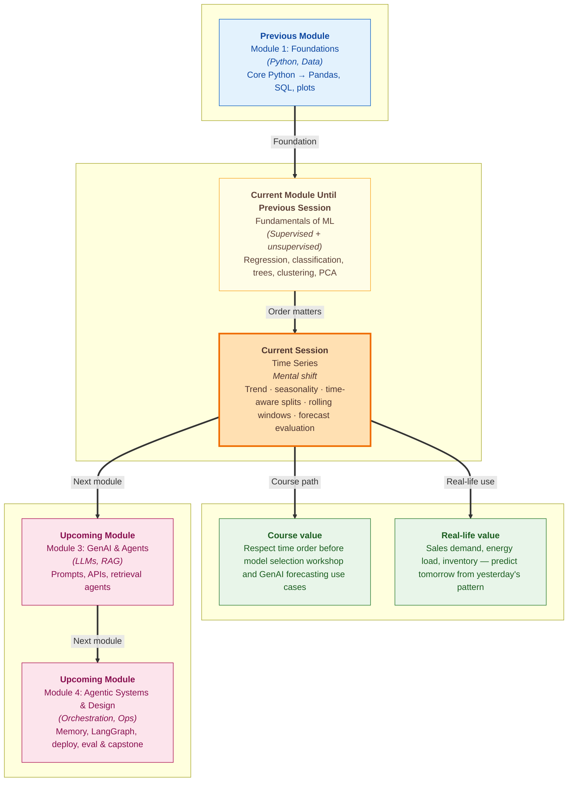

# Pre-read: Time Series

You run a small **ice cream cart** near a college campus. Every day you write down how many cups you sold. After a year of notes, three patterns jump out without any fancy software.

**Sales climb year over year** — word spread, you added two new flavours, more hostels opened nearby. That slow, long-term direction is **trend**.

**Sales spike every April and crash in monsoon** — heat drives footfall; heavy rain keeps people indoors. That repeating calendar rhythm is **seasonality**.

**Yesterday's weather affects tomorrow's sales** — if today was unusually hot, tomorrow often stays busy too. The **order of days matters**. You cannot shuffle your notebook like a deck of cards and pretend March data helps predict January in a meaningful way.

In the **previous session**, you worked with data where rows were **exchangeable** — customer segments, medical readings, transaction features — and you could often **randomly split** rows into train and test sets. **Time series** breaks that habit. The question is not only *"what predicts sales?"* but *"what happens **next** given everything that happened **before**?"*

That shift — from static tables to **data that moves forward on a clock** — is the heart of today's session.

---

## Context of This Session in the Course

---

## The challenge: predicting the future without cheating

Suppose your cart sells **300 cups on a normal Tuesday** and **900 on the last Saturday before Diwali**. A model that only sees **one number per row** with no date attached might treat both days as unrelated. It misses that **900** is partly **seasonal** — festival demand — not a sign that every Saturday will look like that forever.

Now imagine you train a model to forecast next week's sales. You randomly put **December** rows into training and **January** rows into testing, the way you might split a customer table. The model **peeks at the future** during training — it has already seen holiday spikes before predicting earlier weeks. Scores look excellent. Production fails the first real January you deploy.

These are classic **time series** mistakes:

| Mistake | Why it hurts |
|---|---|
| Ignoring **trend** | You under-order stock when business is quietly growing month by month |
| Ignoring **seasonality** | You prepare for an "average day" on a day that is never average |
| **Random train/test split** | You leak future information — evaluation lies |
| No **rolling history** as input | You throw away the last seven days of signal that humans use instinctively |

The live session teaches you to **decompose** what you see (trend vs seasonality), **split data with time in mind**, build features with **rolling windows**, and **evaluate forecasts** the way forecasting teams actually do — on **held-out future periods**, not shuffled rows.

---

## Trend, seasonality, and the cricket scorecard analogy

Open a **cricket team's scores** across five years of IPL seasons.

**Trend** is the long arc: are they winning more matches over the years because the squad improved, better coaching, smarter auctions? Plot total wins per season — if the line drifts upward, that is trend.

**Seasonality** is the repeating beat inside each year: home-ground advantage in certain months, player fatigue late in the tournament, higher scores on flat wickets in April evenings. The pattern **repeats on a calendar** even when the overall team strength changes.

A good analyst does not ask *"what is the average score?"* alone. They ask *"where are we on the **calendar**?"* and *"are we on an **upward path** or not?"* Sales dashboards, electricity demand, hospital admissions, and app downloads all speak this language.

Separating **trend** from **seasonality** helps you **forecast responsibly**. Trend tells you the direction of travel. Seasonality tells you which part of the cycle you are in. Together they explain why **yesterday plus last year same week** both belong in your thinking — which leads naturally to **rolling windows**.

---

## Time-aware splits: never use tomorrow to grade yesterday

In earlier ML work you learned **train / validation / test splits** and **data leakage** guards — fit preprocessing on training data only, never let test information sneak into training. Time series adds one non-negotiable rule: **respect chronological order**.

**Time-aware split** means:

- **Train** on older dates
- **Validate or test** on **later** dates the model has **not** seen
- Treat the timeline like a **story that only moves forward**

Think of exam preparation. You would not let a student read **next month's question paper** to study for **this month's test**. A random row split on dated sales data is exactly that cheat — the model has memorised future spikes before pretending to predict them.

Professional teams often use **walk-forward** thinking: train up to March, predict April; slide the window; train up to April, predict May. The spirit is the same — **evaluate on the future you have not trained on**.

This connects directly to **evaluation for time series**. Metrics like **MAE** (mean absolute error — average size of mistakes) and **RMSE** (root mean squared error — punishes large misses more) still apply, but they must be computed on **forecast horizons** that respect time. A model with pretty scatter plots on shuffled rows can be **worthless for next-week planning**.

---

## Rolling windows: what the last seven days know

Humans forecast with **recent memory**. The ice cream vendor thinks: *"We sold 420, 380, 410 the last three hot days — tomorrow will likely stay busy."* A **rolling window** formalises that habit for models.

Instead of one static row per month, you engineer features from a **sliding slice** of history:

- **Rolling mean** — average sales over the last 7 days (smooths noise)
- **Rolling sum or max** — peak demand in the last 14 days (stock planning)
- **Lag features** — sales from exactly 7 days ago (weekly seasonality hint)

The **window size** is a design choice, like choosing **K** in clustering. Too short — noisy. Too long — slow to react to change. The right width depends on whether your pattern repeats **daily**, **weekly**, or **yearly**.

Rolling features bridge **raw dates** and **model-ready columns** without pretending time is just another category. They are how tabular ML eats time series problems before you need specialised forecast libraries — and they remain useful even when you move to richer methods later.

---

In this pre-read, you'll discover:

- **Understand** how **trend** (long-term direction) and **seasonality** (repeating calendar patterns) differ — and why both matter for real forecasts
- **Learn** why **time-aware splits** replace random shuffling when rows carry dates — and how that prevents **future leakage**
- **Discover** how **rolling windows** turn recent history into features a model can use for **next-step prediction**
- **Understand** how **evaluation for time series** must score predictions on **held-out future periods**, not mixed-up past rows

---

## Words you will hear — explained right away

- **Time series:** Data recorded **in time order** — daily sales, hourly temperature, monthly revenue — where **when** something happened matters as much as **what** happened.
- **Trend:** The **long-run direction** — generally up, down, or flat — after you zoom out from day-to-day noise.
- **Seasonality:** A **repeating pattern** tied to the calendar — weekdays vs weekends, summer vs winter, festival weeks vs normal weeks.
- **Time-aware split:** Train on **past** dates, test on **future** dates — never shuffle time like a bag of marbles.
- **Rolling window:** A **fixed-length slice** of recent history (last 7 days, last 12 months) used to compute summary features that update as time moves forward.
- **Lag feature:** A value from **earlier in the timeline** — for example, sales from exactly one week ago — used as an input to predict today.
- **Forecast evaluation:** Measuring prediction error on **future holdout periods** using metrics such as **MAE** or **RMSE**, with time order respected.

---

## What's next

After this session, you should be able to look at dated business data and ask the questions forecasters ask before touching any model:

- Is there a **trend**? Is there **seasonality**? At what **cadence** — daily, weekly, yearly?
- Did I split data **in time**, or did I accidentally **leak the future**?
- What **rolling features** would a human manager already be using informally?
- Are my metrics computed on **genuine future predictions**, or on a shuffled illusion?

You should be ready to connect time series thinking to the **model selection workshop** in **upcoming** work — comparing approaches on fair, time-respecting criteria — and later to agentic systems that **call APIs** returning **timestamped data** (inventory, metrics, logs). Models that ignore time order fail quietly until real deployment; models that respect it earn trust from ops teams and finance planners alike.

---

## Questions to explore in the live session

1. Your ice cream cart sells **120 cups/day in January** and **480 cups/day in May** every year, but **overall yearly totals rise by 8%**. Which part is **seasonality**, which part is **trend**, and why would a single "average daily sales" number mislead inventory planning?

2. You randomly split **730 days** of sales into 80% train and 20% test. The test set includes days from **March** and the train set includes days from **November of the same year**. What went wrong with this split — and how would you redesign it so evaluation reflects **real forecasting**?

3. You build a **7-day rolling average** of sales to predict tomorrow's demand. On a sudden **heatwave day** sales jump 3× normal. Will the rolling average react **immediately** or **gradually** — and how would you decide between a **7-day** versus **28-day** window for a college canteen versus a monthly billing metric?

Come ready to treat **time as an axis, not a label**. This session is where machine learning meets the calendars, dashboards, and delivery schedules that every growing business already lives by — and where honest evaluation means **never grading yesterday with tomorrow's answer key**.
