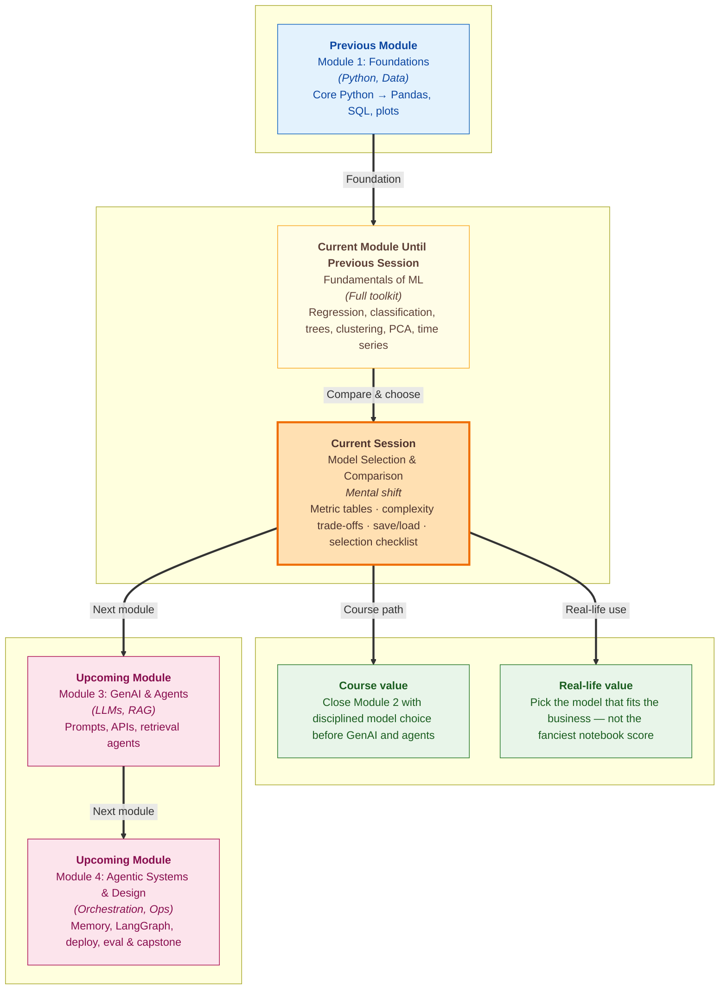

# Pre-read: ML Workshop — Model Selection & Comparison

You need a **new phone**. Two shopkeepers pitch hard.

The first shows a benchmark chart: **"Fastest processor — 98% score!"** The second asks what you actually do: long battery for commute videos, decent camera for family photos, storage for work files, budget under ₹25,000. Same market, different decision.

Machine learning at the end of a module feels like that first shopkeeper. You have trained **linear regression**, **logistic regression**, **decision trees**, **random forests**, **K-Means**, **PCA**, and thought about **time-ordered data**. Each demo showed a metric going in the right direction. But a real project asks a harder question: **which approach fits this problem, this data size, this team, and this business constraint — not which one looked smartest in isolation?**

In the **previous session** you learned that **time series** demands **time-aware splits** and **rolling features** — evaluation rules that differ from a plain customer table. Earlier sessions added **classification metrics** (accuracy, precision, recall, F1, ROC-AUC) and **regression metrics** (MAE, RMSE, R-squared). Today's workshop is where those pieces meet: **compare models fairly**, weigh **complexity**, **save** the winner, and walk through a **selection checklist** you can reuse after this module closes.

---

## Context of This Session in the Course

---

## The challenge: many models, one decision

Imagine a **fintech team** predicting **loan default** (yes/no). One engineer swears by **logistic regression** — fast, explainable to auditors. Another pushes a **random forest** — higher accuracy on the validation set. A third mentions **clustering** first to find unusual applicant groups. All three can produce numbers. Leadership wants **one production choice** and a reason they can defend in a meeting.

Without discipline, teams pick the **highest headline metric** and discover later that:

- The "winner" **overfits** — great on past data, weak on next quarter's applicants
- The metric chosen **does not match the business cost** — false approvals hurt more than false rejections
- The model is **too heavy** to retrain weekly or too **opaque** for compliance
- Nobody **saved** the trained artifact — every deployment starts training from scratch

This workshop teaches the habits that prevent those regrets: build **metric tables** that compare candidates on the **same test conditions**, judge **complexity** honestly, **persist** the chosen model, and finish with a **selection checklist** — the ML equivalent of the second shopkeeper asking what you need the phone for.

---

## Metric tables: same exam, same answer key

A **metric table** is a side-by-side scorecard. Rows are **models** (logistic regression, decision tree, random forest, baseline mean predictor, and so on). Columns are **metrics** chosen for the **problem type**:

| Problem type | Metrics you might compare |
|---|---|
| **Regression** (predict a number) | MAE, RMSE, R-squared |
| **Classification** (predict a category) | Accuracy, precision, recall, F1, ROC-AUC |
| **Time series forecast** | MAE/RMSE on **future holdout** periods (from the **previous session**) |
| **Clustering** (no labels) | Inertia, silhouette-style summaries, business interpretability of segments |

The rule is **fair comparison**: same **train/test split** (or same time-aware split for dated data), same **preprocessing**, same **target definition**. Changing the split between models is like giving one job candidate an easier interview.

**Baselines belong in the table too.** A model that beats **"always predict the average"** or **"always predict the majority class"** by a tiny margin may not justify deployment complexity. You learned baselines in earlier workflow sessions — they anchor the table so "fancy" is not confused with "useful."

When stakeholders ask *"why this model?"*, the metric table is your evidence — not a single screenshot from one notebook cell.

---

## Comparison by complexity: the interview panel, not the loudest speaker

**Complexity** is more than lines of code. It includes:

- **Interpretability** — Can a credit analyst see **why** an application was flagged?
- **Training cost** — Does the model need hours and a GPU, or seconds on a laptop?
- **Data hunger** — Does it need millions of rows, or can it work on thousands?
- **Overfitting risk** — Deep trees and large ensembles can memorize noise
- **Maintenance** — Will the team retrain and monitor it reliably?

Picture an **interview panel** scoring three candidates on the **same rubric**: technical skill, communication, culture fit, start date. The loudest candidate is not automatically hired. **Random forest** might win on ROC-AUC while **logistic regression** wins on auditability and speed. **Model selection** is choosing the best **trade-off**, not the highest number in one column.

A simple pattern many teams use:

1. Start with a **simple, interpretable** model as baseline
2. Try a **moderately complex** model if baseline error is too high
3. Add complexity **only when metrics improve meaningfully** on **honest validation** — not on training scores alone

This connects to ideas from earlier sessions: **regularization** controls complexity in regression; **tree depth** and **ensemble size** control it in classification; **K** in clustering controls segment count. Today's lens is **comparative** — how do those knobs show up when models sit **next to each other** in one table?

---

## Model persistence: save the recipe, not just the photo

Training can take minutes or hours. **Model persistence** means **saving** the trained model (and often the **preprocessing steps** fit on training data) to disk, then **loading** it later for predictions without retraining from zero.

Think of a **family recipe book**. You could recreate biryani from memory every Sunday — slow, inconsistent. Or you write the recipe once and follow it. **Saving/loading** is writing the recipe: the learned weights, tree structures, or scaler parameters that define *this* fitted model.

Why it matters:

- **Deployment** — A small API or batch job loads the artifact and scores new rows
- **Reproducibility** — Teammates get the **same** model version, not "whatever I ran yesterday"
- **Versioning** — When you improve the checklist and retrain, you keep the old file for comparison

Workshop time typically covers the **idea and workflow** — train, save, load, predict on a fresh row — so Module 2 ends with something you could hand to an engineering team, not only a notebook output.

---

## The selection checklist: before you ship

Before any model leaves the notebook, professional teams run a **selection checklist**. Yours will vary by project, but core questions repeat:

| Check | Question to answer |
|---|---|
| **Problem fit** | Regression, classification, clustering, or time-ordered forecast? |
| **Metric fit** | Which metric matches **business cost** (false alarm vs missed detection)? |
| **Data fit** | Enough rows? Leakage guarded? Time split respected if dates matter? |
| **Baseline beat** | Does the candidate beat a **simple baseline** by a **meaningful** margin? |
| **Complexity fit** | Can the team **explain, retrain, and monitor** this choice? |
| **Persistence** | Is the chosen model **saved** with preprocessing for reuse? |
| **Next step** | What would you monitor after deployment — drift, accuracy drop, segment shift? |

This checklist closes **Module 2** as a coherent story: you did not learn algorithms in a vacuum — you learned to **choose** among them like a practitioner.

---

In this pre-read, you'll discover:

- **Understand** how **metric tables** compare models on the **same splits and metrics** — regression, classification, and time-aware evaluation where relevant
- **Learn** why **comparison by complexity** (interpretability, data needs, overfitting risk) matters as much as a single accuracy number
- **Discover** **model persistence** — **saving and loading** trained models so predictions are reproducible without retraining every time
- **Apply** a practical **selection checklist** to pick a model that fits the **job**, not the **ego**

---

## Words you will hear — explained right away

- **Metric table:** A **side-by-side comparison** of models and their scores on agreed metrics under the same evaluation setup.
- **Baseline model:** A **deliberately simple** reference — mean prediction, majority class, simple rules — used to judge whether a complex model earns its keep.
- **Model complexity:** How flexible, heavy, or opaque a model is — and how much data and maintenance it demands.
- **Overfitting:** When a model fits **training noise** so well that **new data** performance drops — the classic reason a "winner" fails in production.
- **Model persistence:** **Saving** a trained model to a file and **loading** it later for scoring — sometimes called **serialization**.
- **Selection checklist:** A **repeatable list of questions** that must be satisfied before a model is chosen for deployment or demo handoff.
- **Validation vs test:** **Validation** helps you **compare** models during development; **test** is the **final exam** you touch sparingly for an unbiased score.

---

## What's next

After this workshop, you should be able to stand at the end of an ML project and defend a choice in plain language:

- Here is our **metric table** on fair splits — including **time-aware** evaluation when the **previous session's** lessons apply
- Here is why we rejected the more complex model — or why we accepted the complexity cost
- Here is the **saved model file** and what preprocessing it expects
- Here is our **checklist** sign-off

**Upcoming** work in the **next module** shifts to **GenAI and agents** — language models, prompts, retrieval — a different toolkit, but the same professional habit: **compare options on criteria that match the use case**, not hype. Module 2 gave you **classical ML judgment**; that judgment still matters when you later decide whether a forecast, a classifier, or an LLM should handle a sub-task inside an agent.

---

## Questions to explore in the live session

1. Two models predict loan default: **logistic regression** has **ROC-AUC 0.82** and **F1 0.71**; **random forest** has **ROC-AUC 0.86** and **F1 0.69**. The business cares most about **catching defaults** without drowning in false alarms. Which metric column would you weight more heavily — and could you pick a winner from **one number alone**?

2. A regression model shows **RMSE 12,000** on training data and **RMSE 28,000** on validation data. A simpler model shows **RMSE 15,000** on both. Which likely **overfits** — and what would your **metric table** say about **complexity vs gain**?

3. You train the best model on Friday and demo on Monday — but you **forgot to save** the artifact. Your teammate retrains on slightly different notebook order and gets different predictions. What **persistence step** was missing — and what would you add to your **selection checklist** so that never happens again?

Come ready to stop collecting algorithms and start **making decisions**. This session is the bridge between **learning models** and **using them responsibly** — the last workshop before the course opens the door to **generative AI and agentic systems**.
