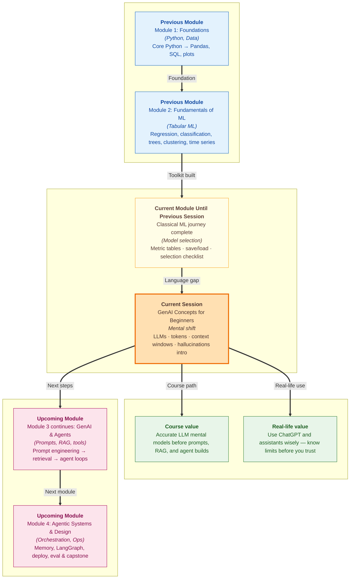

# Pre-read: GenAI Concepts for Beginners

You open **ChatGPT** on your phone and type: *"Draft a polite email to my manager asking for leave next Friday."* In seconds, you get a full paragraph — correct tone, neat structure, ready to edit and send.

Now remember the **previous session**. You compared **logistic regression**, **decision trees**, and **random forests** in a **metric table**, saved the winner with **joblib**, and walked a **selection checklist** before calling any model "production-ready." Brilliant work — but not one of those models could have written that email. They needed **rows and columns**, fixed numbers, a clear label to predict. Human language does not sit still in a spreadsheet.

Job posts today mention **AI assistants**, **ChatGPT**, and **agents** that read and write like people. The gap between **tabular ML thinking** and **language-ready thinking** is exactly where this course turns next. Before you prompt, call an API, or build an agent, you need one thing: an **accurate mental model** of how these talking machines actually work — and where they quietly fail.

---

## Context of This Session in the Course

---

## What if every customer said the same thing in ten different ways?

Picture a **busy support queue** at an online store. One customer writes: *"I want a refund on order #4421."* Another says: *"Please return my money for the damaged item."* A third taps: *"Can you reverse the charge from last Tuesday?"*

Same intent. Completely different words.

Old **rule-based** systems — the kind that power many **IVR phone menus** — work like frozen flowcharts. *If the message contains the word "refund", send to billing.* Message 1 passes. Messages 2 and 3 fail, even though a human hears the same request instantly. Scale that to thousands of phrasings per day and you see why rigid rules break while language stays creative.

**What if** you needed software that not only **routes** a ticket but **drafts** the reply, **summarises** a long complaint thread, or **remembers** what the customer said ten messages ago? The classical ML toolkit you just mastered was never built for that world. Something new had to arrive — models that treat **language as their native input**, not as awkward columns in a table.

That something is a **Large Language Model (LLM)** — the technology behind **ChatGPT**, **Gemini**, **Claude**, and **LLaMA**.

---

## The rise of talking machines — in one breath

The journey from "computers cannot read sentences" to "ChatGPT shocked the world" took years of research. You do not need the maths to benefit from the story.

Early systems tried **keyword tricks** and **word counts** — brittle, easy to fool. Then researchers taught machines to turn words into numbers that carry **meaning**, to read longer text, and eventually to build **GPT-style models** trained on a huge slice of the internet with one simple job: **guess the next piece of text**. No manual label for every task. One massive training run that learns grammar, facts, styles, and reasoning patterns across countless topics.

When **ChatGPT** launched in 2022, anyone could type plain English and get a fluent answer. That moment is why **agentic systems** — bots that plan, use tools, and act — are now part of everyday work conversation. This session is your first map of that territory: what an LLM **is**, how it **differs from rule-based software**, and why **trusting it blindly** is risky.

---

## The tiffin box in your head — tokens and memory limits

Here is the analogy that makes the rest of the session click.

> **Imagine a fixed-size tiffin box.** Everything the model "sees" in one shot — your instructions, pasted documents, chat history, and its own answer — must fit inside. The box is measured in **tokens**, not in words you count on screen. A **token** is a small chunk of text: a whole word, part of a word, punctuation, even a space pattern. Like **Lego bricks**, a sentence is snapped into standard pieces the machine can work with. Cloud services often **bill per token**, and every model has a **context window** — a hard cap on how many tokens fit in one request.

If you pack a **50-page report** into the box when the lid only closes at three pages, something gets **left out** — usually the beginning. The model does not always flash a red error. It simply **cannot see** what fell off. For **Indian languages**, the same meaning often needs **more tokens** than tidy English — a real concern when you design apps for Bharat-wide users.

Understanding **tokens** and **context windows** is not a geek detail. It is how you predict **cost**, **speed**, and **why a bot forgot your instruction** halfway through a long chat.

---

## Fluent words are not always true words

Here is the mental shift that surprises most beginners.

An LLM does **not** look up answers in a filing cabinet like a search engine. It **writes forward**, one token at a time, choosing what sounds most likely next — like a vastly powerful **phone keyboard autocomplete** that has read millions of documents. Ask the same question twice and you may get **different wording**. That is not a bug; it is how **probabilistic text generation** works.

The danger follows naturally. Because the model is rewarded for **smooth, plausible** continuations — not for **verified truth** — it can state **false facts with complete confidence**. That is a **hallucination**: fluent fiction dressed as fact. Real cases already exist — lawyers fined for submitting **fabricated court cases** an assistant invented. When a bot only **shows** text, the harm is believing something wrong. When an **agent** sends emails, books tickets, or updates records, the harm can be **irreversible**.

This session introduces **hallucinations** and sibling failure modes — **knowledge cutoffs**, **math mistakes**, **context loss** in long chats — so you design with eyes open, not hope.

---

In this pre-read, you'll discover:

- **Understand** why **classical ML** and **rule-based software** hit a wall on open-ended language — and how **LLMs** fill that gap without you needing neural-network maths
- **Learn** what **tokens** and **context windows** mean for real prompts — including when a long document probably **will not fit** in one shot
- **Discover** how **token-by-token prediction** differs from a **database lookup** — and why the same question can produce **different answers**
- **Recognise** **hallucinations** and common **failure modes** so you never confuse **confident tone** with **correct facts**

---

## Words you will hear — explained right away

- **LLM (Large Language Model):** A model trained on vast text to **read and generate** human-like language — the engine behind modern chat assistants.
- **Generative AI (GenAI):** AI that **creates new content** (text, images, code) instead of only scoring or classifying existing data.
- **Prompt:** The instruction or question you send in — it steers what the model writes back.
- **Token:** The smallest chunk of text the model processes; APIs count and charge by tokens, not by words on your screen.
- **Context window:** The maximum tokens the model can handle in **one request** — prompt plus answer together.
- **Hallucination:** A **confident but false** statement the model generates because it optimises for plausible text, not fact-checking.
- **Rule-based software:** Fixed **if/keyword** logic — predictable, but brittle when people rephrase the same intent.

---

## What's next

After this session, you should be able to:

- **Explain to a colleague** why your **Random Forest** from the ML workshop could score loan risk but not draft a customer email — using a clear language example
- **Speak confidently about tokens and context limits** — and rough-size whether a chunk of text likely fits before you paste it into an assistant
- **Describe autocomplete-style generation** — and why two runs of the **same prompt** may legitimately differ
- **Spot hallucination risk** before trusting an answer in a **high-stakes** situation — refund policy, legal claim, medical advice, financial decision
- **Connect GenAI to ML habits you already have** — fair comparison, baselines, and "does this tool fit the job?" thinking now applied to language models

**Upcoming** sessions in this module move from **mental models** to **hands-on work**: prompt design, APIs, retrieval, and agent loops. The vocabulary you build here is the floor everything else stands on.

---

## Questions we will unpack live

1. Three customers want a **refund** — one says *"refund"*, one says *"return my money"*, one says *"reverse the charge."* A keyword rule only catches the first. How would you explain the difference between that **rule-based** failure and what an **LLM** might do — including what new risk the LLM introduces?

2. You paste a **40-page policy PDF** into ChatGPT and ask a question about a rule on **page 2**. The answer sounds confident but is wrong. Could the problem be **context window overflow** rather than "the AI is broken"? How would you check?

3. A colleague says: *"ChatGPT searched Google for my answer."* What is the accurate mental model — **retrieval** or **generation** — and why does that distinction matter when the same question is asked twice?

Come curious. The leap from **metric tables and saved models** to **talking machines you can reason about** is the doorway to everything that follows — prompts, retrieval, agents, and design choices you can defend in a real meeting.
