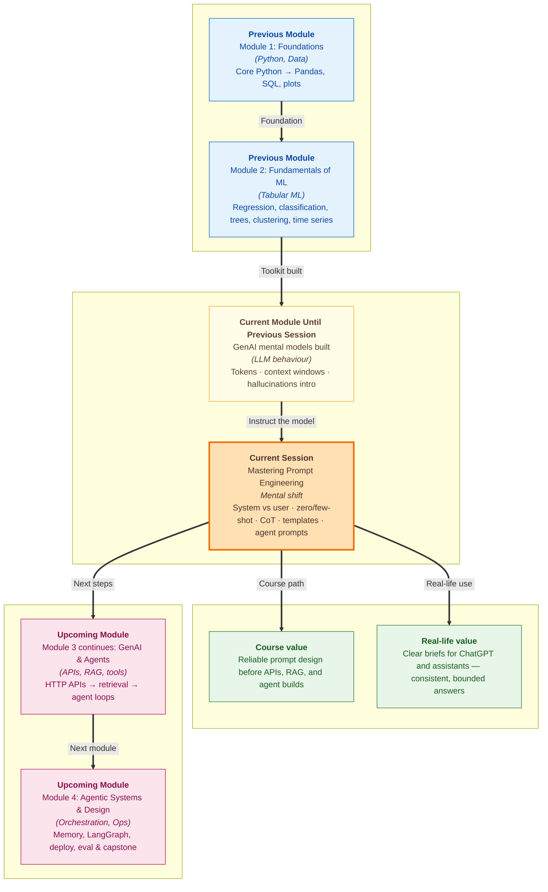

# Pre-read: Mastering Prompt Engineering

You open **ChatGPT** and type: *"Tell me about loans."* The reply is long, generic, and somewhere in the middle it quotes an interest rate that sounds official — but you never asked for numbers, and you are not sure they are real.

Your classmate types: *"You are a bank FAQ bot. Explain home loans in three bullet points for a first-time buyer. Do not quote interest rates."* The answer is short, on-topic, and safe to paste into a WhatsApp group for your family.

Same tool. Same evening. Completely different outcome.

In the **previous session**, you learned how **LLMs** (large language models) generate text **token by token**, what **context windows** limit, and why **hallucinations** — confident but false statements — happen. You saw that fluent language does not mean the model stores verified facts; it predicts likely text. Knowing *how* the machine works is step one. Step two — the one that decides whether your answers stay useful at scale — is **how you instruct it**.

That instruction craft has a name: **prompt engineering**. And it is the bridge between "I tried ChatGPT once and it was random" and "I can design an assistant that follows rules even when I am not watching."

---

## Context of This Session in the Course

---

## What if you had to answer five hundred student questions — and every reply had to sound the same?

Picture **orientation week** at a college. Hundreds of freshers flood the helpdesk: *"When does the library open?"* *"What is the fine for a late book?"* *"Can I bring food inside?"*

One tired volunteer answers each question differently — sometimes helpful, sometimes off-topic, sometimes making up a rule that does not exist. By afternoon, rumours spread because two students got conflicting answers.

Now imagine the college hires a **smart intern** who has read every campus notice but will guess when the brief is vague. You cannot stand behind that intern for every single chat. You need a **written briefing** that runs before the doors open: who they are, what topics they cover, how politely to refuse politics or health advice, and how long each reply should be.

That backstage briefing is exactly what a **system prompt** does in an AI chat. The **user prompt** is whatever the student types at the counter — *"What is the last date for scholarship?"* — fresh each time. The model always reads **both**: the permanent rules plus the live question. Put your long rules only in the first user message and they get buried in chat history. Put them in the **system** slot and they shape every turn.

> **Think of it like a wedding caterer.** You do not say *"make it nice."* You specify guest count, veg/non-veg split, budget, and serving time. Prompts need that same level of detail — or the model fills gaps with plausible-sounding guesses.

---

## Teaching by instruction versus teaching by example

Once the backstage rules are set, you still need the model to copy a **pattern** inside each task.

**Zero-shot** prompting is like a teacher saying *"Write a film review"* with no sample on the board. Fine for common jobs — translation, short Q&A — where the model has seen millions of examples online. It breaks when you need the **same JSON keys**, **brand tone**, or **repeatable labels** across hundreds of inputs.

**Few-shot** prompting is showing two sample reviews with a fixed structure, then saying *"Now review this film the same way."* The model mirrors the pattern — short taglines, bullet order, classification labels — without you writing a fifty-line rulebook. The trade-off: examples eat **context window** space, so two strong samples usually beat ten noisy ones.

For **multi-step reasoning** — profit calculations, eligibility checks, support triage — formatting alone is not enough. **Chain-of-thought (CoT)** prompting asks the model to **show working** before the final answer, like a student writing steps in a maths exam instead of only the last number. A doctor who lists symptoms, rules out causes, then recommends treatment is using the same habit. A doctor who blurts one medicine name with no reasoning is risky — and so is an AI that jumps straight to *"Answer: refund approved"* without checking what the customer actually said.

---

## The mad-libs form professionals reuse

When the same task repeats with different data — summarise this article, polish this email, answer this FAQ — rewriting the whole prompt every time invites drift. A **prompt template** is a reusable pattern with **placeholders** for the parts that change.

Picture a **railway reservation form**: name, age, train number, and class are always asked; only the values differ. A strong template has five building blocks:

| Block | What it does |
|---|---|
| **Role** | Who the AI is and what expertise it claims |
| **Task** | The job for this specific run |
| **Instructions** | Ordered steps to follow |
| **Constraints** | Guardrails — length limits, forbidden topics, no invented facts |
| **Output format** | Exact shape of the answer — headings, bullets, labelled sections |

Only the student input or document slot changes each run. The agent behaviour stays stable — which is why beginner **single-agent** workflows combine one solid **system prompt** (persona, scope, reasoning steps, guardrails) with one **user template** (context plus question) instead of improvising from scratch every time.

---

In this pre-read, you'll discover:

- **Understand** why **system** and **user** prompts are separate layers — and how a clear backstage briefing stops an agent from drifting off-topic or inventing facts
- **Learn** when a plain instruction (**zero-shot**) is enough — and when two worked examples (**few-shot**) lock in format and tone you can trust in automation
- **Discover** how **chain-of-thought** step lists sharpen multi-step answers — from support triage to study advice — without you re-explaining the process every turn
- **Assemble** a **reusable prompt template** with role, task, instructions, constraints, and output format — the blueprint for a dependable beginner agent

---

## Words you will hear — explained right away

- **Prompt engineering:** Designing and refining the text instructions you send to an LLM so outputs stay accurate, consistent, and useful — like writing a clear brief for a smart intern.
- **System prompt:** Persistent background rules set once — persona, scope, tone, and workflow for the whole conversation.
- **User prompt:** The live message each turn — the student's question, pasted document, or follow-up.
- **Zero-shot prompting:** Asking for a task with **no examples** in the prompt; the model relies on patterns from training.
- **Few-shot prompting:** Including **one or more worked examples** before the real input so the model copies your format or labels.
- **Chain-of-thought (CoT):** Instructing the model to show **intermediate reasoning steps** before the final answer — like showing working in an exam.
- **Prompt template:** A reusable text pattern with **placeholders** for variable content — fixed instructions, changing details.
- **Agent prompt:** The combined design — system rules, reasoning workflow, output format, and guardrails — that steers one AI worker through a repeated task.
- **Hallucination guardrail:** A prompt rule that forbids inventing facts outside the context you provided — essential after what you learned about fluent fiction in the previous session.

---

## What's next

After this session, you should be able to:

- **Draft a bounded system prompt** for a real helper — campus FAQ, fee-payment bot, or study buddy — with persona, scope, refusal line, and response length
- **Choose zero-shot or few-shot** for a practical task and explain **why** — including when examples are worth the extra tokens
- **Upgrade a weak one-liner** with chain-of-thought steps so reasoning is visible on logic-heavy questions
- **Build a five-block template** you could hand to a teammate or wire into an app — same structure every run, only the input slot changes
- **Design a beginner agent prompt** that combines role, numbered workflow, constraints, and labelled output — ready for the API and RAG work ahead in this module

**Upcoming** sessions connect these prompt designs to **HTTP APIs**, **retrieval**, and **agent loops** — but the system prompt remains the main lever for how your agent thinks and responds.

---

## Questions we will unpack live

1. A **college Tech Fest FAQ bot** must answer only about dates, venue, and registration — and politely refuse questions about cricket scores or celebrity gossip. How do you split **permanent rules** (system) from **each student's question** (user) so scope holds even after twenty messages in the same chat?

2. You need **twenty customer testimonials** for a fictional app called **StudyPath** — same tone, same one-line structure, every time. You try a single sentence first, then add two sample testimonials. Which approach gives output you could paste into a spreadsheet without manual cleanup — and how many examples is *too many* for your token budget?

3. A support queue receives: *"My order arrived damaged — order #8821."* A weak prompt might jump to a generic apology. How would you embed **numbered chain-of-thought steps** in the system prompt — restate problem, classify issue type, branch to the right response, cap reply length — so the model reasons before it promises a refund amount it was never told?

Come ready with one narrow task from your own life — a report, polite email, campus query, or interview prep question. If you can describe the messy version in a short paragraph, you already have material for the exercises. The shift from *"the AI is smart enough without instructions"* to *"I write the brief, the machine follows it"* is what turns a chat toy into a tool you can defend in a real meeting.
