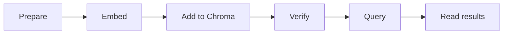

# Implementing Vector Search Systems

## Context of This Session

In the previous session, you built the **mental model** for vector databases. You learned why **embeddings** turn text into numbers, why normal SQL search is not enough for nearest-meaning search, and how the **chunk -> embed -> store -> query -> top-k** flow works.

Today you run the storage and retrieval part in code using **Chroma** on your laptop.

**In this session, you will:**

- Recall the **embed -> store -> query -> top-k** pipeline.
- Learn Chroma words like **client**, **collection**, **id**, **document**, **metadata**, and **embedding**.
- Set up Chroma with a local persistent folder.
- Add FAQ data into a Chroma collection using **upsert**.
- Verify stored data using **count**, **peek**, and **get**.
- Retrieve relevant rows using **query** and understand **distance** values.
- Inspect how Chroma saves data locally using a SQLite viewer.

This is a hands-on implementation session. Vector indexing theory, ANN internals, metadata filtering, collection updates, and retrieval tuning are kept for later RAG work.

---

## Bridge -- From Concepts to Code with Chroma

You already know what similarity search does. Today you learn how one tool stores and searches vectors in practice.

### Quick Recall -- The Pipeline You Will Implement

Imagine a student support bot for an online shopping app. A user types: *"I want my money back after sending the shoes back."* No FAQ may use those exact words, but the meaning is close to returns and refunds.

Today's lab follows these steps:

1. **Prepare** short FAQ records with id, text, and metadata.
2. **Embed documents** using an embedding model.
3. **Store in Chroma** using a collection.
4. **Verify** that the rows were stored correctly.
5. **Embed the user query** using the same model.
6. **Query Chroma** for the top-k nearest records.
7. **Read results** with ranks, documents, metadata, and distances.


- **Official Definition:** **Top-k retrieval** returns the k stored records whose embedding vectors are nearest to the query vector.
- **In Simple Words:** It means, *"Give me the best few matches by meaning."*
- **Real-Life Example:** At a Kirana shop, if you say *"Bhaiya, kuch thanda de do"*, the shopkeeper understands the intent and gives a cold drink. You did not need to say the exact product name.

**Same model rule:** The same embedding model must be used for stored documents and user queries. If documents are encoded using one model and queries using another, distances become unreliable.

### Simple Activity -- Map the Pipeline

In your notebook, draw six boxes:



Under **Add to Chroma**, write four labels: **id**, **document**, **metadata**, and **embedding**. This becomes your checklist while writing code.

---

## Chroma Terminology -- Learn the Vocabulary First

Before typing code, understand what Chroma calls each thing. If you know SQL tables and rows, the comparison below will feel familiar.

### Chroma vs SQL -- Concept Map

| Chroma term | What it holds | SQL analogy |
|---|---|---|
| **Client** | Connection to Chroma | Database connection or engine |
| **Collection** | Named bucket of stored records | Table |
| **Record** | One searchable item | Row |
| **id** | Unique key for a record | Primary key |
| **document** | Human-readable text | Text column |
| **metadata** | Key-value labels like category or source | Extra columns |
| **embedding** | Numeric vector representing meaning | Vector column |
| **upsert** | Insert new or replace existing record by id | `INSERT ... ON CONFLICT UPDATE` idea |
| **query** | Similarity search by vector | Meaning search, not classic SQL |
| **get** | Fetch by exact id | `SELECT ... WHERE id = ...` |


- **Official Definition:** A **Chroma collection** is a named container that stores records with ids, documents, metadata, and embeddings.
- **In Simple Words:** A collection is like one labelled shelf. Each item on the shelf has a name tag, readable text, labels, and hidden number coordinates for meaning search.
- **Real-Life Example:** A coaching centre cupboard stores labelled folders. Each folder has a number, notes inside, subject stickers, and a location that helps the librarian find similar folders.

### Three Ways to Connect to Chroma

| Client type | Code pattern | When to use |
|---|---|---|
| **In-memory** | `chromadb.Client()` | Quick trials; data disappears when the program ends |
| **Persistent local client** | `chromadb.PersistentClient(path="./chroma_store")` | Today's lab; data remains on disk |
| **HTTP client** | Connect to a running Chroma server | Team or server deployment |

- **Official Definition:** **PersistentClient** stores Chroma data in a folder on your computer.
- **In Simple Words:** It is like saving a file to your Documents folder instead of writing in an unsaved Notepad window.
- **Real-Life Example:** The `./chroma_store` folder is your almirah. Closing Python does not empty it.

### What Goes Inside One Stored Record?

Every record you store can include these pieces:

| Piece | Required? | Purpose |
|---|---|---|
| **id** | Yes | Unique name for the record |
| **document** | Recommended | Original text returned in search results |
| **metadata** | Optional | Tags like category and source |
| **embedding** | Required for this lab | Vector used for similarity search |


**Common doubt:** *"Can Chroma create embeddings automatically?"* Yes, Chroma can do that if you attach an embedding function. In this lab, we keep `embedding_function=None` and pass embeddings manually so every step is visible.

### What Is a Method?

In today's lab, you will write code like `collection.count()` and `collection.query(...)`.

- **Official Definition:** A **method** is a function that belongs to an object.
- **In Simple Words:** An object is like a toolbox. A method is one tool inside it.
- **Real-Life Example:** A WhatsApp chat is like an object. The search option inside it is like a method.

**Pattern to remember:** `collection.count()` means the `collection` object is running its own count action.

### Key Chroma Methods You Will Use

| Method | Job | SQL feel |
|---|---|---|
| `get_or_create_collection(...)` | Open or create a named collection | `CREATE TABLE IF NOT EXISTS` |
| `collection.upsert(...)` | Add or update records by id | Insert or update |
| `collection.count()` | Count stored records | `COUNT(*)` |
| `collection.peek()` | Show a sample of stored rows | `SELECT * LIMIT 5` |
| `collection.get(ids=[...])` | Fetch exact records by id | `SELECT ... WHERE id = ...` |
| `collection.query(...)` | Run top-k similarity search | Vector similarity search |


**`add` vs `upsert`:**

- **`add`** inserts new records. If the id already exists, it does not replace the old row.
- **`upsert`** inserts if the id is new and updates if the id already exists.

For a living knowledge base, **upsert** is safer because FAQ text may change later.

### Simple Activity -- Terminology Match

In your notebook, write these Chroma terms: Client, Collection, id, document, metadata, embedding, upsert, query, get. Next to each term, write one simple meaning and one example value from an FAQ system.

---

## Set Up Your Development Environment

You need two libraries:

- **ChromaDB** for vector storage and retrieval.
- **Sentence Transformers** for creating local text embeddings.

### Install Commands

```bash
pip install chromadb  # Install the Chroma vector database client for Python
pip install -U sentence-transformers  # Install local embedding model support
```

**How the commands work:**

- `chromadb` gives you `PersistentClient`, collections, `upsert`, `get`, and `query`.
- `sentence-transformers` loads a pretrained embedding model and converts text into vectors.
- If your system uses `pip3`, run the same commands with `pip3` instead of `pip`.
- Use Python 3.10 or higher when possible.

### Create Your Project Folder

```bash
mkdir vector_search_lab  # Create a folder for today's lab files
cd vector_search_lab  # Move into the lab folder
```

**How the commands work:**

- Chroma creates the `./chroma_store` folder inside the folder where your script runs.
- Running the script from different folders may create different Chroma stores.

### Setup Troubleshooting

During setup, always check which Python and pip your terminal is using.

```bash
python --version  # Check the active Python version
pip --version  # Check which Python environment pip is connected to
pip3 --version  # Use this if pip points to a different Python
```

**Common setup fixes:**

- If `pip install chromadb` fails, try `pip3 install chromadb`.
- If import errors appear, confirm that VS Code is using the same Python environment where packages were installed.
- If `sentence-transformers` downloads dependencies slowly, wait for the install to complete before running the notebook.
- If you restart the folder, delete `./chroma_store` only when you intentionally want a clean Chroma database.

### Simple Activity -- Environment Check

Run `python --version`. Then run both install commands. In Python, test:

```python
import chromadb  # Check whether Chroma imports correctly
from sentence_transformers import SentenceTransformer  # Check whether the embedding library imports correctly
```

Write in your notebook: **Environment ready -- Chroma + Sentence Transformers.**

---

## Prepare Sample Data

Good retrieval starts with clean and small chunks. Each stored record should contain one clear idea.

Each record needs:

| Field | Purpose | Example |
|---|---|---|
| **id** | Unique key | `"doc2"` |
| **text** | FAQ text stored and returned | `"Refunds are processed within 5 to 7 business days..."` |
| **metadata** | Tags stored with the row | `{"category": "returns", "source": "policy"}` |

- **Official Definition:** **Metadata** is structured key-value information stored with each record.
- **In Simple Words:** Metadata is a label on the folder.
- **Real-Life Example:** An Amazon seller tags FAQs as Returns, Shipping, Account, or Payments.

The running example is an e-commerce support knowledge base.

```python
records = [  # Master list; each dictionary becomes one Chroma record
    {  # Record 1: return window
        "id": "doc1",  # Unique primary key for this FAQ row
        "text": "Customers can return products within 30 days of delivery.",  # Human-readable FAQ text
        "metadata": {"category": "returns", "source": "policy"},  # Tags stored with the row
    },
    {  # Record 2: refund timing
        "id": "doc2",  # Second unique primary key
        "text": "Refunds are processed within 5 to 7 business days after the return is approved.",  # Refund FAQ text
        "metadata": {"category": "returns", "source": "policy"},  # Returns category tag
    },
    {  # Record 3: free shipping threshold
        "id": "doc3",  # Third unique primary key
        "text": "Orders above 499 rupees qualify for free shipping.",  # Shipping FAQ text
        "metadata": {"category": "shipping", "source": "faq"},  # Shipping category tag
    },
    {  # Record 4: password reset
        "id": "doc4",  # Fourth unique primary key
        "text": "You can reset your password from the account settings page.",  # Account FAQ text
        "metadata": {"category": "account", "source": "help_center"},  # Account category tag
    },
    {  # Record 5: express delivery window
        "id": "doc5",  # Fifth unique primary key
        "text": "Express delivery orders usually arrive within 24 to 48 hours.",  # Express delivery FAQ text
        "metadata": {"category": "shipping", "source": "faq"},  # Shipping category tag
    },
    {  # Record 6: failed payment help
        "id": "doc6",  # Sixth unique primary key
        "text": "If your payment fails, try another card or use UPI.",  # Payment FAQ text
        "metadata": {"category": "payments", "source": "help_center"},  # Payments category tag
    },
]
```

**How the code works:**

- Each dictionary is one record, similar to one row in a SQL table.
- `id`, `text`, and `metadata` stay together in the same dictionary.
- Later, we create separate lists for ids, documents, and metadatas from this master list.

### Simple Activity -- Draft Two Rows

Copy the same structure. Replace two FAQ sentences with your own domain examples, such as coaching, travel booking, or an internal wiki. Keep id, text, and metadata.

---

## Create the Chroma Client and Collection

The first coding step is to connect to Chroma and open a collection.

```python
import chromadb  # Import Chroma vector database client
from sentence_transformers import SentenceTransformer  # Import embedding model loader
from pprint import pprint  # Import pretty-printing for readable output

client = chromadb.PersistentClient(path="./chroma_store")  # Store Chroma data on local disk

collection = client.get_or_create_collection(  # Open an existing collection or create a new one
    name="support_knowledge_base",  # Collection name, similar to a table name
    embedding_function=None,  # We will pass embeddings manually
)

print("Collection ready:", collection.name)  # Print the collection name
print("Current record count:", collection.count())  # Print current number of records
```

**How the code works:**

- `PersistentClient(path="./chroma_store")` creates or opens a local Chroma folder.
- `get_or_create_collection(...)` is safe to run again; it reconnects to the same collection.
- `embedding_function=None` means Chroma will not embed text automatically.
- On a fresh run, `collection.count()` should print `0`.

**Common mistake:** Running the same script from a different folder creates a different `./chroma_store` path.

### Simple Activity -- Inspect an Empty Collection

Run only the client and collection block. Write down the collection name, the count, and the folder path where `chroma_store` is created.

---

## Add Data to Your Chroma Collection

Now you will convert FAQ text into embeddings and store the data in Chroma.

### upsert() -- Add or Update Records

The **`upsert`** method takes parallel lists of ids, documents, metadatas, and embeddings. One item in each list belongs to the same row.

```python
model = SentenceTransformer("all-MiniLM-L6-v2")  # Load a small pretrained embedding model

documents = [record["text"] for record in records]  # Extract text values from records
ids = [record["id"] for record in records]  # Extract ids from records
metadatas = [record["metadata"] for record in records]  # Extract metadata dictionaries from records

document_embeddings = model.encode(  # Convert all FAQ strings into vectors
    documents, convert_to_numpy=True  # Return a numpy array for efficient batch encoding
).tolist()  # Convert numpy array to normal Python lists for Chroma

collection.upsert(  # Insert or update all six records in Chroma
    ids=ids,  # Unique keys for each record
    documents=documents,  # Human-readable text
    metadatas=metadatas,  # Category and source tags
    embeddings=document_embeddings,  # Numeric vectors used for similarity search
)

print("Upsert complete.")  # Confirm that upsert finished
print("Total records now:", collection.count())  # Should print 6 after first successful run
```

**How the code works:**

- `SentenceTransformer("all-MiniLM-L6-v2")` loads a small local embedding model.
- `model.encode(documents, ...)` creates one vector for each FAQ sentence.
- `.tolist()` converts the vectors into a format Chroma accepts.
- `collection.upsert(...)` stores ids, documents, metadata, and embeddings together.
- After a successful upsert, `count()` should show `6`.

### Embedding Dimensions and Model Choice

The model used here creates **384-dimensional embeddings**. That means every FAQ sentence becomes a list of 384 numbers.

- **Official Definition:** An **embedding dimension** is the number of numeric values in one vector.
- **In Simple Words:** If a sentence becomes 384 numbers, the vector has 384 dimensions.
- **Real-Life Example:** Think of a student report card. If it has marks for 6 subjects, it has 6 values. An embedding has many more values because it captures meaning in a richer way.

Different models can create vectors with different dimensions. A larger model may produce vectors with more dimensions and may be more accurate, but it can also be slower and heavier.

**Important rule:** A Chroma collection should use embeddings from the same model. Do not mix 384-dimensional embeddings from one model with vectors from another model in the same collection.

### Simple Activity -- Trace One Record Through Add

Pick `doc3`. Write:

- The document text.
- One metadata key-value pair.
- One sentence explaining what `model.encode()` does to that text.
- Whether `count()` became `6` after upsert.

---

## Verify What You Stored

Never demo search without checking that storage worked. Chroma gives three useful inspection methods.

### count() -- Row Count

The **`count()`** method returns how many records exist in the collection.

```python
total = collection.count()  # Get the number of records in the collection
print("Total records:", total)  # Print the count; expect 6 in this lab
```

**How the code works:**

- A correct count tells you that all rows landed.
- If the count is wrong, fix storage before running retrieval.

### peek() -- Sample Rows

The **`peek()`** method shows a small sample of stored rows.

```python
print("\nPeek at stored data:")  # Print a heading for readability
pprint(collection.peek())  # Show sample ids, documents, and metadata
```

**How the code works:**

- `peek()` helps you quickly confirm that text and metadata are not empty or mismatched.
- It is useful before writing a search query.

### get() -- Exact Fetch by id

The **`get()`** method fetches records when you already know the id. This is exact lookup, not meaning search.

```python
one_row = collection.get(ids=["doc4"])  # Fetch the record whose id is doc4
print("\nExact fetch for doc4:")  # Print a heading for readability
pprint(one_row)  # Show document and metadata for doc4
```

**How the code works:**

- `get(ids=["doc4"])` is like SQL `WHERE id = 'doc4'`.
- `get` does not understand meaning; it only looks up the id you provide.
- `query` is different because it searches by vector similarity.

| Method | Search type | Use when |
|---|---|---|
| **get(ids=[...])** | Exact id lookup | You know the id |
| **query(query_embeddings=...)** | Nearest-meaning search | The user typed a natural-language question |


### Inspect Chroma Storage with SQLite Viewer

Because we used `PersistentClient`, Chroma saves local files inside `./chroma_store`. One of those files is a SQLite database file used internally by Chroma.

You can install a **SQLite Viewer** extension in VS Code and open the SQLite file from the Chroma storage folder.

**What you should observe:**

- Chroma creates local database files when persistent storage is used.
- Collection information and embedding-related data are saved in these files.
- Embedding values are long numeric arrays, so you may only see part of them clearly.
- This inspection is only for understanding storage. In normal application code, use Chroma methods like `count`, `peek`, `get`, and `query`.

**Do not manually edit Chroma's SQLite files.** Treat them as Chroma's internal storage.

### Simple Activity -- Verification Log

After upsert, fill this in your notebook:

- Expected count: **6**
- Actual `count()`: ___
- One id from `peek()`: ___
- One metadata value from `peek()`: ___
- `get(ids=["doc1"])` document text: ___
- Pass or fail: ___

---

## Retrieve Data with Similarity Search

Now you will embed a user question and ask Chroma for nearest records.

### query() -- Search by Meaning

The **`query()`** method finds stored vectors nearest to the query vector. You pass `query_embeddings` and choose how many results to return with `n_results`.

```python
user_query = "I want to return my shoes and get my money back"  # User's natural-language question

query_embedding = model.encode(  # Encode the query using the same model
    [user_query], convert_to_numpy=True  # Keep batch format even for one query
).tolist()  # Convert to Python list format for Chroma

results = collection.query(  # Run similarity search in Chroma
    query_embeddings=query_embedding,  # Pass the query vector
    n_results=3,  # Return top 3 nearest records
)

print("\nQuery:", user_query)  # Print the query
print("Top 3 matches:\n")  # Print a results heading

for i in range(len(results["ids"][0])):  # Loop through all returned ranks
    print(f"Rank {i + 1}")  # Print human-friendly rank number
    print("  ID:", results["ids"][0][i])  # Print matched record id
    print("  Document:", results["documents"][0][i])  # Print matched FAQ text
    print("  Metadata:", results["metadatas"][0][i])  # Print matched metadata
    if results.get("distances"):  # Check whether distances are present
        print("  Distance:", results["distances"][0][i])  # Print distance score
    print()  # Add blank line between ranks
```

**How the code works:**

- The user query is first converted into a vector.
- The same embedding model must be used again.
- `n_results=3` means top-k is 3.
- `results["ids"][0][0]`, `results["documents"][0][0]`, and `results["metadatas"][0][0]` describe the Rank 1 record.
- Lower distance usually means the match is closer in meaning.

**Common doubt:** *"Why not pass raw text directly to query?"* In this lab, `embedding_function=None`, so Chroma does not know how to embed raw text by itself. You provide vectors manually.

### Try a Second Query -- Same Collection, Different Intent

```python
second_query = "How do I change my login password?"  # Another user question

second_embedding = model.encode(  # Encode the second query with the same model
    [second_query], convert_to_numpy=True  # Batch of one query
).tolist()  # Convert vector to Python list format

second_results = collection.query(  # Search the same Chroma collection again
    query_embeddings=second_embedding,  # Pass the password question vector
    n_results=2,  # Return top 2 nearest results
)

print("Query:", second_query)  # Print the second query
for i in range(len(second_results["ids"][0])):  # Loop through returned results
    print(f"Rank {i + 1}:", second_results["documents"][0][i])  # Print document text by rank
```

**How the code works:**

- The same collection is reused.
- Only the user query changes.
- The password reset FAQ should rank highly because its meaning is closest.
- If a less relevant result appears below it, compare the distance scores before trusting it.

### Simple Activity -- Predict Before You Run

Before running the shoe-return query, write the three ids you expect at Rank 1, Rank 2, and Rank 3. Run the code and compare your prediction with the output.

---

## Interpret Query Results -- Ranks, Distances, and One Weak Match

Reading retrieval output correctly is as important as writing the code.

### Understanding the Result Object

| Field | Meaning |
|---|---|
| **Rank order** | Index 0 is the best semantic match |
| **documents** | Text returned from stored records |
| **metadatas** | Tags stored with each record |
| **distances** | Closeness score; lower usually means nearer |


- **Official Definition:** **Similarity search** ranks stored embedding vectors by closeness to the query vector.
- **In Simple Words:** Chroma checks which stored meaning-coordinates are closest to the question's meaning-coordinate.
- **Real-Life Example:** Google Maps lists nearby metro stations first. The first result is closest by distance, not alphabetically first.

**Rank 1 does not always mean final business answer.** It means the closest vector found in the current collection.

### When a Result Is Only Partly Useful

**User query:** *"How do I change my login password?"*

**Expected useful result:** `doc4` -- *"You can reset your password from the account settings page."*

**What can also happen:** Chroma may return another less relevant row in Rank 2 because `n_results=2` asks for two nearest records even when only one record is clearly useful.

**What this teaches:**

- Top-k retrieval returns the nearest available vectors, not only perfect answers.
- The first password result can be useful while the second result may be weak.
- Distance helps you compare whether Rank 2 is much farther than Rank 1.
- If the collection has only six rows, Chroma still has to choose from those six rows.
- In later RAG systems, retrieval quality is improved by better chunks, filtering, evaluation, and tuning.

### Simple Activity -- Results Journal

Run the shoe-return query and note the id, category, and distance for each rank. Then run the password query and write which document is Rank 1 and whether Rank 2 is actually useful.

---

## What Comes Next -- Your Chroma Lab Feeds the RAG Track

This session builds the storage and retrieval foundation for RAG.

| Upcoming focus | How today's lab connects |
|---|---|
| **Introduction to RAG** | Retrieved Chroma documents become grounding context |
| **RAG architecture** | Chroma acts as the retriever layer |
| **Building a RAG pipeline** | Real PDFs are chunked, embedded, stored, and queried using the same pattern |
| **Evaluation and improvement** | Retrieval output is tested and improved |

Today's script is not a chatbot yet. It is the retriever shelf that a RAG assistant can read from later.

### Simple Activity -- Draw the Next Layer

Draw two boxes:

- **Today's lab:** Chroma query -> top-k text
- **Next RAG layer:** retrieved text -> LLM answer

Write one sentence: what breaks if the Chroma collection is empty?

---

## Key Takeaways

- **Chroma vocabulary:** A client connects to storage, a collection holds records, and each record can contain id, document, metadata, and embedding.
- **Setup:** `PersistentClient(path="./chroma_store")` keeps data on disk, and `embedding_function=None` means you pass vectors manually.
- **Add data:** `model.encode()` creates embeddings, and `collection.upsert(...)` stores the records.
- **Verify:** `count`, `peek`, and `get` help confirm that data landed correctly before search.
- **Retrieve:** `query` returns top-k nearest records using vector similarity, and distance values help you judge result quality.

In the next stage, these retrieval skills will be used to ground LLM answers with relevant context.

---

## Important Commands, Libraries, and Terminologies

| Term / Command | Type | Meaning |
|---|---|---|
| `pip install chromadb` | Setup | Install Chroma vector database client |
| `pip install -U sentence-transformers` | Setup | Install local embedding model library |
| `python --version` | Setup | Check active Python version |
| `pip --version` / `pip3 --version` | Setup | Check which pip is connected to Python |
| `chromadb.PersistentClient(path="...")` | Code | Chroma client with on-disk persistence |
| `chromadb.Client()` | Code | In-memory Chroma client |
| `get_or_create_collection(name=..., embedding_function=None)` | Code | Open or create a collection |
| `collection.upsert(...)` | Code | Insert or update records by id |
| `collection.add(...)` | Code | Insert new records only |
| `collection.count()` | Code | Return number of stored records |
| `collection.peek()` | Code | Show sample stored records |
| `collection.get(ids=[...])` | Code | Fetch records by exact id |
| `collection.query(query_embeddings=..., n_results=k)` | Code | Run top-k similarity search |
| `SentenceTransformer("all-MiniLM-L6-v2")` | Code | Load a small embedding model |
| `model.encode(texts, convert_to_numpy=True)` | Code | Convert text into vectors |
| **Client** | Chroma term | Connection handle |
| **Collection** | Chroma term | Named bucket of records |
| **id** | Chroma term | Unique key for a record |
| **document** | Chroma term | Human-readable stored text |
| **metadata** | Chroma term | Key-value tags |
| **embedding** | Chroma term | Numeric vector representing meaning |
| **384 dimensions** | Embedding concept | Number of values in each vector from this model |
| **upsert** | Chroma term | Insert new or update existing record |
| **Top-k** | Retrieval concept | Return the k closest matches |
| **Distance** | Retrieval concept | Closeness score between vectors |
| **SQLite Viewer** | Inspection tool | Helps view Chroma's local persistent storage files |
| **get vs query** | Retrieval concept | Exact id lookup vs meaning-based similarity search |
