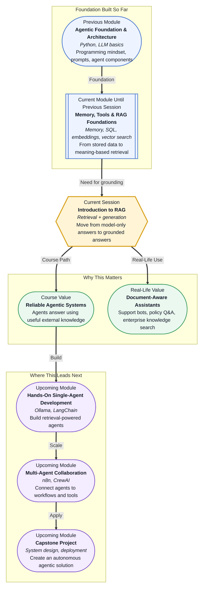

```mermaid
%%{init: {"flowchart": {"nodeSpacing": 45, "rankSpacing": 65, "diagramPadding": 20}} }%%
flowchart TB
    subgraph Foundation["Foundation Built So Far"]
        P1(["Previous Module<br/><b>Agentic Foundation &amp; Architecture</b><br/><i>Python, LLM basics</i><br/>Programming mindset, prompts, agent components"])
        C1[["Current Module Until Previous Session<br/><b>Memory, Tools &amp; RAG Foundations</b><br/><i>Memory, SQL, embeddings, vector search</i><br/>From stored data to meaning-based retrieval"]]
    end

    CS{{"Current Session<br/><b>Introduction to RAG</b><br/><i>Retrieval + generation</i><br/>Move from model-only answers to grounded answers"}}

    subgraph Value["Why This Matters"]
        CV(["Course Value<br/><b>Reliable Agentic Systems</b><br/>Agents answer using useful external knowledge"])
        RV(["Real-Life Value<br/><b>Document-Aware Assistants</b><br/>Support bots, policy Q&amp;A, enterprise knowledge search"])
    end

    subgraph Future["Where This Leads Next"]
        F1(["Upcoming Module<br/><b>Hands-On Single-Agent Development</b><br/><i>Ollama, LangChain</i><br/>Build retrieval-powered agents"])
        F2(["Upcoming Module<br/><b>Multi-Agent Collaboration</b><br/><i>n8n, CrewAI</i><br/>Connect agents to workflows and tools"])
        F3(["Upcoming Module<br/><b>Capstone Project</b><br/><i>System design, deployment</i><br/>Create an autonomous agentic solution"])
    end

    P1 ==>|&nbsp;Foundation&nbsp;| C1
    C1 ==>|&nbsp;Need for grounding&nbsp;| CS
    CS ==>|&nbsp;Course Path&nbsp;| CV
    CS ==>|&nbsp;Real-Life Use&nbsp;| RV
    CV ==>|&nbsp;Build&nbsp;| F1
    F1 ==>|&nbsp;Scale&nbsp;| F2
    F2 ==>|&nbsp;Apply&nbsp;| F3

    classDef previous fill:#eef4ff,stroke:#4f7ccf,color:#111827,stroke-width:2px;
    classDef current fill:#fff4d6,stroke:#d9a321,color:#111827,stroke-width:3px;
    classDef value fill:#eaf8ef,stroke:#3f9f63,color:#111827,stroke-width:2px;
    classDef future fill:#f4ecff,stroke:#8a61d1,color:#111827,stroke-width:2px;

    class P1,C1 previous;
    class CS current;
    class CV,RV value;
    class F1,F2,F3 future;
    linkStyle default stroke-width:3px;
```
