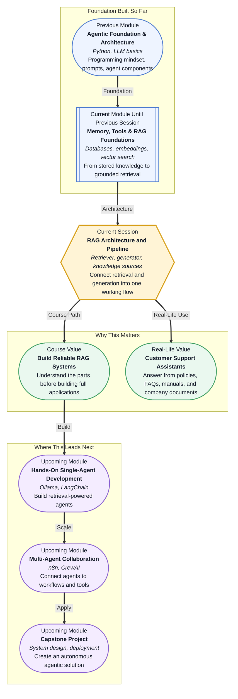

# Pre-read: RAG Architecture and Pipeline

## Context of This Session in the Course

Imagine you ordered a phone from an e-commerce website. The delivery is late, so you open the support chat and ask, **"Can I cancel my order and get a refund?"**

The chatbot replies confidently: **"Yes, you will get a full refund immediately."** It sounds helpful. But what if the actual company policy says refund is allowed only after the delivery partner confirms return pickup? What if electronics have a different rule from clothes? What if the policy changed last week?

This is where a normal AI answer can become risky. The language may be smooth, but the facts may not match the real policy.

In the previous session, you saw why **Retrieval-Augmented Generation**, or **RAG**, is useful. RAG helps an AI system answer with the support of external information instead of depending only on model memory. Now the important question is: **how does a RAG system actually work from inside?**

---

## From a Nice Answer to a Trustworthy Answer

For a customer support assistant, a good answer is not only polite. It must be **correct**, **grounded**, and **based on the right source**.

Think of a human support executive sitting in an office. If a customer asks about refunds, the executive should not guess from memory. They should open the latest refund policy, check the correct rule, and then explain it in simple language.

A RAG system follows the same idea.

It does not ask the LLM to answer blindly. It first searches trusted information, brings the relevant content into the conversation, and then asks the model to generate a clear response using that content.

In simple terms, the system is saying: **"First find the right material. Then write the answer."**

---

## The Three Main Pieces of a RAG System

A RAG pipeline may sound technical, but the basic structure is easy to understand. It has three important parts:

- **Knowledge sources:** These are the trusted materials the system can use, such as return policies, shipping policies, warranty rules, refund FAQs, product manuals, or company documents.
- **Retriever:** This is the search part of the system. It takes the user's question and finds the most relevant pieces from the knowledge sources.
- **Generator:** This is the LLM. It reads the user's question along with the retrieved content and writes the final answer in natural language.

For the e-commerce support use case, the **knowledge source** may be a small set of policy documents. The **retriever** may find the refund section and the electronics return rule. The **generator** may then explain the answer clearly to the customer.

Each part has a different responsibility. The knowledge source stores the facts. The retriever finds useful facts. The generator turns those facts into a helpful answer.

If any one part is weak, the final answer can suffer. If the documents are outdated, the system may use old rules. If the retriever finds the wrong policy, the model may answer from the wrong context. If the generator ignores the retrieved text, the answer may again become a guess.

---

## A Simple Analogy: The Library Desk

Think of a RAG system like a college library help desk.

A student asks, **"Which book should I read for introduction to databases?"** The librarian does not write a new textbook from memory. First, they search the library catalog. Then they pick a few relevant books. After that, they explain, **"Start with this beginner book, then use this reference book for SQL practice."**

In this analogy:

- The library shelves are the **knowledge source**.
- The librarian's search process is the **retriever**.
- The final explanation is the **generator**.

This is the core logic of RAG. The answer becomes stronger because it is connected to material that actually exists.

---

## How the Pipeline Moves Step by Step

The RAG pipeline usually starts with a user question. In our e-commerce example, the customer may ask, **"Can I return a damaged headset after ten days?"**

The system then sends this question to the retriever. The retriever searches the stored policy content and finds the most relevant chunks. A **chunk** simply means a small part of a document, like one paragraph or one section. Instead of sending the whole policy file to the model, the system sends only the useful parts.

Next, the retrieved content is added to the prompt as **context**. Context means supporting information given to the model so it can answer more accurately.

Finally, the generator writes the response. A good RAG answer may say that damaged products can be returned within a certain window, but only if the condition matches the warranty and return policy. The answer is no longer a random confident statement. It is grounded in retrieved policy content.

This flow can be remembered as:

- **Ask:** The user asks a question.
- **Retrieve:** The system finds relevant policy content.
- **Ground:** The content is added as context.
- **Generate:** The LLM writes the final answer.
- **Inspect:** We check whether the retrieved content and final answer make sense.

That last step is important. RAG is not magic. We still need to inspect whether the retrieved policy actually matches the user's intent.

---

## Why Retrieval Depth Matters

One small but powerful idea in RAG is **Top-K**. It means how many matching pieces the retriever should bring back.

If Top-K is too low, the system may miss an important policy. If Top-K is too high, the model may receive too much extra information and become confused. For example, a refund question may need the refund policy and return policy, but not the shipping delay policy, product catalog, and warranty FAQ all together.

So, RAG is not only about using retrieval. It is about using retrieval carefully.

In real systems, teams experiment with how much information should be retrieved. They compare answers with and without retrieval. They check whether the generator follows the provided context. They also look for cases where the system sounds correct but is using the wrong document.

This is why RAG architecture matters. Before building a big application, you must understand how each component affects the answer.

---

In this pre-read, you'll discover:

- How to **understand** the role of knowledge sources in a RAG system.
- How to **discover** what a retriever does before the LLM writes an answer.
- How to **learn** why the generator must use retrieved context instead of guessing.
- How to **connect** the full flow: customer query -> policy retrieval -> grounded response.

---

## What's Next

After this session, you will be able to talk about:

- How a minimal RAG architecture is arranged.
- Why e-commerce policy documents are useful knowledge sources for support assistants.
- How a retriever and generator work together.
- Why grounded answers are usually better than standalone LLM answers.
- How retrieval depth can change response quality.

This session is the bridge between understanding RAG as an idea and seeing RAG as a working system. Once the architecture is clear, building the pipeline becomes much less confusing.

---

## Interesting Questions for the Live Session

- If the retriever finds the wrong policy, can the generator still produce a polished but incorrect answer?
- How many document chunks should a support assistant retrieve before answering a customer?
- What changes when we compare an LLM-only answer with a RAG-grounded answer for the same refund question?
- How can we inspect whether the final response is truly based on the retrieved context?

By the end, RAG architecture should feel like a simple support workflow: **find the right policy, pass it as context, and generate a useful answer.**
