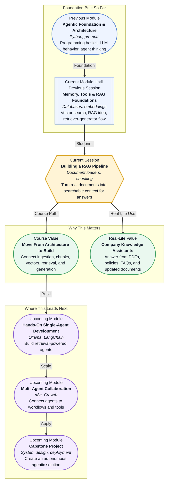

# Pre-read: Building a RAG Pipeline

## Context of This Session in the Course

Imagine an e-commerce company where customer support teams receive hundreds of questions every day.

One customer asks, **"Can I return a laptop charger if the box is opened?"** Another asks, **"Is express delivery refundable if the order arrives late?"** A third asks, **"Does the warranty cover water damage?"**

These questions sound simple, but the correct answers may be hidden across different documents: return policy PDFs, shipping terms, warranty pages, product FAQs, and updated company guidelines. If a support assistant gives answers only from memory, it can easily sound confident but still be wrong.

That is a serious problem. In real companies, one wrong answer can create refund confusion, customer anger, compliance issues, or extra work for the support team.

In the previous session, you saw how **RAG**, or **Retrieval-Augmented Generation**, combines search with answer generation. Instead of asking an AI model to guess, we first retrieve useful information and then ask the model to answer using that information.

Now the question becomes more practical: **how do we build the full workflow when the knowledge is not just one small text sample, but many real documents?**

---

## From One Policy Snippet to a Real Knowledge Base

A small demo may use two or three short policy lines. Real businesses do not work like that.

They have PDFs, web pages, text files, help-center articles, spreadsheets, old policy versions, and newly updated documents. A useful RAG assistant must handle this messy real-world knowledge and convert it into a format that the system can search.

Think of it like preparing a large study folder before an exam. If all your notes are mixed together, half printed, half handwritten, and some pages are from old versions, you cannot revise properly. First, you need to collect the material, organize it, divide it into meaningful sections, and then search the right part when needed.

A RAG pipeline follows the same idea.

It takes raw company documents, breaks them into manageable parts, converts those parts into searchable representations, stores them properly, retrieves the relevant pieces for a user question, and finally uses the LLM to produce a clear answer.

In simple words: **documents go in, useful context comes out, and the final answer becomes grounded.**

---

## The Two Big Ideas: Loading and Chunking

The first important step is **document loading**. A document loader is a tool or process that reads content from a source and brings it into the system. The source could be a PDF, a text file, a web page, or any other supported format.

For example, an e-commerce assistant may need to load:

- **Return policy** documents for product return rules.
- **Shipping policy** pages for delivery timelines and charges.
- **Warranty documents** for repair and replacement conditions.
- **FAQ files** for common customer questions.

Loading is not just about opening a file. The system must extract useful text and prepare it for the next steps.

The second important step is **chunking**. A chunk simply means a smaller meaningful piece of a larger document. Instead of giving a full policy document to the model, the system splits it into sections like refund rules, damaged product rules, delivery delay rules, and warranty exclusions.

This matters because search works better when the document pieces are neither too big nor too small.

If a chunk is too large, it may contain many unrelated rules and confuse the answer. If a chunk is too small, it may miss important context. For example, the line **"Refund is not allowed"** may be misleading if the next line says **"except for damaged items reported within the allowed window."**

Good chunking is like cutting a long chapter into proper study notes. Each note should be small enough to revise quickly, but complete enough to make sense.

---

## Why Chunk Size and Overlap Matter

When we split documents, we must decide the **chunk size**, which means how much text each piece should contain.

We also decide **overlap**, which means repeating a small part of one chunk in the next chunk. Overlap helps when an important idea continues across two sections. It reduces the chance that the system separates a condition from its explanation.

For example, a return policy may say:

- Products can be returned within a certain window.
- Electronics must pass a quality check.
- Open-box items may have special conditions.

If these lines are split badly, the retriever may bring only one part and miss the full rule. With better chunking and small overlap, the system has a higher chance of retrieving the right context.

This is why building a RAG pipeline is not only about connecting tools. It is about making thoughtful decisions at each step.

---

## The Complete Pipeline Flow

Once documents are loaded and chunked, each chunk is converted into an **embedding**. An embedding is a numerical representation of meaning. You can think of it as giving each text chunk a searchable identity based on what it talks about.

These embeddings are stored in a **vector database**, which is designed to search by meaning instead of exact words.

When a customer asks, **"Can I return a damaged headset after opening the package?"**, the system does not simply search for the exact same sentence. It looks for chunks that are close in meaning, such as damaged product rules, electronics return policy, and open-box conditions.

After retrieval, the selected chunks are passed into a structured prompt. A prompt is the instruction given to the model. Here, the prompt includes both the customer question and the retrieved policy content.

The LLM then generates the final answer. A good answer should not invent rules. It should explain what the retrieved documents support.

So the full flow becomes:

- **Load** real documents from trusted sources.
- **Clean and organize** the extracted text.
- **Chunk** documents into meaningful sections.
- **Embed** each chunk into a searchable format.
- **Store** chunks and metadata in a vector database.
- **Retrieve** the best-matching chunks for a user query.
- **Generate** the final answer using retrieved context.
- **Update** the knowledge base when documents change.

The last point is very important. Company policies are not fixed forever. If the refund rule changes, the RAG system must be refreshed so that it does not answer from old information.

---

In this pre-read, you'll discover:

- How to **understand** why real RAG systems need document loaders.
- How to **discover** the role of chunking in improving retrieval quality.
- How to **learn** why chunk size and overlap can affect final answers.
- How to **connect** loading, chunking, embeddings, storage, retrieval, and generation into one workflow.

---

## What's Next

After this session, you will be able to talk about:

- How a multi-document knowledge base is prepared for a RAG assistant.
- Why document loaders are needed before retrieval can happen.
- How chunking turns large documents into searchable context.
- Why metadata such as policy type can make retrieval more useful.
- How a complete RAG pipeline supports grounded answers in real applications.

This session moves RAG from a clean architecture diagram into a working build mindset. The goal is to see how raw documents become useful context for an AI assistant.

---

## Interesting Questions for the Live Session

- What happens if a refund policy is chunked too broadly and contains unrelated shipping rules?
- How can a support assistant know which chunks are relevant when the user does not use exact policy words?
- If a company updates one policy document, how should the RAG knowledge base be refreshed?
- Can two different chunking strategies produce different answers for the same customer question?

By the end, the RAG pipeline should feel like a practical workflow: **collect the documents, prepare them carefully, search the right pieces, and answer with evidence.**
