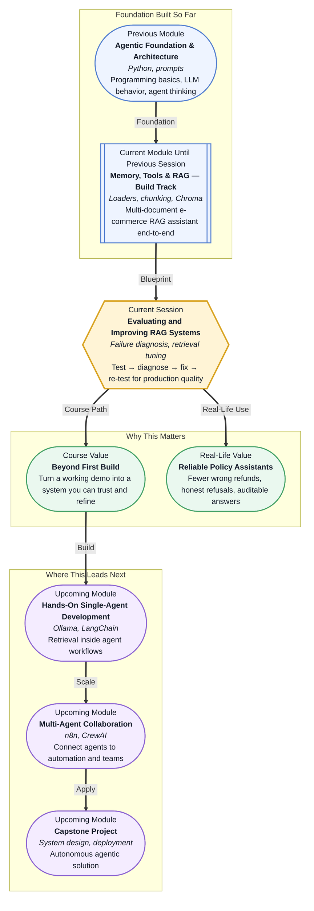

# Pre-read: Evaluating and Improving RAG Systems

## Context of This Session in the Course

Your e-commerce **support assistant** passed the happy-path demo. A teammate asked about **returns for opened electronics** — correct answer. Someone tried **express shipping refunds** — grounded in the shipping policy. Leadership nodded. The pilot looked ready.

Then real users arrived.

One customer asked: **"Can I return a laptop charger if the box is opened?"** The bot cited **general return windows** but missed the line about **accessories and opened packaging** buried in a different chunk. Another asked: **"Is UPI refund available for prepaid orders?"** The bot gave a confident **UPI workflow** — but **no UPI section exists** in your policy library. A third asked a fair question about **warranty and water damage**; the retriever pulled a **shipping delay** paragraph, and the model stitched an answer that sounded official but mixed two policies.

In the **previous session**, you **built** the pipeline — loaders, chunking, embeddings, Chroma storage, retrieval, generation — for the same e-commerce scenario. The system **worked**. Today's shift is professional: **building RAG is only the first step**. Reliable products **test with realistic queries**, **diagnose where failures live**, **apply targeted fixes**, and **repeat** — the same mindset production teams use before trusting a bot with refunds and compliance.

---

## When a working pipeline still gives wrong answers

A failed RAG answer is not one generic bug. It usually falls into one of three buckets:

| Failure type | What went wrong | Everyday sign |
|---|---|---|
| **Retrieval problem** | Wrong chunks retrieved, or the right policy never surfaced | Answer ignores the rule that exists in your documents |
| **Generation problem** | Good chunks retrieved, but the final answer misreads or blends them | Retrieved text says **30 days**; answer says **15 days** |
| **Hallucination** | Answer claims facts **not supported** by retrieved text | Detailed **UPI refund steps** when no UPI policy was retrieved |

**Hallucination reduction** starts with **knowing which bucket you are in**. Tuning **top-k** (how many chunks to retrieve) fixes a retrieval miss. It does not fix a model that ignores retrieved text. Stricter **grounding prompts** (instructions that say *answer only from context*) help generation. They do not invent missing policy.

The live session teaches you to **evaluate retrieval and generation as separate stages** — first ask *"Did we fetch the right policy?"*, then ask *"Did the answer faithfully reflect what we fetched?"* — before changing anything at random.

---

## The challenge we will tackle

What if you run **twenty realistic customer queries** through your assistant and half the failures trace back to **chunk boundaries** — the **30-day electronics rule** split across two chunks, and retrieval always returns only one?

What if raising **top-k** from 3 to 10 pulls in **shipping noise** whenever someone asks about **returns** — more context, worse answers?

What if retrieval is perfect but the model **summarises loosely** — adding **"immediate refund"** when the policy says **"refund after inspection"**?

What if the team ships version one and never **re-tests** after a policy PDF update — so answers quietly drift from **current** rules?

These are **retrieval tuning** and **evaluation** problems, not "the AI is broken" problems. You will analyse the **e-commerce RAG assistant** from the **previous build session**, classify failures, apply **at least two improvement levers**, and observe before/after behaviour on sample queries.

---

## The clinic test: wrong lab, misread report, or invented result

Picture a **clinic** diagnosing why a patient got bad advice.

**Wrong test ordered** — the doctor never checked the report that would answer the question. That is a **retrieval failure**: the policy paragraph was in the library, but search did not bring it to the desk.

**Report on desk, misread** — the correct paragraph was available, but the doctor quoted the wrong line. That is a **generation failure**: evidence present, answer wrong.

**No report, confident diagnosis anyway** — the doctor invented a treatment not on any page. That is **hallucination**: the answer is not supported by retrieved evidence.

Good clinics do not replace the entire hospital after one mistake. They ask **which stage failed** and fix **that stage**. RAG improvement works the same way — **targeted fixes** after **honest diagnosis**, not random prompt stuffing.

---

## Improvement levers you will apply

Once you classify a failure, you reach for specific levers — often **two or more** on the same assistant:

**Top-k adjustment** — Retrieve more or fewer chunks. Too few misses relevant rules; too many adds confusing policy types (shipping mixed with returns).

**Chunk refinement** — Change chunk size or overlap so related conditions stay together — e.g. **opened box** and **accessory returns** in one searchable unit.

**Metadata filtering by policy type** — Tag chunks as **returns**, **shipping**, **warranty**, **refund** and filter search so a returns question does not pull shipping paragraphs.

**Stricter grounding prompts** — Tell the model to use **only** retrieved text, cite when uncertain, and **refuse** when context does not contain the answer — critical for **hallucination reduction** on out-of-domain questions like **UPI** when your corpus has no UPI section.

**Precision vs recall trade-off** — Narrow retrieval (high precision) vs broader retrieval (high recall). Support bots that handle **money and compliance** often prefer **missing with honesty** over **guessing with confidence**.

Each lever should be tied to a **diagnosed failure**, not applied because a blog post said so. You **re-test** the same query set after each change and note what moved.

---

## The iterative evaluation cycle

Production RAG is a **repeat cycle**, not a one-time notebook: **test** with realistic queries, **diagnose** whether retrieval, generation, or hallucination failed, **apply** a targeted improvement, **re-test** and compare, then **repeat** when policies or user behaviour change.

**User feedback** — support agents flagging wrong answers, customers rating replies — feeds the next test batch. **Policy updates** — new refund PDF, revised warranty — mean **refreshing the index** and **re-running** key questions. Teams that skip this loop ship demos; teams that keep it ship **trust**.

This **iterative evaluation mindset** closes Module 2's RAG track: you moved from **vector search** to **architecture** to **full pipeline build**; now you learn to **maintain quality** like an owner, not only an installer.

---

In this pre-read, you'll discover:

- **How** to **classify RAG failures** as **retrieval**, **generation**, or **hallucination** — and why the fix depends on the class
- **How** to **evaluate retrieval and generation separately** on realistic e-commerce customer queries
- **How** to **apply targeted improvements** — top-k, chunking, metadata filters, grounding prompts — and observe effects on sample queries
- **Why** **ongoing test → diagnose → improve → re-test** is required for reliable production RAG, not optional polish

---

## Words you will hear — explained right away

- **Failure mode:** A **repeatable pattern** of wrong behaviour — wrong chunks, misread evidence, or invented facts.
- **Retrieval tuning:** Adjusting **how search works** — top-k, filters, chunk design — so the right policy surfaces.
- **Hallucination:** Model output that **sounds authoritative** but is **not supported** by retrieved documents.
- **Grounding prompt:** Instructions that require answers to **follow retrieved context** and **refuse** when evidence is missing.
- **Top-k:** The **number of best-matching chunks** returned per search — a knob you tune, not a magic constant.
- **Metadata filter:** Searching only within chunks tagged **returns** or **warranty**, so irrelevant policy types stay out.
- **Precision vs recall (retrieval):** **Precision** — retrieved chunks are on-topic. **Recall** — you find every relevant rule, even if some noise slips in.
- **Iterative evaluation:** A **repeat cycle** of testing, diagnosing, fixing, and re-testing — especially after policy or user behaviour changes.

---

## What's next

After this session, you should be able to:

- **Test** your e-commerce RAG assistant with **realistic customer queries** beyond the demo path
- **Diagnose** whether each bad answer is primarily **retrieval**, **generation**, or **hallucination**
- **Improve** quality through **at least two levers** you can justify from diagnosis — not guesswork
- **Compare** before and after behaviour on the **same questions** and explain what changed
- **Outline** a simple **production habit**: test → diagnose → improve → re-test when documents or feedback change
- **Connect** this discipline to **upcoming** work where RAG lives **inside agents and LangChain workflows** — same quality bar, richer surface area

**Upcoming** sessions in the same module introduce **APIs and tool integration** — how agents **call** systems beyond document search. The evaluation mindset you build here applies there too: **observe failures, classify them, fix the right layer**.

---

## Interesting questions for the live session

1. A customer asks **"Can I return opened electronics within 30 days?"** Retrieval returns only a chunk about **packaging materials**, not **electronics**. Is this primarily **retrieval**, **generation**, or **hallucination** — and would you fix **chunk boundaries**, **top-k**, or the **grounding prompt** first?

2. Retrieval returns the correct **"30 days with inspection"** paragraph, but the answer says **"instant refund, no inspection."** Which stage failed — and why would raising **top-k** probably **not** help?

3. After your company publishes an **updated refund policy PDF**, the bot still answers from **old 7-day language**. The model and prompts are unchanged. What part of the **iterative cycle** was skipped — and what would you **re-test** before calling the update done?

Come ready to treat your RAG assistant like a **product**, not a **project demo**. The previous session gave you the pipeline; this session gives you the **quality loop** that keeps answers trustworthy when real customers, real policies, and real edge cases show up.
