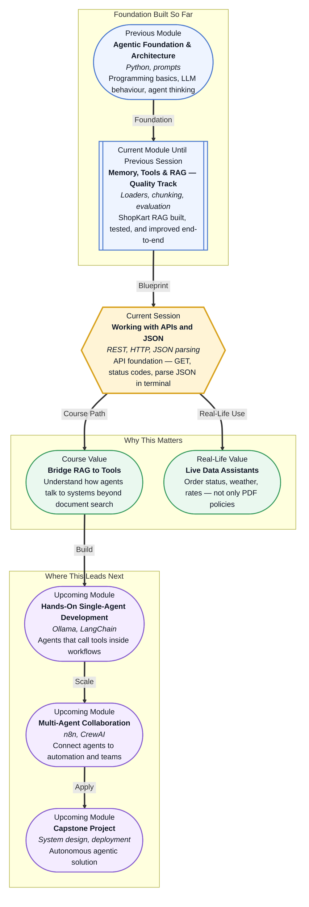

# Pre-read: Working with APIs and JSON

## Context of This Session in the Course

Your **ShopKart support assistant** can now answer policy questions with confidence — return windows, shipping timelines, warranty rules — because it **searches stored documents** and **grounds** answers in what it finds. That is a major step. But a customer messages: **"Where is my order ORD-88421 right now?"** Another asks: **"What is today's exchange rate for a refund to USD?"** A third wants **live delivery ETA**, not the general shipping policy paragraph.

Your RAG pipeline has **no answer** for these. The policies are in your library; the **order location**, **currency rate**, and **courier status** live in **other systems** — updated every minute. If the bot guesses from policy text, it will sound polite and still be **wrong**. That gap is where **APIs** enter the story.

In the **previous sessions**, you already crossed this bridge once without naming every part. Every time your assistant called the **Groq model** to generate a reply, your code sent a **structured request** and received a **structured response** — the same pattern banks, food apps, and travel sites use millions of times a day. This session makes that pattern **visible and reusable**, so your agent can reach **live data outside your document library**, not only PDFs and text files.

---

## When stored knowledge is not enough

**Retrieval-augmented generation** answers from **what you have already loaded** — policies, FAQs, manuals. It is the right tool when the truth lives in **documents you control**.

**Live external data** answers from **systems you do not own** — order databases, payment gateways, weather feeds, currency services. Those systems expose a **contract**: send a request in an agreed format, receive a response in an agreed format. That contract is an **API** (Application Programming Interface) — a formal way for one piece of software to ask another for work and get a result back.

| Situation | Best approach | Example |
|---|---|---|
| Answer from company policy files | **RAG** — search stored chunks | "Can I return opened accessories?" |
| Answer from live operational data | **API** — fetch current record | "Where is order ORD-88421?" |
| Generate natural language from evidence | **LLM call** — also an API | Turn retrieved policy into a polite reply |

The challenge for a support team — and for you as a builder — is not choosing **RAG or API**. It is knowing **which question needs which source**, and how to **pass clean data** from an external response into the model so the final answer stays **accurate and grounded**.

---

## The request-and-response conversation every agent depends on

Every API conversation has the same rhythm, whether you are fetching order status or asking an LLM to write a reply:

1. **You ask** — where to send the request, what action you want, and any details needed (like an order ID).
2. **The system replies** — first with a **status** that says success or failure, then with **data** in a standard shape.

Think of it like **ordering at a restaurant with a fixed menu**. You do not walk into the kitchen. You tell the **waiter** exactly what is on the menu — table number, dish name, special instructions. The waiter carries that **request** to the kitchen. The kitchen sends back **food** or says **"that item is unavailable today."** The API is the waiter; the **menu** is the contract listing what you may ask for and what you will get back.

For your ShopKart work, the **Groq call** you used while building and evaluating RAG followed this same rhythm. You prepared a **prompt**, sent it through a **request**, and read back a **reply** packaged as structured data. Once you see that parallel, APIs stop feeling like "backend developer jargon" and start feeling like **how agents breathe outside their notebook**.

---

## REST, status codes, and the language of data

Most web APIs you will meet follow **REST** conventions — a widely used style where **actions** map to familiar verbs:

| Action you want | Usual request type | Plain meaning |
|---|---|---|
| Read existing data | **GET** | "Show me this information" |
| Create something new | **POST** | "Add this record" |
| Update existing data | **PUT** or **PATCH** | "Change this field" |
| Remove something | **DELETE** | "Remove this entry" |

When the other system answers, it sends a **status code** — a short signal about how the conversation went. You may already have felt these in the **previous session** when **Groq rate limits** stopped answers mid-demo: the system was saying **"too many requests — slow down"** rather than **"here is your answer."**

| Code | Plain meaning | When you might see it |
|---|---|---|
| **200** | Success — here is your data | Order details fetched correctly |
| **400** | Bad request — you sent something invalid | Wrong order ID format |
| **401** | Not authorised — missing or wrong credentials | API key not accepted |
| **404** | Not found — that resource does not exist | Order number not in the system |
| **429** | Too many requests — rate limit hit | Heavy testing during live demos |
| **500** | Server error — problem on their side | External service temporarily down |

Checking the **status** before trusting the **data** is a professional habit — the same way you would not treat a waiter shrugging as proof your order is ready.

The **data** itself usually arrives as **JSON** — a structured format built from **labels and values**, grouped in **objects** and **lists**. If you have worked with Python **dictionaries** and **lists**, JSON will feel familiar: nested information with clear names, easy for both humans and programs to read. APIs send JSON as **text**; your job in the live session is to **turn that text into usable values** — order status, city name, amount — and **route the right fields into a prompt** so the model answers from **fresh facts**, not stale guesses.

---

In this pre-read, you'll discover:

- **Why** agents need **APIs** alongside **RAG** — stored documents for policy, live requests for operational facts
- **How** the **request–response pattern** works — and how it connects to the **Groq calls** you already used in the ShopKart labs
- **What** **REST methods** and **HTTP status codes** mean in plain language — including **rate-limit failures** you may have seen before
- **How** **JSON** carries API data — and how extracting the right fields prepares work for **agent tools** in the **next** session

---

## Words you will hear — explained right away

- **API:** A **contract** between two software systems — what you may request and what response you should expect back.
- **REST API:** A common **style** of web API where URLs and request types (GET, POST, etc.) express what you want to do.
- **Request:** What **you send** — where to go, what action to take, and any details (headers and body carry this information).
- **Response:** What **you get back** — a **status code** plus **data** (often JSON).
- **JSON:** A **structured text format** for data — named fields, nested groups, and lists — used almost everywhere in modern APIs.
- **Status code:** A **numbered signal** (like 200 or 404) that tells you whether the call succeeded before you read the payload.
- **Rate limit:** A **cap** on how many requests you can make in a short window — protects shared services from overload.
- **Parse:** To **read structured response text** and pull out the specific values your agent or prompt needs.

---

## What's next

After this session, you should be able to:

- **Explain** when a ShopKart-style assistant should use **document search (RAG)** versus a **live API fetch**
- **Describe** the parts of an API **request** and **response** using the same language as your existing **LLM calls**
- **Interpret** common **HTTP status codes** — including **429 rate limits** — before trusting response data
- **Recognise** **JSON structure** in API responses and identify which fields matter for a given customer question
- **Execute** a **GET request** with **`requests`**, handle non-200 responses safely, and **print extracted JSON fields** in the terminal — the fetch-and-parse foundation the **next** session extends into **function calling** and **Groq replies**
- **Prepare** for **tool integration** — registering today's weather helper and RAG retrieval as **agent tools**, then merging live JSON with policy excerpts in one customer reply

---

## Interesting questions for the live session

1. A customer asks **"What is your return policy for opened electronics?"** and another asks **"Has my refund for order ORD-4421 been processed?"** — which question should your assistant answer from **stored policy documents**, which needs a **live API call**, and why would mixing them up create **confident but wrong** replies?

2. Your code sends a request for order details and receives status **404** with an empty data section. Should the assistant tell the customer **"Your refund was approved yesterday"** based on general refund policy text? What should happen **before** any LLM generates a user-facing answer?

3. A weather service returns JSON with **city**, **temperature**, and **forecast summary** — but your prompt only needs **temperature** for a one-line reply. Why is **selecting specific fields** better than dumping the entire response into the model — and how does that habit help when you connect **multiple tools** in the **upcoming** module work?

Come ready to learn how software systems **talk in structured JSON** — the step before your ShopKart assistant can **choose tools** and answer with both **policy rules** and **live facts** in the **next** session.
