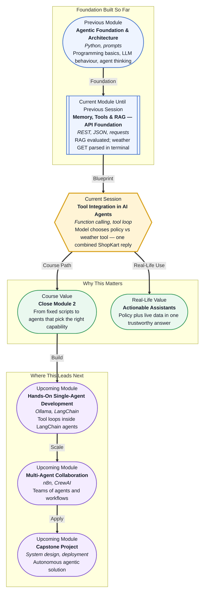

# Pre-read: Tool Integration in AI Agents

## Context of This Session in the Course

Your **ShopKart support assistant** can answer **return windows** from policy documents and can **fetch live weather** as structured JSON — you proved the second part in the **previous session** by calling a public API, checking the status code, and printing extracted fields in the terminal.

But the script still **hard-codes the path**. Every branch — *policy question*, *weather check*, *both together* — would need **your** `if/else` logic written in advance. That does not scale when customers ask unpredictable combinations: *"Express delivery to Mumbai tomorrow — policy says metro express is 1–2 days, but will rain delay the handoff?"*

A **chat-only model** might guess. A **fixed script** might call the wrong tool. What you need is an **agent runtime** where the **model reads tool descriptions** and **chooses** policy search versus weather fetch — then your Python code **runs** the choice and **returns JSON** for the final reply.

That shift — from **you wiring every branch** to **the model picking tools** — is **function calling**, and it closes **Module 2**.

---

## The problem with scripts that only talk or only fetch

Imagine a support desk with two specialists: one holds the **policy binder**, one checks the **live weather screen**. A customer asks a question that needs **both**. If you wrote a script that **always** opens the binder first, you waste time on pure weather questions. If it **always** checks weather, refund policy questions get invented numbers.

| Approach | Strength | Weakness |
|---|---|---|
| **Chat-only LLM** | Natural language | Invents live facts; stale on orders and weather |
| **RAG only** | Grounded policy | Cannot see rain outside the PDF |
| **Fixed API script** | Live JSON | Wrong tool for policy-only questions |
| **Agent with tools** | Picks capability per question | Needs clear tool descriptions and safe error handling |

The challenge: **who decides** which specialist to call? In early labs, **you** decided in code. In this session, the **model proposes** the tool; **your Python runtime validates and executes** — the same division of labour production agent systems use before LangChain wraps it in the **upcoming** module.

---

## Function calling — the coordinator, not the courier

**Function calling** does **not** mean the model runs Python on the server by itself. The model outputs a **structured choice**: tool name plus arguments. Your application **performs** the real work — HTTP GET, policy search, database query — and sends **JSON results back** for the final answer.

Picture a **hotel concierge**. The guest asks for a restaurant and a taxi. The concierge **decides** whom to call — they do not cook the meal or drive the car. They **route** the request, wait for **structured answers**, and **compose** one polite reply. The LLM is the concierge; your registered Python functions are the restaurant and taxi services.

The loop you will trace live:

1. **User asks** a ShopKart question.
2. **Model reads** available tools and their descriptions.
3. **Model requests** zero, one, or **multiple** tool calls with arguments.
4. **Runtime executes** each tool — weather GET, policy search.
5. **JSON results return** to the model.
6. **Model writes** the customer-facing answer using **only** tool outputs and policy excerpts — not invented rain or refund timelines.

**Common doubt:** *"If the model picks the tool, can it still hallucinate?"* **Yes** — if tool results are ignored or errors are hidden. That is why the **previous** evaluation habit matters: check **what each tool returned** before trusting the final paragraph.

---

## Two tools, one ShopKart story

Today's lab registers **two tools** on the same assistant:

| Tool | Purpose | Returns |
|---|---|---|
| **Policy search** | Ground answers in ShopKart **returns / shipping / warranty / refunds** | JSON with policy excerpts |
| **Weather fetch** | Live **temperature and conditions** for a delivery city | JSON from the public API you built in the **previous** session |

A question like *"Express handoff in Delhi tomorrow — metro express rules and current weather?"* should trigger **both**. A question like *"Can I return unopened earphones within seven days?"* should trigger **policy only**. Your job in the live session is to **register clear descriptions** so the model routes correctly — vague names like `tool1` and `tool2` fail in practice.

When a weather API returns **non-200**, or policy search finds **no excerpt**, the agent must **say so honestly** — not fill gaps with confident fiction. Safe error messages are part of **tool integration**, not an optional extra.

---

In this pre-read, you'll discover:

- **Why** agents need **tools** — not only RAG and not only fixed API scripts
- **How** **function calling** lets the **model choose** policy search versus live weather fetch
- **What** a **tool execution loop** looks like — propose, run, return JSON, reply
- **How** to **combine policy excerpts and live weather** in one grounded ShopKart answer without mixing up sources

---

## Words you will hear — explained right away

- **Tool:** A named capability your Python code exposes to the agent — search policy, fetch weather, look up an order.
- **Function calling:** The pattern where the model outputs **which tool** to run and **with what arguments**; your runtime executes it.
- **Tool schema:** A description of the tool name, purpose, and expected inputs — helps the model route correctly.
- **Tool execution loop:** Repeat until the model stops requesting tools: call → JSON result → model continues → final answer.
- **Agent runtime:** Your Python application that registers tools, runs them, and feeds results back to the LLM.
- **Structured tool result:** JSON returned from a tool — the only live facts the final answer should cite.

---

## What's next

After this session, you should be able to:

- **Explain** why **function calling** beats hard-coded `if/else` for mixed ShopKart questions
- **Register** at least **two tools** — policy search and weather fetch — with clear descriptions
- **Execute** the **model → tool call → JSON result → final reply** loop using **Groq**
- **Handle** tool failures safely when an API errors or retrieval returns nothing useful
- **Demonstrate** one answer that combines **policy rules** and **live weather** without inventing either
- **Connect** this pattern to **upcoming** **LangChain** work where the same loop is managed by an **agent executor**

---

## Interesting questions for the live session

1. A customer asks **"What is the return window for unopened items?"** and another asks **"Is it raining in Mumbai right now?"** — which tool(s) should run for each, and what goes wrong if the model calls **weather** for a pure policy question?

2. The weather tool returns **`{"error": "API status 500"}`** but the final answer says **"Light drizzle expected — delivery may slip by one hour."** Which stage failed — tool execution, tool routing, or **generation** — and how would you fix it using habits from the **previous** evaluation work?

3. One question needs **express shipping policy** and **live Delhi weather**. Why is it better to run **two tool calls** and merge JSON results than to paste an entire weather API response and full policy PDF into one prompt?

Come ready to turn your ShopKart assistant from a **script that fetches** into an **agent that chooses** — the last build block of **Module 2** before single-agent development begins in the **upcoming** module.
