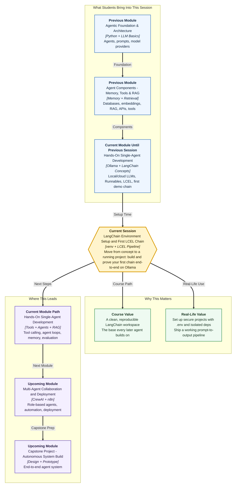

# Pre-read: LangChain Environment Setup and First LCEL Chain

## Context of This Session in the Course

## From Ideas to a Working LangChain Project

Imagine a small team building a student-help chatbot for a college website. One teammate creates the prompt, another connects the model, and someone else tests the final output. Everything looks simple in discussion, but when they try to run the project on different laptops, problems begin.

One laptop has a different Python package version. Another has the model name typed differently. Someone has pasted a private key directly into a Python file. Another person says, "It works on my machine," but nobody else can run it.

This is the gap today's session closes. You are not only learning how to write a LangChain chain. You are learning how to prepare a **clean workspace** where the chain can run in a predictable, professional, and team-friendly way.

Think of it like setting up a kitchen before cooking. If the ingredients are scattered, the gas is not connected, and the recipe is written on random sticky notes, even a simple dish becomes stressful. But when the kitchen is arranged, ingredients are labelled, and the recipe is clear, cooking becomes smooth. A LangChain project also needs that kind of arrangement.

In this pre-read, you'll discover:

- **Understand** why an isolated Python environment protects your project from package confusion.
- **Learn** how `.env` files keep settings and secrets away from source code.
- **Discover** how ChatOllama connects LangChain to a local Ollama model.
- **Understand** how a prompt, model, and parser become one LCEL pipeline.

## Why Setup Is Not Just "Installation"

Many beginners think setup means only installing packages. In real projects, setup means something deeper: creating a repeatable structure that another person can understand, clone, and run without guessing.

A **virtual environment**, often called `venv`, is a separate Python space for one project. In simple words, it is like keeping different college subject notebooks separate. Your maths notes should not get mixed with your chemistry notes. Similarly, one project's packages should not disturb another project's packages.

This matters a lot in AI development because libraries change quickly. LangChain, Ollama integrations, and helper tools may receive updates often. If you install everything into your main system Python, you may accidentally break an older project while preparing a new one.

Today's session treats setup as the foundation of trust. Before asking the model to answer anything, you first make sure the project has its own environment, required packages, safe folders, and clear configuration.

## Keeping Secrets and Settings in the Right Place

A professional AI project should not keep private details inside code. Even if you are using local Ollama and may not need an API key, you still need a clean way to store settings like model name, host URL, and temperature.

This is where **environment variables** help. An environment variable is a setting stored outside the main code and read when the program runs. In simple Indian English, it is like a private sticky note your program checks before starting.

For example, your ATM card can be used only with a PIN, but you would never write the PIN on the card itself. Similarly, a project may need important configuration, but that configuration should not be hardcoded into Python files.

The `.env` file becomes the local place for these values. The `.env.example` file becomes the shareable template for teammates. The `.gitignore` file makes sure private local files do not accidentally go to GitHub. This small habit separates casual scripts from professional development.

## Meeting the Main Pieces

Once the workspace is ready, the session moves into the first working chain. The model connection will happen through **ChatOllama**. ChatOllama is a LangChain wrapper that talks to your Ollama server. In simple words, it is the adapter between LangChain's workflow and the model running through Ollama.

Then comes **ChatPromptTemplate**. A prompt template is a reusable message structure with blanks that can be filled later. Think of a college notice format: the structure remains the same, but the date, event name, venue, and audience keep changing. ChatPromptTemplate does this for chat-style model inputs using roles like system and human.

After the model responds, you need clean output. A model response may come as an object with extra information, but your application often needs a plain string. **StrOutputParser** handles that final cleanup. In simple words, it takes the useful answer and gives it back in a format your program can easily display or pass forward.

The final idea is **LCEL**, which stands for LangChain Expression Language. LCEL lets you connect pieces into a pipeline. You can imagine it like a metro route: input enters the first station, moves to the next station, and exits at the final station. The order matters, and each station has a clear job.

## The Chain Mental Model

The first chain in this session has a simple but powerful flow:

- The prompt prepares the message.
- The model generates a response.
- The parser converts the response into clean text.

This is the base pattern behind many larger AI systems. Later, you may add tools, memory, retrieval, evaluation, or multiple agents. But under all that complexity, the same discipline remains: define the input clearly, send it through reliable components, and check the output before showing it to users.

That is why this session is important. You are not just running a demo. You are learning the first professional rhythm of LangChain development: setup, configure, connect, run, and validate.

## What Comes Next

After this session, you should be able to talk confidently about:

- Why a LangChain project should have its own isolated Python environment.
- How `.env`, `.env.example`, and `.gitignore` support safe collaboration.
- How ChatOllama binds your LangChain code to a local Ollama model.
- How ChatPromptTemplate, ChatOllama, and StrOutputParser form a clean LCEL chain.
- Why testing the same chain with different inputs is necessary before trusting it.

## Interesting Questions for the Live Session

- If the same chain works on one laptop but fails on another, where should you start debugging first?
- What happens when your `.env` model name does not exactly match the model available in Ollama?
- How can one small LCEL chain become the starting point for future agents with tools, memory, and retrieval?
