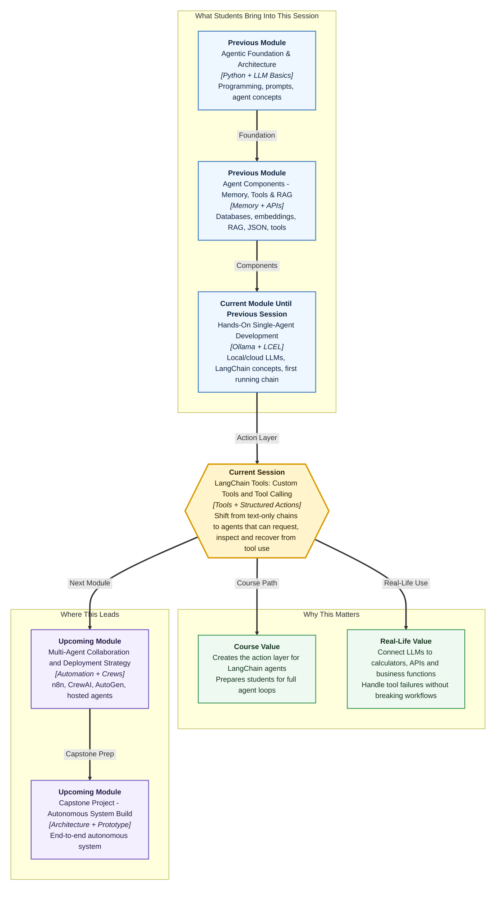

# Pre-read: LangChain Tools: Custom Tools and Tool Calling

## Context of This Session in the Course

---

Imagine you are using a food-delivery app during a rainy evening. You type, *"Find me something hot under 200 rupees, check if it can reach in thirty minutes, and apply the best coupon."* A normal chat reply is not enough here. The app must search restaurants, compare prices, check delivery time, apply a coupon, and then show a final answer you can trust.

Now think about an AI assistant inside a company. Someone asks, *"What is the latest leave balance for Priya, and can you draft a short approval message if she has enough days left?"* If the assistant only writes text from memory, it may guess. That is risky. It needs to **use tools**: maybe one tool checks the HR database, another formats the message, and another records the approval request.

This is where the next mental shift begins. In the previous session, you made a LangChain chain that could take input, pass it through a prompt, call a model, and return a clean response. That is a strong start, but it is still mostly a **text-only flow**. Real agentic systems need the model to decide when a task requires outside help, ask for that help in a structured way, receive the result, and then continue the conversation intelligently.

In this pre-read, you'll discover:

- **Understand** why tools turn an LLM from a talker into a task performer.
- **Learn** how LangChain describes tools so a model can choose the right one.
- **Discover** what a structured tool call looks like before it is executed.
- **Understand** why error handling is important when tools fail or receive wrong inputs.

## From Helpful Reply to Useful Action

A language model is excellent at understanding intent and generating explanations. But many real problems need **fresh data**, **calculation**, or **external action**. The model may understand the sentence *"calculate the final invoice after discount and tax"*, but the actual calculation should be done by a reliable function, not by guesswork.

That function is what we call a **tool**. A tool is a small, clearly described capability that the model can request when needed. It may be a calculator, a weather lookup, a database search, a ticket-booking API, or a company policy checker.

Think of the model like a smart team lead in an office. The team lead understands the customer's problem, but does not personally do every job. For salary details, they call HR. For tax calculation, they call accounts. For delivery status, they call operations. The quality of the final answer depends on choosing the right specialist and passing the right details.

LangChain tools bring this same office logic into your agent workflow.

## Why Tool Descriptions Matter So Much

When humans ask for help, we rely on names and descriptions. If you see two counters in a railway station, one marked **Ticket Booking** and another marked **Parcel Enquiry**, you know where to go. If both counters are only labelled *Service*, confusion begins.

Models also need clear labels. A LangChain-native tool is not just a function. It carries a **name**, **input structure**, and **description**. The description tells the model when the tool should be used. The input structure tells the model what information must be provided.

For example, a tool that checks course attendance should make it clear that it needs a student ID and returns attendance status. A vague tool description like *"gets data"* is weak because the model may call it for the wrong reason. A precise description like *"fetches attendance percentage for one student using their student ID"* gives the model a better chance of selecting it correctly.

This is why today's session focuses on **typing** and **descriptions**. Typing means we clearly define what kind of input a tool expects, such as text, number, or a structured object. Descriptions mean we explain the tool's purpose in simple, direct language. Together, they reduce confusion.

## What Is a Tool Call?

A **tool call** is the model's structured request to use a tool. It is not the final answer. It is more like a filled request slip.

In daily life, imagine telling a shop assistant, *"Please check if size 9 is available in black."* The assistant may write a small internal note: product equals shoe, size equals 9, colour equals black. That note is structured, so the stockroom person knows exactly what to check.

Similarly, a model-emitted tool call usually contains three important ideas:

- The **tool name**, meaning which capability the model wants to use.
- The **arguments**, meaning the specific input values the tool needs.
- The **call identity**, meaning a way to match the tool's result back to the original request.

LangChain lets you inspect these tool calls before execution. This is powerful for learning and debugging because you can see whether the model understood the user's question properly. If the user asks for a discount calculation but the model selects a weather tool, you immediately know the selection went wrong.

## The Tool Feedback Loop

Tool calling is not magic in one step. It is a loop.

First, the user asks a question. Then the model decides whether a tool is needed. If yes, the model emits a structured tool call. Your program executes the requested tool and captures the output. That output is sent back to the model as a **ToolMessage**, which simply means a message carrying the tool's result. Finally, the model uses that result to produce a coherent final response for the user.

This loop is similar to a doctor asking for a blood test. The doctor listens to symptoms, requests a specific test, reads the test result, and then gives advice. The test result alone is not the final advice. It becomes useful only when the doctor interprets it in context.

In agentic systems, the model plays the interpreting role. The tool provides reliable external information or action results. LangChain gives you the message structure to connect both sides cleanly.

## When Tools Fail

In real systems, tools do not always behave perfectly. A user may provide a wrong ID. An API may be down. A calculator tool may receive text where it expected a number. A database may return no matching record.

If the whole application crashes at the first failure, the assistant feels unreliable. A better system treats failure as a recoverable signal. It can say, *"I could not find that student ID. Please check the ID and try again."* Or it can ask a follow-up question instead of pretending everything worked.

This is called **error containment**. It means keeping the failure inside a controlled boundary so the agent can respond gracefully. For beginners, the key idea is simple: a tool failure should become useful information for the model, not a silent disaster for the user.

This is especially important in professional workflows. Imagine an HR onboarding assistant, a finance helper, or a support bot. These systems must be honest when a tool fails. Recoverable errors build trust because the user knows what happened and what to do next.

## What You Will Be Able to Do Next

After this session, you will be able to talk about agent tools with much more confidence:

- Explain why a model needs tools for real-world tasks.
- Create tool definitions that are easier for a model to select correctly.
- Inspect tool calls and understand what the model is trying to do.
- Connect tool results back into the conversation using tool messages.
- Recognize common tool-selection and argument mistakes from traces.
- Design agent behavior that does not collapse when a tool fails.

The most exciting part is that this session is the bridge between a simple chain and a real agent loop. Once tools are available, the assistant is no longer limited to only generating words. It can request calculations, fetch facts, ask APIs, and combine those results into a useful answer.

## Interesting Questions for the Live Session

- If two tools look similar, how can we help the model choose the correct one?
- What should the agent do when the model passes incomplete or incorrect arguments to a tool?
- How can we inspect tool-call traces to understand whether the agent is behaving sensibly?
- When should a tool error be shown to the user, and when should the agent attempt recovery first?

By the end, **tool calling** should feel less like a mysterious agent feature and more like a disciplined workflow: understand the request, choose the right helper, pass the right details, read the result, and answer with confidence.
