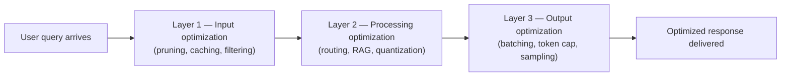

# MCP, On-device SLMs, Token Optimization, and LLMOps

## Resources

[Deck](https://canva.link/fylv43q6ycaxzn2)

[Ideal project submission template](https://docs.google.com/document/d/1FsCSVLryWnXz4-oGrNheihl-mBzSW76D/edit?usp=sharing&ouid=109823013851316341035&rtpof=true&sd=true)


## 1. What You'll Learn in This Section

In this lesson, you'll learn to:

- Explain what Model Context Protocol (MCP) is and configure it in Claude Desktop using a real JSON config.
- Distinguish on-device Small Language Models from cloud LLMs and identify where each excels.
- Apply the three-layer token optimization framework to reduce costs in any AI application.
- Build and use an LLMOps dashboard to monitor the health, cost, and safety of a production LLM application.

---

## 2. Detailed Explanation

### Model Context Protocol (MCP)

**MCP (Model Context Protocol)** is an open standard launched in 2024 by Anthropic. Think of it as the USB-C port for LLMs — just as USB-C lets any peripheral plug into any device, MCP lets any external application plug into any LLM.

**Why it matters**

Without MCP, asking an LLM like ChatGPT or Gemini to place a food order or execute a trade returns advice — not action. The LLM explains what to do but cannot actually do it, because it has no way to reach external tools. MCP fixes this by defining a standardized endpoint schema that any company (Zomato, Zerodha, Spotify, Uber) can implement. Once a company publishes an MCP server, any LLM that supports MCP can call that company's tools directly on behalf of the user.

**Walkthrough**

MCP wraps a company's existing API into a standard configuration schema. You add that schema to Claude Desktop's developer config file. Every time a new session starts, the LLM prompts you to authenticate, then acts on your behalf.

Setup steps for Claude Desktop:

1. Open Claude Desktop → Settings → Developer → Edit Config.
2. Add the MCP server entry under `mcpServers` in the JSON config file.
3. Restart Claude Desktop.
4. Authenticate when prompted — the LLM handles the OAuth or OTP flow.

Here is what a Zerodha Kite MCP entry looks like in the config:

```json
{
  "mcpServers": {
    "kite": {
      "command": "npx",
      "args": ["mcp-remote", "https://mcp.kite.trade/mcp"]
    }
  }
}
```

After authentication, you can type "Tell me the stocks that I hold" and Claude calls Zerodha's `get_holdings` API endpoint, returning holdings, current prices, average buying price, and fundamentals — all inside the chat. Financial portfolio analysis now happens entirely inside the LLM interface, using real-time data.

A Zomato MCP was also attempted. It connected and sent an OTP, but the OAuth callback tried to redirect to `localhost` and the session dropped. That attempt had a 0% tool success rate across two tries. This illustrates a real operational risk: MCP integrations can partially connect and still fail.

**Important:** MCP does not work with browser-based versions of Claude, ChatGPT, or Gemini. It requires the desktop application.

An **MCP marketplace** exists where providers publish their configurations. Companies with published servers include 11Labs, Firecrawl, BrowserBase, Unity, Microsoft (Microsoft 365, Playwright, Docs, To-Do, Fabric, and 365 Core), and Zerodha's Kite. Notion and Lovable also have entries.

When you run MCP-powered applications, track these four operational metrics:

| Metric | What it measures |
|---|---|
| Tool success rate | How often the MCP call completes without error |
| Latency | Time for the MCP server to return a response |
| Groundedness | Whether the LLM answer is based on retrieved data or hallucinated |
| Permission violations | Whether unauthorized access attempts are detected |

To build your own MCP server: define a standard endpoint schema for your application. DeepLearning.AI offers a half-hour MCP course (technical; requires coding knowledge) as a recommended starting point.

**Safety note:** Connecting personal accounts — financial, food ordering — to an LLM through MCP carries inherent risk. The LLM platform displays a warning that such interactions occur at the user's own risk. The technology is still evolving; stateful MCP sessions are the current state.

**Common mistakes**

- Expecting MCP to work in a browser tab — it only works in the desktop application.
- Ignoring the tool success rate metric; a 0% rate means MCP is configured but not actually functioning.

---

### On-device Small Language Models (SLMs)

**An SLM (Small Language Model)** is a model that runs entirely on your device and stores tokens and personalization data locally. It delivers LLM-level reasoning for a specific domain without needing an internet connection.

**Why it matters**

Running LLMs in the cloud has two fundamental problems. First, scale cost: massive data centers, compute, and GPUs are required — infrastructure that a common individual cannot own. Second, privacy: users are increasingly uncomfortable sending sensitive data (health records, voice, photos) to cloud servers.

On-device SLMs solve both. The inference happens on the chip inside your phone or car, not in a remote data center.

**Walkthrough**

SLMs are narrower than general-purpose LLMs — they are trained for specific domains rather than general knowledge. Here are real-world examples:

| Device / Product | Domain the SLM is trained on |
|---|---|
| Tesla Autopilot | Driving patterns, road sign detection, auto-manoeuvring, self-parking, cruise mode |
| Mahindra (BE 6E / autonomous variants) | Same driving categories (Indian context) |
| Apple iPhone | On-device Apple Intelligence — health data, voice, photos never leave the device |
| Google Pixel (2026 models) | On-device AI features expanded at Google I/O 2026 |
| Snapchat Lenses | Visual recognition and augmented reality |

Apple, Qualcomm, and Google are the main chip and platform investors in on-device SLM capability.

Four reasons SLMs matter in practice:

- **Speed** — no round-trip to a data center; inference is local.
- **Privacy** — sensitive data never leaves the device.
- **Energy cost** — lower than cloud inference because there is no network round-trip.
- **Regulatory alignment** — GDPR (Europe) and HIPAA (US) push organizations toward keeping data on-device. Some companies already prohibit sending data to cloud LLMs but allow on-device SLMs.

The cost of running an on-device SLM is embedded in the device purchase price — roughly ₹50,000 to ₹1,00,000 for a capable smartphone. There is no per-query token cost after purchase.

The industry is moving from general-purpose cloud LLMs toward use-case-specific on-device SLMs as the next growth phase.

**Common mistakes**

- Treating SLMs as just "smaller LLMs" — their key differentiator is that they run on-device and are domain-specific, not just that they have fewer parameters.
- Overlooking regulatory requirements: GDPR and HIPAA constraints often make on-device SLMs the only compliant option.

---

### Token optimization — three-layer framework

**Token optimization** is a set of techniques to reduce token consumption across the input, processing, and output layers of an LLM application, without sacrificing quality or personalization.

**Why it matters**

AI products fail not because AI cannot add value, but because they become too expensive to scale. When user volume grows, token consumption grows proportionally and costs become prohibitive. As a real example: Microsoft initially allowed all employees unlimited LLM access via Claude. By the end of February, the bill was large enough that Microsoft reversed the policy and imposed limits.

The goal is to maintain personalization, response quality, and accuracy while minimizing token consumption across three layers: **input**, **processing**, and **output**.

**Walkthrough**



**Layer 1 — Input optimization**

| Technique | How it works |
|---|---|
| Prompt pruning | A cheaper, smaller LLM strips the user's prompt to only its essential keywords and task before it reaches the main LLM. |
| Keyword-based filtering | Long natural-language prompts are reduced to action-relevant keywords before sending. |
| Token caching | Frequently used tokens or phrases from a user's history are stored and automatically added to future prompts — the user does not restate them each time. |
| Response caching | Completed LLM responses for common queries are stored. If the same query recurs, return the cached response instead of re-querying. A cache hit rate of 20–30% is a healthy target. |

**Layer 2 — Processing optimization**

| Technique | How it works |
|---|---|
| Model routing | Route queries to different model tiers based on complexity. Simple queries (payment status, discount lookup, order tracking) go to a smaller, cheaper model. Complex queries (investment decisions, escalations) go to a larger model. The user never knows which model answered. Target ratio: 90% to the cheaper model, 10% to the capable model. |
| Quantization | Strip a model down to only the tokens, weights, and parameters relevant to a specific domain. Sarvam AI quantizes for Indian languages; DeepSeek narrowed its model to five or six common use cases. The result is a smaller, faster, domain-specific model. |
| RAG (Retrieval-Augmented Generation) | Build an internal retrieval pipeline so company-specific knowledge queries are answered from a local knowledge base, not from the LLM's general parametric memory. This cuts the tokens spent on general-knowledge inference. |
| Fine-tuning instructions | Add explicit directives in the system prompt to prevent unnecessary reasoning loops — for example: "only process if necessary", "iterate once to get the answer; do not validate your answer again and again". These prevent models like Claude Sonnet from running three or four internal reasoning iterations by default. |

Here is a model routing decision example:

```text
Query: payment status / cashback / discount / order status
  → Route to: smaller, cheaper model

Query: escalation / complaint
  → Route to: mid-tier model

Query: investment decision / financial analysis
  → Route to: larger, higher-capability model
```

**Layer 3 — Output optimization**

| Technique | How it works |
|---|---|
| Batching and streaming | Deliver responses in smaller incremental batches. If users are satisfied with a shorter batch, stop there — no need to burn full output tokens. |
| Output token limit | Set a hard cap on output token count per response (e.g., 500, 2,000, or 5,000 tokens). Test different caps with a small cohort before scaling. |
| Sampling | Show users shorter answers first; tune the target output length based on observed user satisfaction. |

**Key token performance metrics** to track continuously:

| Metric | Description |
|---|---|
| Average tokens per query | Total input + processing + output tokens consumed per user request |
| Cache hit rate | Percentage of responses served from cache; 20–30% is a healthy target |
| Throughput | Requests served per second or minute; tests the system's concurrency ceiling |
| Cost per million tokens | Dollar amount charged per 1M tokens by your chosen model |

Practical tips:

- Launch to 10 users first. Measure average tokens burned per query, then extrapolate to the full user base before committing to a rollout.
- In automation workflows (n8n, make.com), configure two model tiers: a cheaper model (e.g., Gemini 1.5) for most queries, and a more capable model (e.g., Gemini 3) only when the cheaper one falls short.
- Not every query needs an LLM — basic rule-based checks or database lookups can handle a meaningful portion of requests with zero token cost.

**Common mistakes**

- Scaling to all users before measuring per-query token cost — always test with a small cohort of 10 users first.
- Ignoring cache hit rate: even a 20% hit rate meaningfully reduces LLM calls and costs.

---

### LLMOps (LLM Operations)

**LLMOps** is the discipline of monitoring, measuring, and managing LLM-powered applications in production — tracking prompt success rates, latency, token costs, hallucination rates, safety violations, and model drift.

Think of it as the ECG of your LLM application: just as an ECG continuously monitors a heart's rhythm and health, an LLMOps dashboard continuously monitors your AI application's health, performance, and cost.

**Why it matters**

Traditional operations teams at companies like Ola and Zomato run live dashboards to catch problems in real time. Ola's ops team watches a live India map showing ride demand versus driver supply and reroutes drivers to high-demand zones. Zomato's ops team monitors restaurant rating trends and flags sudden drops. At Myntra, a code change silently broke American Express credit card payments — the ops team discovered it after two days and were then able to debug, revert, and fix it.

LLMOps applies this same discipline to AI applications. Without it, a model upgrade could silently double your token consumption (from 1.5M to 3M tokens in a single day) and you would only notice at the end-of-month billing cycle.

**Walkthrough**

An LLMOps dashboard tracks five categories of metrics:

**Prompt lifecycle metrics:**
- Number of prompts received
- A/B prompt variants being tested, and which variant users prefer
- Prompts answered successfully versus those that failed or errored
- Follow-up recommendation acceptance rate
- Prompt Explorer view: individual prompt text, tokens burned, response latency, and pass/fail per prompt

**Model performance metrics:**
- Latency percentiles by model (filterable per model: GPT-4, GPT-3.5, Gemini, etc.)
- Success rate and failure rate
- Model drift detection — when model behaviour changes over time without an explicit code change
- Which model is most actively used and the date of last model deployment

**Safety and quality metrics:**
- Evaluation ratings: polite, safe, not harmful
- Hallucination rate and citation rate
- Adversarial/jailbreak prompt detection — how many attack attempts occur per day and from which geographies

**Business metrics:**
- Number of users converted
- Breakdown of which model versions users are on
- Cost per request
- Token usage trends (e.g., detecting when a model upgrade doubles consumption)

**Technical metrics:**
- Total API token usage
- Average response size
- Throughput and concurrency

The three primary users of an LLMOps dashboard are:
- **AI engineers** — diagnose model failures (e.g., "Why are all Gemini 3.5 responses getting thumbs down?")
- **Product managers** — monitor the effect of model upgrades on cost and quality
- **Business analysts** — track user conversion, cost per interaction, and satisfaction trends

To build one: run a prompt describing a product designer persona in Lovable or Replit, instructing the tool to build an LLMOps monitoring dashboard. The generated dashboard includes Product metrics, Business metrics, Technical metrics, and Prompt Explorer tabs. To connect it to real data, select an LLM provider (OpenAI, Gemini, Claude) and paste a valid API key. The dashboard then reads live usage data from the API.

Your team should review the dashboard every morning (or evening) to:
- Check if error or failure rates spiked overnight.
- Identify which prompts are causing the most failures or highest token burn.
- Detect model-drift signals before they become user-visible problems.
- Monitor token cost trends to avoid end-of-month billing surprises.

Multiple providers can be added simultaneously; data ingests automatically via API keys.

**Common mistakes**

- Treating LLMOps as optional — without it, a model upgrade or a sudden spike in adversarial prompts can go undetected for days.
- Only monitoring cost and ignoring safety metrics like hallucination rate and jailbreak detection.

---

## 3. Key Takeaways

- **MCP** turns LLMs from advice-givers into action-takers by providing a universal standard (like USB-C) that lets any external application plug into any LLM — configured in a JSON file added to Claude Desktop.
- **On-device SLMs** run on-device for a specific domain, eliminating cloud LLM problems of cost, privacy, and regulatory compliance. No per-query fees — the cost is embedded in the device purchase price.
- **Token optimization** works across three layers — input (pruning, caching), processing (routing, quantization, RAG), and output (batching, token caps) — and should always be tested on a small cohort before scaling.
- A **20–30% cache hit rate** and a **90/10 model routing ratio** are the key operational targets for keeping token costs under control at scale.
- **LLMOps** is the monitoring layer that keeps production AI applications reliable and cost-controlled — the daily dashboard review catches model drift, token cost spikes, and safety violations before they become user-visible problems.

**Mental model:** Think of building an AI product as running a restaurant. MCP is the delivery integration (connecting your kitchen to every delivery app). SLMs are the specialized in-house chef — fast and expert in one cuisine. Token optimization is portion control (delivering great food without over-serving). LLMOps is the kitchen ops manager watching every order and cost in real time.