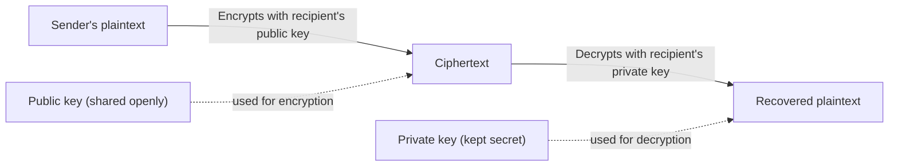
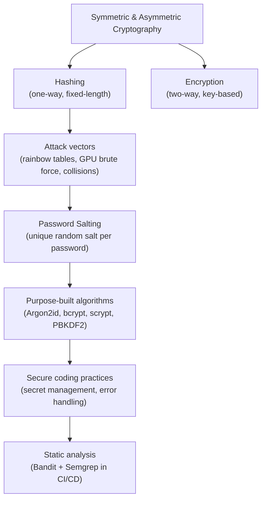

# Applied Cryptography: Hashing, Encryption, Salting, and Secure Coding Practices

## 1. What You'll Learn in This Section

In this lesson, you'll learn to:

- Distinguish between symmetric and asymmetric cryptography and explain why asymmetric encryption is considered more secure.
- Describe hashing properties — one-way, fixed-length, deterministic, avalanche effect — and contrast hashing with encryption.
- Apply password salting and select the right algorithm (Argon2id, bcrypt, scrypt, PBKDF2) for secure password storage.
- Implement secure coding practices: safe error handling, proper secret management, and automated static analysis using Bandit and Semgrep.

---

## 2. Detailed Explanation

### Symmetric vs Asymmetric Key Cryptography

**Symmetric key cryptography** is an encryption scheme where a single secret key handles both encryption and decryption. Both communicating parties must share this same key in advance.

**Asymmetric key cryptography** (also called public key cryptography) uses two mathematically linked keys: a **public key**, which anyone can see, and a **private key**, which only the owner holds. A sender encrypts data using the recipient's public key; only the recipient's private key can decrypt it.

**Why it matters**

Symmetric encryption is straightforward but has a key-sharing problem: how do two parties exchange the secret key safely in the first place? Asymmetric encryption solves this — you can freely broadcast your public key and never expose your private key.

**Walkthrough**

The security of asymmetric encryption rests on the mathematical difficulty of **prime factorization**. Multiply two large primes together and you get a very large number. Given only that product, finding the original two primes is computationally infeasible with today's computers. This unsolved problem is the mathematical foundation of asymmetric encryption.



**Common mistakes**

- Confusing the direction: always encrypt with the *recipient's* public key, decrypt with the *recipient's* private key — never the other way around for confidentiality.
- Assuming asymmetric encryption is immune to all future threats. **Quantum computers** are significantly faster than even supercomputers and could potentially factor very large numbers, breaking today's asymmetric encryption. This motivates migration to **Post-Quantum Cryptography (PQC)** — algorithms designed to remain secure even against quantum computers.

---

### Hashing — Properties and Use Cases

**Hashing** is a one-way function that converts any input into a fixed-length output, called a hash. Unlike encryption, hashing cannot be reversed.

**Why it matters**

You cannot store passwords in plaintext (a breach would expose them all). You also cannot store them encrypted (you would need to decrypt to compare — and the key could be stolen). Hashing gives you a way to verify a password without ever storing or recovering the original.

**Walkthrough**

Four core properties define a good hashing function:

| Property | What it means |
|---|---|
| **One-way** | The original data cannot be recovered from the hash. |
| **Fixed-length output** | Any input — one word or a whole book — produces the same-length hash. |
| **Deterministic** | The same input always produces the same hash. |
| **Avalanche effect** | A single character change (even one space) completely changes the hash output. |

Common algorithms and their status:

- **SHA-256** — widely used, currently secure.
- **SHA-1** — older and weaker; being phased out.
- **MD5** — cryptographically broken; do not use for security purposes.

Hashing is used for password storage, data integrity verification, forensics (verifying a cloned device was not modified), and SSL certificates.

**Hashing vs encryption:**

| | Hashing | Encryption |
|---|---|---|
| Reversible? | No (one-way) | Yes (two-way, using a key) |
| Output size | Fixed length | Grows with input size |
| Use case | Integrity, password storage | Confidentiality |

Hashing is never used for confidentiality. Use encryption when the original data must be recoverable.

**Common mistakes**

- Using MD5 or SHA-1 for new security implementations — both have known weaknesses.
- Treating hashing and encryption as interchangeable — they serve entirely different purposes.

---

### Why Hashing Alone Is Not Enough — Attack Vectors

Even SHA-256 on its own is not safe for password storage, because several well-known attacks exist against unsalted hashes.

**Why it matters**

Understanding the attack vectors is what motivates every password-storage best practice that follows.

**Walkthrough**

Three major attack types:

**1. Hash collisions.** Older algorithms like MD5 have documented **collisions** — two completely different inputs that produce the same hash output. This breaks integrity guarantees and disqualifies MD5 for security use.

**2. Rainbow tables.** A **rainbow table** is a pre-computed table containing billions of known passwords mapped to their hash values. If an unsalted password is hashed with a known algorithm, an attacker looks up the hash and instantly retrieves the original password — it is a lookup, not a computation. Tools like CrackStation demonstrate this: a password such as `admin1234` hashed with SHA-256 can be reversed immediately using the site's terabytes of pre-computed data.

**3. GPU brute force.** Modern GPUs can compute more than **10 billion SHA-256 hashes per second**, making brute-force attacks feasible against short or common passwords.

**The 2012 LinkedIn breach** brought this risk into the real world: 6.5 million user passwords were leaked, all hashed using SHA-1 without salting. Attackers cracked them rapidly using pre-computed rainbow tables. This breach is a landmark example of what weak hashing costs in practice.

**Common mistakes**

- Assuming SHA-256 is safe for passwords just because it is "not broken" — the GPU speed and rainbow table attacks still apply without salting.
- Thinking rainbow tables only target MD5 — any unsalted hash of a known algorithm is vulnerable.

---

### Password Salting

**Salting** is the practice of adding a cryptographically random, unique value (the **salt**) to each password before hashing it. The salt is stored alongside the resulting hash.

**Why it matters**

Rainbow tables are pre-computed for plain passwords. Adding a unique salt before hashing means the attacker's pre-computed table is useless — they would need to recompute the entire table for every possible salt, which is computationally infeasible.

**Walkthrough**

The salting process in four steps:

1. Generate a random salt (unique per password).
2. Concatenate the salt with the password.
3. Hash the combined value.
4. Store the salt together with the resulting hash.

Each salt must be unique for every single password. Reusing salts weakens the protection.

OWASP sets a minimum of **16 bytes** of salt per password. In Java, because each character is 2 bytes, this is 8 characters. In most other languages (1 byte per character), 16 characters are needed.

**Common mistakes**

- Reusing the same salt for multiple passwords — this partially recreates the rainbow table problem.
- Forgetting to store the salt — without it, you cannot verify the password later.

---

### Recommended Password-Hashing Algorithms

Plain cryptographic hash functions (SHA-256, MD5) are designed to be fast — which is bad for passwords. Purpose-built password-hashing algorithms are intentionally slow and memory-intensive, making brute-force attacks impractical.

**Why it matters**

Choosing the wrong algorithm is what led to breaches like LinkedIn's. The following four algorithms are the correct choices, ranked by preference.

**Walkthrough**

| Algorithm | Memory-hard | Auto-salting | FIPS compliant | Recommended order |
|---|---|---|---|---|
| **Argon2id** | Yes | Yes | No | 1st |
| **scrypt** | Yes | No | No | 2nd |
| **bcrypt** | No | Yes (128-bit) | No | 3rd |
| **PBKDF2** | No | No | Yes | Required for FIPS |

- **Argon2id** is the strongest algorithm available today. It is memory-hard (resistant to GPU and ASIC attacks), automatically handles salting, and is the first-choice recommendation per the OWASP Password Storage Cheat Sheet. It is slower than bcrypt — which is a deliberate security feature.
- **bcrypt** is widely used and battle-tested. It automatically generates a 128-bit salt and is a reliable choice for most applications, though it is not FIPS-compliant.
- **scrypt** is memory-hard and similar in strength to Argon2id, with more tuning options (CPU cost, memory cost, parallelism).
- **PBKDF2** (Password-Based Key Derivation Function 2) is required when FIPS compliance is mandated (e.g., US government systems). Its FIPS-standard iteration count is approximately 600,000 iterations.

**Common mistakes**

- Using SHA-256 or SHA-512 directly for password storage — these are fast hash functions, not password-hashing algorithms.
- Skipping manual salting for scrypt or PBKDF2 — unlike Argon2id and bcrypt, these do not auto-salt.

---

### Password Strength and Entropy

**Password entropy** is a measure of how unpredictable a password is. Higher entropy means more work for an attacker.

**Why it matters**

Even the best hashing algorithm cannot compensate for a weak password. A short or common password is cracked quickly regardless of how it was hashed.

**Walkthrough**

Practical measurements from a password strength analyzer:

- `admin1234`: entropy of **46 bits**, no special characters, classified as weak and easily crackable.
- Adding special characters increases entropy significantly.
- Increasing length and character variety pushes estimated brute-force time to centuries (on a normal computer).
- Common passwords (`quality`, `123456789`, `1234567890`) are recognized as keyboard patterns and cracked in under 21 seconds.

The **minimum recommended password length is 12 characters**, based on permutation and combination calculations.

**Common mistakes**

- Accepting passwords of 6–8 characters as "good enough" — modern GPUs make short passwords trivially breakable.
- Ignoring character variety — length alone is not sufficient if only lowercase letters are used.

---

### Encryption in Practice — AES-256

**Encryption** is a two-way (reversible) process: authorized parties use a secret key to recover the original plaintext from ciphertext.

**Why it matters**

Encryption is the right tool when data must be stored or transmitted and later recovered — for example, sending a private message or storing a credit card number.

**Walkthrough**

In symmetric encryption, two communicating parties share one secret key. A software layer automatically encrypts outgoing messages and decrypts incoming ones. Even if a third party intercepts the traffic, they see only ciphertext.

**AES-256** is a widely used symmetric encryption algorithm. Encrypting "hello world" with a 256-bit key produces an output significantly longer than the plaintext — and the output grows further as the input grows. This contrasts directly with hashing, whose output is always fixed-length regardless of input size.

**Common mistakes**

- Using encryption where hashing is appropriate (e.g., password storage) — if the key is compromised, all passwords are exposed.
- Using a weak or predictable encryption key (e.g., a short dictionary word) — the algorithm is only as strong as the key.

---

### Secure Secret Management

Hard-coding passwords, API keys, or cryptographic keys directly in source code is a critical security flaw — static analysis tools will flag it immediately.

**Why it matters**

Source code is often committed to version control, shared across teams, and sometimes made public accidentally. A hard-coded secret in a repository is an exposure waiting to happen.

**Walkthrough**

Three tiers of secret management:

1. **Development:** store secrets in `.env` files. Add `.env` to `.gitignore` so it is never committed to Git or GitHub.
2. **Production:** use a centralized, encrypted, auditable secrets management solution — **HashiCorp Vault**, **Azure Key Vault**, or **AWS Secrets Manager**. These provide encryption at rest, access auditing, and regulatory compliance.
3. **Key rotation:** rotate cryptographic keys on a schedule.
   - Internet-exposed/production applications: every **30 to 60 days**.
   - Internal applications: every **90 days** (some organizations use 6 months).

**Common mistakes**

- Committing `.env` files to version control — always verify `.gitignore` includes `.env` before the first commit.
- Never rotating keys — a key that was once compromised silently stays compromised indefinitely.

---

### Secure Error Handling

When an application catches an exception and returns the full error, stack trace, or internal details to the caller, it exposes internal architecture to potential attackers.

**Why it matters**

Error messages are a surprisingly common information leak. A stack trace can reveal file paths, library versions, database schema details, and server configuration — all useful to an attacker.

**Walkthrough**

Bad pattern — returns internal details to the caller:

```python
# Bad: exposes full exception details to the caller
except Exception as e:
    return str(e)  # Returns full stack trace and internal details
```

Good pattern — returns a generic message, logs internally:

```python
# Good: returns a generic message; logs internally
except Exception as e:
    logger.error("Exception occurred", exc_info=True)  # Internal log
    return "An error occurred"  # Generic message to user
```

Rules for secure error handling:

- Return only generic, user-friendly messages to end users (e.g., "An error occurred").
- Log full error details internally only — never in the API response.
- Log security events: failed logins, access violations, input validation failures, admin changes.
- Use a centralized error handler with structured logging.
- Never log sensitive data such as passwords or tokens.

**Common mistakes**

- Returning `str(e)` directly from an except block — this sends the full exception message to the client.
- Not logging internally at all — this makes debugging and security auditing impossible.

---

### Code Lab — Secure Hashing in Python

The lab (`lab/app.py`) implements both insecure patterns (used to trigger static analysis tools) and secure patterns side by side, using three Python libraries: **`hashlib`** (built-in cryptographic hashing), **`bcrypt`** (password-hashing library), and **`secrets`** (cryptographically secure random token generation).

**Why it matters**

Reading working code alongside its insecure counterpart makes the contrast concrete — you see exactly what to avoid and exactly what to use instead.

**Walkthrough**

Secure password hashing with bcrypt — 12 rounds, auto-generated salt:

```python
import bcrypt

def hash_password(password: str) -> bytes:
    # Generate a cryptographically random salt
    salt = bcrypt.gensalt(rounds=12)
    # Encode the password and hash it together with the salt
    hashed = bcrypt.hashpw(password.encode(), salt)
    return hashed
```

Password verification using `bcrypt.checkpw` — returns `True` on match, `False` on mismatch, and returns "Invalid credentials" (never the stored hash or a stack trace) on failure.

A `generate_reset_token` function uses the `secrets` library to produce a cryptographically secure token for password-reset flows.

The same file deliberately includes insecure patterns for static analysis to detect: a hard-coded password, MD5 hashing, and SHA-1 hashing.

**Common mistakes**

- Using `hashlib.md5()` or `hashlib.sha1()` for new password storage — these are flagged by every SAST tool as insecure.
- Returning the stored hash or the original exception message on a failed login — always return a generic message.

---

### Static Analysis with Bandit

**Bandit** is a Python-specific static analysis tool that scans source code for common security issues and can be integrated directly into CI/CD pipelines.

**Why it matters**

Manual code review misses things. Bandit runs automatically and surfaces security findings with exact file names, line numbers, and severity levels — making it practical for a team to enforce a security baseline.

**Walkthrough**

Run Bandit against a directory at medium severity:

```bash
bandit -r lab/ --severity-level medium
```

Against the lab file, Bandit produces:

- **Issue 1 (High severity, High confidence):** use of weak MD5 hashing for security purposes. CWE number cited with exact file, line, and column.
- **Issue 2 (High severity):** another weak hash algorithm finding.
- **Issue 3 (Low severity):** additional finding.

Total: **2 high-severity issues and 1 low-severity issue**.

Bandit also reports the Python version and any non-executed text blocks.

**Common mistakes**

- Running Bandit only at low severity and ignoring medium and high findings.
- Not integrating Bandit into CI/CD — manual-only runs are skipped under deadline pressure.

---

### Static Analysis with Semgrep

**Semgrep** is a multi-language **SAST** (static application security testing) tool. Unlike Bandit (Python-only), Semgrep supports many languages and draws on a large community rule library.

**Why it matters**

Semgrep complements Bandit. Running both tools ensures broader coverage — any finding missed by one is likely caught by the other.

**Walkthrough**

Run Semgrep against a directory using its auto-configured rule set:

```bash
semgrep --config auto lab/
```

Against the lab file, Semgrep ran **187 rules** and produced **3 findings** — all overlapping with Bandit's output (MD5 usage, insecure hashing). Consistency across tools confirms the findings are genuine.

**CI/CD integration.** The lab repository includes a GitHub Actions workflow (`.github/workflows/security-scan.yml`) that runs on Ubuntu, installs Bandit and Semgrep, scans the codebase, and uploads findings as artifacts (JSON and summary formats). Pushing the repository to GitHub triggers the full scan automatically.

**Common mistakes**

- Treating Semgrep and Bandit as redundant and running only one — overlapping findings from two independent tools give higher confidence; gaps in one are covered by the other.
- Ignoring uploaded CI/CD artifacts — findings that are not reviewed are findings that go unfixed.

---

### The Full Security Picture — How the Ideas Connect



---

## 3. Key Takeaways

- Asymmetric cryptography uses a public/private key pair; its security relies on the mathematical difficulty of prime factorization — a problem quantum computers may eventually solve, motivating Post-Quantum Cryptography.
- Hashing is one-way and fixed-length; encryption is reversible and output grows with input. Never use hashing for confidentiality or plain SHA-256/MD5 for password storage.
- Salting defeats rainbow tables by making each stored hash unique, even for identical passwords. OWASP requires a minimum of 16 bytes of salt per password.
- Use purpose-built algorithms in this order: Argon2id (first choice), scrypt (second), bcrypt (third), PBKDF2 (required for government FIPS compliance).
- Secure error handling means returning generic messages to users and logging full details internally only. Hard-coded secrets must move to `.env` files (development) or a secrets manager like HashiCorp Vault or AWS Secrets Manager (production), with key rotation every 30–90 days.
- Automate security scanning with Bandit (Python-specific) and Semgrep (multi-language) integrated into your CI/CD pipeline — manual code review alone is not reliable enough.

**Mental model:** Think of applied cryptography as a layered defence. Symmetric/asymmetric encryption protects data in transit; hashing with salting protects stored passwords; purpose-built algorithms make brute force impractical. Secure configuration keeps secrets out of source code, and static analysis ensures the whole stack is checked automatically on every commit.